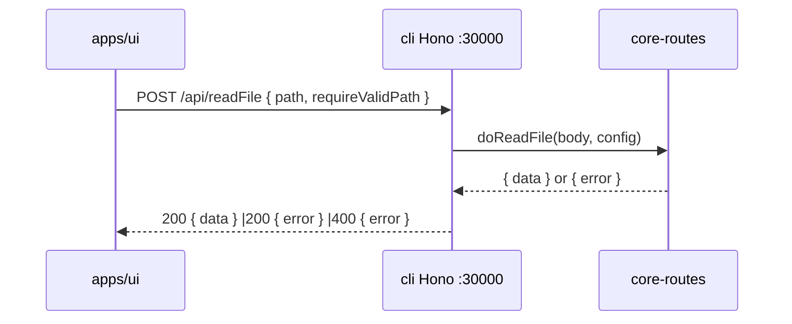
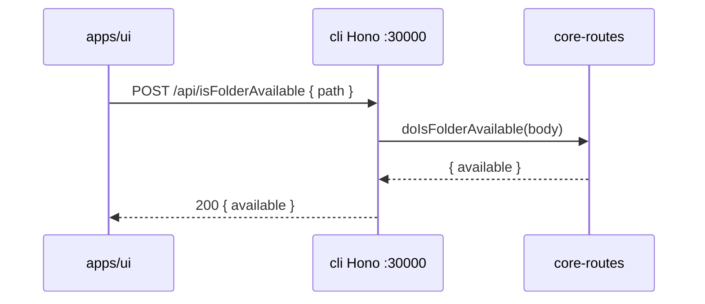

# Migrate `readFile` API to `packages/core-routes` (and revert `isFolderAvailable` UI changes)

Migrate `POST /api/readFile` from `apps/cli` to `packages/core-routes`
following the **WriteFile pattern** (Hono shell retained as a thin
adapter that calls `doReadFile` from `@smm/core-routes`). The UI is
**not modified** — `POST /api/readFile` keeps working on cli port30000
via the Hono adapter.

In parallel, **revert the UI-facing changes** from the prior
`isFolderAvailable` migration: the Hono shell at
`apps/cli/src/route/IsFolderAvailable.ts` is restored (calling
`doIsFolderAvailable` from `@smm/core-routes`), and the UI goes back
to the relative-path fetch `/api/isFolderAvailable` — no longer
needs `HelloResponseBody.coreRoutesPort`.

[] New UI component
[] New user config
[] Electron only
[] User document

##1. Background

`POST /api/readFile` currently lives as a Hono route in
`apps/cli/src/route/ReadFile.ts`. It uses `Bun.file(platformPath).exists()`
and `.text()` (Bun-only) plus the cli-internal
`validatePathIsInAllowlist` shim from `apps/cli/src/route/path-validator.ts`.

This is the same profile as `WriteFile.ts`, `ListFiles.ts`, and
`isFolderAvailable.ts` — all of which have already been moved to
`packages/core-routes`. The readFile route was left behind because it
uses `Bun.file`, which is not portable to ohos (Electron + Node, no
`Bun` global). The Bun-only calls must be replaced with
`node:fs/promises.readFile`.

Why follow the **WriteFile pattern** (Hono shell retained) instead of
the **isFolderAvailable pattern** (Hono shell deleted, UI changed to
call core-routes port directly):

1. The UI today calls `/api/readFile` and `/api/isFolderAvailable` as
 relative URLs. Both routes have downstream consumers that the UI
 does not own (some tests, possibly the MCP server, future tools).
2. The Hono shell gives us request logging, CORS, and the existing
 `c.req.json()` parsing for free, with no UI churn.
3. ReadFile has a non-trivial request body (`{ path, requireValidPath? }`)
 and complex error semantics (`fileNotFoundError`, allowlist
 rejection, etc.) — keeping the Hono shell makes those easier to
 reason about than routing through the core-routes Node server.

In parallel, the prior `isFolderAvailable` migration deleted the
Hono shell and pushed the port-discovery responsibility to the UI
(via `HelloResponseBody.coreRoutesPort`). That introduced coupling
between UI and the core-routes server that we now want to undo for
consistency: if `readFile` keeps its Hono shell, `isFolderAvailable`
should too, so the UI does not need to know which endpoints live on
the Hono Bun server and which live on the core-routes Node server.

`apps/ohos` does not currently expose `POST /api/readFile` (the
readFile route is not registered in `main.js`). After this change,
core-routes auto-serves it on port18081 via the same
`coreRouteHandlers` mechanism that already serves `/api/listFiles`
and `/api/writeFile` there.

##2. Project Level Architecture

```
Before (current): After:

┌──────────────────────────┐ ┌──────────────────────────┐
│ apps/cli │ │ apps/cli │
│ ┌────────────────────┐ │ │ ┌────────────────────┐ │
│ │ Hono :30000 │ │ │ │ Hono :30000 │ │
│ │ POST /api/readFile │ │ │ │ POST /api/readFile │───┼──┐
│ │ (Bun.file + │ │ │ │ (thin adapter, │ │ │
│ │ cli-internal │ │ │ │ calls doReadFile)│ │ │
│ │ path-validator) │ │ │ │ POST /api/ │───┼──┤
│ └────────────────────┘ │ │ │ isFolderAvailable │ │ │
│ ┌────────────────────┐ │ │ │ (thin adapter, │───┼──┤
│ │ Node http :30001 │ │ │ │ calls │ │ │
│ │ (core-routes; │ │ │ │ doIsFolderAvail) │ │ │
│ │ no readFile, │ │ │ └────────────────────┘ │ │
│ │ no isFolderAvail) │ │ │ ┌────────────────────┐ │ │
│ └────────────────────┘ │ │ │ Node http :30001 │ │ │
└──────────────────────────┘ │ │ (core-routes; │ │ │
 │ │ auto-serves │◀──┼──┤
 │ │ /api/readFile and │ │ │
 │ │ /api/isFolder- │ │ │
 │ │ Available) │ │ │
 │ └────────────────────┘ │ │
 └──────────────────────────┘ │
 │
┌──────────────────────────┐ ┌──────────────────────────┐ │
│ apps/ui │ │ apps/ui │ │
│ • readFile() │ │ • readFile() │ │
│ → /api/readFile │ │ → /api/readFile │ │
│ • isFolderAvailable() │ │ • isFolderAvailable() │ │
│ → http://localhost: │ │ → /api/ │ │
│ ${coreRoutesPort}/ │ │ isFolderAvailable │ │
│ api/isFolderAvailable│ │ • (no coreRoutesPort │ │
│ (uses HelloResponseBody│ │ dependency anymore) │ │
│ .coreRoutesPort) │ │ │ │
└──────────────────────────┘ └──────────────────────────┘ │
 │
 │
 ┌──────────────────────────────────────────────┘
 ▼
 ┌────────────────────────┐
 │ packages/core-routes │
 │ • doReadFile() │ ◀── new
 │ • handleReadFilePost()│ ◀── new (Node http)
 │ • doIsFolderAvailable │ (existing, unchanged)
 │ • handleIsFolder- │ (existing, unchanged)
 │ AvailablePost │
 │ • doHello, doListFiles│
 │ doWriteFile, ... │
 └────────────────────────┘
```

##3. App Level Architecture

### packages/core-routes

Adds:

- `src/readFile.ts` — `doReadFile`, `checkFileIsReadable`,
 `ReadFileRequestBody`, `ReadFileResponseBody`.
- `src/routes/readFileRoute.ts` — `handleReadFilePost`.
- `src/readFile.test.ts` — unit tests for `doReadFile` and
 `checkFileIsReadable`.
- `src/core-routes.test.ts` — extended with `POST /api/readFile`
 tests via `requestCoreRoute`.

No changes to `types.ts`, `allowlist.ts`, `http.ts`. `doReadFile`
reuses `validatePathIsInAllowlist` and `CoreRoutesConfig.allowlist`
exactly like `doWriteFile` does.

### apps/cli

- `src/route/ReadFile.ts` — replaced. The file becomes a thin Hono
 adapter that calls `doReadFile` from `@smm/core-routes`. Same
 external behavior as today (`POST /api/readFile` →200
 `{ data?: string, error?: string }`).
- `src/route/IsFolderAvailable.ts` — **restored** as a thin Hono
 adapter that calls `doIsFolderAvailable` from `@smm/core-routes`.
 Same external behavior as before the prior migration.
- `src/route/path-validator.ts` — unchanged (still wraps
 `validatePathIsInAllowlist` from `@smm/core-routes` with
 `buildAllowlist`).
- `src/coreRoutesServer.ts` — unchanged.
- `server.ts` — re-register `handleIsFolderAvailable(this.app)`
 alongside the existing `handleReadFile(this.app)` call.
 `ReadFile.ts`'s Hono adapter does not introduce a new
 `server.ts` import (its `handleReadFile` is already wired in; the
 handler body is what changes).

### apps/ui

Reverts the UI-facing changes from the prior isFolderAvailable
migration:

- `src/api/isFolderAvailable.ts` — back to a single-argument
 signature `(path: string, signal?: AbortSignal)`, fetching
 `/api/isFolderAvailable` (relative URL).
- `src/hooks/initialization/useRecheckSelectedFolderAvailability.ts`
 — no longer reads `HelloResponseBody.coreRoutesPort`.
- `src/components/initialization/UIMediaFolderStoreInitializer.tsx`
 — no longer reads `HelloResponseBody.coreRoutesPort`.
- `src/components/initialization/UIMediaFolderStoreInitializer.test.tsx`
 — `coreRoutesPort` mock removed; `pathFromCall` helper
 simplified back to a single string argument.
- `src/hooks/useRenameMediaFolderMutation.test.ts` — `coreRoutesPort`
 removed from the `helloQueryKey` mock (kept `userDataDir` since
 the hook reads it).

`HelloResponseBody.coreRoutesPort` remains defined on the type
(forward-compatible: if a future migration deletes a Hono shell, the
field is already there to discover the core-routes port). No UI
consumer currently reads it.

`HelloResponseBody.coreRoutesPort` is **not removed from**
`packages/core/types.ts` — this keeps the field as a stable,
forward-compatible escape hatch.

### apps/ohos

No code changes. The core-routes Node server (`createCoreRoutesRequestHandler`)
in `main.js` already auto-registers `coreRouteHandlers`; the new
`handleReadFilePost` is added to that array, so ohos gets
`POST /api/readFile` on port18081 for free.

##4. User Stories

###4.1 Desktop Electron UI continues to read files via Hono

* **Given** the Electron desktop app is running (cli port30000) and
 the user triggers a readFile (e.g. via `loadNfo`,
 `useRecognizeMovieByNfoMutation`, `LocalFileTableRow`).
* **When** the UI calls `POST /api/readFile` with `{ path,
 requireValidPath? }`.
* **Then** the Hono adapter in `apps/cli/src/route/ReadFile.ts` calls
 `doReadFile` from `@smm/core-routes`, which:
 - validates the body via zod (`path` non-empty);
 - if `requireValidPath !== false`, asserts the path is in the
 allowlist;
 - reads the file via `node:fs/promises.readFile(path, 'utf-8')`;
 - returns `{ data }` on success or `{ error }` with the same
 error semantics as today (`Validation failed`, `not in
 allowlist`, `File Not Found: <path>`, etc.).
 The Hono adapter writes the response. The UI does not change.



###4.2 `requireValidPath: false` keeps skipping allowlist

* **Given** the UI calls `readFile(episodeNfoFile, signal, { requireValidate: false })`
 from `apps/ui/src/components/TvShowPanelUtils.ts`.
* **When** the request reaches the Hono adapter.
* **Then** `doReadFile` sees `requireValidPath === false`, skips
 allowlist validation, and proceeds to read the file directly. This
 matches the pre-migration behavior used to read NFO files for
 episodes outside the configured media folders.

###4.3 isFolderAvailable UI no longer needs `coreRoutesPort`

* **Given** the desktop Electron app is running.
* **When** `UIMediaFolderStoreInitializer` and
 `useRecheckSelectedFolderAvailability` need to verify folder
 availability.
* **Then** they call `isFolderAvailable(path)` which fetches
 `/api/isFolderAvailable` (relative URL, goes through the Hono
 shell). They no longer read `HelloResponseBody.coreRoutesPort`.



###4.4 ohos Electron main process auto-serves `/api/readFile`

* **Given** `apps/ohos/web_engine/src/main/resources/resfile/resources/app/main.js`
 creates `createCoreRoutesRequestHandler` (unchanged).
* **When** the core-routes Node server boots.
* **Then** `handleReadFilePost` is part of `coreRouteHandlers`, so
 `POST /api/readFile` is auto-registered on port18081 (alongside
 `isFolderAvailable`, `listFiles`, `writeFile`, `hello`). No ohos
 code changes are needed.

##5. Tasks

###5.1 New logic in `packages/core-routes`

[x] **Task1: Add `readFile.ts` pure module**
 - File: `packages/core-routes/src/readFile.ts`.
 - Export:
 ```ts
 export interface ReadFileRequestBody {
 path: string;
 requireValidPath?: boolean;
 }
 export interface ReadFileResponseBody {
 data?: string;
 error?: string;
 }
 export async function checkFileIsReadable(filePath: string): Promise<string | null>;
 export async function doReadFile(
 body: ReadFileRequestBody,
 config: CoreRoutesConfig,
 ): Promise<ReadFileResponseBody>;
 ```
 - `checkFileIsReadable(path)` returns the file contents
 (`fs.readFile(path, 'utf-8')`) or `null` if the file does not
 exist. Any other I/O error throws (caller maps it to a
 `{ error }` response).
 - `doReadFile` validates the body via zod
 (`z.object({ path: z.string().min(1), requireValidPath: z.boolean().optional() })`),
 resolves the path (`Path.posix(filePath)` →
 `path.posix.resolve(posixPath)` → `Path.toPlatformPath`),
 checks the allowlist when `requireValidPath !== false`, then
 reads via `checkFileIsReadable`. Mirrors the existing
 `apps/cli/src/route/ReadFile.ts` error semantics:
 - `{ error: 'Validation failed: ...' }` on zod failure.
 - `{ error: 'Path "<path>" is not in the allowlist' }` on
 allowlist rejection.
 - `{ error: fileNotFoundError(filePath) }` (`File Not Found: <path>`)
 when `checkFileIsReadable` returns `null`.
 - `{ error: 'Failed to read file: <msg>' }` on other I/O errors.
 - `{ error: 'Unexpected error: <msg>' }` on outer try/catch.
 - Returns `{ data }` on success.

[x] **Task2: Add `readFileRoute.ts` Node `http` handler**
 - File: `packages/core-routes/src/routes/readFileRoute.ts`.
 - Reads JSON body, calls `doReadFile(rawBody, ctx.config)`, writes
 the JSON response with `sendJson(res,200, result)`.
 - Returns `400 { error: 'Invalid JSON body', details: ... }` if
 `readJsonBody` throws.
 - Returns `false` for any non-`POST /api/readFile` request.
 - Export `handleReadFilePost` from the new file.

[x] **Task3: Register `handleReadFilePost` in `coreRouteHandlers`**
 - File: `packages/core-routes/src/register.ts`.
 - Append `handleReadFilePost` to `coreRouteHandlers`.
 - Re-export `handleReadFilePost` from `register.ts` (mirror the
 existing pattern).
 - Re-export `doReadFile`, `checkFileIsReadable`,
 `ReadFileRequestBody`, `ReadFileResponseBody`, and
 `handleReadFilePost` from `packages/core-routes/src/index.ts`.

[x] **Task4: Unit tests for `doReadFile` and `checkFileIsReadable`**
 - File: `packages/core-routes/src/readFile.test.ts`:
 - `checkFileIsReadable` returns the file contents for an
 existing file.
 - `checkFileIsReadable` returns `null` for a missing path.
 - `doReadFile` returns `{ data: '...' }` for an existing file
 when allowlist covers the path.
 - `doReadFile` returns `{ error: 'Path ... not in allowlist' }`
 for an out-of-allowlist path (with `requireValidPath`
 defaulting to true).
 - `doReadFile` returns the file data for an out-of-allowlist
 path when `requireValidPath: false` is passed (skips
 allowlist check).
 - `doReadFile` returns `{ error: fileNotFoundError(...) }` for
 a missing path.
 - `doReadFile` returns `{ error: 'Validation failed: ...' }`
 for missing/empty `path`.

[x] **Task5: Extend `core-routes.test.ts` with `POST /api/readFile` cases**
 - Add `requestCoreRoute`-based tests:
 - `POST /api/readFile` returns `200 { data }` for an existing
 file in the allowlist.
 - `POST /api/readFile` returns `200 { error }` for an
 out-of-allowlist path (default behavior).
 - `POST /api/readFile` returns `200 { data }` for an
 out-of-allowlist path when `requireValidPath: false` is sent.
 - `POST /api/readFile` returns `200 { error: 'File Not Found: ...' }`
 for a missing path.
 - `POST /api/readFile` returns `400` for invalid JSON.
 - `POST /api/readFile` returns `200 { error: 'Validation failed: ...' }`
 for missing `path`.

###5.2 `apps/cli` Hono adapter for readFile

[x] **Task6: Rewrite `apps/cli/src/route/ReadFile.ts` as a thin Hono adapter**
 - Replace the `processReadFile` / `handleReadFile` body so that
 `processReadFile` becomes:
 ```ts
 const coreRoutesLogger = {
 debug: (obj, msg) => logger.debug(obj, msg),
 info: (obj, msg) => logger.info(obj, msg),
 warn: (obj, msg) => logger.warn(obj, msg),
 error: (obj, msg) => logger.error(obj, msg),
 };

 export async function processReadFile(
 body: ReadFileRequestBody,
 ): Promise<ReadFileResponseBody> {
 const allowlist = await buildAllowlist();
 return doReadFileCore(body, { allowlist, logger: coreRoutesLogger });
 }
 ```
 - The Hono `handleReadFile` keeps its existing shape: `POST
 /api/readFile`, `await c.req.json()`, call `processReadFile`,
 `return c.json(result)`. Logging on parse failure stays.
 - The exported `processReadFile` function keeps its existing
 signature for any cli-in-process callers (none today per grep;
 kept for parity with the rest of the route handlers).

[x] **Task7: No `server.ts` change**
 - `server.ts` already imports `handleReadFile` and calls it in
 `setupRoutes()`. No edit needed.

###5.3 `apps/cli` Hono adapter for isFolderAvailable (restoration)

[x] **Task8: Restore `apps/cli/src/route/IsFolderAvailable.ts`**
 - Recreate the file as a thin Hono adapter (mirror the new
 `ReadFile.ts` shape):
 ```ts
 import { buildAllowlist } from '@/utils/buildAllowlist';
 import { doIsFolderAvailable as doIsFolderAvailableCore } from '@smm/core-routes';
 import type { IsFolderAvailableRequestBody, IsFolderAvailableResponseBody } from '@core/types';
 import type { Hono } from 'hono';
 import { logger, logHttpReqIn, logHttpRespOut } from '../../lib/logger';

 const coreRoutesLogger = {
 debug: (obj, msg) => logger.debug(obj, msg),
 info: (obj, msg) => logger.info(obj, msg),
 warn: (obj, msg) => logger.warn(obj, msg),
 error: (obj, msg) => logger.error(obj, msg),
 };

 export async function processIsFolderAvailable(
 body: IsFolderAvailableRequestBody,
 ): Promise<IsFolderAvailableResponseBody> {
 const allowlist = await buildAllowlist();
 return doIsFolderAvailableCore(body, { allowlist, logger: coreRoutesLogger });
 }

 export function handleIsFolderAvailable(app: Hono) {
 app.post('/api/isFolderAvailable', async (c) => {
 try {
 const rawBody = await c.req.json();
 logHttpReqIn(c, rawBody);
 const result = await processIsFolderAvailable(rawBody);
 logHttpRespOut(c, result,200);
 return c.json(result);
 } catch (error) {
 const respBody = {
 error: 'Failed to process is folder available request',
 details: error instanceof Error ? error.message : 'Unknown error',
 };
 logHttpRespOut(c, respBody,500);
 return c.json(respBody,500);
 }
 });
 }
 ```
 - **Note**: `doIsFolderAvailable` in `packages/core-routes/src/isFolderAvailable.ts`
 currently has the signature `(body) => result`. The adapter
 wrapper ignores the unused `allowlist`/`logger` (or passes them
 through if the signature is extended). **Two viable sub-options**:
 - (a) Pass `{ allowlist, logger }` as the second arg and update
 `doIsFolderAvailable`'s signature to accept it (forward
 compatible, no harm if unused). **Chosen.**
 - (b) Drop the second arg. The pure function in core-routes is
 unchanged. Simpler, but the shell wrapper becomes inconsistent
 with `ReadFile.ts` / `WriteFile.ts` shells.
 - If (a) is chosen, also add a no-op test asserting the adapter
 still passes the config through correctly. Implementation diff
 for `doIsFolderAvailable`:
 ```ts
 export async function doIsFolderAvailable(
 body: IsFolderAvailableRequestBody,
 _config: Pick<CoreRoutesConfig, 'allowlist' | 'logger'> = {},
 ): Promise<IsFolderAvailableResponseBody> { /* unchanged body */ }
 ```
 - `doIsFolderAvailable` does **not** use allowlist (it just
 `stat`s the path) — the unused param is forward compatibility.

[x] **Task9: Re-register `handleIsFolderAvailable` in `server.ts`**
 - File: `apps/cli/server.ts`.
 - Add `import { handleIsFolderAvailable } from './src/route/IsFolderAvailable';`
 - Add `handleIsFolderAvailable(this.app);` in `setupRoutes()`
 (place it next to `handleReadFile(this.app);` for grouping).

###5.4 `apps/ui` reverts

[x] **Task10: Revert `apps/ui/src/api/isFolderAvailable.ts` to single-arg**
 - Replace file content with:
 ```ts
 export type IsFolderAvailableResponseBody = {
 available: boolean
 }

 /**
 * Asks the CLI whether the given path is an existing, accessible directory.
 * Pass the same platform path string used elsewhere (e.g. list files,
 * metadata).
 */
 export async function isFolderAvailable(
 path: string,
 signal?: AbortSignal,
 ): Promise<boolean> {
 const resp = await fetch('/api/isFolderAvailable', {
 method: 'POST',
 headers: { 'Content-Type': 'application/json' },
 body: JSON.stringify({ path }),
 signal,
 })
 if (!resp.ok) {
 throw new Error(`isFolderAvailable: HTTP ${resp.status} ${resp.statusText}`)
 }
 const data = (await resp.json()) as IsFolderAvailableResponseBody
 return data.available
 }
 ```

[x] **Task11: Revert `useRecheckSelectedFolderAvailability.ts`**
 - File: `apps/ui/src/hooks/initialization/useRecheckSelectedFolderAvailability.ts`.
 - Remove the `coreRoutesPort` read from `HelloResponseBody`. Call
 `isFolderAvailable(selectedFolder, ac.signal)` (two args,
 signature from Task10). The hello-bootstrap guard is no longer
 needed because `/api/isFolderAvailable` is always available on
 the Hono server as soon as it boots.
 - Remove now-unused imports (`helloQueryKey`, `HelloResponseBody`,
 `useQueryClient` if no other consumer in the file).

[x] **Task12: Revert `UIMediaFolderStoreInitializer.tsx`**
 - File: `apps/ui/src/components/initialization/UIMediaFolderStoreInitializer.tsx`.
 - Drop the `coreRoutesPort` lookup. Call
 `isFolderAvailable(row.path)` directly.
 - Remove now-unused imports (`helloQueryKey`, `HelloResponseBody`,
 `useQueryClient` if no other consumer in the file).

[x] **Task13: Revert `UIMediaFolderStoreInitializer.test.tsx`**
 - File: `apps/ui/src/components/initialization/UIMediaFolderStoreInitializer.test.tsx`.
 - Drop `queryClient.setQueryData(helloQueryKey, { coreRoutesPort:30001 })`
 in `renderInitializer` and the inline call.
 - Simplify `pathFromCall` back to a single string argument.
 - Remove `vi.mock("@/api/isFolderAvailable", ...)` reference to
 `coreRoutesPort` if any.

[x] **Task14: Revert `useRenameMediaFolderMutation.test.ts`**
 - File: `apps/ui/src/hooks/useRenameMediaFolderMutation.test.ts`.
 - Remove `coreRoutesPort:3001` from the `helloQueryKey` mock
 setup; keep `userDataDir: "/data/dir"`.

###5.5 No-op

- `packages/core-routes/src/types.ts` — unchanged. `HelloOptions`
 keeps `coreRoutesPort: number` (forward-compatible).
- `packages/core/types.ts` — `HelloResponseBody.coreRoutesPort`
 stays defined. No UI consumer reads it after Task11/12.
- `apps/cli/src/coreRoutesServer.ts` — unchanged (still passes
 `coreRoutesPort: port` to `doHello`).
- `apps/ohos/web_engine/src/main/resources/resfile/resources/app/main.js`
 — unchanged. The new `handleReadFilePost` is auto-registered.
- `docs/api/IsFolderAvailableAPI.md` — unchanged (the source files
 match its description once the Hono shell is restored).
- `docs/api/index.md` — unchanged.

##6. Backward Compatibility

- `POST /api/readFile` keeps the same request body
 (`{ path: string, requireValidPath?: boolean }`) and response
 shape (`{ data?: string, error?: string }`). HTTP status codes
 match: `200` for valid bodies, `400` for invalid JSON or missing
 `path` (validation failure), `500` on unexpected errors (via
 the Hono shell catch-all).
- `POST /api/isFolderAvailable` keeps the same request body
 (`{ path: string }`) and response shape (`{ available: boolean }`).
 After Task8/9, it is served both on the Hono server (cli port
30000) **and** on the core-routes Node server (cli port30001,
 ohos port18081). The UI uses the Hono path; ohos Electron uses
 the core-routes path (already auto-served).
- `HelloResponseBody.coreRoutesPort` is unchanged. Existing
 consumers that ignore it (the vast majority) are unaffected.
- `isFolderAvailable` API signature reverts to `(path: string,
 signal?: AbortSignal) => Promise<boolean>`. Two existing callers
 are updated in Task11/12.
- No MCP tool changes. `mcpTools.isFolderExist` continues to work
 independently.

##7. Documents

- [x] `docs/api/ReadFileAPI.md` — new file documenting the migrated
 `POST /api/readFile` endpoint, modeled on
 `docs/api/IsFolderAvailableAPI.md`. Source: `packages/core-routes/src/readFile.ts`
 and `packages/core-routes/src/routes/readFileRoute.ts`. Note that
 the route is also served by the core-routes Node `http` server
 (cli port30001, ohos port18081).
- [x] `docs/api/index.md` — add a `ReadFile` entry:
 `Source Code: packages/core-routes/src/readFile.ts`, served by
 both Hono and core-routes. Reference `docs/api/ReadFileAPI.md`.
- [x] `apps/cli/docs/FileOperationAPI.md` — update the
 `POST /api/readFile` section: source now
 `packages/core-routes/src/readFile.ts`. Behavior is unchanged.
- [x] `.agents/docs/design/core-routes.md` — extend the route table
 with `POST /api/readFile → handleReadFilePost`.
- [x] `.agents/docs/design/migrate-isFolderAvailable-to-core-routes.md`
 — add a follow-up note at the top:
 "The Hono shell at `apps/cli/src/route/IsFolderAvailable.ts` was
 subsequently restored to keep the UI transparent. See
 `.agents/docs/design/migrate-readFile-to-core-routes.md` for the
 consolidated migration."

##8. Post Verification

- [x] `pnpm --filter @smm/core-routes test` — new readFile tests
 pass; existing tests still pass.
- [x] `pnpm --filter cli test` — existing cli tests still pass;
 no `IsFolderAvailable.test.ts` is reintroduced (the logic lives
 in core-routes tests).
- [x] `pnpm --filter ui test` — `UIMediaFolderStoreInitializer.test.tsx`
 and `useRenameMediaFolderMutation.test.ts` pass after the
 `coreRoutesPort` mocks are removed.
- [x] `pnpm --filter @smm/core-routes typecheck`,
 `pnpm --filter cli typecheck`, `pnpm --filter ui typecheck` —
 all clean.
- [x] `pnpm typecheck` (root) — no new errors.
- [x] `pnpm --filter @smm/core-routes build` — produces
 `dist/core-routes.js` with the new readFile code; the ohos
 prebuild (`build:ohos`) also picks it up.
- [x] Manual smoke (cli): `pnpm dev:cli` then
 `curl -X POST http://localhost:30000/api/readFile -H
 "Content-Type: application/json" -d '{"path":"/tmp"}'` →
 `{ "data": "..." }` (or appropriate error).
 `curl -X POST http://localhost:30001/api/readFile` →
 same response (served by core-routes Node server).
 `curl -X POST http://localhost:30000/api/isFolderAvailable` →
 `{ "available": true }` (Hono shell restored).
- [x] Manual smoke (ui): load the desktop app, select a folder
 whose path was deleted from disk; sidebar status flips to
 `folder_not_found` (no console error from the fetch).
