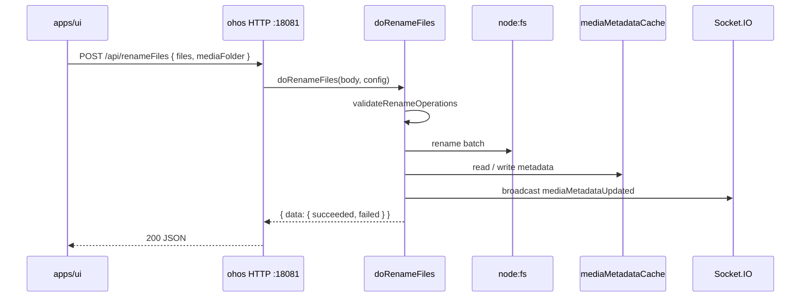

# Migrate `POST /api/renameFiles` to `packages/core-routes`

Move `POST /api/renameFiles` from `apps/cli`-only implementation into
`packages/core-routes` so **HarmonyOS (ohos)** can serve the same endpoint
via its embedded core-routes HTTP server (`127.0.0.1:18081`). Desktop
**Electron + cli** keeps a **Hono thin shell** that delegates to
`doRenameFiles` (WriteFile / readFile pattern).

Fixes ohos 404: `{ error: "Not found: POST /api/renameFiles" }` when the
UI confirms rule-based or AI-based TvShow rename.

[ ] New UI component
[ ] New user config
[ ] Electron only
[ ] User document

## 1. Background

### Problem

- **ohos** main process (`apps/ohos/src/http/server.ts`) routes all
  `/api/*` to `createCoreRoutesRequestHandler`. It does **not** spawn
  `apps/cli`.
- UI (`apps/ui/src/api/renameFiles.ts`) always calls
  `POST /api/renameFiles` for TvShow/Movie episode renames, associated
  files, and metadata refresh when `mediaFolder` is supplied.
- `POST /api/renameFiles` is implemented only in
  `apps/cli/src/route/RenameFiles.ts` (Hono). It is **not** registered in
  `packages/core-routes/src/register.ts`.
- Result on ohos: core-routes fallback 404 with message
  `Not found: POST /api/renameFiles`.

### Prior art

| Reference | Relevance |
|-----------|-----------|
| `doRenameFolder` + `handleRenameFolderPost` | Same domain (media rename + metadata cache + userConfig); already on ohos |
| `migrate-readFile-to-core-routes.md` | Hono thin shell + `coreRouteHandlers` auto-register on ohos |
| `rename-episodes.md` | End-to-end rename flow, validation, metadata update |
| `api-migration.md` §2.3.3 | Migration rationale and P1 priority |

### Decisions (confirmed)

1. **CLI**: WriteFile pattern — Hono adapter calls `doRenameFiles` from
   `@smm/core-routes`.
2. **Broadcast**: Inject `broadcast` via `CoreRoutesConfig`; on success
   emit `mediaMetadataUpdated` (same as cli today).

## 2. Project Level Architecture

```
Before (ohos broken):

  apps/ui ──POST /api/renameFiles──► ohos HTTP :18081
                                         │
                                         ▼
                                   core-routes (no handler)
                                         │
                                         ▼
                                   404 Not found


After:

  apps/ui ──POST /api/renameFiles──► ohos HTTP :18081  ──► doRenameFiles
        │                              (core-routes)         + broadcast
        │
        └──POST /api/renameFiles──► cli Hono :30000 ──► doRenameFiles
                                         (thin shell)      + broadcast
```

Shared package layer:

```
packages/core-routes
  ├── renameFiles.ts           doRenameFiles, validate, execute, metadata
  ├── routes/renameFilesRoute.ts
  └── register.ts              + handleRenameFilesPost

packages/core (optional extract)
  └── mediaMetadata.ts         updateMediaMetadataAfterRename (pure)
```

## 3. App Level Architecture

### 3.1 packages/core-routes

**New modules**

| File | Responsibility |
|------|----------------|
| `src/renameFiles.ts` | `doRenameFiles(body, config)` — validation, batch rename, optional metadata update + broadcast |
| `src/renameFileExecution.ts` | `executeBatchRenameOperations` using `node:fs/promises` (no `Bun.file`) |
| `src/validateRenameOperations.ts` | Async validation: sync rules from `@smm/core` + `stat` for source/dest existence |
| `src/routes/renameFilesRoute.ts` | `handleRenameFilesPost` — Node http handler |
| `src/renameFiles.test.ts` | Unit tests for `doRenameFiles` |
| `src/routes/renameFilesRoute.test.ts` or extend `core-routes.test.ts` | HTTP integration tests |

**`CoreRoutesConfig` extension** (`types.ts`):

```typescript
import type { WebSocketMessage } from "./socketIO/types.ts";

export interface CoreRoutesConfig {
  // ... existing fields ...
  /** Optional Socket.IO broadcast; used by renameFiles after metadata update */
  broadcast?: (message: WebSocketMessage) => void;
}
```

**`doRenameFiles` contract** (unchanged API surface vs cli):

Request (`RenameFilesRequestBody` from `@smm/core/types`):

```typescript
{
  files: Array<{ from: string; to: string }>;  // platform paths
  traceId?: string;
  mediaFolder?: string;   // POSIX; when set, update metadata + broadcast
  clientId?: string;
}
```

Response (`RenameFilesResponseBody`):

```typescript
{
  data?: { succeeded: string[]; failed: Array<{ path: string; error: string }> };
  error?: string;
}
```

**Processing steps** (mirror `apps/cli/src/route/RenameFiles.ts`):

1. Zod validate body (min 1 file, non-empty paths).
2. Resolve `mediaFolderPath`:
   - Use `body.mediaFolder` if provided (POSIX).
   - Else infer via `getMediaFolder(firstFile.from, userConfig.folders)` —
     move `getMediaFolder` to `@smm/core` or duplicate small helper in
     core-routes (prefer **`packages/core/path.ts` or new
     `packages/core/mediaFolder.ts`**).
3. `validateRenameOperations(files, mediaFolderPath)`:
   - `validateRenameOperationsSync` from `@smm/core/validations/rename`
   - `validateSourceFileExist` / `validateDestFileNotExist` reimplemented
     with `node:fs/promises.stat` (no cli imports).
4. `executeBatchRenameOperations(validatedRenames)` — sequential
   `mkdir` + `rename`; collect per-file errors; partial success allowed
   (return `succeeded` + `failed` arrays).
5. If `mediaFolder` provided and at least one success:
   - `readMediaMetadataCache(appDataDir, mediaFolder)`
   - `updateMediaMetadataAfterRename(metadata, successfulRenames)` —
     **extract pure function to `@smm/core/mediaMetadata`** (shared with
     cli tool; cli `renameFilesInBatch.ts` re-exports or imports from core).
   - `writeMediaMetadataCache(appDataDir, updated)`
   - `config.broadcast?.({ clientId, event: 'mediaMetadataUpdated', data: { folderPath: mediaFolder } })`
6. Return `{ data: { succeeded, failed } }` or `{ error }` for validation
   failures (HTTP 200 per project API guidelines).

**Bun removal in execution path**

- Replace `Bun.file().exists()` in error handling with `stat` /
  `access` from `node:fs/promises` (cli `executeRenameOperation` currently
  uses Bun for ENOENT diagnostics — port the stat-based branch only).

### 3.2 apps/cli

- **`apps/cli/src/route/RenameFiles.ts`**: thin Hono adapter.
  - `processRenameFiles(body, clientId?)` → `doRenameFiles(body, {
      allowlist: await buildAllowlist(),
      appDataDir: getAppDataDir(),
      logger: coreRoutesLogger,
      broadcast: (msg) => broadcast(msg),  // existing cli socketIO
    })`
  - Keep route path, status codes, logging shape.
- **`apps/cli/src/utils/renameFileUtils.ts`**: keep for MCP /
  `renameFilesInBatch` tool until a follow-up; **or** re-export execution
  from core-routes to avoid drift (optional in this change — minimum is
  route adapter only).
- **`apps/cli/src/coreRoutesServer.ts`**: pass `broadcast` from
  `createSocketIOManager` when building config (if core-routes server
  should also expose renameFiles on :3001 — yes, for parity).

### 3.3 apps/ohos

- **`apps/ohos/src/http/server.ts`**: when building
  `createCoreRoutesRequestHandler` config, wire `broadcast` from the
  existing `createSocketIOManager(mainHttpServer, ...)` instance.
- Rebuild & copy `core-routes.js` into resfile (existing build pipeline).
- **No UI changes** — relative `fetch('/api/renameFiles')` already correct.

### 3.4 apps/ui

**No changes required.** Existing flows already handle errors via
`handleRenamePromptConfirmForTvShow` (toast + plan restore).

## 4. User Stories

### 4.1 ohos TvShow rule-based rename succeeds

* **Given** — ohos app running, media folder imported, rename plan ready
* **When** — user confirms `RuleBasedRenameFilePrompt`
* **Then** — `POST /api/renameFiles` returns 200 with
  `{ data: { succeeded, failed } }`, files renamed on disk, metadata
  cache updated, `mediaMetadataUpdated` broadcast, UI shows success or
  error toast



### 4.2 Desktop cli continues to work via Hono shell

* **Given** — Electron desktop, cli on :30000
* **When** — UI calls `POST /api/renameFiles`
* **Then** — Hono adapter delegates to same `doRenameFiles`; behavior
  unchanged for callers

### 4.3 Validation failure returns business error (not 404)

* **Given** — target file already exists
* **When** — `POST /api/renameFiles`
* **Then** — 200 `{ error: "Target file ... already exists" }` (or
  aggregated validation message); UI toast shows error

## 5. Tasks

### 5.1 packages/core — shared pure logic

- [x] **Task 1**: Move `updateMediaMetadataAfterRename` to
  `packages/core/mediaMetadata.ts` (or dedicated `renameMediaMetadata.ts`).
- [x] **Task 2**: Move or re-export `getMediaFolder` to `packages/core`
  (from `apps/cli/src/utils/getMediaFolder.ts`).
- [x] **Task 3**: Update `apps/cli/src/tools/renameFilesInBatch.ts` to
  import from `@smm/core` (no behavior change).
- [ ] **Task 4**: Unit tests in `packages/core` for moved functions.

### 5.2 packages/core-routes — renameFiles implementation

- [x] **Task 5**: Extend `CoreRoutesConfig` with optional `broadcast`.
- [x] **Task 6**: Implement `validateRenameOperations` in core-routes
  (uses `@smm/core/validations/rename` + fs stat).
- [x] **Task 7**: Implement `executeBatchRenameOperations` in
  `renameFileExecution.ts` (Node fs only).
- [x] **Task 8**: Implement `doRenameFiles` in `renameFiles.ts`.
- [x] **Task 9**: Implement `handleRenameFilesPost` in
  `routes/renameFilesRoute.ts`.
- [x] **Task 10**: Register in `register.ts` + export from `index.ts`.
- [x] **Task 11**: Unit tests — validation errors, happy path, partial
  failure, metadata update + broadcast mock, missing appDataDir.

### 5.3 apps/cli integration

- [x] **Task 12**: Rewrite `RenameFiles.ts` as thin Hono adapter calling
  `doRenameFiles`.
- [x] **Task 13**: Wire `broadcast` into `coreRoutesServer.ts` config.
- [x] **Task 14**: Ensure existing cli tests still pass; add adapter test
  if missing.

### 5.4 apps/ohos integration

- [x] **Task 15**: Pass `broadcast` from `createSocketIOManager` into
  core-routes handler config in `server.ts`.
- [x] **Task 16**: Rebuild core-routes CJS bundle and verify
  `core-routes.js` contains `/api/renameFiles` handler.

### 5.5 Documentation

- [x] **Task 17**: Update `api-migration.md` — mark renameFiles as
  in-progress / done when complete.
- [ ] **Task 18**: Add `docs/api/RenameFilesAPI.md` (or update
  `apps/cli/docs/MediaFolderOperationAPI.md`) — note core-routes source.
- [ ] **Task 19**: Update `.agents/docs/design/core-routes.md` route table.

## 6. Backward Compatibility

- Request/response JSON shape unchanged (`RenameFilesRequestBody` /
  `RenameFilesResponseBody`).
- HTTP status: 200 for business success/error (existing convention); 404
  only when route missing (fixed on ohos).
- MCP / AI `renameFilesInBatch` tool continues using cli internals in
  this change; optional follow-up to delegate execution to core-routes.
- Partial batch failure semantics preserved (`succeeded` + `failed`).

## 7. Documents

- [ ] `docs/api/RenameFilesAPI.md` — new or extend existing MediaFolder op doc
- [ ] `docs/api/index.md` — list core-routes as source
- [ ] `api-migration.md` — status update after implementation
- [ ] `.agents/docs/design/core-routes.md` — route table
- [ ] `.agents/docs/design/rename-episodes.md` — note backend can be core-routes on ohos

## 8. Post Verification

- [x] `pnpm --filter @smm/core-routes test`
- [x] `pnpm --filter core test`
- [x] `pnpm --filter cli test` (via `apps/cli`)
- [ ] `pnpm typecheck`
- [ ] `pnpm build`
- [ ] **ohos smoke**: `curl -X POST http://127.0.0.1:18081/api/renameFiles`
  with minimal body → not 404; validation error or success as expected
- [ ] **Manual ohos**: TvShow rule-based rename confirm → toast success,
  files renamed, episode table refreshed
- [ ] **Manual desktop**: same rename flow on Electron unchanged
