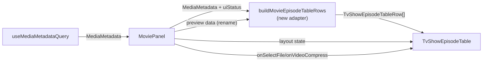

# MoviePanel 复用 TvShowEpisodeTable 组件

## Checklist

- [ ] New UI component — 无（复用现有 TvShowEpisodeTable）
- [ ] New user config — 无
- [ ] Electron only — 否
- [ ] User document — 否

## Status

**完成** — MoviePanel 已复用 TvShowEpisodeTable，获得一致的 UI/UX。通过 typecheck 和全部测试（1399 passed, 23 skipped, 0 failed）。

## 1. Background

`MovieEpisodeTable`（322 行）与 `TvShowEpisodeTable`（953 行）是两个独立实现的表格组件，分别服务于电影和电视剧面板。虽然共享底层 `ui/table.tsx` 和 `computeAssociatedFileRenames` 工具，但 UI/UX 不一致：

| 特性 | TvShowEpisodeTable | MovieEpisodeTable |
|------|-------------------|-------------------|
| 布局模式 | simple / detail / preview | 无（单模式） |
| 视频截图 | ✅ ffmpeg 生成 | ❌ |
| 封面缩略图 | ✅ HoverCard | ❌ |
| 预览模式 | rename / recognize | boolean（仅 strikethrough） |
| 行模型 | 每集一行，关联文件同行 | 每种文件类型一行 |

本次目标：MoviePanel 直接复用 `TvShowEpisodeTable`，将电影视为"一季一集的电视剧"显示，获得一致的 UI/UX。

## 2. 核心思路

**Adapter 模式**：不改动 `TvShowEpisodeTable` 组件本身，在 MoviePanel 侧构建适配函数，将 `MediaMetadata`（movie 类型）转换为 `TvShowEpisodeTableRow[]`。

电影 → 电视剧映射：
- 视频文件 → `S01E01` 的 `videoFile`
- `poster.jpg`/`fanart.jpg` → `S01E01` 的 `thumbnail`
- 字幕文件 → `S01E01` 的 `subtitle`
- `movie.nfo` → `S01E01` 的 `nfo`
- `movie.name` → `S01E01` 的 `episodeTitle`（用于 detail 布局）

## 3. Architecture

### 3.1 Data Flow



### 3.2 变更文件清单

#### 新增

| 文件 | 描述 |
|------|------|
| `apps/ui/src/lib/buildMovieEpisodeTableRows.ts` | 适配函数：`MediaMetadata` → `TvShowEpisodeTableRow[]` |

#### 修改

| 文件 | 变更 |
|------|------|
| `apps/ui/src/components/movie/MoviePanel.tsx` | 替换 `MovieEpisodeTable` 为 `TvShowEpisodeTable`；新增 `layout` 状态；调整 rename preview 逻辑 |
| `apps/ui/src/components/movie/MovieHeaderV2.tsx` | 新增布局切换按钮（Simple / Detail / Preview） |

#### 可移除

| 文件 | 说明 |
|------|------|
| `apps/ui/src/components/movie/MovieEpisodeTable.tsx` | 不再使用（仅 MoviePanel 引用，无其他调用方） |

#### 不变

- `TvShowEpisodeTable.tsx` — 不改动
- `buildMovieFilesFromMediaMetadata.ts` — 保留（adapter 内部可能复用其文件查找逻辑）
- `MovieMediaMetadataUtils.ts` — 保留
- `RuleBasedRenameFilePrompt.tsx` — 保留（movie rename 仍使用此 prompt）
- `episode-file.tsx` — 保留

## 4. Component Changes

### 4.1 MoviePanel 状态变更

```typescript
// 新增：布局状态
type EpisodeTableLayout = "simple" | "detail" | "preview"
const [layout, setLayout] = useState<EpisodeTableLayout>("simple")

// 新增：rename preview 数据
interface MovieRenamePreview {
  newVideoFile?: string
  newSubtitle?: string
  newNfo?: string
}
const [renamePreview, setRenamePreview] = useState<MovieRenamePreview | null>(null)
```

### 4.2 buildMovieEpisodeTableRows 适配函数

```typescript
export function buildMovieEpisodeTableRows(
  mm: MediaMetadata,
  uiStatus: UIMediaFolderStatus,
  options?: {
    renamePreview?: MovieRenamePreview
  }
): TvShowEpisodeTableRow[]
```

**输出**：
- `uiStatus !== "ok"` 或无 mediaFiles 时 → 空态 divider（与 TvShowPanel 一致）
- 正常状态 → 一个 `TvShowEpisodeDataRow`：season=1, episode=1
  - `videoFile` ← `mediaFiles[0].absolutePath`
  - `thumbnail` ← poster/fanart 文件路径
  - `subtitle` ← 第一个关联字幕文件
  - `nfo` ← `movie.nfo` 路径
  - `episodeTitle` ← `movie.name`（detail 布局使用）
  - `checked` ← false
- 有 `renamePreview` 时 → 填入 `newVideoFile`/`newSubtitle`/`newNfo`

### 4.3 MoviePanel 渲染变更

```tsx
// 旧
<MovieEpisodeTable
  data={tableData}
  preview={preview}
  ...
/>

// 新
<TvShowEpisodeTable
  data={tableData}
  mediaFolderPath={mediaMetadata?.mediaFolderPath}
  layout={layout}
  preview={renamePreview ? "rename" : undefined}
  onSelectFileContextMenuClick={handleSelectFile}
  onVideoCompressContextMenuClick={handleVideoCompress}
/>
```

**注意**：
- `onUnlinkContextMenuClick` 不传递 → 菜单项不渲染
- 当 `preview` 激活时，父组件强制 `layout="simple"`（TvShowEpisodeTable 的设计约束）
- `onCheck` 不传递 → checkbox 在 preview 模式下仍显示（组件行为），但不可交互

### 4.4 MovieHeaderV2 新增布局切换

参考 `TvShowPanelHeader.tsx` 的布局按钮实现，在 MovieHeaderV2 的 action bar 区域添加：
```
[Simple] [Detail] [Preview]
```

- Preview 按钮在 HarmonyOS 平台隐藏（与 TvShowPanelHeader 一致）
- 布局状态通过 props 传递给 MoviePanel

## 5. 不变的行为

- 电影搜索（MediaDatabaseSearchbox）— 不变
- TMDB/TVDB 选择（handleSelectResult）— 不变
- 重命名流程（RuleBasedRenameFilePrompt）— 不变
- 字幕相关对话框（Transcribe、Translate、Synthesize、Process Pipeline）— 不变
- 数据持久化（updateMediaMetadata）— 不变

## 6. 新增功能

通过复用 TvShowEpisodeTable，MoviePanel 自动获得：

| 功能 | 说明 |
|------|------|
| **Detail 布局** | 显示电影封面缩略图 + 标题 + 文件路径 |
| **Preview 布局** | 视频截图（ffmpeg），5 张缩略图网格 |
| **HoverCard 缩略图** | 鼠标悬停海报时显示大图预览 |
| **列显隐切换** | 右键表头切换 video/thumbnail/subtitle/nfo 列 |
| **Open 菜单** | 右键 → Open 打开文件 |

## 7. 暂不实现（未来考虑）

| 功能 | 原因 |
|------|------|
| 多视频文件支持 | 当前仅取第一个视频文件；多版本电影场景需单独设计 |
| Audio 文件列 | TvShowEpisodeTable 无 audio 列；commentary 等音频文件需要时再扩展 |
| 批量识别/重命名计划 | Movie rename 使用单文件流程（RuleBasedRenameFilePrompt），非 plan-based |

## 8. Backward Compatibility

- `MovieEpisodeTable` 组件删除（无其他调用方）
- `MovieFileRow` 类型删除（不再需要）
- `buildMovieFilesFromMediaMetadata` 保留（其内部文件查找逻辑被 adapter 复用）
- 外部 API 不变（`MoviePanel` 的导出签名不变）

## 9. Tasks

### 9.1 创建适配函数

- [x] Task 1 — 创建 `apps/ui/src/lib/buildMovieEpisodeTableRows.ts`
  - [x] 实现 `buildMovieEpisodeTableRows(mm, uiStatus, options?)` 函数
  - [x] 处理空态（initializing / folder_not_found / error_loading_metadata）
  - [x] 构建 `TvShowEpisodeDataRow`（season=1, episode=1）
  - [x] 查找并映射关联文件（poster → thumbnail, subtitle → subtitle, nfo → nfo）
  - [x] 处理 rename preview：填入 `newVideoFile`/`newSubtitle`/`newNfo`

### 9.2 修改 MoviePanel

- [x] Task 2 — 修改 `apps/ui/src/components/movie/MoviePanel.tsx`
  - [x] 新增 `layout` 状态（simple/detail/preview）和 `renamePreview` 状态
  - [x] 替换 `MovieEpisodeTable` 为 `TvShowEpisodeTable`
  - [x] 使用 `buildMovieEpisodeTableRows` 构建表格数据
  - [x] `preview` 激活时强制 `layout="simple"`
  - [x] 实现 `handleVideoCompress` 回调（适配 TvShowEpisodeDataRow）

### 9.3 修改 MovieHeaderV2

- [x] Task 3 — 修改 `apps/ui/src/components/movie/MovieHeaderV2.tsx`
  - [x] 新增 `episodeTableLayout` 和 `onEpisodeTableLayoutChange` props
  - [x] 添加布局切换按钮（Simple / Detail / Preview）
  - [x] Preview 按钮在 HarmonyOS 隐藏

### 9.4 清理

- [x] Task 4 — 删除 `apps/ui/src/components/movie/MovieEpisodeTable.tsx`
  - [x] 确认无其他引用后删除

### 9.5 测试

- [x] Task 5 — 编写 `buildMovieEpisodeTableRows.test.ts` 单元测试（18 tests）
  - [x] 空态测试（initializing / folder_not_found / error_loading_metadata）
  - [x] 正常数据测试（video + associated files）
  - [x] Rename preview 测试

### 9.6 验证

- [x] Task 6 — `pnpm run typecheck:ui` 通过（0 errors）
- [x] Task 7 — `pnpm test` 通过（1399 passed, 23 skipped, 0 failed）
