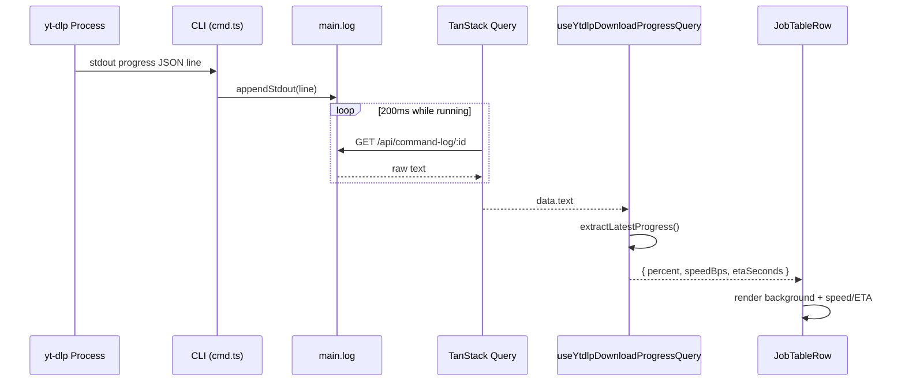

# MusicPanel JobRow — Download Progress Bar

在 MusicPanel 的下载任务行 (`JobTableRow`) 中实现进度条，整行背景作为进度条显示范围。
复用 BackgroundJobsPopover 中已有的 `useYtdlpDownloadProgressQuery` hook，通过 TanStack Query cache 自动共享日志查询。

## Checklist

- [x] New UI component — `JobTableRow` 增加进度条渲染，非新组件
- [ ] New user config — none
- [ ] Electron only — none
- [ ] User document — none

## 1. Background

- MusicPanel 已有下载任务行 (`JobTableRow`)，显示状态图标（pending/running/completed/failed）和上下文菜单
- 但缺少**实时进度条**（百分比、速度、ETA），用户无法直观了解下载进度
- BackgroundJobsPopover 中的 `BackgroundJobItem` 已通过 `useYtdlpDownloadProgressQuery` 实现同样的进度显示
- 两个组件共享同一个 TanStack Query cache（相同 `queryKey`），不会重复请求

## 2. Project Level Architecture

None — 不改动 `packages/core`。

## 3. App Level Architecture

### 数据流

```
CLI command log (main.log)  ← 单一日志源
         ↑ TanStack Query (200ms poll)
         │
useCommandLogQuery(executionId, isRunning)
         ↑
useYtdlpDownloadProgressQuery(executionId, isRunning)  ← 共享 hook
         │
    ┌────┴────┐
    │         │
    ▼         ▼
BackgroundJobItem   JobTableRow (MusicPanel)
(BgJobsPopover)      (下载任务行)
```

两个组件用不同 `executionId`（不同 job）→ 各自查询自己的日志。同一个 `executionId` → TanStack Query cache 命中，**零重复请求**。

### 组件改动

```
DownloadingTrack           ← 新增 executionId?: string
      │
      ▼
tracksFromDownloadJobRecords()
      │  映射 record.data.executionId → track.executionId
      ▼
Track / JobTableRowData    ← 现有 flow，无需改接口
      │
      ▼
MusicFileTable
      │  tableData 已含 executionId
      ▼
JobTableRow
      │  useYtdlpDownloadProgressQuery({ executionId, isRunning })
      │  → liveProgress (percent / speedBps / etaSeconds)
      ▼
      backgroundProgressBar (整行背景填充)
      └─ speed / ETA text
```

## 4. User Stories

### 4.1 下载任务行显示实时进度条

* **Given** 用户在 MusicPanel 中已有下载任务（status: downloading）
* **When** yt-dlp 持续输出 progress JSON 到 main.log
* **Then** `JobTableRow` 的整行背景从左到右填充为进度指示色（绿色半透明）
* **And** 行内继续显示标题、艺术家、状态图标
* **And** 在合适位置显示下载速度（如 "2.5 MB/s"）和剩余时间（如 "1m 30s"）



## 5. Tasks

### 5.1 扩展数据模型 — `executionId` 透传

- [x] `apps/ui/src/components/MediaPlayer.tsx` — `DownloadingTrack` 接口新增 `executionId?: string`
- [x] `apps/ui/src/lib/tracksFromDownloadVideoJobs.ts` — `tracksFromDownloadJobRecords` 映射 `record.data.executionId`
- [x] `apps/ui/src/components/MusicFileTable.tsx` — `JobTableRowData` 新增 `executionId?: string` 字段
- [x] `apps/ui/src/components/MusicPanel.tsx` — `tableData` 映射中传递 `track.executionId`

### 5.2 实现进度条 UI

- [x] `apps/ui/src/components/JobTableRow.tsx`
  - 导入 `useYtdlpDownloadProgressQuery`
  - `const executionId = row.executionId`（从 JobTableRowData 获取）
  - `const isRunning = row.status === 'downloading'`
  - `const { progress: liveProgress } = useYtdlpDownloadProgressQuery({ executionId: executionId ?? '', isRunning })`
  - 渲染：
    - **背景进度条**：整行 `div` 使用 `relative isolate`，内层 `position: absolute; -z-10` `bg-green-500/20` `width: percent%`
    - **速度/ETA**：在 `durationLabel` prop 传入 `MusicRowMediaCells` 展示
    - 保持现有状态图标（spinner 等）
  - 添加单元测试

### 5.3 测试

- [x] `apps/ui/src/components/MusicPanel.downloadJobs.test.tsx` — 现有测试通过
- [x] `apps/ui/src/components/JobTableRow.test.tsx` — 9 个单元测试通过（mock `useYtdlpDownloadProgressQuery`）

## 6. Backward Compatibility

- `DownloadingTrack` 新增可选字段 `executionId?: string` — 不影响现有代码（undefined 时为空）
- `tracksFromDownloadJobRecords` 新增一行映射 — 只影响下载任务 track
- `JobTableRow` 新增进度条渲染 — 当 `executionId` 为空或 `liveProgress` 为 null 时，回退到原有的纯状态图标显示
- TanStack Query cache 共享是自动的（相同 queryKey），无需额外适配

## 7. Documents

None.

## 8. Post Verification

- [x] Unit tests: `pnpm run test` (CLI 249 + UI 1064 = 1313 tests, 0 failures)
- [x] Typecheck: no new errors from changed files
- [ ] Manual e2e: 启动 yt-dlp 下载，MusicPanel 行背景填充 + 速度/ETA 实时更新
