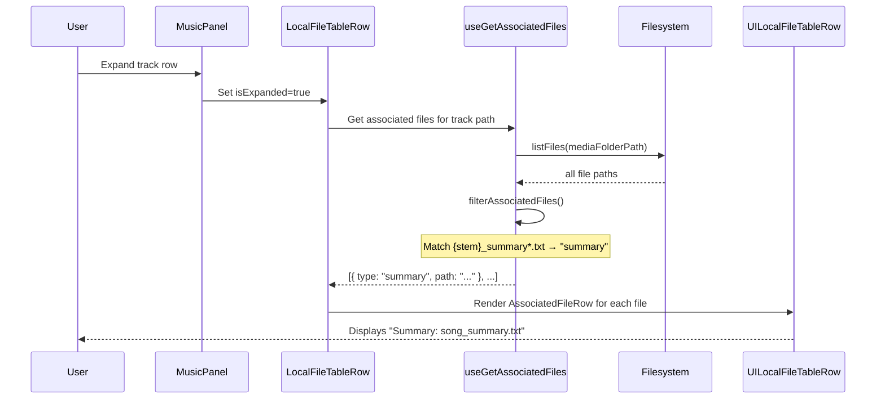

# MusicPanel - Display Summary Associated File

Add summary file (`*_summary.txt`) as a visible associated file in MusicPanel rows, displayed alongside existing subtitle/audio/thumbnail associated files.

## 1. Background

Currently, when a user expands a music track row in MusicPanel, associated files (subtitles, audio tracks, thumbnails) are listed below the track. A "Summarize" context menu action already exists that calls an AI pipeline to generate a summary file named `{stem}_summary.txt` (via `summarizeVideo.ts` + `summarizeFilename.ts`). However, after generation, the summary file does not appear in the expanded row as an associated file — the user can't see or access it from the UI.

The `AssociatedFile` type (`"summary"`) and its UI rendering (`AssociatedFileRow.tsx`) already exist. The gap is only in file discovery: `useGetAssociatedFiles.ts` currently classifies `.nfo` files as `"summary"`, but `.nfo` is not a summary file — it's an NFO metadata file. The `_summary.txt` pattern is never checked.

## 2. Architecture

```
MusicPanel
  └─ MusicFileTable
       └─ LocalFileTableRow  ← uses useGetAssociatedFiles()
            └─ UILocalFileTableRow
                 └─ AssociatedFileRow  ← renders "summary" type (already works)
```

The `useGetAssociatedFiles` hook lists all files in the media folder and calls `filterAssociatedFiles()` to match each track's associated files by naming convention. The fix is purely in `filterAssociatedFiles()`:

- **Before**: `.nfo` files → classified as `"summary"` (incorrect)
- **After**: `{stem}_summary*.txt` files → classified as `"summary"` (correct)

### Discovery pattern

For a track `song.mp3` (stem = `song`), the filter checks every file in the folder:
- `song_summary.txt` ✓ match
- `song_summary_1.txt` ✓ match
- `song_summary_99.txt` ✓ match

### Data flow (no changes to architecture)



## 3. User Stories

### 3.1 View summary file in expanded track row

* **Given** a music track `song.mp3` exists in the media folder
* **And** a summary file `song_summary.txt` exists alongside it
* **When** the user expands the track row in MusicPanel
* **Then** the associated files section shows a row labeled "Summary" with the filename `song_summary.txt`

### 3.2 Multiple summary variants

* **Given** a music track `song.mp3` exists
* **And** summary files `song_summary.txt` and `song_summary_1.txt` exist
* **When** the user expands the track row
* **Then** both summary files appear as separate "Summary" rows

### 3.3 No confusion with .nfo files

* **Given** a music track `song.mp3` exists
* **And** an NFO file `song.nfo` exists
* **When** the user expands the track row
* **Then** the NFO file does NOT appear as a "Summary" row (regression fix)

## 4. Tasks

### 4.1 Update associated file discovery

- [ ] **Task 1** — In `apps/ui/src/hooks/useGetAssociatedFiles.ts`, update `filterAssociatedFiles()`:
  - Remove `.nfo` from the summary file detection (remove `findFiles([".nfo"], "summary", results)`)
  - Add custom pattern matching for `_summary*.txt` files:
    ```
    For each file path in allFilePaths:
      if basename starts with (stem + "_summary") AND ends with ".txt":
        push as { type: "summary", path }
    ```

### 4.2 Verify existing UI handles summary correctly

- [ ] **Task 2** — Verify `AssociatedFileRow.tsx` already displays `"summary"` type correctly (label from `associatedFiles.type.summary` i18n key)
- [ ] **Task 3** — Verify `JobRow.tsx` already handles `"summarizing"` status indicator during active summarization

No new UI components needed — the `AssociatedFileRow` already supports the `"summary"` type.

## Backward Compatibility

- **`.nfo` files will no longer appear as associated "Summary" files.** Previously they were incorrectly classified as `"summary"`. This is a bug fix. No user relies on `.nfo` showing as "Summary" because the label was misleading.
- No API changes, no type changes, no store changes.

## Documents

None required — this is a small internal fix. No API or user guide changes needed.
