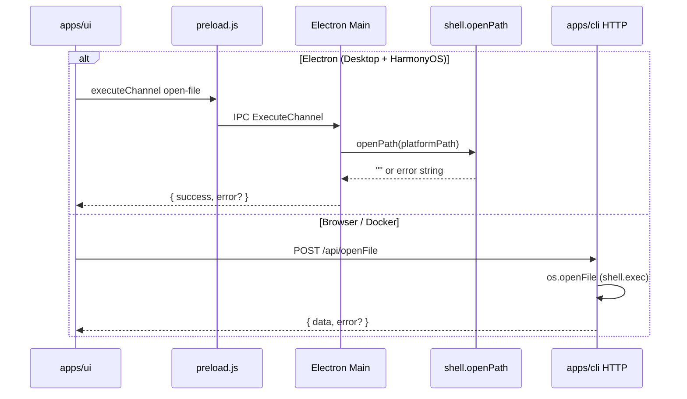
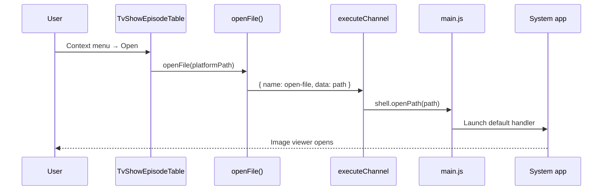

# Open File (Electron IPC via shell.openPath)

Enable "Open" context-menu actions (fanart, episode video, music tracks, associated files) on **HarmonyOS** and unify **all Electron** runtimes to open files via `shell.openPath`, following the same `executeChannel` pattern as `open-in-file-manager`.

[ ] New UI component
[ ] New user config
[x] Electron only — IPC path requires Electron main process; HTTP fallback remains for Browser/Docker
[ ] User document

## 1. Background

### Problem

On desktop (CLI), right-click → **Open** calls `POST /api/openFile`, which runs platform shell commands (`start` / `xdg-open` / `open -R`) in `apps/cli/src/utils/os.ts`.

On **HarmonyOS**, the embedded HTTP server only serves `packages/core-routes` — **`/api/openFile` is not registered** → UI gets **404**. Fanart and other "Open" actions silently fail.

### Solution

Wire file opening through **`packages/electron-common`** using Electron's **`shell.openPath(path)`**:

- Returns `""` on success
- Returns an error message string on failure

HarmonyOS is treated as Electron (see [harmonyos-integration.md](./harmonyos-integration.md)); UI must **not** add HarmonyOS-specific branches.

### Entry points (existing UI, no new components)

| Component | Trigger |
|-----------|---------|
| `TvShowEpisodeTable.tsx` | Context menu → Open (folder files: fanart/poster/nfo; episode video) |
| `MusicFileTable.tsx` | Context menu → Open |
| `MusicPanel.tsx` | Track open event |
| `AssociatedFileRow.tsx` | Double-click / context menu → Open |
| `FileExplorer.tsx` | Double-click image file |

All call `openFile()` from `apps/ui/src/api/openFile.ts`.

## 2. Project Level Architecture

Extend the existing **ExecuteChannel** routing in `packages/electron-common` with a new task `open-file`, parallel to `open-in-file-manager`:

```
apps/ui → openFile(path)
  → (Electron) window.api.executeChannel({ name: 'open-file', data: path })
  → main process → shell.openPath(path)
  → (Browser/Docker) POST /api/openFile → apps/cli (unchanged)
```



**No change** to `packages/core-routes` — `OpenFile` stays CLI-only per [api-migration.md](../../../api-migration.md).

## 3. App Level Architecture

### 3.1 `packages/electron-common`

| File | Change |
|------|--------|
| `src/channels.ts` | Add `OPEN_FILE_CHANNEL = "open-file"` |
| `src/openFileTask.ts` | **New** — `openFileWithShell(path)` using `shell.openPath` |
| `src/executeChannelIpc.ts` | Route `open-file` → `openFileWithShell` |
| `src/index.ts` | Export new channel + task |
| `src/executeChannelIpc.test.ts` | Tests for routing + openPath success/failure |

**Task implementation** (`openFileTask.ts`):

```typescript
export async function openFileWithShell(path: string): Promise<OpenFileResult> {
  if (!path || typeof path !== "string") {
    return { success: false, error: "Path is required and must be a string" }
  }
  const result = await shell.openPath(path)
  if (result === "") {
    return { success: true }
  }
  return { success: false, error: result }
}
```

**No HarmonyOS native fallback** (`FileManagerAdapter.OpenVerifiedItem`) — per product decision, rely solely on `shell.openPath`.

### 3.2 `apps/ui/src/api/openFile.ts`

Mirror `openInFileManagerApi` pattern:

1. If `window.api.executeChannel` exists → IPC with channel `open-file`
2. Else → existing `POST /api/openFile` (Browser/Docker + CLI dev without preload)

Map IPC response `{ success, error? }` to existing `OpenFileResponseBody` (`{ data: { path }, error? }`).

**No component changes** — all callers keep using `openFile()`.

### 3.3 Build outputs

After `electron-common` changes:

- Desktop Electron: picks up via workspace dependency (rebuild electron if needed)
- HarmonyOS: `pnpm run build:ohos` rebundles `main.js` + `preload.js`

### 3.4 Unchanged

| Area | Reason |
|------|--------|
| `apps/cli/src/route/OpenFile.ts` | HTTP fallback for non-Electron |
| `apps/ohos/src/http/server.ts` | No `/api/openFile` on OHOS |
| UI components | Already call `openFile()` API |

## 4. User Stories

### 4.1 Open fanart on HarmonyOS

* **Given** a TV show media folder is imported with persisted file access
* **When** the user right-clicks the fanart row and chooses **Open**
* **Then** the system default image viewer opens the fanart file



### 4.2 Open file on desktop Electron

* **Given** SMM runs as Electron desktop app
* **When** the user opens a file via any entry point
* **Then** `shell.openPath` is used via IPC (not HTTP round-trip to CLI)

### 4.3 Browser/Docker unchanged

* **Given** SMM UI runs in browser against `apps/cli`
* **When** the user triggers Open
* **Then** `POST /api/openFile` is used as today

## 5. Tasks

### 5.1 electron-common

- [x] Add `OPEN_FILE_CHANNEL` to `channels.ts`
- [x] Implement `openFileTask.ts` with `shell.openPath`
- [x] Wire route in `executeChannelIpc.ts`
- [x] Export from `index.ts`
- [x] Unit tests in `executeChannelIpc.test.ts` (success, empty path, openPath error string)

### 5.2 UI API

- [x] Update `apps/ui/src/api/openFile.ts` — IPC-first, HTTP fallback
- [x] Add/update unit test for `openFile.ts` (mock `window.api.executeChannel`)

### 5.3 HarmonyOS bundle

- [x] Run `pnpm run build:ohos` to refresh `main.js`

### 5.4 Documentation

- [x] Add **§4 Open File** to [harmonyos-integration.md](./harmonyos-integration.md)
- [x] Add troubleshooting note to [faq-harmonyos.md](../faq-harmonyos.md) (path must be app-accessible URI)

## 6. Backward Compatibility

- **IPC channel names**: new channel `open-file` added; existing channels unchanged
- **HTTP `/api/openFile`**: preserved for Browser/Docker; CLI behavior unchanged
- **Preload surface**: no breaking changes; `executeChannel` already exists
- **Response shape**: UI maps IPC result to existing `OpenFileResponseBody` — callers unchanged

## 7. Documents

- [x] `.agents/docs/design/harmonyos-integration.md` — new section 4 Open File + update IPC table
- [x] `.agents/docs/faq-harmonyos.md` — open file troubleshooting
- [x] `apps/ohos/README.md` — mention `open-file` channel in preload list

## 8. Post Verification

- [x] Unit tests — `pnpm --filter @smm/electron-common test` and `pnpm --filter ui test` (openFile API)
- [x] Build — `pnpm run build:ohos` succeeded

## 9. Path requirements (HarmonyOS)

Same constraints as [harmonyos-integration.md §3.3](./harmonyos-integration.md):

| Path source | Format |
|-------------|--------|
| Media folder files | `file://docs/storage/...` URI (persisted via DocumentViewPicker) |
| App sandbox files | `/data/storage/el2/base/files/...` |

Pass paths **as stored** in metadata — do not rewrite. `shell.openPath` only succeeds for paths the app can access.
