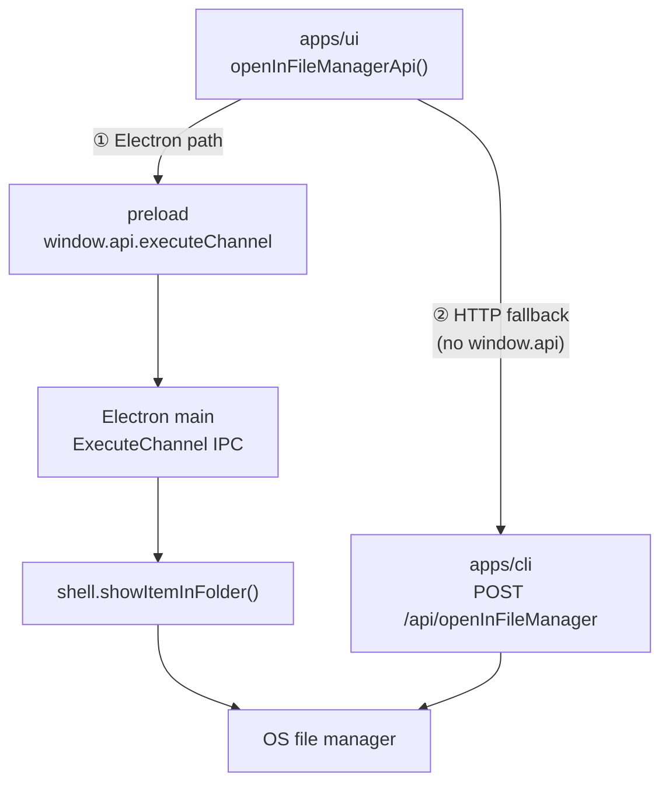
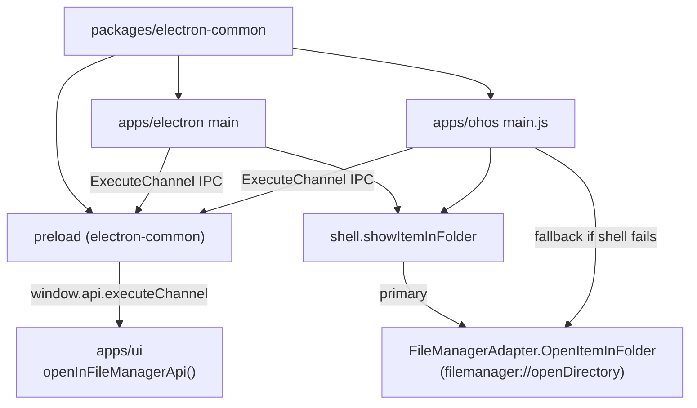
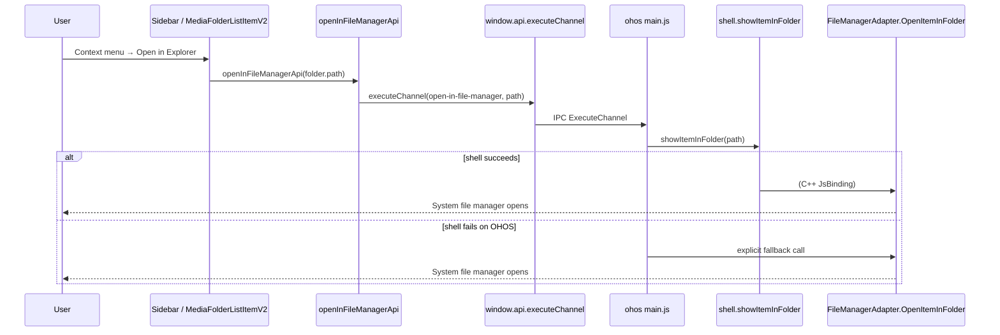

# Open in File Manager

Enable **Open in Explorer** (在资源管理器中打开) on HarmonyOS by wiring the existing Electron IPC path to the native `FileManagerAdapter.OpenItemInFolder` adapter. The UI keeps a single code path — no HarmonyOS-specific branches in `apps/ui`.

Related:

- [architecture.md](../architecture.md)
- [harmonyos-folder-import.md](./harmonyos-folder-import.md)
- [harmonyos-file-access-persist.md](./harmonyos-file-access-persist.md)
- [faq-harmonyos.md](../faq-harmonyos.md)

[ ] New UI component
[ ] New user config
[x] Electron only — requires Electron main process + preload IPC (HarmonyOS uses the same contract as desktop Electron)
[ ] User document

## 1. Background

### 1.1 Feature overview

Users can open a folder in the OS file manager from several UI entry points:

| Entry point | Component | Path passed |
|-------------|-----------|-------------|
| Sidebar context menu | `MediaFolderListItemV2` → `Sidebar.tsx` | Media folder path from `smm.json` `folders[]` |
| Menu → Open app data folder | `menu.tsx` | `hello.appDataDir` |
| Menu → Open log folder | `menu.tsx` | `hello.logDir` |

All call sites use the same API wrapper: `openInFileManagerApi()` in `apps/ui/src/api/openInFileManager.ts`.

### 1.2 Current architecture (all platforms)



**Path selection in UI** (`apps/ui/src/api/openInFileManager.ts`):

1. If `window.api.executeChannel` exists → IPC channel `open-in-file-manager` with platform path.
2. Otherwise → `POST /api/openInFileManager` (CLI HTTP route).

### 1.3 Desktop Electron path (working today)

| Layer | File | Responsibility |
|-------|------|----------------|
| UI | `apps/ui/src/api/openInFileManager.ts` | `executeChannel({ name: 'open-in-file-manager', data: path })` |
| Preload | `apps/electron/src/preload/index.ts` | Exposes `window.api.executeChannel` → `ipcRenderer.invoke('ExecuteChannel', …)` |
| Main | `apps/electron/src/main/index.ts` | Registers `ipcMain.handle('ExecuteChannel', channelRoute)` |
| Router | `apps/electron/src/main/ChannelRoute.ts` | Routes `open-in-file-manager` → `openInFileManager()` |
| Task | `apps/electron/src/main/tasks/OpenInFileManagerTask.ts` | Calls `shell.showItemInFolder(path)` |

Desktop OS mapping:

| Platform | Mechanism |
|----------|-----------|
| Windows / macOS / Linux | Electron `shell.showItemInFolder` → Explorer / Finder / default handler |

### 1.4 HTTP fallback path (CLI / Docker / Browser)

| Layer | File | Responsibility |
|-------|------|----------------|
| UI | `apps/ui/src/api/openInFileManager.ts` | `fetch('/api/openInFileManager', { path })` |
| CLI | `apps/cli/src/route/OpenInFileManager.ts` | Spawns OS command: `cmd /c start`, `open -R`, or `xdg-open` |

**Not available on HarmonyOS:**

- `core-routes` does **not** register `/api/openInFileManager`.
- CLI route does not support `process.platform === 'ohos'`.
- HarmonyOS main HTTP server (`apps/ohos/src/http/server.ts`) only serves `core-routes` handlers.

### 1.5 HarmonyOS gap (broken today)

HarmonyOS is an Electron shell but the IPC path is incomplete:

| Component | Desktop Electron | HarmonyOS today |
|-----------|------------------|-----------------|
| Preload `window.api.executeChannel` | ✅ | ❌ missing |
| Main `ExecuteChannel` IPC | ✅ | ❌ missing |
| HTTP `/api/openInFileManager` | ✅ (via CLI) | ❌ not in core-routes |

Result: UI falls through to HTTP → **404 / not implemented** on HarmonyOS.

### 1.6 HarmonyOS native capability (already present)

The HarmonyOS HAP template ships `FileManagerAdapter` in `apps/ohos/web_engine`:

```typescript
// FileManagerAdapter.ets — simplified
openItemInFolder(filePath: string, onCompleted: (ret: boolean) => void) {
  let uri = fileUri.getUriFromPath(filePath);
  context.openLink('filemanager://openDirectory', {
    parameters: { fileUri: uri }
  });
}
```

Registered via JsBinding as `FileManagerAdapter.OpenItemInFolder` (`FileManagerAdapterBind.ets`).

The openharmony-sig Electron port typically maps `shell.showItemInFolder()` to this adapter at the C++ layer. If that mapping fails on a device, the main process can fall back to an explicit native call.

### 1.7 Design principle

Same as [harmonyos-folder-import.md](./harmonyos-folder-import.md):

> UI must **not** add HarmonyOS-specific branches. HarmonyOS is treated as Electron because it exposes the same preload contract.

HarmonyOS wiring lives in `apps/ohos` main process + `packages/electron-common` preload only.

## 2. Project Level Architecture

Extend shared Electron IPC so both `apps/electron` and `apps/ohos` expose the same `window.api.executeChannel` contract.



No change to `packages/core-routes` or `apps/cli` HTTP APIs for this feature.

## 3. App Level Architecture

### 3.1 packages/electron-common

Add shared ExecuteChannel IPC + preload surface:

```
packages/electron-common/src/
├── channels.ts                    # + EXECUTE_CHANNEL = "ExecuteChannel"
├── executeChannelIpc.ts           # registerExecuteChannelIpcHandlers
├── openInFileManagerTask.ts       # openInFileManager(path) — shell + OHOS fallback
└── preload/
    ├── executeChannelApi.ts       # createExecuteChannelPreloadApi
    └── index.ts                   # merge into ohos preload export
```

**Main-process API:**

```typescript
registerExecuteChannelIpcHandlers(ipcMain, {
  openInFileManager: openInFileManagerTask,
})
```

**Preload surface:**

```typescript
window.api.executeChannel(request: { name: string; data: unknown }): Promise<{ name: string; data: unknown }>
```

**Channel contract (unchanged from desktop):**

| Field | Value |
|-------|-------|
| IPC name | `ExecuteChannel` |
| Request `name` | `'open-in-file-manager'` |
| Request `data` | Platform-format folder path string |
| Response `data` | `{ success: boolean; error?: unknown }` (matches existing `OpenInFileManagerTask`) |

### 3.2 openInFileManagerTask — shell first, native fallback

```typescript
async function openInFileManager(path: string): Promise<{ success: boolean; error?: unknown }> {
  try {
    await shell.showItemInFolder(path)
    return { success: true }
  } catch (shellErr) {
    if (!isHarmonyOSPlatform()) throw shellErr

    const ok = await openItemInFolderViaNativeBinding(path)
    if (ok) return { success: true }
    return { success: false, error: shellErr }
  }
}
```

**HarmonyOS native fallback** (only when `shell.showItemInFolder` throws):

Use the same bridge pattern as [harmonyos-file-access-persist.md](./harmonyos-file-access-persist.md). Investigate at implementation time:

1. **Preferred:** Confirm `shell.showItemInFolder` already invokes `FileManagerAdapter.OpenItemInFolder` — then fallback may never run; still log shell errors for diagnostics.
2. **Fallback:** If shell is not wired, main process calls `systemPreferences.callArkTSFunction('EtsBridge.OpenItemInFolder', 'boolean', [path])`, which delegates to `FileManagerAdapter.openItemInFolder` via `filemanager://openDirectory`.

### 3.3 Path format on HarmonyOS

| Path source | Typical format | Notes |
|-------------|----------------|-------|
| Sidebar media folder | `file://docs/storage/...` URI from DocumentViewPicker | Stored in `smm.json` `folders[]`; same string used by `fileAccessPersist` |
| App data dir | `/data/storage/el2/base/files/...` sandbox path | From `hello.appDataDir` |
| Log dir | Sandbox or app-specific path | From `hello.logDir` |

Pass paths **as stored** — do not rewrite in UI. `FileManagerAdapter` uses `fileUri.getUriFromPath(filePath)` which accepts both filesystem paths and URI strings.

**Limitation:** Only paths the app can access will succeed (persisted user-granted folders or app sandbox). Arbitrary paths outside grant/sandbox will fail — surface `error` to the user via existing toast/console handling.

### 3.4 apps/ohos

- Import and call `registerExecuteChannelIpcHandlers(ipcMain)` in `apps/ohos/src/main.ts` (alongside dialog + fileAccess IPC).
- Rebuild `main.js` + `preload.js` via `pnpm run build:ohos`.

### 3.5 apps/electron

- Refactor existing inline `ExecuteChannel` + `OpenInFileManagerTask` to use `@smm/electron-common` shared module (behavior unchanged on Windows / macOS / Linux).

### 3.6 apps/ui

**No changes required** if preload + main IPC are wired correctly. Existing flow:

```
Sidebar context menu
  → handleOpenInExplorer(folder.path)
  → openInFileManagerApi(path)
  → window.api.executeChannel({ name: 'open-in-file-manager', data: path })
```

Map IPC `{ success, error }` to `OpenInFileManagerResponseBody` in preload or main if response shape differs (today UI expects `{ data: { path }, error? }` from HTTP; IPC path returns `{ name, data: { success, error? } }` — verify and normalize in shared task if needed).

## 4. User Stories

### 4.1 Sidebar — open media folder in system file manager (HarmonyOS)

* **Given** the app runs on HarmonyOS with imported media folders in the Sidebar
* **When** the user right-clicks a folder and chooses「在资源管理器中打开」
* **Then** the system file manager opens at that folder location



### 4.2 Menu — open app data / log directory (HarmonyOS)

* **Given** the app runs on HarmonyOS
* **When** the user opens app data or log folder from the menu
* **Then** the system file manager opens at the sandbox path (same IPC path as §4.1)

### 4.3 Desktop regression

* **Given** the app runs on Windows / macOS / Linux Electron
* **When** the user triggers any open-in-file-manager action
* **Then** behavior is unchanged (`shell.showItemInFolder` only; no native fallback)

## 5. Tasks

### 5.1 packages/electron-common

- [x] Add `EXECUTE_CHANNEL` to `channels.ts`
- [x] Extract `openInFileManagerTask.ts` (shell + HarmonyOS fallback helper)
- [x] Add `executeChannelIpc.ts` with `registerExecuteChannelIpcHandlers`
- [x] Add `preload/executeChannelApi.ts` — expose `window.api.executeChannel`
- [x] Update `packages/electron-common/ohos/preload.js` build output to include `window.api`
- [x] Unit tests: channel routing, non-OHOS skips fallback, OHOS fallback invoked when shell throws

### 5.2 apps/electron

- [x] Replace inline `ExecuteChannel` / `OpenInFileManagerTask` with `@smm/electron-common` imports
- [ ] Verify desktop manual smoke test (Sidebar + menu)

### 5.3 apps/ohos

- [x] Register `registerExecuteChannelIpcHandlers(ipcMain)` in `main.ts`
- [ ] On device: verify `shell.showItemInFolder` → file manager opens for media folder URI
- [ ] On device: verify fallback path if shell throws (log which path was used)
- [x] Rebuild HarmonyOS bundle (`pnpm run build:ohos`)

### 5.4 Response shape alignment

- [x] Audit `openInFileManagerApi` IPC vs HTTP response handling; normalize in shared task or preload so UI error toasts work on HarmonyOS (menu.tsx checks `openResult.error`)

### 5.5 Verification

- [x] `pnpm --filter @smm/electron-common test`
- [x] `pnpm --filter @smm/ohos-electron-main test`
- [ ] HarmonyOS device: Sidebar media folder → file manager opens
- [ ] HarmonyOS device: Menu app data / log folder → file manager opens
- [ ] Desktop Electron: no regression

## 6. Backward Compatibility

**none** for existing users:

- Desktop Electron: same IPC contract, implementation moved to shared package.
- CLI HTTP `/api/openInFileManager`: unchanged; still used by non-Electron runtimes.
- UI: no API signature changes.

HarmonyOS is a **new capability** — previously non-functional.

## 7. Documents

- [x] `.agents/docs/faq-harmonyos.md` — add troubleshooting entry if `openLink` fails (path not granted, wrong URI format)
- [x] `apps/ohos/README.md` — note `window.api.executeChannel` in preload capabilities list

## 8. Post Verification

- [x] Unit tests — `pnpm --filter @smm/electron-common test` and `pnpm --filter @smm/ohos-electron-main test` pass
- [x] Build — `pnpm run build:ohos` succeeds (via `build:ohos` subset: electron-common + ohos main)
- [ ] Device — Sidebar + menu open-in-file-manager actions open system file manager on HarmonyOS
- [ ] Desktop — Sidebar + menu actions still work on Windows / macOS / Linux Electron
