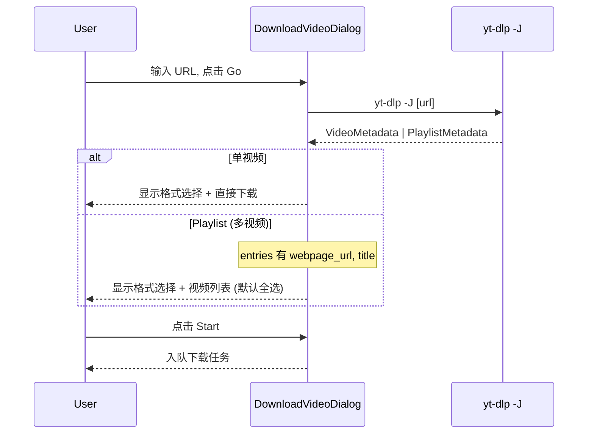

# Optimize DVD: Use yt-dlp -J Playlist Data for Episodes/Collections

合并格式拉取和视频列表拉取为一次 `yt-dlp -J` 调用, 移除"下载分集"和"获取视频列表"勾选框.

[ ] New UI component - none (移除 UI 元素)
[ ] New user config - none
[ ] Electron only - none
[ ] User document - none

## 1. Background

当前 DVD 的流程:
1. 用户点击 Go → `yt-dlp -J [url]` 拉取格式 (播放列表响应中 entries 被丢弃)
2. 用户勾选"下载分集"→ `yt-dlp -j [url]` 再拉取一次获取视频列表
3. 用户勾选"获取视频列表"→ `yt-dlp --flat-playlist -J [url]` 再拉取一次

实际上 `yt-dlp -J [url]` 对 **所有类型的 URL** (Bilibili 系列/合集、YouTube 播放列表等) 都返回 `PlaylistMetadata`, entries 中包含完整视频列表。步骤 2 和 3 完全多余。

## 2. Project Level Architecture

none

## 3. App Level Architecture

**移除前:**
```
handleGo → listYtdlpFormats(-J) → formats only  (entries discarded)
         → [checkbox] → getBilibiliEpisodesMetadata(-j) → episodes
         → [checkbox] → getBilibiliCollectionMetadata(--flat-playlist -J) → collection
```

**移除后:**
```
handleGo → listYtdlpFormats(-J) → formats + videoListEntries (playlists)
         → 自动显示视频列表 (无需勾选框)
```



## 4. User Stories

### 4.1 Bilibili 系列自动显示分集

* **Given** 用户在 DVD 中输入 `https://www.bilibili.com/bangumi/play/ssXXXXX`
* **When** 点击 Go
* **Then** yt-dlp 返回 PlaylistMetadata, 格式面板下方**自动显示**分集列表 (全部默认勾选), 无需额外操作

### 4.2 Bilibili 合集自动显示视频列表

* **Given** 用户在 DVD 中输入 `https://space.bilibili.com/XXXXX/lists/YYYYY`
* **When** 点击 Go
* **Then** yt-dlp 返回 PlaylistMetadata, 视频列表自动显示 (全部默认勾选)

### 4.3 YouTube 播放列表自动显示

* **Given** 用户在 DVD 中输入 `https://www.youtube.com/playlist?list=...`
* **When** 点击 Go
* **Then** 播放列表中的视频自动显示

### 4.4 单视频 URL 无变化

* **Given** 用户输入普通单视频 URL
* **When** 点击 Go
* **Then** 仅显示格式选择, 无视频列表 (行为不变)

## 5. Tasks

### 5.1 修改 useListFormatsMutation 保存 Playlist entries

- [x] **Task 1** — 修改 `apps/ui/src/components/dialogs/hooks/useListFormatsMutation.ts`
  - 新增 `videoListEntries: VideoMetadata[] | null` 状态
  - 在 `listYtdlpFormats` 成功回调中, 当响应来源于 playlist 时保存 entries
  - 需要在 `listYtdlpFormats` API 层面返回原始 parsed 数据 (而不是只返回 `videoMetadataForFormatsListing`)
  - 或者: 修改 `listYtdlpFormats` 返回 `{ videoMetadata, playlistEntries? }` 而不是仅 `VideoMetadata`

### 5.2 修改 useDownloadVideoForm

- [x] **Task 2** — 修改 `apps/ui/src/components/dialogs/hooks/use-download-video-form.ts`
  - 从 `useListFormatsMutation` 接收 `videoListEntries`
  - 导出 `videoListEntries: { title: string; url: string }[] | null`
  - 移除 `canDownloadEpisodes` 和 `isCollectionUrl` 的 UI 用途 (仍用于内部判断)
  - 移除 `showCookiesAtTopLevel` 旧逻辑 (现在有 videoListEntries 或 videoMetadata 就表示已获取)

### 5.3 修改 useYtdlpDownloadFlow

- [x] **Task 3** — 修改 `apps/ui/src/components/dialogs/hooks/use-ytdlp-download-flow.ts`
  - 移除 `downloadEpisodes` 状态和相关逻辑
  - 移除 `downloadCollectionVideos` 状态和相关逻辑
  - 移除 `fetchEpisodesMetadata` 和 `fetchCollectionMetadata` 调用
  - 移除 `handleDownloadEpisodesChange` 和 `handleDownloadCollectionVideosChange`
  - 移除 `useBilibiliEpisodesMetadataMutation` 和 `useBilibiliCollectionMetadataMutation` 的使用
  - 改用 `videoListEntries` prop 直接派生 `episodes: EpisodeItem[]`
  - `selectedEpisodeUrls` 初始化为 `videoListEntries` 全选

### 5.4 修改 UI 组件

- [x] **Task 4** — 修改 `apps/ui/src/components/dialogs/UIDownloadVideoDialogContent.tsx`
  - 移除 `downloadEpisodes`, `canDownloadEpisodes`, `downloadCollectionVideos`, `isCollectionUrl` props
  - 当 `videoListEntries` 非空时, 在格式面板下方直接显示视频列表 (合并 EpisodesSection 和 CollectionSection 为一个通用 VideoListSection)
  - 移除 `hideFormatCodeUi` 逻辑 (不再有 episodes/collection 勾选框)

- [x] **Task 5** — 创建视频列表 UI
  - 合并 `EpisodesSection` 和 `CollectionSection` 为一个组件
  - 无需勾选框, 直接显示列表
  - 列表始终可见 (当 entries 存在时), 不依赖勾选框切换

### 5.5 清理死代码

- [x] **Task 6** — 移除不再使用的 API 函数和 hooks
  - `apps/ui/src/api/ytdlp.ts`: 移除 `getBilibiliEpisodesMetadata`, `getBilibiliCollectionMetadata` 及相关类型、辅助函数
  - `apps/ui/src/hooks/ytdlp/useYtdlpMutations.ts`: 移除 `useBilibiliEpisodesMetadataMutation`, `useBilibiliCollectionMetadataMutation`
  - 更新相关测试文件

## 6. Backward Compatibility

- `handleStart` 中 `downloadEpisodes` 和 `downloadCollectionVideos` 状态被移除, 改用 `videoListEntries.length > 1` 判断是否为多视频下载
- 任务入队接口不变 (`createJob` / `buildDownloadVideoJob`)
- `DownloadVideoBackgroundJobData.videos` 格式不变

## 7. Documents

none

## 8. Post Verification

- [x] `pnpm run test` — 所有测试通过
- [x] `pnpm run build` — 构建成功
- [x] 手动验证: Bilibili 系列 → Go → 自动显示分集列表
- [x] 手动验证: Bilibili 合集 → Go → 自动显示视频列表
- [x] 手动验证: YouTube 播放列表 → Go → 自动显示视频列表

> **Status**: COMPLETED ✅ — yt-dlp -J 一次调用即可获取视频列表和格式信息
