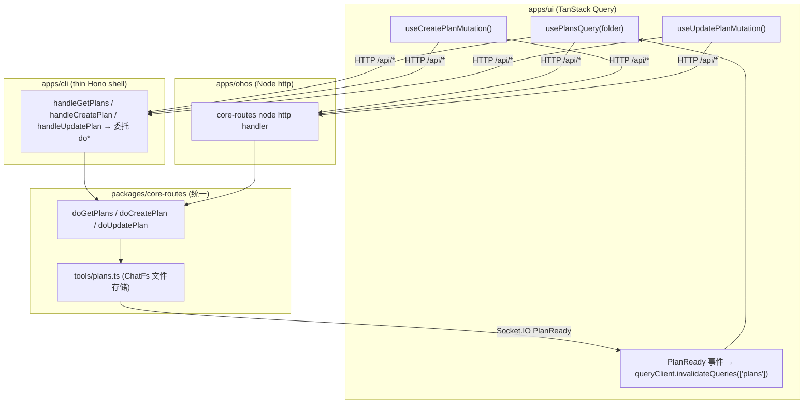
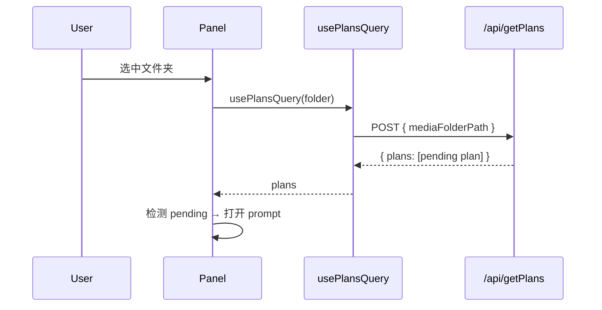
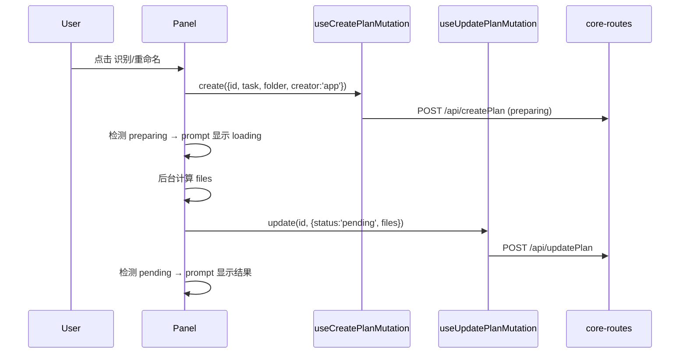

# 重构 Plan 系统：从 Zustand PlanStore 迁移到 TanStack Query

将前端基于 Zustand 的 `plansStore` 重构为基于 TanStack Query 的 Plan Query/Mutation。统一所有平台（Electron 桌面 / Docker / 浏览器 / HarmonyOS）的 Plan 存储为**基于文件**的方案，废弃 IndexedDB (`ai/planStore.ts`)、Zustand (`stores/plansStore.ts`) 与 `GlobalStatesProvider`。新增 `preparing` 状态与 `creator` 字段，简化 Plan 的心智模型。

[ ] New UI component - 无新增 UI 组件（复用现有 Prompt）
[ ] New user config - 无
[ ] Electron only - 否（全平台）
[ ] User document - 否（仅内部设计/API 文档）

## 1. Background

### 1.1 现状

当前 Plan 系统存在 **3 套并行的状态/存储机制**，心智模型复杂：

| 机制 | 文件 | 用途 | 问题 |
|------|------|------|------|
| Zustand `usePlansStore` | `apps/ui/src/stores/plansStore.ts` | 前端 Plan 主状态（含 `tmp`/`loading`） | 与服务端状态割裂，需手动 `fetchPlans` + `setPlans` 同步 |
| IndexedDB `ai/planStore.ts` | `apps/ui/src/ai/planStore.ts` | 浏览器内 AI 工具（`ReverseProxyChatTransport`）的 Plan 存储 | 与后端文件存储重复实现，仅前端可见 |
| `GlobalStatesProvider` | `apps/ui/src/providers/global-states-provider.tsx` | 旧的 pending plans 容器 | **已不再被任何组件挂载/消费**，死代码 |

后端文件存储（`{appDataDir}/plans/*.plan.json`）是唯一的「真相源」，但前端需要通过 `getPendingPlans`/`updatePlan` HTTP + Socket.IO 事件手动同步到 Zustand。

### 1.2 关键约束

- **HTTP 路由缺失**：`getPendingPlans`/`updatePlan` HTTP 路由**仅存在于 `apps/cli`**，`packages/core-routes`（HarmonyOS 使用）没有这些路由。HarmonyOS 当前依赖前端 IndexedDB 路径，删除 IDB 后将无法读写 Plan。
- **临时 Plan**：rule-based recognize/rename 创建 `tmp: true` + `status: 'loading'` 的内存临时 Plan，不落盘。本次改为落盘的 `preparing` Plan。
- **MoviePanel**：当前**完全不使用 Plan 系统**，重命名走同步 `renameFiles` API，识别走 TMDB mutation。本次纳入统一的 Plan 流程。

### 1.3 决策（已与需求方确认）

1. **状态命名**：保留 `completed`，仅新增 `preparing`。最终状态集合：`preparing | pending | completed | rejected`。
2. **后端路由位置**：统一放到 `packages/core-routes`（CLI 与 OHOS 共用），删除 CLI 专属副本。CLI 保留 thin Hono shell 委托给 core-routes 的 `do*` 纯函数（沿用现有 `RenameFiles`/`ReadFile` 模式）。
3. **前端 AI 工具**：删除 IDB，改为调用新的 HTTP `createPlan`/`updatePlan`（与后端文件方案统一）。
4. **查询范围**：`usePlansQuery(mediaFolderPath)` 按文件夹过滤，query key 含 folder path。
5. **开发阶段**：功能交付（需单元测试 + typecheck）。
6. **覆盖范围**：TvShowPanel + MoviePanel。

## 2. Project Level Architecture



**变更要点**：
- Plan 的领域逻辑（创建/更新/查询/删除）统一到 `packages/core-routes/src/tools/plans.ts`，通过 `ChatFs` 抽象实现 Node(OHOS)/Bun(CLI) 通用。
- 新增 3 个 HTTP 端点（RPC 风格，遵循 `data`/`error` 响应约定）：`/api/getPlans`、`/api/createPlan`、`/api/updatePlan`。
- 删除 CLI 专属的 `GetPendingPlans.ts`/`UpdatePlan.ts` 及其依赖的 `recognizeMediaFilesTool`/`renameFilesToolV2` 中的 status/list 逻辑（迁移到 core-routes）。

## 3. App Level Architecture

### 3.1 数据模型变更（packages/core）

`RecognizeMediaFilePlan` 与 `RenameFilesPlan` 新增字段：

```ts
status: "preparing" | "pending" | "completed" | "rejected"   // 新增 preparing
creator: "app" | "ai"                                         // 新增
```

- `preparing`：Plan 已创建但内容（files）尚未计算完成。
- `creator`：`"app"`（rule-based recognize/rename）或 `"ai"`（AI Assistant / MCP）。

**移除前端专属类型扩展**：删除 `UIRecognizeMediaFilePlan`/`UIRenameFilesPlan` 中的 `tmp` 字段与 `loading` 状态（被 `preparing` + 落盘取代）。`UIPlan` 直接等价于 core 的 `RecognizeMediaFilePlan | RenameFilesPlan`（仅路径为平台格式）。

### 3.2 前端 Hooks（apps/ui/src/hooks/plans/）

```ts
// query key: ['plans', normalizeMediaFolderPathForQuery(mediaFolderPath)]
usePlansQuery(mediaFolderPath?: string): UseQueryResult<UIPlan[]>

useCreatePlanMutation(): UseMutationResult<UIPlan, Error, {
  id?: string                  // 可选，前端预生成 UUID 以便立即用于 prompt
  task: 'recognize-media-file' | 'rename-files'
  mediaFolderPath: string
  creator: 'app' | 'ai'
}>

useUpdatePlanMutation(): UseMutationResult<UIPlan, Error, {
  id: string
  patch: { status?: PlanStatus; files?: ... }   // 更新状态和/或内容
}>
```

- 全部遵循**乐观更新策略**（AGENTS.md）：`onMutate` 先更新 query cache → `mutationFn` 调 API → `onError` 回滚 → `onSettled` 视情况 `invalidateQueries`。
- `useCreatePlanMutation` 由调用方预生成 `id`，使 prompt 能立即引用该 Plan。
- 终态（`completed`/`rejected`）更新后，后端**删除 Plan 文件**，query 失效后该 Plan 从缓存消失（取代旧的 IDB `cleanupStalePlans`）。

### 3.3 HTTP API（packages/core-routes）

| 端点 | 请求 | 响应 `data` | 说明 |
|------|------|-------------|------|
| `POST /api/getPlans` | `{ mediaFolderPath }` | `{ plans: Plan[] }` | 返回该文件夹下**活跃**（`preparing`/`pending`）Plan |
| `POST /api/createPlan` | `{ id?, task, mediaFolderPath, creator }` | `{ plan: Plan }` | 创建 `preparing` 空 Plan |
| `POST /api/updatePlan` | `{ id, status?, files? }` | `{ plan: Plan }` | 更新内容；终态时删除文件 |

- 复用 `tools/plans.ts` 的 `ChatFs` 文件 I/O；新增 `createPlan`、`updatePlanContent`、`getActivePlansForFolder`、`deletePlan` 纯函数。
- AI/MCP 的 `begin/add/end` 工具语义对齐新模型：`begin` → `createPlan(preparing, creator='ai')`；`add` → 追加 files；`end` → `updatePlan(status='pending')` + 广播 `PlanReady`。

### 3.4 状态同步

- Socket.IO `recognizeMediaFilePlanReady` / `renameFilesPlanReady` 事件 → 事件监听器调用 `queryClient.invalidateQueries({ queryKey: ['plans'] })`，触发当前文件夹的 plans 重新拉取（取代 `fetchPlans` + `setPlans`）。

### 3.5 删除清单

- `apps/ui/src/stores/plansStore.ts`（Zustand）
- `apps/ui/src/ai/planStore.ts`（IndexedDB）
- `apps/ui/src/providers/global-states-provider.tsx`（死代码）
- `apps/ui/src/actions/planActions.ts`（`fetchPlans`/`savePlan` 由 hooks 取代）
- CLI：`src/route/GetPendingPlans.ts`、`src/route/UpdatePlan.ts`，及 `recognizeMediaFilesTool.ts`/`renameFilesToolV2.ts` 中的 `updatePlanStatus`/`getAllPending*` 逻辑（迁移至 core-routes）

## 4. User Stories

### 4.1 查询并显示 pending plan（TvShowPanel / MoviePanel）

* **Given** - 某媒体文件夹存在 `pending` 状态的 Plan（来自 AI 或 app）
* **When** - 用户在 Panel 中选中该文件夹
* **Then** - `usePlansQuery(folder)` 返回该 Plan，自动弹出对应 prompt（recognize / rename）



### 4.2 创建并准备 app Plan（rule-based recognize / rename）

* **Given** - 用户在 Panel 中点击「识别」或「重命名」
* **When** - 触发创建流程
* **Then** - 立即创建 `preparing` Plan 并弹出 loading prompt；后台计算完成后更新为 `pending`，prompt 显示结果



### 4.3 修改 Plan 状态（确认 / 取消）

* **Given** - prompt 显示 `pending` Plan
* **When** - 用户点击「确认」（应用 Plan）或「取消」
* **Then** - 确认：应用 Plan → `useUpdatePlanMutation(id, {status:'completed'})`；取消：`{status:'rejected'}`。后端删除 Plan 文件，prompt 关闭

### 4.4 AI 创建 Plan 的状态同步

* **Given** - AI（后端 chat / MCP，或前端 transport）创建了新 Plan
* **When** - 后端广播 `PlanReady` Socket.IO 事件
* **Then** - 前端事件监听器 `invalidateQueries(['plans'])` → 当前文件夹 plans 重新拉取 → 弹出 prompt

### 4.5 用户切换 naming rule 时更新 Plan（rename）

* **Given** - rename prompt 已打开且存在 `pending` Plan
* **When** - 用户选择新的 naming rule
* **Then** - `useUpdatePlanMutation(id, {status:'preparing'})` → prompt 显示 loading → 计算新文件名 → `useUpdatePlanMutation(id, {status:'pending', files})` → prompt 更新

## 5. Tasks

### 5.1 数据模型（packages/core）

- [ ] `RecognizeMediaFilePlan` 新增 `preparing` 状态与 `creator` 字段
- [ ] `RenameFilesPlan` 新增 `preparing` 状态与 `creator` 字段
- [ ] `createEmptyRenamePlan` 等 helper 支持 `creator` 参数，默认 `'app'`
- [ ] 删除 `packages/core/types/plan.ts`（确认无引用后）
- [ ] 单元测试：类型/helper 默认值

### 5.2 后端统一存储与领域逻辑（packages/core-routes/src/tools/plans.ts）

- [ ] `createPlan(appDataDir, fs, {id?, task, mediaFolderPath, creator})` → Plan（status=preparing）
- [ ] `updatePlanContent(appDataDir, fs, id, patch)` → Plan（终态时 deletePlan）
- [ ] `getActivePlansForFolder(appDataDir, fs, mediaFolderPath)` → Plan[]（preparing|pending）
- [ ] `deletePlan(appDataDir, fs, id)`
- [ ] AI 工具 `begin/add/end` 对齐：begin 用 createPlan(preparing, creator='ai')，end 用 updatePlan(status='pending')
- [ ] 单元测试（红绿原则）：创建/更新/查询/删除/终态清理

### 5.3 新 HTTP 接口（packages/core-routes）

- [ ] `doGetPlans` / `doCreatePlan` / `doUpdatePlan` 纯函数（含 Zod 校验，遵循 `data`/`error` 约定）
- [ ] node http route handlers：`plansRoute.ts`（getPlans/createPlan/updatePlan）
- [ ] 在 `register.ts` 的 `coreRouteHandlers` 中注册并导出 `do*`
- [ ] 单元测试：路由处理与校验失败分支

### 5.4 CLI 集成（apps/cli）

- [ ] 新增 thin Hono shell `handleGetPlans`/`handleCreatePlan`/`handleUpdatePlan` 委托 core-routes `do*`
- [ ] `server.ts` 注册新路由，移除 `handleGetPendingPlans`/`handleUpdatePlan`
- [ ] 删除 `src/route/GetPendingPlans.ts`、`src/route/UpdatePlan.ts`
- [ ] 清理 `recognizeMediaFilesTool.ts`/`renameFilesToolV2.ts` 中已迁移逻辑，AI/MCP 工具改用 core-routes plan 函数
- [ ] 回归：现有 AI/MCP recognize/rename e2e 流程

### 5.5 前端 API 层（apps/ui/src/api）

- [ ] 新增 `getPlans.ts`、`createPlan.ts`
- [ ] 修改 `updatePlan.ts` 支持 `{ status?, files? }` patch（兼容新签名）
- [ ] 删除 `getPendingPlans.ts`

### 5.6 前端 Hooks（apps/ui/src/hooks/plans）

- [ ] `plansQueryKeys.ts`（`['plans', normalizedFolder]`）
- [ ] `usePlansQuery.ts`
- [ ] `useCreatePlanMutation.ts`（乐观更新 + 预生成 id）
- [ ] `useUpdatePlanMutation.ts`（乐观更新 + 终态移除）
- [ ] 单元测试：乐观更新 / 回滚 / 失效

### 5.7 前端组件迁移

- [ ] `TvShowPanel.tsx`：替换 `usePlansStore` → hooks；rule-based recognize/rename 改为 createPlan(preparing)+updatePlan；confirm/cancel 改用 useUpdatePlanMutation
- [ ] `TvShowPanelPrompts.tsx`：`plans` 来源改为 `usePlansQuery`；`loading` 判断改为 `preparing`
- [ ] `MoviePanel.tsx`：rename 流程纳入 Plan 系统（createPlan→updatePlan→confirm），监听 pending rename plan 弹出 prompt
- [ ] `eventlisteners/RecognizeMediaFilePlanReadyEventListener.tsx`：改为 `invalidateQueries(['plans'])`
- [ ] `eventlisteners/RenameFilesPlanReadyEventListener.tsx`：同上

### 5.8 前端 AI 工具迁移（apps/ui/src/ai）

- [ ] `BeginRecognizeTask`/`AddRecognizedMediaFile`/`EndRecognizeTask`：改用 HTTP createPlan/updatePlan，移除 IDB
- [ ] `BeginRenameFilesTask*`/`AddRenameFileToTask*`/`EndRenameFilesTask*`：同上
- [ ] `Assistant.tsx`：移除 `cleanupStalePlans()` 调用与 IDB 依赖
- [ ] 删除 `ai/planStore.ts`、`ai/plan/renamePlanService.ts`（如仅服务 IDB）

**Transport 分流（task tools 单路径执行）**：rename/recognize 的 6 个 task 工具在 registry 中 `backend: true` 且 `frontend: true`，但**同一运行时只在一端 execute**：

| Transport | Task tools `execute` | `Assistant.tsx` 挂载 |
|-----------|---------------------|---------------------|
| `AssistantChatTransport`（桌面默认） | 仅 `doChat` → `core-routes` | **不挂载** 6 个 task `makeAssistantTool` |
| `ReverseProxyChatTransport` | 仅浏览器 → HTTP plan API | **挂载** 6 个 task 组件 |

条件：`useFrontendTransport = isHarmonyOS() \|\| isUIAiChatTransportEnabled`。若桌面同时挂载前端 task tools 与后端 tools，会重复 `createPlan`（orphan plan + LLM taskId 不一致）。详见 `ai-assistant.md` §1.1。

### 5.9 清理死代码

- [ ] 删除 `stores/plansStore.ts`、`providers/global-states-provider.tsx`、`actions/planActions.ts`
- [ ] 全局搜索确认无残留引用

### 5.10 文档

- [ ] 更新 `.agents/docs/architecture.md`（State Management：移除 GlobalStatesProvider/plansStore，新增 plans query hooks）
- [x] 更新 `.agents/docs/design/episode-rename-recognize.md`（Plan 生命周期、状态、creator、统一 plan 预览/prompt、AI transport 分流）
- [x] 更新 `.agents/docs/design/ai-assistant.md`（transport、Plan 存储、task tools 单路径执行）
- [ ] 更新 `docs/api/index.md`（getPlans/createPlan/updatePlan，移除 getPendingPlans）

## 6. Backward Compatibility

- **磁盘上的旧 Plan 文件**：旧文件无 `creator` 字段且 status 为 `pending|completed|rejected`。读取时对缺失 `creator` 默认 `'app'`；旧的 `completed`/`rejected` 文件在首次 `getActivePlansForFolder` 时被忽略（非活跃），可由后续终态更新或惰性清理移除。无需迁移脚本。
- **IndexedDB `smm-ai-plans` 库**：删除代码后不再访问，残留库不影响功能（浏览器侧惰性遗弃）。
- **HTTP 端点变更**：`getPendingPlans` 被 `getPlans` 取代——前后端同步发布（monorepo 单次部署），无跨版本兼容问题。
- **OHOS**：本次首次为 OHOS 提供 Plan HTTP 路由，删除 IDB 后 OHOS 行为与桌面一致。

## 7. Documents

- [ ] `.agents/docs/architecture.md` - 更新 State Management 与 TvShowPanel/MoviePanel 架构图
- [x] `.agents/docs/design/episode-rename-recognize.md` - Plan 生命周期/状态/creator/存储统一、AI 预览与 prompt
- [x] `.agents/docs/design/ai-assistant.md` - transport 与 task tools 单路径执行
- [ ] `docs/api/index.md` - 新增 getPlans/createPlan/updatePlan，移除 getPendingPlans

## 8. Post Verification

- [ ] Unit tests：`pnpm run test` 全部通过（core / cli / ui plan 相关用例，红绿原则验证）
- [ ] Typecheck：`pnpm run typecheck` 通过
- [ ] Build：`pnpm run build` 成功
- [ ] 手动/e2e 回归：TvShow rule-based recognize、TvShow rule-based rename、TvShow AI recognize/rename、Movie rename、AI Plan Socket 同步
