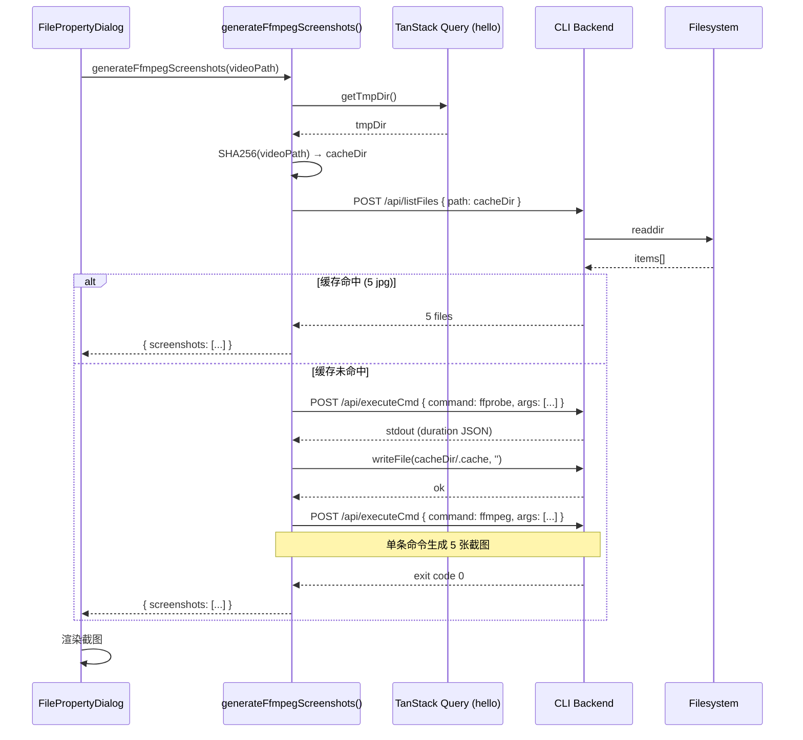

# Refactor: Screenshots API → executeCmd + listFiles

将专用 `/api/screenshots` 端点替换为通用 `listFiles`（缓存检查）+ `executeCmd`（ffprobe + ffmpeg 截图生成）的组合调用，从后端移除 `generateVideoScreenshots` 及相关缓存逻辑，把截图生成逻辑移至前端。

[ ] New UI component
[ ] New user config
[ ] Electron only
[ ] User document

## 1. Background

当前 `/api/screenshots` 是一个**专用端点**，内部封装了：
- 视频时长探测（ffprobe）
- 5 张截图的生成（5 次 ffmpeg spawn）
- 确定性缓存目录（SHA256 of videoPath）
- 缓存有效性检查（mtime 比较 + meta.json）

这个分支逻辑完全可以用已有的通用 API（`listFiles` + `executeCmd`）在前端实现，从而：
- **精简后端**：移除 ~100 行专用路由 + ~80 行工具函数
- **平台移植优势**：截图逻辑用纯前端 JS 实现，移植到其他平台时只需重新实现通用 API

## 2. Project Level Architecture

none — 不涉及 monorepo 跨包结构调整。

## 3. App Level Architecture

### 3.1 apps/cli（后端）

**移除：**
- `src/route/screenshots.ts` — 整个文件删除
- `server.ts` — 移除 `handleScreenshots` 的 import 和注册
- `src/utils/Ffmpeg.ts` — 移除以下函数（仅被 screenshots 路由使用）：
  - `getScreenshotCacheDir`
  - `readScreenshotCacheMeta`
  - `isScreenshotCacheValid`
  - `generateScreenshot`
  - `getVideoDuration`
  - `generateVideoScreenshots`
  - `NUM_SCREENSHOTS` 常量
  - 未使用的 imports：`crypto`, `getTmpDir`

**保留：** `discoverFfmpeg`, `discoverFfprobe`, `resolveFfmpegPathInfo`, `escapeForDoubleQuotedShell`, 格式转换等函数 — 它们被其他路由使用或备用。

### 3.2 apps/ui（前端）

**`src/api/ffmpeg.ts` — `generateFfmpegScreenshots` 重写：**

```
调用链路（重构后）
═══════════════════════════════════════════════════════════════

  generateFfmpegScreenshots(videoPath)
  │
  ├─ ① getTmpDir()                          ── 从 hello TanStack Query 缓存读取
  │
  ├─ ② computeHash(videoPath)               ── crypto.subtle.digest('SHA-256', ...)
  │     → cacheDir = `${tmpDir}/screenshots/${hash}/`
  │
  ├─ ③ listFiles({ path: cacheDir, onlyFiles: true })
  │     ├─ 命中 (5 个 jpg)                   → 直接返回路径数组
  │     │
  │     └─ 未命中
  │
  ├─ ④ executeCmdToCompletion(ffprobe, args)  ── 获取视频时长
  │     → 解析 duration，计算 5 个时间戳 (duration/6 间隔)
  │
  ├─ ⑤ writeFile(`${cacheDir}/.cache`, '')     ── 确保目录存在（后端 mkdir）
  │
  ├─ ⑥ executeCmdToCompletion(ffmpeg, args)  ── **单条命令**，5 张截图
  │     → args: -ss ts1 -i video -ss ts2 -i video -ss ts3 -i video
  │             -ss ts4 -i video -ss ts5 -i video
  │             -map 0:v -vframes 1 -q:v 2 out1.jpg
  │             -map 1:v -vframes 1 -q:v 2 out2.jpg
  │             ...
  │
  └─ ⑦ 返回 { screenshots: [...] }
```

### 3.3 缓存策略变更

| 维度 | 当前（专用端点） | 重构后（通用 API） |
|------|-----------------|-------------------|
| 缓存目录 | `{tmpDir}/screenshots/{sha256(videoPath)}/` | **不变** |
| 缓存验证 | mtime 比较 + meta.json | **仅检查 5 个 jpg 是否存在**（最简策略） |
| meta.json | 写入/读取 video mtime | **不保留** |

> 选择最简缓存策略（1b/2b）的权衡：如果视频文件被替换但路径不变，旧截图不会被刷新。这是极端边缘情况，且用户可通过删除 tmp 目录手动清理。

## 4. User Stories

### 4.1 打开文件属性对话框时显示视频截图

* **Given** 用户已导入一个包含视频文件的媒体文件夹
* **When** 用户右键视频文件并选择"属性"
* **Then** 对话框显示 5 张视频截图，2 秒内加载完成
* **And** 再次打开同一视频的属性时，截图立即显示（命中缓存）



## 5. Tasks

### 5.1 Backend — 移除专用端点 ✅

[x] 5.1.1 删除 `apps/cli/src/route/screenshots.ts`
[x] 5.1.2 从 `apps/cli/server.ts` 移除 `handleScreenshots` import 和调用
[x] 5.1.3 从 `apps/cli/src/utils/Ffmpeg.ts` 移除：
  - `getScreenshotCacheDir`
  - `readScreenshotCacheMeta`
  - `isScreenshotCacheValid`
  - `generateScreenshot`
  - `getVideoDuration`
  - `generateVideoScreenshots`
  - `NUM_SCREENSHOTS` 常量
  - 未使用的 imports (`crypto`, `getTmpDir`)
  - `escapeForDoubleQuotedShell` **保留**（被 `getMediaTags` / `writeMediaTags` 使用）

### 5.2 Frontend — 重写截图生成逻辑 ✅

[x] 5.2.1 重写 `apps/ui/src/api/ffmpeg.ts` 中的 `generateFfmpegScreenshots` 函数：
  - 从 TanStack Query 缓存读取 `tmpDir`（不足时自动 fetch hello API）
  - 使用 Web Crypto API (`crypto.subtle.digest`) 计算 SHA256
  - 通过 `listFiles` 检查缓存目录
  - 通过 `executeCmdToCompletion` 调用 ffprobe 获取时长
  - 通过 `writeFile` 确保缓存目录存在（利用后端 `mkdir({recursive})`）
  - 通过 `executeCmdToCompletion` 调用 ffmpeg **单命令**生成 5 张截图
[x] 5.2.2 新增辅助函数：
  - `sha256Hex(str: string): Promise<string>` — Web Crypto SHA256 转 hex
  - `parseFfprobeDuration(stdout: string): number | null` — 从 ffprobe JSON 提取时长
  - ffmpeg 参数在 `generateFfmpegScreenshots` 内联构造（65 args，低于 100 上限）

### 5.3 Hello Query 缓存访问 ✅

[x] 5.3.1 `generateFfmpegScreenshots` 直接使用 `queryClient.getQueryData(helloQueryKey)` 读取缓存
  - 未命中时自动 `queryClient.fetchQuery({ queryKey: helloQueryKey, queryFn: () => hello() })`
  - 无需修改 `useHelloQuery.ts`

### 5.4 验证

[x] 5.4.1 后端 typecheck — 无新增错误（仅有遗留的 `ffprobeExecutablePath` 问题）
[x] 5.4.2 前端 typecheck — 无错误
[x] 5.4.3 E2E 测试 — `MediaFileProperties.e2e.ts` 1 passing (23.3s)

## 6. Backward Compatibility

- `HelloResponseBody.tmpDir` 字段已存在，**保持**，不删除
- `getTmpDir()` 函数在 `config.ts` 中**保留**（被其他模块如 Ytdlp、permission 使用）
- 前端 `generateFfmpegScreenshots` 的函数签名**不变**，调用者无需修改
- `POST /api/screenshots` 已被移除 → 已有客户端代码需更新（已在本次重构中完成）

## 7. Documents

[ ] `docs/api/index.md` — 移除 `/api/screenshots` 条目的记录（如存在 — 待确认）

## 8. Post Verification

[x] Unit tests — `pnpm run test` 无新增失败
[x] Build — `pnpm run build` 构建成功
[x] Type check — 前端无错误，后端仅有遗留错误（与本次重构无关）
[x] E2E — `MediaFileProperties.e2e.ts` 测试通过（23.3s, 1 passing）
