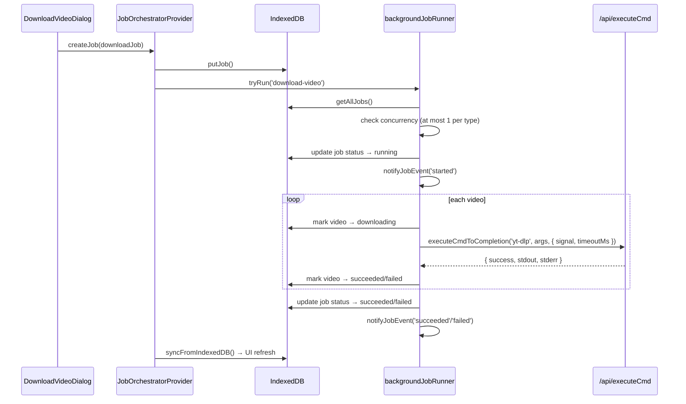
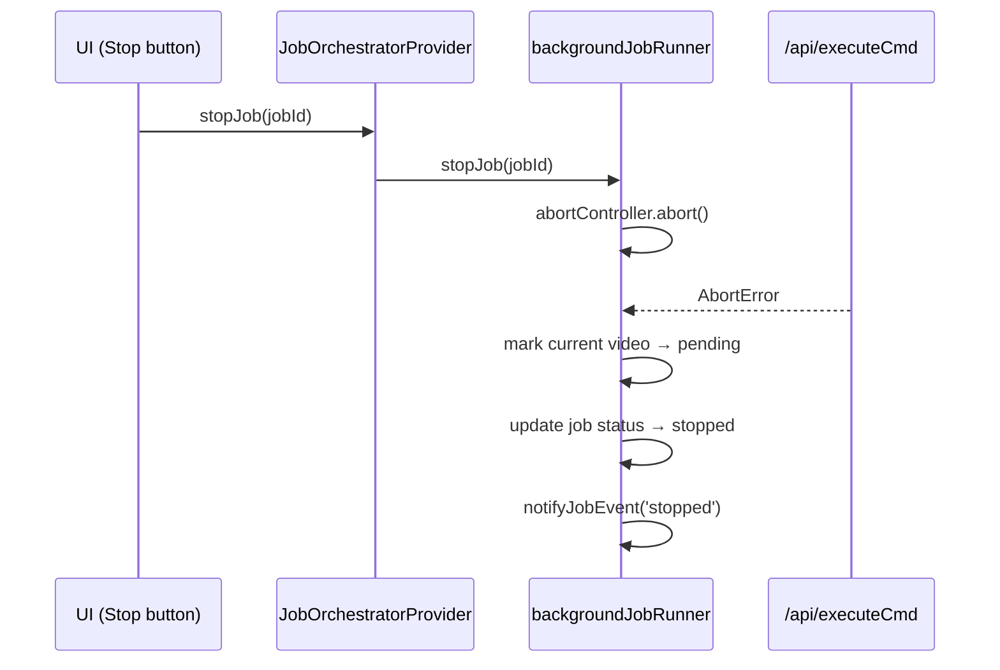
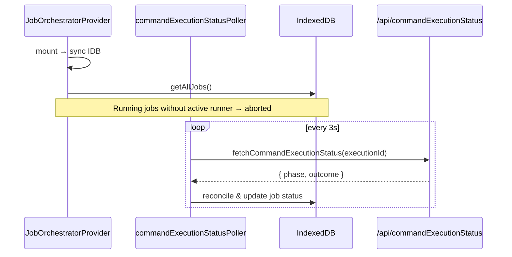

# Remove Service Worker from Background Jobs

移除 Service Worker, 将后台任务执行转由主线程直接处理.

[ ] New UI component - none
[ ] New user config - none
[ ] Electron only - none
[ ] User document - none

## 1. Background

当前后台任务系统 (download / transcribe / translate / synthesize / process) 通过 Service Worker 代理执行 CLI 命令. 
详见 `deprecate-sw.md` 分析: SW 在当前 Electron SPA 架构中不是必需的, 移除后可减少 ~1200 行 JS 代码重复, 简化双向通信, 全链路 TypeScript 类型安全.

## 2. Project Level Architecture

none

## 3. App Level Architecture

**移除前:**
```
UI Thread                     Service Worker              CLI Backend
JobOrchestratorProvider  ──→  download-service-worker.js ──→ /api/executeCmd
       ↕ postMessage    ←──       ↕ IDB                    (streaming NDJSON)
       ↕ IDB
```

**移除后:**
```
UI Thread                                        CLI Backend
JobOrchestratorProvider ──→ backgroundJobRunner ──→ /api/executeCmd
       ↕ callback              ↕ IDB               (streaming NDJSON)
       ↕ IDB
```

核心变化:
- SW 层被 `JobOrchestratorProvider` 内新增的执行逻辑取代, 不再通过 postMessage
- 删除 4 个 SW 相关文件
- 不新建独立模块, 执行逻辑直接内聚在 orchestrator 中

## 4. User Stories

### 4.1 创建并执行下载任务

* **Given** 用户在 DVD 中配置 YouTube URL 和参数
* **When** 点击 Start 按钮
* **Then** 任务被写入 IDB, `backgroundJobRunner` 自动拾取并执行 yt-dlp 下载, 状态栏实时更新进度



### 4.2 停止正在运行的任务

* **Given** 有一个 download 任务正在运行
* **When** 用户点击 Stop 按钮
* **Then** 当前视频的 yt-dlp 进程被 abort, 任务变为 stopped, 剩余视频保持 pending



### 4.3 页面刷新后任务恢复

* **Given** 有一个 download 任务在刷新前正在运行
* **When** 页面刷新完成
* **Then** reconciliation poller 从 CLI 查询命令状态, 将已完成的任务标记为 succeeded/failed, 未关联 executionId 的任务标记为 aborted



## 5. Tasks

### 5.1 在 JobOrchestratorProvider 中新增任务执行逻辑

`backgroundJobRunner` 合并到 `JobOrchestratorProvider.tsx` 中, 因为两者共享同一份 IDB 数据、状态 refs 和 sync 逻辑, 分离只会增加胶水代码。

- [x] **Task 1** — 新增执行引擎 (在 `JobOrchestratorProvider.tsx` 内)
  - 维护 `runningJobs` ref: `Map<jobType, jobId>` (全局每类型最多 1 个 running)
  - 维护 `abortControllers` ref: `Map<jobId, AbortController>`
  - 实现 `executeJob(jobId)` — 从 IDB 读取, 检查并发, 执行命令, 更新 IDB
  - 实现 `stopExecutingJob(jobId)` — abort 当前执行, 标记为 stopped
  - 按任务类型 dispatch:
    - `download-video`: 遍历 videos, 逐个 `executeCmdToCompletion('yt-dlp', ...)`, 每个 video 完成后更新 IDB
    - `transcribe/translate/synthesize/process`: `executeCmdToCompletion('videocaptioner', ...)`
  - 超时: download 1h / synthesize 1h / process 2h / transcribe & translate 10min
  - 使用 `executeCmdToCompletionWithHeaders` 传递 executionId + signal

- [x] **Task 2** — 移除 SW 相关逻辑
  - 删除 `navigator.serviceWorker.register()`
  - 删除 `postSw()`, SW message listener
  - 删除 `attachDownloadServiceWorkerUpdateChecks`
  - `tryAutoStart` / `startJob` / `stopJob` / `removeJob` 改为调用 `executeJob` / `stopExecutingJob`

- [x] **Task 3** — 调整 SW 生命周期逻辑
  - `handleSwReactivate` 简化为纯 IDB 迁移 (running→aborted), 不再依赖 SW 激活事件
  - 页面加载时直接执行一次迁移
  - 保留 toast 通知逻辑 (在 executeJob 完成/失败时触发)

### 5.2 删除 SW 文件 & 清理引用

- [x] **Task 4** — 删除文件
  - `apps/ui/public/download-service-worker.js`
  - `apps/ui/public/whitelisted-cmd-sw.js`
  - `apps/ui/src/lib/downloadServiceWorker.ts`
  - `apps/ui/src/lib/downloadServiceWorker.test.ts`

- [x] **Task 5** — 检查 Vite/Electron 构建配置中是否引用 SW 文件, 移除相关引用

## 6. Backward Compatibility

- IDB schema 不变 (`DownloadTaskDatabase` / `jobs` store)
- 任务数据格式不变 (job.type, job.data 字段完全兼容)
- `TaskJobRecord` 类型不变
- reconciliation poller 不变
- **页面刷新后的行为变化**: 之前 SW 继续运行的任务, 现在会被 reconciliation 恢复或标记为 aborted (对用户基本透明)

## 7. Documents

none — 内部架构重构, 无 API 或用户文档变更

## 8. Post Verification

- [ ] `pnpm run test` — 所有单元测试通过
- [ ] `pnpm run build` — 构建成功
- [ ] 手动验证: 创建下载任务 → 启动 → 查看进度 → 停止
- [ ] 手动验证: 页面刷新后任务状态正确恢复
