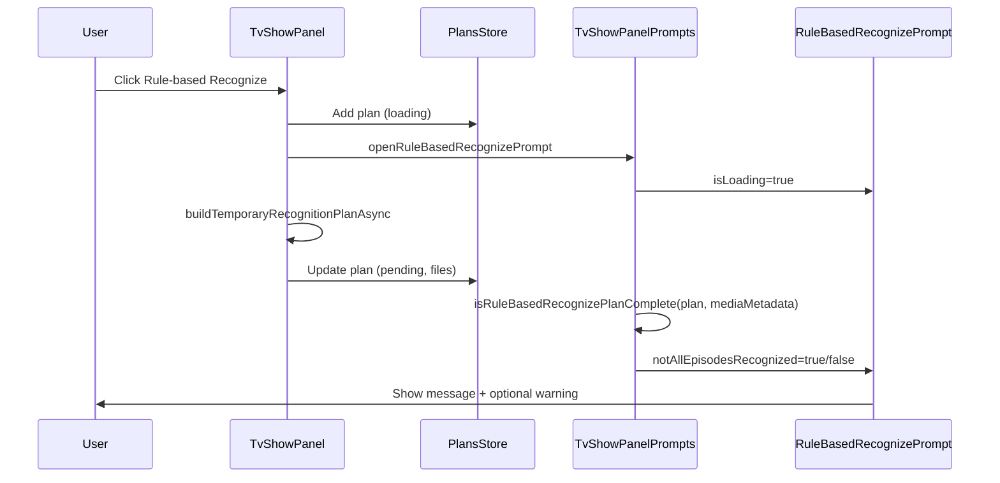

# Rule-based Recognize — Episode Validation

在 RuleBasedRecognizePrompt 中校验 rule-based recognition plan 是否已识别电视剧的全部 episodes；若未全部识别，显示提醒文案。

[ ] New UI component
[ ] New user config
[ ] Electron only
[ ] User document

## 1. Background

TvShowPanel 在用户点击「Rule-based Recognize」时会：

1. 立即创建 `loading` 状态的临时 plan，并打开 `RuleBasedRecognizePrompt`
2. 后台调用 `buildTemporaryRecognitionPlanAsync` → `recognizeEpisodesAsync` 生成 `files` 映射
3. Plan 变为 `pending` 后，用户在 Prompt 中确认是否应用识别结果

当前 Prompt 只询问「Is it {tvShowTitle} ({tmdbId})?」，不提示 plan 是否覆盖了全部 episodes。用户可能误以为已全部识别而确认，导致部分集数仍无视频文件映射。

## 2. Project Level Architecture

none

## 3. App Level Architecture

```
TvShowPanel (handleRuleBasedRecognizeButtonClick)
  └─ buildTemporaryRecognitionPlanAsync → plan.files[]

TvShowPanelPrompts
  ├─ ruleBasedPlan (from plansStore)
  └─ RuleBasedRecognizePrompt
       ├─ isLoading (plan.status === 'loading')
       └─ notAllEpisodesRecognized (new prop, computed when plan ready)
            └─ isRuleBasedRecognizePlanComplete(plan, mediaMetadata)
```

新增纯函数 `isRuleBasedRecognizePlanComplete`（或 `areAllEpisodesRecognizedInPlan`），复用 `buildEpisodes` 获取 tvShow 元数据中的全部季/集，与 plan.files 中的 `(season, episode)` 集合对比。

## 4. User Stories

### 4.1 未全部识别时显示提醒

* **Given** 用户已对某电视剧文件夹执行 rule-based recognize，且 tvShow 元数据中有 N 个 episodes
* **When** 识别 plan 就绪（`status === 'pending'`），且 plan.files 覆盖的 episode 数 < N
* **Then** `RuleBasedRecognizePrompt` 在原有确认文案下方显示提醒：「It seems not all episodes are recognized」（及对应 i18n 翻译）
* **And** Confirm 按钮仍可点击

### 4.2 全部识别时不显示提醒

* **Given** plan.files 覆盖了 tvShow 元数据中的全部 episodes
* **When** Prompt 显示且非 loading
* **Then** 不显示额外提醒

### 4.3 Loading 期间不显示提醒

* **Given** plan 仍在 `loading`
* **When** Prompt 显示 spinner
* **Then** 不显示 episode 完整性提醒（避免闪烁或误判）



## 5. Tasks

### 5.1 校验逻辑

[x] 在 `apps/ui/src/lib/` 新增 `isRuleBasedRecognizePlanComplete.ts`
  - 期望集数：tvShow seasons 中全部 `(season.season, episode.episode)`（与剧集表一致）
  - 已覆盖：`plan.files` 或已有 `mediaFiles` 映射
[x] 单元测试 `isRuleBasedRecognizePlanComplete.test.ts`

### 5.2 UI

[x] `RuleBasedRecognizePrompt` 新增 prop `notAllEpisodesRecognized?: boolean`
[x] `TvShowPanelPrompts` 计算并传入 prop

### 5.3 i18n

[x] 在 `apps/ui/public/locales/*/components.json` 的 `toolbar` 下新增 key `notAllEpisodesRecognized`

### 5.4 Recognize 预览 UI 区分（`disabled` 行）

[x] `TvShowEpisodeDataRow` 增加通用 `disabled?: boolean`（非 plan 专用命名）
[x] `fillTvShowEpisodeTableRowByRecognizeMediaFilesPlan` 将 plan 映射为 `checked` / `disabled`
[x] `TvShowEpisodeTable` 根据 `row.disabled` 渲染 muted 样式与禁用 checkbox
[x] 单元测试覆盖 plan 与 mediaFiles 混排场景

**分层职责**

| 层 | 职责 |
|----|------|
| `fillTvShowEpisodeTableRowByRecognizeMediaFilesPlan` | 读 plan.files，写 row 的 `checked` / `disabled` |
| `TvShowEpisodeDataRow` | 通用行数据 + 与 preview 类型无关的交互状态 |
| `TvShowEpisodeTable` | 根据 `row.disabled` 渲染 muted + 禁用 checkbox |

- plan 内集数：`checked=true`，`disabled=false`，显示 plan 路径
- plan 内集数且 plan 路径与已有 mediaFiles **相同**：`checked=false`，`disabled=true`（无变更，避免误认会修改该集）
- plan 内**全部**文件均与 mediaFiles 一致时，Prompt 显示 `toolbar.allPlanFilesUnchanged` 提醒，并禁用确认按钮
- plan 外集数：`checked=false`，`disabled=true`，保留已有 `videoFile`（mediaFiles），灰色只读展示
- context menu 保持可用（Open / Properties）

### 5.5 组件测试（可选）

[ ] `RuleBasedRecognizePrompt` 测试：当 `notAllEpisodesRecognized=true` 时渲染提醒文案

## 6. Backward Compatibility

none — 纯 UI 增强，不改变 plan 数据结构或 API。

## 7. Documents

none

## 8. Post Verification

[x] Unit tests — `pnpm test:ui` 通过
[ ] Build — `pnpm build:ui` 通过（或 `pnpm typecheck`）
