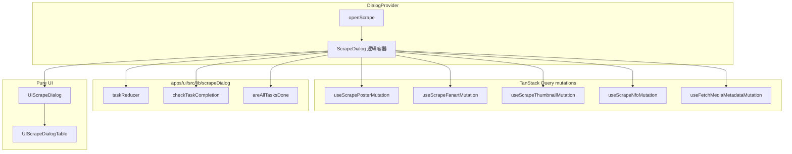

# ScrapeDialog 设计文档

## 1. 背景与目标

ScrapeDialog（刮削对话框）用于对**已识别的媒体文件夹**批量下载/生成元数据关联文件：

| 任务 ID | 内容 |
|---------|------|
| `poster` | 海报图 `poster.{ext}` |
| `fanart` | 背景图 `fanart.{ext}` |
| `thumbnails` | 每集缩略图（与视频同目录、同名不同扩展名） |
| `nfo` | NFO（电影：`movie.nfo`；剧集：`tvshow.nfo` + 各集 `.nfo`） |

用户打开对话框后可查看各任务状态，点击「开始」按顺序执行未完成项；完成后刷新 `MediaMetadata`。

### 设计目标

- 与 `TranscribeDialog` / `UITranscribeDialog` 一致：**逻辑容器 + 纯 UI** 分层。
- 纯函数（reducer、completion 检测）可单测，不依赖 React / i18n。
- 保留 E2E `data-testid` 稳定。
- Cancel / 关闭语义清晰，避免与 `canClose` 混淆。

### 演进历史

1. **V1**：单文件混合 reducer、mutations、completion 检测与 Dialog UI。
2. **V2**：独立实现 + `scrapeDialogV2` feature flag；修正 Cancel 语义（`cancelDisabled = isRunning`）。
3. **当前**：合并为单一产品入口；逻辑/UI 分层（原 V2 行为 + 重构结构）。已移除 V1/V2 双轨与 feature flag。

重构动机：旧版将状态、TanStack Query、文件检测与 UI 耦在同一文件，难以单测与维护；分层后与 TranscribeDialog 模式一致。

## 2. 架构



目录结构：

```
ScrapeDialog（逻辑容器）
├── useScrapePosterMutation / Fanart / Thumbnail / Nfo
├── useFetchMediaMetadataMutation
├── lib/scrapeDialog（taskReducer、checkTaskCompletion、selectors）
└── UIScrapeDialog（纯 UI）
    └── UIScrapeDialogTable
```

### 2.1 入口

- `DialogProvider` 通过 `useDialogs().scrapeDialog` 暴露 `[openScrape, closeScrape]`。
- 调用方传入 `mediaMetadata`（可选 `title` / `description` 保留在 options 类型中，当前 UI 使用 i18n 默认标题）。

### 2.2 文件职责

| 路径 | 职责 |
|------|------|
| [`apps/ui/src/lib/scrapeDialog/`](../../apps/ui/src/lib/scrapeDialog/) | 纯逻辑：类型、reducer、completion 检测、selector（无 React） |
| [`ScrapeDialog.tsx`](../../apps/ui/src/components/dialogs/ScrapeDialog.tsx) | 逻辑容器：`useReducer`、mutation 编排、关闭/开始处理 |
| [`UIScrapeDialog.tsx`](../../apps/ui/src/components/dialogs/UIScrapeDialog.tsx) | Dialog 壳、Header/Footer、按钮 disabled |
| [`UIScrapeDialogTable.tsx`](../../apps/ui/src/components/dialogs/UIScrapeDialogTable.tsx) | 任务表格与行状态（含错误本地化） |

对外导出：`ScrapeDialog` 为唯一产品入口；`UIScrapeDialog` / `UIScrapeDialogTable` 可供 Storybook 或测试直接渲染。

## 3. 状态机

### 3.1 Reducer 动作

| Action | 效果 |
|--------|------|
| `INIT` | 重置任务列表，`isRunning = false` |
| `SET_COMPLETION` | 根据磁盘已有文件将对应任务标为 `completed` |
| `START_RUN` | `isRunning = true` |
| `MARK_RUNNING` / `MARK_COMPLETED` / `MARK_FAILED` | 更新单任务状态；失败时写入 `failedReason` |
| `FINISH_RUN` | `isRunning = false` |

任务顺序固定：`poster` → `fanart` → `thumbnails` → `nfo`（`SCRAPE_TASK_IDS`）。

### 3.2 打开对话框时

1. `dispatch(INIT)`，四条任务均为 `pending`。
2. 异步 `checkTaskCompletion(mediaMetadata)`（`listFiles` 递归扫描）。
3. `SET_COMPLETION` 将已存在文件的项标为 `completed`（其余保持 `pending`）。

`useEffect` 依赖 `[isOpen, mediaMetadata]`，**不依赖 `t`**，避免 i18n 函数引用变化导致无限循环。

### 3.3 点击「开始」

1. 若 `allTasksDone` → 直接 `onClose()`（按钮文案为「完成」）。
2. `START_RUN` → 按顺序跳过 `completed` / `failed`，对其余项 `MARK_RUNNING` → 调用对应 mutation → `MARK_COMPLETED` 或 `MARK_FAILED`。
3. 全部处理完后 `refreshMediaMetadata`。
4. `FINISH_RUN`（在 `finally` 中）。

失败任务不阻断后续任务；错误文案由 hook/API 层 toast，状态列展示 `localizeScrapeError(failedReason)`。

## 4. 关闭与 Cancel 语义

两类「关闭」必须区分：

| 概念 | 条件 | 影响 |
|------|------|------|
| **`cancelDisabled`** | `isRunning === true` | Cancel 按钮 `disabled`；`handleClose` 提前 return |
| **`canDismissIncidentally`** | `allTasksDone && !isRunning` | 右上角 X、`onOpenChange`（遮罩/Esc）是否允许关闭 |

**Cancel 按钮**（用户主动取消对话框）：

- 刮削**前**（含 pending、或部分 completed）：**可用**。
- 刮削**中**：**禁用**。

**误绑定教训**：曾将 Cancel 设为 `disabled={!canClose}`（即与 `allTasksDone` 绑定），导致有未完成任务时 Cancel 变灰不可点。正确做法是 **`cancelDisabled = isRunning` only**。

```typescript
// ScrapeDialog.tsx
const canDismissIncidentally = allTasksDone && !state.isRunning
const cancelDisabled = state.isRunning
```

### 行为约束（重构前后不变）

- [x] `cancelDisabled = isRunning` — 刮削前 Cancel 可用，刮削中禁用
- [x] `canDismissIncidentally = allTasksDone && !isRunning` — X / 遮罩 / Esc
- [x] 保留全部 E2E `data-testid`

## 5. 类型

核心类型定义于 [`lib/scrapeDialog/types.ts`](../../apps/ui/src/lib/scrapeDialog/types.ts)，UI props 定义于 [`types/index.ts`](../../apps/ui/src/components/dialogs/types/index.ts)。

```typescript
export type ScrapeTaskId = "poster" | "fanart" | "thumbnails" | "nfo"
export type ScrapeTaskStatus = "pending" | "running" | "completed" | "failed"

export interface ScrapeTaskView {
  id: ScrapeTaskId
  status: ScrapeTaskStatus
  failedReason?: string
}

export interface UIScrapeDialogProps {
  isOpen: boolean
  onClose: () => void
  tasks: ScrapeTaskView[]
  isRunning: boolean
  allTasksDone: boolean
  showButtons: boolean
  cancelDisabled: boolean
  canDismissIncidentally: boolean
  onCancel: () => void
  onStart: () => void | Promise<void>
}

export type ScrapeDialogProps = Pick<UIScrapeDialogProps, "isOpen" | "onClose"> & {
  mediaMetadata?: MediaMetadata
}
```

逻辑层任务**不含**翻译后的 `name`；UI 通过 `scrape.tasks.{id}` i18n key 渲染列名。

## 6. Completion 检测（`checkTaskCompletion`）

扫描 `mediaMetadata.mediaFolderPath` 下所有文件（递归）：

| 任务 | 判定 |
|------|------|
| poster / fanart | 存在 `poster.{imageExt}` / `fanart.{imageExt}` |
| nfo（电影） | 存在 `movie.nfo` |
| nfo（剧集） | 存在 `tvshow.nfo` 且每个已识别季集视频旁有对应 `.nfo` |
| thumbnails | 每个有 season/episode 的视频同目录存在 `{videoBase}.{imageExt}` |

无 `mediaFolderPath` 或 `listFiles` 失败时，全部返回 `false`（保守视为未完成）。

## 7. Mutations（TanStack Query）

逻辑容器直接使用现有 hooks（**不**合并为单一 hook）：

| Hook | 用途 |
|------|------|
| `useScrapePosterMutation` | 下载 poster |
| `useScrapeFanartMutation` | 下载 fanart |
| `useScrapeThumbnailMutation` | 下载剧集缩略图 |
| `useScrapeNfoMutation` | 写入 NFO |
| `useFetchMediaMetadataMutation` | 刮削结束后刷新元数据 |

Poster / fanart 使用 `userConfig.preferMediaLanguage`。

## 8. UI 与 E2E

### 8.1 testid（勿改）

| testid | 元素 |
|--------|------|
| `scrape-dialog` | 对话框根 |
| `scrape-dialog-table` | 任务表 |
| `scrape-dialog-task-row-{id}` | 任务行 |
| `scrape-dialog-task-status-{id}` | 状态列 |
| `scrape-dialog-cancel` | Cancel |
| `scrape-dialog-start` | 开始 / 完成 |

E2E：[`apps/e2e/test/componentobjects/ScrapeDialogCO.ts`](../../apps/e2e/test/componentobjects/ScrapeDialogCO.ts)。

### 8.2 i18n

- 命名空间 `dialogs`：标题、列名、任务名、状态、错误映射。
- 命名空间 `common`：Cancel 按钮。
- 错误本地化：[`lib/scrapeError.ts`](../../apps/ui/src/lib/scrapeError.ts) 的 `localizeScrapeError`。

## 9. 测试

| 文件 | 覆盖 |
|------|------|
| [`lib/scrapeDialog/scrapeDialog.test.ts`](../../apps/ui/src/lib/scrapeDialog/scrapeDialog.test.ts) | reducer、selector、movie NFO completion |
| [`ScrapeDialog.test.tsx`](../../apps/ui/src/components/dialogs/ScrapeDialog.test.tsx) | 错误传播集成；**Cancel 集成**（pending 可点、部分 completed 可点、刮削中禁用） |
| [`UIScrapeDialog.test.tsx`](../../apps/ui/src/components/dialogs/UIScrapeDialog.test.tsx) | props → UI 绑定（Cancel/Start disabled、回调） |

Cancel 回归必须在 **`ScrapeDialog.test.tsx` 集成层**断言（不能只测 UIScrapeDialog 手动传 `cancelDisabled={false}`），否则无法捕获 `cancelDisabled` 与 `canDismissIncidentally` 误绑定的 bug。

## 10. 非目标

- 刮削进行中取消后台 HTTP 请求（关闭 UI 后 mutation 仍会继续）。
- 合并四个 scrape mutation 为单一 hook。
- 变更 scrape CLI/API 或改为 Background Job 模型。
- Season poster completion 检测（旧 V1 中曾注释，当前未启用）。

## 11. 重构记录

以下工作已完成，本节仅作历史记录。

- [x] 编写设计文档（本文档）
- [x] 提取 `apps/ui/src/lib/scrapeDialog/`（taskReducer、checkTaskCompletion、selectors、types）
- [x] 实现 `UIScrapeDialog` + `UIScrapeDialogTable`
- [x] 重写 `ScrapeDialog.tsx` 为逻辑容器
- [x] 迁移/补充单元测试与集成测试
- [x] 更新 `index.ts` 导出与 `architecture.md` 说明
- [x] 移除 V1/V2 双轨与 `scrapeDialogV2` feature flag
