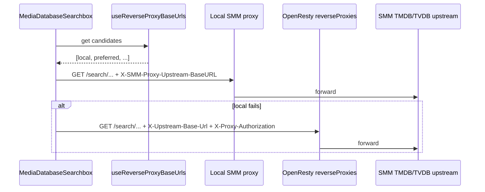

# Searchbox General Reverse Proxies

This design document describes migrating `MediaDatabaseSearchbox` from dedicated `mediaDatabases` direct endpoints to general `reverseProxies` (OpenResty), with local SMM reverse proxy tried first.

## 1. Background

Searchbox today:

1. Bootstraps discovery via `startMediaDatabaseServiceDiscovery()`.
2. Probes each `mediaDatabases` entry (typed `tmdb` / `tvdb`) and stores the fastest URL per type in `preferTmdbBaseUrl` / `preferTvdbBaseUrl`.
3. Searches by calling those URLs **directly** (`searchTmdbDirect` / `searchTvdbDirect`) with optional `Authorization: Bearer yyyy-MM-dd` (local calendar date).

Remote config now exposes `reverseProxies` — general OpenResty proxies. Protocol (from `reverse-proxy-readme.md`):

| Concern | OpenResty remote | Local SMM proxy |
|---------|------------------|-----------------|
| Upstream header | `X-Upstream-Base-Url` | `X-SMM-Proxy-Upstream-BaseURL` |
| Proxy auth | `X-Proxy-Authorization: Bearer {UTC yyyyMMdd}` | none (date-token N/A) |
| Token format | UTC `yyyyMMdd`, ±1 day | N/A |

Upstream for Searchbox remains SMM-managed:

- TMDB: `https://mediadb.vercel.app/api/tmdb`
- TVDB: `https://mediadb.vercel.app/api/tvdb`

## 2. Architecture

### 2.1 Project Level

| Package / App | Role |
|---------------|------|
| Remote `config.json` | Source of `reverseProxies` |
| `apps/cli` `GET /api/discover` | Already normalizes and returns `reverseProxies` |
| `apps/ui` | Discovery, preference storage, Searchbox search path |

Out of scope: `useTmdbQueries` / scrape / AI / connection status — they keep using local `appConfig.reverseProxyUrl` only.

### 2.2 App Level (UI)

```
main.tsx
  └─ startReverseProxyServiceDiscovery()
       ├─ fetchDiscoverConfig().reverseProxies
       ├─ probe with OpenResty headers (×3 / URL)
       └─ preferReverseProxyBaseUrl

MediaDatabaseSearchbox
  └─ useReverseProxyBaseUrls()
       order: local → preferred remote → other remotes
  └─ search via shared proxy header builder
       ├─ kind: local → X-SMM-Proxy-Upstream-BaseURL
       └─ kind: openresty → X-Upstream-Base-Url + X-Proxy-Authorization
```

### 2.3 Key Design

**Proxy candidate**

```ts
type ProxyKind = 'local' | 'openresty'

interface ReverseProxyCandidate {
  id: string              // 'local' | remote id (e.g. 'gz1')
  kind: ProxyKind
  url: string
  authorizationMethod: 'date-token' | 'none'
}
```

**Priority**

1. Local `appConfig.reverseProxyUrl` (`kind: 'local'`, `authorizationMethod: 'none'`) when present.
2. `localStorage.preferReverseProxyBaseUrl` (fastest remote from last probe).
3. Remaining discovered remotes (deduped by URL).

**Header builder** (single place)

- `local`: `X-SMM-Proxy-Upstream-BaseURL: <upstream>`
- `openresty`: `X-Upstream-Base-Url: <upstream>` + if `date-token` then `X-Proxy-Authorization: Bearer <UTC yyyyMMdd>`
- Never put OpenResty date-token on `Authorization` (must not collide with upstream auth).

**Date token**

- New helper: UTC `yyyyMMdd` for OpenResty.
- Remove Searchbox use of local `yyyy-MM-dd` + `Authorization` (old mediaDatabases direct path).

**localStorage**

- New key: `preferReverseProxyBaseUrl` → `{ id, url, authorizationMethod }`
- On discovery start: if new key missing, migrate from `preferTmdbBaseUrl` or `preferTvdbBaseUrl` (prefer whichever exists; URL may be a dedicated media DB URL — treat as soft hint only if it matches a discovered reverse proxy URL; otherwise discard).
- Delete old keys after successful write of new preference (or after migration attempt).

**Delete after migration**

- `tmdbDirect.ts`, `TvdbDirectSearch.ts` and their tests (Searchbox-only).
- Per-type prefer keys and `useMediaDatabaseBaseUrls(type)` API surface (replace with `useReverseProxyBaseUrls`).

## 3. User Stories

### 3.1 Search prefers local proxy

* **Given** local reverse proxy is available via hello / `appConfig.reverseProxyUrl`
* **When** user searches in MediaDatabaseSearchbox
* **Then** the first attempt uses local proxy with `X-SMM-Proxy-Upstream-BaseURL` pointing at SMM-managed TMDB/TVDB upstream

### 3.2 Fallback to remote OpenResty

* **Given** local proxy fails or is missing, and `reverseProxies` were discovered
* **When** user searches
* **Then** Searchbox tries preferred remote then other remotes using OpenResty headers and UTC date-token when required

### 3.3 Single preferred remote for both databases

* **Given** discovery probes complete
* **When** fastest remote is selected
* **Then** only `preferReverseProxyBaseUrl` is written (not separate TMDB/TVDB prefers)



## 4. Implementation checklist

- [x] Context + design docs
- [x] Implementation plan in `docs/superpowers/plans/`
- [x] Proxy header helper + UTC date-token
- [x] Discovery rewrite for `reverseProxies` + `preferReverseProxyBaseUrl`
- [x] `useReverseProxyBaseUrls` (local first)
- [x] Wire Searchbox; remove direct search helpers
- [x] Tests + docs (`media-database.md`)
