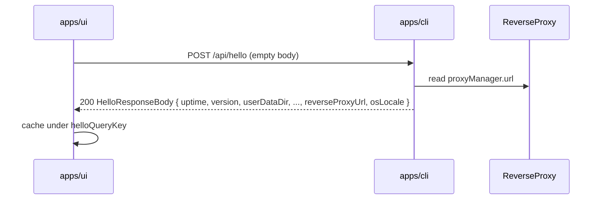
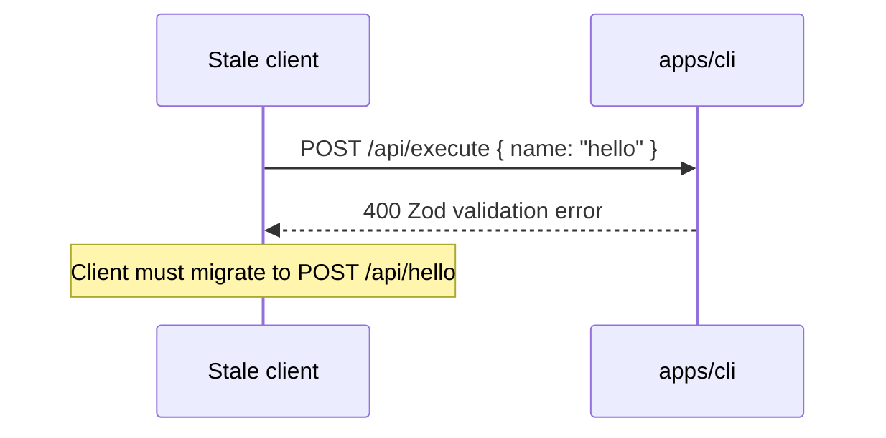

# Split `hello` task out of `/api/execute` into `/api/hello`

[brief the change here.]

Refactor the `hello` task out of the generic `POST /api/execute` orchestration
endpoint and expose it as a dedicated `POST /api/hello` endpoint. The
`/api/execute` endpoint keeps its other task dispatch logic (e.g.
`GetSelectedMediaMetadata`) but no longer knows about `hello`. The internal
`executeHelloTask` function in `apps/cli` is preserved unchanged so that
in-process tools (e.g. `getMediaFolders`) can keep using it.

[Complete the checklist below]
[ ] New UI component - check this if new UI component added
[ ] New user config - check this if new user config introduced
[ ] Electron only - check this if new feature only work in Electron env.
[ ] User document - check this if this change requires to add/update/delete user documents in `docs` folder

## 1. Background

The `POST /api/execute` endpoint in `apps/cli/server.ts` is documented as a
"special orchestration route for multiple tasks". It currently dispatches by
`name` field to two task handlers: `hello` and `GetSelectedMediaMetadata`. The
`hello` task, however, has a different role from the rest of the system: it is
the *application bootstrap handshake* used by the UI right after the CLI
starts. It returns environment paths, version, reverse-proxy URL, and OS
locale — information that has nothing to do with any "task" the user is
running.

Mixing it into the generic `/api/execute` orchestration route causes a few
practical problems:

1. **Coupling with the task schema.** The `executeRequestSchema` Zod enum must
   stay in sync with whatever tasks `/api/execute` actually handles. Adding or
   removing a `hello`-like bootstrap handshake today means touching the
   generic task schema, which is misleading — `hello` is not a user task.

2. **Async semantics mismatch.** `hello` is invoked from the UI on every page
   load (via `useReloadAppConfig` and `useHelloQuery`) and must work even
   before any media is selected. Other `/api/execute` tasks operate on
   currently-selected media state (e.g. `GetSelectedMediaMetadata` requires
   `clientId`). Forcing them through the same Zod schema and validation
   surface is awkward.

3. **Discoverability / documentation.** A dedicated, stable endpoint is
   easier to describe in docs and easier to call from external tooling (the
   `@smm/test` package's `hello()` helper, future HarmonyOS web engine code,
   etc.).

This change is a refactor: no behavior change for end users, but a clearer
separation between the bootstrap handshake (`/api/hello`) and the
user-action task orchestrator (`/api/execute`).

## 2. Project Level Architecture

`none`.

This is an internal HTTP API refactor. The split between UI, CLI, and shared
packages stays the same; only the route path and call sites change.

## 3. App Level Architecture

`apps/cli` route layout changes:

```
Before:                                    After:
POST /api/execute                          POST /api/hello   (new, dedicated)
  └─ name: "hello"                           └─ executeHelloTask(proxyManager.url)
  └─ name: "GetSelectedMediaMetadata"       POST /api/execute  (no longer handles "hello")
  └─ 501 for unknown name                    └─ name: "GetSelectedMediaMetadata"
                                             └─ 501 for unknown name
```

`packages/core` is unchanged. The `HelloResponseBody` type and the
`ApiExecutePostRequestBody` comment that references `/api/execute` are
updated to reflect the new endpoint for `hello` (see §7).

`apps/ui` and `packages/test` switch their call sites from
`POST /api/execute { name: "hello" }` to `POST /api/hello`.

In-process callers of `executeHelloTask` inside `apps/cli` (e.g.
`getMediaFolders.ts`) are **not** affected — the function keeps the same
signature and is imported the same way.

## 4. User Stories

### 4.1 UI bootstrap handshake works against the new endpoint

* **Given** the CLI server is running and the UI is loaded
* **When** the UI calls `useReloadAppConfig.reload()` (or any other path that
  triggers the `hello` handshake)
* **Then** it must `POST /api/hello` with an empty JSON body and receive the
  same `HelloResponseBody` payload as before



### 4.2 /api/execute no longer accepts `name: "hello"`

* **Given** a client that still sends the old `POST /api/execute { name: "hello" }`
* **When** the request reaches the CLI
* **Then** the `executeRequestSchema` Zod validation rejects `name: "hello"`
  with HTTP 400 (enum error) and the message says
  `name must be one of: "system", "GetSelectedMediaMetadata"`.



### 4.3 `GetSelectedMediaMetadata` is unchanged

* **Given** a `POST /api/execute` call with `name: "GetSelectedMediaMetadata"`
* **When** the request reaches the CLI
* **Then** it still routes to `executeGetSelectedMediaMetadataTask` and
  returns the same payload as before.

## 5. Tasks

### 5.1 New HTTP interface

[x] **Task 1: Add `POST /api/hello` route in `apps/cli/server.ts`**
   - Register a new `this.app.post('/api/hello', ...)` handler near the
     existing `POST /api/execute` block (around `server.ts:241`).
   - The handler simply calls `executeHelloTask(this.proxyManager.url)` and
     returns `c.json(result)`.
   - No request body validation is required (an empty body is acceptable).
     If a body is present, it is ignored.

[x] **Task 2: Remove `hello` from the `executeRequestSchema` enum**
   - In `server.ts:189`, change
     `z.enum(['hello', 'system', 'GetSelectedMediaMetadata'], ...)` to
     `z.enum(['system', 'GetSelectedMediaMetadata'], ...)` and update the
     Zod error message accordingly.
   - Remove the `if (body.name === 'hello') { ... }` branch in
     `server.ts:261-264`. The remaining 501 fallback continues to handle
     unknown task names.

[x] **Task 3: Update `apps/ui/src/api/hello.ts` to call `/api/hello`**
   - Change the `fetch` URL from `/api/execute` to `/api/hello`.
   - Method stays `POST`. Request body becomes `undefined` (or `{}`), and
     the `name: 'hello'` field is removed.

[x] **Task 4: Update `packages/test/src/index.ts::hello()` to call `/api/hello`**
   - Change the `fetch` URL from
     `http://localhost:30000/api/execute` to
     `http://localhost:30000/api/hello`.
   - Drop the `{ name: 'hello' }` body — send `undefined` body or `{}`.

[x] **Task 5: Update the `ApiExecutePostRequestBody` doc comment in
   `packages/core/types.ts`**
   - The JSDoc comment at `types.ts:147` currently says
     `Request body for POST /api/execute endpoint`. Leave the type
     description intact, but verify it is still accurate (it is — `/api/execute`
     still takes `{ name, data }`). No code change required; if desired, add
     a brief note in the comment that the bootstrap handshake is at
     `POST /api/hello` instead.

### 5.2 No CLI in-process changes

`executeHelloTask` in `apps/cli/tasks/HelloTask.ts` keeps the same
signature. Internal callers in `apps/cli/src/tools/getMediaFolders.ts` are
unchanged.

## 6. Backward Compatibility

This is a **breaking change** for any external client still calling
`POST /api/execute { name: "hello" }`. We accept this because:

- The only known clients are `apps/ui` (updated in this change) and
  `packages/test` (updated in this change). The two of them together cover
  the entire repo.
- `apps/electron` / `apps/docker` do not call `hello` directly; they only
  embed the UI, which is updated.
- `apps/ohos` HarmonyOS web engine bundles the built UI assets; after a UI
  rebuild + Electron rebuild the change propagates. No source-level edits
  are required in `apps/ohos`.
- A stale client will see a 400 Zod validation error (or a 501 if the
  validation message is bypassed). Both responses make the cause obvious
  to anyone reading server logs.

No versioned alias is provided. If a smoother migration is needed later, a
follow-up can add a temporary redirect, but it is out of scope here.

## 7. Documents

[ ] `packages/core/types.ts:147` — `ApiExecutePostRequestBody` JSDoc.
      No behavioral change; consider adding a one-line note in the comment
      that the bootstrap `hello` handshake is exposed at `POST /api/hello`.
[ ] `docs/api/index.md` — currently does not list `/api/execute` or
      `/api/hello`. No change required. (Optional: add an entry for
      `/api/hello` in a follow-up documentation pass — out of scope here.)

## 8. Post Verification

[x] Type check
    Ran `pnpm typecheck` on 2026-06-10. The remaining errors are
    pre-existing on `main` (unrelated to this change: `body is of type
    'unknown'` in test files, BigIntStats mocks, etc.). No new errors
    were introduced by this change in `server.ts`, `api/hello.ts`,
    `packages/test`, or `types.ts`.
[x] Unit tests
    - `apps/cli`: 297 passed, 13 skipped (was 289 passed; +8 new tests in
      `src/route/execute.test.ts`).
    - `apps/cli/src/validations/validateRenameOperations.test.ts` still
      passes (mocks `tasks/HelloTask`).
    - `apps/ui`: 1284 passed, 23 skipped.
    - `packages/core`: 278 passed.
[ ] Build
    Run `pnpm run build` and expect success. (Not run in this session —
    the only file shape changes are import shuffling in `server.ts` and
    a JSDoc comment in `packages/core/types.ts`; nothing that should
    affect the build.)
[ ] Manual smoke test
    Replaced with the in-process integration tests in
    `apps/cli/src/route/execute.test.ts`, which exercise the same
    scenarios against a Hono `app` instance directly:
    1. `POST /api/hello` returns 200 with `HelloResponseBody`.
    2. `POST /api/hello` with `proxyManager.url = null` returns
       `reverseProxyUrl: null`.
    3. `POST /api/hello` with a body returns 200 (body ignored).
    4. `POST /api/execute` with `name: "GetSelectedMediaMetadata"`
       routes to the task handler.
    5. `POST /api/execute` with `name: "system"` returns 501.
    6. `POST /api/execute` with `name: "hello"` returns 400 Zod error
       (proves old callers are rejected).
    7. `POST /api/execute` with missing name returns 400.
    8. `POST /api/execute` with invalid JSON returns 400.

    A full live `curl` smoke test can be run by:
    1. `pnpm dev:cli`
    2. `curl -X POST http://localhost:30000/api/hello`  → HelloResponseBody
    3. `curl -X POST -H "Content-Type: application/json" \
            -d '{"name":"hello"}' http://localhost:30000/api/execute`
       → 400 Zod error
