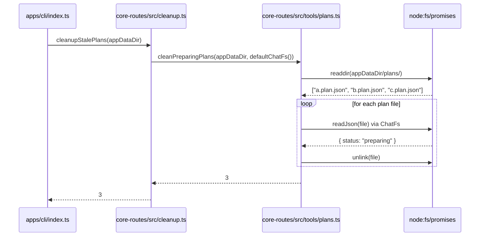

# 启动/退出清理动作抽取到 core-routes

将 cleanup 动作编排逻辑从 `apps/cli/index.ts` 抽取到 `packages/core-routes/src/cleanup.ts`，并在所有运行环境 (CLI + OHOS) 执行清理，包含用于事后排查的结构化日志。

[ ] New UI component
[ ] New user config
[ ] Electron only
[ ] User document

## 1. Background

`cleanPreparingPlans()` 函数已存在在 `packages/core-routes/src/tools/plans.ts`，但清理的**调用编排**直接写在 `apps/cli/index.ts` 中。`apps/ohos` 完全不执行清理。需要将清理动作抽取到 core-routes，使所有环境共享。

Refer to [context.md](context.md) for detail context.

## 2. Architecture

### 2.1 Project Level Architecture

**新增模块** `packages/core-routes/src/cleanup.ts`，提供与运行环境无关的清理函数。

```
packages/core-routes/src/cleanup.ts
  exports:
    cleanupStalePlans(appDataDir, fs?) → number   (核心清理逻辑)
```

```
调用关系:
  apps/cli/index.ts  ──→ cleanupStalePlans(appDataDir) + 自有 cleaners
  apps/ohos/main.ts  ──→ cleanupStalePlans(appDataDir)  (app.ready 之后)
  apps/ohos/main.ts  ──→ cleanupStalePlans(appDataDir)  (app.before-quit)
```

### 2.2 App Level Architecture

```
┌──────────────────────────────────────────────────────────────┐
│               packages/core-routes/src/cleanup.ts             │
│                                                              │
│  cleanupStalePlans(appDataDir, fs?)                          │
│    → cleanPreparingPlans(appDataDir, fs ?? defaultChatFs())  │
│    → returns number of deleted plan files                    │
└──────────────────────────────────────────────────────────────┘
              ▲                             ▲
              │                             │
    ┌─────────┴──────────┐       ┌─────────┴──────────────┐
    │    apps/cli         │       │    apps/ohos             │
    │                     │       │                          │
    │  startup:           │       │  app.whenReady():        │
    │  - CommandLogCleaner│       │  - cleanupStalePlans()   │
    │  - YtdlpCookies     │       │  - startMainHttpServer() │
    │  - cleanupStalePlans│       │                          │
    │                     │       │  app.before-quit:        │
    │  shutdown:          │       │  - cleanupStalePlans()   │
    │  - YtdlpCookies     │       │                          │
    │  - cleanupStalePlans│       │                          │
    └─────────────────────┘       └──────────────────────────┘
```

### 2.3 Key Points

| 关注点 | 说明 |
|--------|------|
| **cleanup.ts** | 新文件，位于 `packages/core-routes/src/`, 提供 `cleanupStalePlans()` 函数 |
| **cleanPreparingPlans** | 已存在的底层函数，保留在 `packages/core-routes/src/tools/plans.ts`，添加 `logger?` 参数后增加结构化日志 |
| **defaultChatFs** | 已从 `packages/core-routes/src/chatFs.ts` 导出，`cleanupStalePlans` 默认使用它 |
| **OHOS 类型定义** | `CoreRoutesModule` 接口需添加 `cleanupStalePlans` 和 `defaultChatFs` |
| **Logging** | `cleanupStalePlans` / `cleanPreparingPlans` 接受可选 `CoreRoutesLogger`，输出 scan-start / enumeration / per-file / summary / warn 事件 |

## 3. User Stories

### 3.1 CLI 环境 stale plan 文件清理

* **Given** - CLI 程序启动，`{appDataDir}/plans/` 下有 3 个 status=`preparing` 的 plan 文件残留
* **When** - 程序执行启动清理
* **Then** - 3 个 preparing 文件被删除，其他文件不受影响



### 3.2 OHOS 环境 stale plan 文件清理

* **Given** - OHOS 应用启动，`{appDataDir}/plans/` 下有 2 个 status=`preparing` 的 plan 文件残留
* **When** - `app.whenReady()` 后，`startMainHttpServer()` 之前执行清理
* **Then** - 2 个 preparing 文件被删除

* **Given** - OHOS 用户退出应用
* **When** - `app.on('before-quit')` 触发
* **Then** - preparing plan 文件被清理

## 4. Tasks

### 4.1 core-routes 新增清理模块

- [x] Task 1: 创建 `packages/core-routes/src/cleanup.ts`
  - 导出 `cleanupStalePlans(appDataDir: string, fs?: ChatFs): Promise<number>`
  - 调用 `cleanPreparingPlans(appDataDir, fs ?? defaultChatFs())`

- [x] Task 2: 修改 `packages/core-routes/src/index.ts`
  - 新增导出: `export { cleanupStalePlans } from "./cleanup.ts";`

### 4.2 CLI 端改用 core-routes 清理

- [x] Task 3: 修改 `apps/cli/index.ts`
  - 移除对 `cleanPreparingPlans` 的单独 import
  - 改用 `import { cleanupStalePlans } from '@smm/core-routes'`
  - 将启动时的 `cleanPreparingPlans(appDataDir, defaultChatFs())` 替换为 `cleanupStalePlans(appDataDir)`
  - 将 `beforeStop` 中的调用也替换为 `cleanupStalePlans(appDataDir)`

### 4.3 OHOS 端新增清理

- [x] Task 4: 修改 `apps/ohos/src/core-routes-loader.ts`
  - `CoreRoutesModule` 类型添加 `cleanupStalePlans` 函数签名
  - 添加 `defaultChatFs` 函数签名

- [x] Task 5: 修改 `apps/ohos/src/main.ts`
  - 在 `app.whenReady()` 中，`startMainHttpServer()` 之前调用 `cleanupStalePlans()`
  - 添加 `app.on('before-quit', ...)` 处理退出清理
  - 通过 `loadCoreRoutes()` 动态获取 `cleanupStalePlans`
  - 需要从 `server.ts` 或 `paths.ts` 获取 `appDataDir`

- [x] Task 6: ~~修改 `apps/ohos/src/http/server.ts`~~ (跳过)
  - 不需要: `main.ts` 直接通过 `app.getPath("userData")` 获取 `appDataDir`
  - 在 `hello-config.ts` 中已经定义 `appDataDir === userDataDir`

## 5. Backward Compatibility

无 breaking changes。`cleanPreparingPlans` 保持不变，`cleanupStalePlans` 是新增函数。CLI 端原有功能语义不变，只是调用方式从直接调用底层函数改为通过 wrapper 函数。

## 6. Documents

[ ] `docs/api/index.md` — 无需更新 (无新 API)
[ ] `docs/design/cleanup.md` — 无需更新 (已有设计)

## 7. Post Verification

- [x] TypeScript 类型检查: `pnpm typecheck` 通过 (仅检查修改文件, 预存在错误与本任务无关)
- [x] core-routes 单元测试: `bun test` 添加 7 个新测试用例，全部通过
  - `cleanPreparingPlans > removes only \`preparing\` plans`
  - `cleanPreparingPlans > is a no-op when no plans exist`
  - `cleanupStalePlans > uses the default ChatFs when none is provided`
  - `cleanupStalePlans > accepts an explicit ChatFs override`
  - `cleanupStalePlans > logs start, per-file decisions, and a completion summary`
  - `cleanupStalePlans > warns and continues when a plan file cannot be processed`
  - `cleanupStalePlans > prefixes every emitted log message with [cleanup]`
- [ ] CLI 构建: `pnpm --filter @smm/cli build` (需 CI 验证)
- [ ] OHOS 构建: `pnpm --filter @smm/ohos-electron-main build` (需 CI 验证)

## 8. Logging Contract

`cleanupStalePlans(appDataDir, fs?, logger?)` 在收到 `logger` 时按以下顺序输出事件:

| 阶段 | Level | 消息 | 上下文字段 |
|---|---|---|---|
| 扫描开始 | `info` | `[cleanup] plan cleanup: scanning for stale preparing plans` | `appDataDir`, `plansDir` |
| 文件枚举 | `info` | `[cleanup] plan cleanup: enumerated plan files` | `plansDir`, `scanned` |
| 跳过不可读 | `debug` | `[cleanup] plan cleanup: skipping unreadable plan file` | `filePath` |
| 删除 | `debug` | `[cleanup] plan cleanup: removed stale preparing plan` | `filePath`, `planId`, `task` |
| 保留 | `debug` | `[cleanup] plan cleanup: keeping plan (not preparing)` | `filePath`, `planId`, `status` |
| 单文件失败 | `warn` | `[cleanup] plan cleanup: failed to process plan file, skipping` | `filePath`, `error` |
| 汇总 | `info` | `[cleanup] plan cleanup: complete` | `plansDir`, `scanned`, `removed`, `failed`, `durationMs` |

### 8.1 日志前缀约定

所有与 cleanup job 相关的日志都以 `[cleanup]` 作为统一前缀。这样可以跨运行时、跨文件地用一条 `grep` 命令定位全部 cleanup 事件:

- **CLI (pino)**: 前缀出现在 pino 的 `msg` 字段
- **OHOS (console)**: 同时出现在 console 前缀和 core-routes 的 `msg` 字段
  - `createPlanCleanupLogger` 仅在 console 输出中附加 `[cleanup]`
  - core-routes 内部又附加了一次 `[cleanup]`
  - 两者重复但无副作用: 文本中仍可直接 `grep '[cleanup]'` 定位
- **CLI 外层包裹日志**: `apps/cli/index.ts` 中的 "stale preparing plan files cleaned up on startup/shutdown" 也使用 `[cleanup]` 前缀

调用方仍可在外层打额外日志 (例如 OHOS 的 `[cleanup] plan cleanup phase finished` 和 `[cleanup] plan cleanup threw an unexpected error`)。

**容错**:
- `warn` 不会中断后续文件处理，一个坏文件不会影响其他清理。
- 如果 `logger` 未提供，函数静默运行 (保留原行为)。
- 所有 emit 的消息均以 `[cleanup]` 开头，由 `cleanup.test.ts > prefixes every emitted log message with [cleanup]` 验证。
