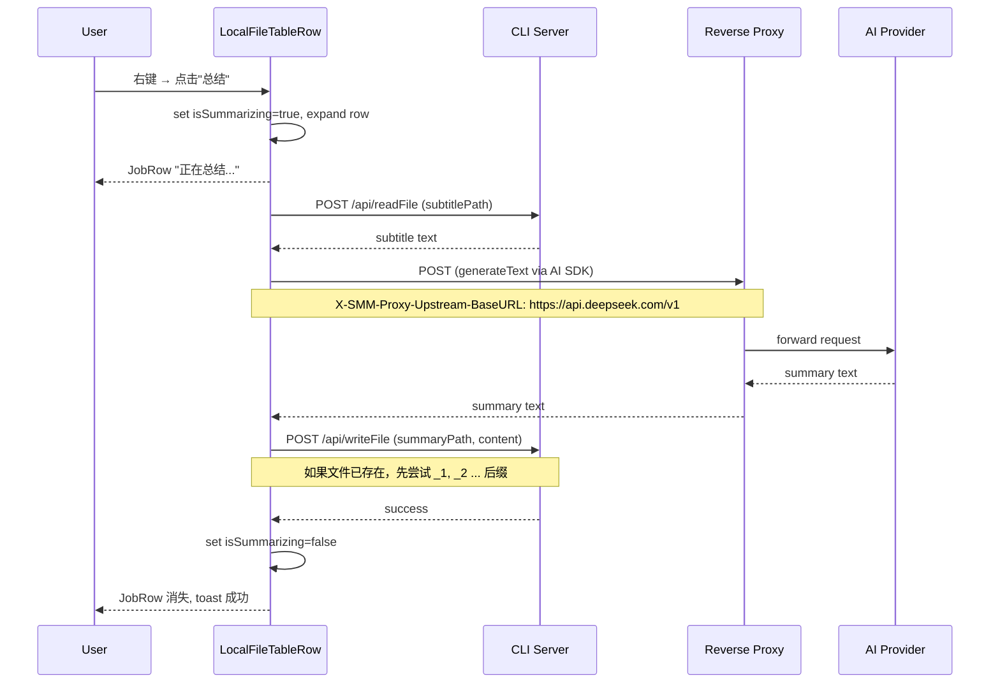

# AI 总结视频内容 (Summarize Video)

在 MusicPanel 中右键点击有字幕关联文件的视频/音频，选择"总结"菜单时，使用 AI 基于字幕内容生成摘要并输出到 `视频文件名_summary.txt`。

## 1. Background

MusicPanel 已经支持字幕的转写、翻译、合成、全流程处理等操作。本项目新增 **AI 总结** 功能：读取视频的关联字幕文件内容，通过用户配置的 AI 大模型（经 CLI reverse proxy 转发）生成内容摘要，写入到视频同目录下。

与现有字幕操作不同，"总结"不依赖 Background Jobs v2（IndexedDB + Service Worker），而是在前端组件内直接调用 AI SDK `generateText` + `writeFile` API。

## 2. Architecture

```mermaid
flowchart TB
  subgraph ui [UI Thread - LocalFileTableRow]
    CM[ContextMenu "总结"]
    STATE[isSummarizing state]
    SDK[AI SDK generateText]
    RF[readFile API]
    WF[writeFile API]
    JR[JobRow "正在总结..."]
  end

  subgraph cli [CLI Backend]
    RP[Reverse Proxy]
    API1[/api/readFile]
    API2[/api/writeFile]
  end

  subgraph ai [AI Provider]
    AIAPI[OpenAI-compatible API]
  end

  CM -->|onSummarize| STATE
  STATE -->|set isSummarizing=true| JR
  STATE --> RF
  RF --> API1
  API1 -->|subtitle content| STATE
  STATE --> SDK
  SDK -->|X-SMM-Proxy-Upstream-BaseURL header| RP
  RP -->|forward| AIAPI
  AIAPI -->|summary text| RP
  RP --> SDK
  SDK -->|summary| WF
  WF -->|POST /api/writeFile| API2
  API2 -->|write summary file| STATE
  STATE -->|set isSummarizing=false| JR
```

### 关键设计决策

1. **前端直接调用 AI SDK**：参考 `sample/` 项目，在前端通过 `@ai-sdk/openai-compatible` 的 `generateText` 生成文本
2. **CLI Reverse Proxy 转发**：使用现有的 reverse proxy 将请求转发到 AI Provider，前端设置 `X-SMM-Proxy-Upstream-BaseURL` header 指定目标
3. **文件读写复用已有 API**：通过已有的 `/api/readFile` 读取字幕文件，通过 `/api/writeFile` 写入摘要文件
4. **本地状态管理进度**：不使用 IndexedDB + Service Worker 的 Background Jobs 系统，改为组件内部 `useState` 管理 `isSummarizing` 状态

## 3. User Stories

### 3.1 右键菜单显示"总结"

* **Given** - 用户在 MusicPanel 中右键点击一个视频/音频行
* **When** - 该视频/音频有关联的字幕文件（.srt/.ass/.vtt 等）
* **Then** - 右键菜单中显示"总结"选项，可点击
* **When** - 该视频/音频没有关联字幕文件
* **Then** - "总结"选项显示为禁用状态

### 3.2 执行 AI 总结

* **Given** - 用户右键点击并选择"总结"
* **When** - 前端读取字幕内容、调用 AI 生成摘要、写入文件
* **Then** - 
  * 视频行自动展开，展开区域显示 JobRow "正在总结..."
  * AI 返回摘要后，写入 `{视频文件名}_summary.txt`（与视频同目录）
  * 如果 `_summary.txt` 已存在，自动尝试 `_summary_1.txt`、`_summary_2.txt` ... 直到找到不冲突的文件名
  * 完成后 JobRow 消失，toast 提示成功
* **When** - AI 调用失败或写入失败
* **Then** - JobRow 消失，toast 提示失败原因



## 4. Tasks

### 4.1 CLI: Reverse Proxy 白名单扩展

- [ ] **Task 4.1.1**: 在 `apps/cli/src/proxy/reverseProxy.ts` 的 `ALLOWED_UPSTREAM_HOSTS` 中添加所有默认 AI Provider 的 hostname
  - `api.deepseek.com`
  - `api.openai.com`
  - `openrouter.ai`
  - `open.bigmodel.cn`
- [ ] **Task 4.1.2**: 实现动态白名单：启动时从 userConfig 的 `aiProviders` 中提取所有 baseURL 的 hostname 并加入允许列表

### 4.2 UI: 新增类型和状态

- [ ] **Task 4.2.1**: 在 `types/associated-files.ts` 中扩展 `RunningJob.type` 添加 `"summarizing"`
- [ ] **Task 4.2.2**: 在 `types/music-table.ts` 的 `LocalFileTableRowFileMenu` 中添加 `onSummarize` 和 `canSummarize` 字段
- [ ] **Task 4.2.3**: 在 `UILocalFileTableRow` props 中添加 `isSummarizing?: boolean`
- [ ] **Task 4.2.4**: 在 `UILocalFileTableRow` 中，当 `isSummarizing` 为 true 时渲染 `<JobRow jobType="summarizing" />`

### 4.3 UI: 右键菜单

- [ ] **Task 4.3.1**: 在 `LocalFileTableRow` 组件内添加 `isSummarizing` 本地状态
- [ ] **Task 4.3.2**: 在 `LocalFileTableRow` 中根据 `associatedFiles` 判断是否有字幕文件，设置 `canSummarize`
- [ ] **Task 4.3.3**: 在 `LocalFileRow` 右键菜单中添加"总结"菜单项（`Sparkles` 图标），根据 `canSummarize` 控制 disabled
- [ ] **Task 4.3.4**: 实现 `handleSummarize` 逻辑：
  1. `setIsExpanded(true)`, `setIsSummarizing(true)`
  2. `readFile(subtitlePath)` 读取字幕内容
  3. 从 `useConfig()` 获取 AI 配置（`aiProviders` + `selectedAIProvider`），从 `appConfig` 获取 `reverseProxyUrl`
  4. 通过 `createOpenAICompatible` 构建 provider（baseURL=reverseProxyUrl, headers={X-SMM-Proxy-Upstream-BaseURL}）
  5. 调用 `generateText` 生成摘要
  6. 计算输出路径：`{videoDir}/{videoStem}_summary.txt`，如果存在则尝试 `_summary_1.txt`、`_summary_2.txt` ...
  7. `writeFile(outputPath, summary)` 写入文件
  8. `setIsSummarizing(false)`, toast 成功/失败

### 4.4 JobRow 显示

- [ ] **Task 4.4.1**: 在 `JobRow.tsx` 中添加 `"summarizing"` case，显示对应文本
- [ ] **Task 4.4.2**: 将 `isSummarizing` 从 `LocalFileTableRow` 传递到 `UILocalFileTableRow`
- [ ] **Task 4.4.3**: 在 `UILocalFileTableRow` 的展开区域，除了显示 `matchingJobs` 外，当 `isSummarizing` 为 true 时额外渲染 JobRow

### 4.5 国际化

- [ ] **Task 4.5.1**: 在 `zh-CN/components.json` 添加：
  - `mediaPlayer.trackContextMenu.summarize`: `"总结"`
  - `localFileTableRow.job.summarizing`: `"正在总结..."`
- [ ] **Task 4.5.2**: 在 `en/components.json` 添加：
  - `mediaPlayer.trackContextMenu.summarize`: `"Summarize"`
  - `localFileTableRow.job.summarizing`: `"Summarizing..."`

### 4.6 冲突文件名处理

- [ ] **Task 4.6.1**: 创建 `lib/summarizeFilename.ts`，实现文件碰撞处理逻辑：
  ```typescript
  async function findAvailableSummaryPath(videoPath: string): Promise<string>
  // 尝试 {stem}_summary.txt → {stem}_summary_1.txt → {stem}_summary_2.txt ...
  // 通过 listFiles API 检查是否存在，找到第一个不冲突的文件名
  ```

## Backward Compatibility

- `ALLOWED_UPSTREAM_HOSTS` 的新增项不影响现有功能
- `RunningJob.type` 新增 `"summarizing"`，JobRow 的 switch 需要处理新 case（TypeScript 已覆盖）
- 新增菜单项不影响现有右键菜单行为

## Documents

- [ ] `docs/design/summarize-video.md` — 本文档
