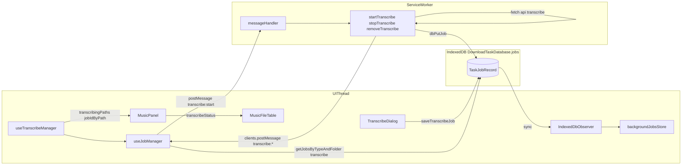
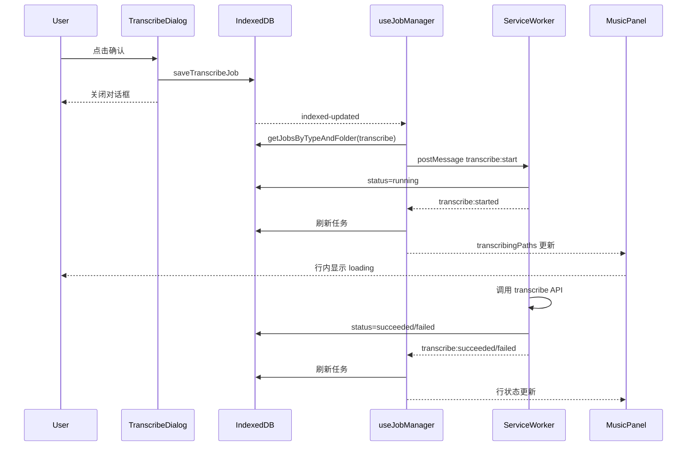

# 生成字幕（Transcribe）技术设计

> **Note**: 本文档创建于 Service Worker 架构时期。Service Worker 已于后续重构中移除（详见 `remove-service-worker.md`），
> 但任务流程和 API 接口仍然有效，异步执行已迁移至主线程 `JobOrchestratorProvider`。

## 目标

“生成字幕”功能将用户在 UI 中发起的转写任务持久化到 IndexedDB，并通过后台任务系统异步执行。  
目标是：

- 在 `MusicPanel` 行级展示任务状态（运行中/失败）
- 在全局 `BackgroundJobs` 中统一展示下载与转写任务
- 页面刷新后仍可恢复任务状态（来源于 IndexedDB）

## 范围与非目标

### 范围

- 前端 UI（`TranscribeDialog`、`MusicPanel`、`MusicFileTable`）
- 前端任务编排（`useJobManager`、`useTranscribeManager`）
- IndexedDB 持久化（与下载任务共用 `jobs` 表）
- Service Worker 执行转写与状态回写

### 非目标

- 不设计后端转写算法实现
- 不涉及模型精度、ASR 质量评估

## 核心架构

## 数据模型

任务存储于 `DownloadTaskDatabase/jobs`，下载与转写共用表结构。

### `TaskJobRecord`

- `id`: 任务 ID
- `type`: `download-video` 或 `transcribe`
- `status`: `pending | running | succeeded | failed | stopped | aborted`（按场景使用）
- `progress`: 进度（转写通常 0/100）
- `folder`: 媒体目录（用于按面板过滤）
- `data`: JSON 字符串（任务业务负载）
- `createdAt` / `updatedAt`

### `TranscribeBackgroundJobData`

- `folder`: 平台路径（用于 manager 按目录筛选）
- `mediaPath`: POSIX 绝对路径（用于 UI 行匹配）
- `mediaPathPlatform`: 平台路径（用于请求 `/api/*/transcribe`）
- `title`: 展示标题
- `provider`: `videoCaptioner | tencentAsr`
- `videoCaptioner?`: `asr/language/wordTimestamps/format`
- `tencentAsr?`: `baseUrl/apiKey`

## 关键模块职责

### 1) `TranscribeDialog`

- 负责“入队”，不负责执行
- `onConfirm` 时：
  1. 校验 `folder` 与选中文件路径
  2. `buildTranscribeJob(...)`
  3. `saveTranscribeJob(job)` 写入 IndexedDB
  4. 关闭对话框

### 2) `useJobManager`（通用任务编排）

参数化：`jobType`、`messagePrefix`、`autoStartKey`、`platformFolder`。

核心行为：

- 监听 `indexed-updated`，刷新任务列表
- 监听 SW `message`，处理 `*:started/*:succeeded/*:failed/*:stopped`
- 自动启动下一个 pending 任务（可通过 localStorage 开关）
- 暴露统一控制：`startJob/stopJob/removeJob`

### 3) `useTranscribeManager`

在 `useJobManager` 基础上提供转写视角：

- `transcribingPaths: Set<string>`
- `transcribeFailedPaths: Set<string>`
- `jobIdByPath: Map<string, string>`

用于 `MusicPanel` 行级映射与“停止转写”。

### 4) `download-service-worker.js`

新增转写处理：

- `transcribe:start` -> `startTranscribe(jobId)`
- `transcribe:stop` -> `stopTranscribe(jobId)`
- `transcribe:remove` -> `removeTranscribe(jobId)`

执行流程：

1. 从 IDB 读取任务
2. 标记 `running` 并写回
3. 调用 `/api/videocaptioner/transcribe` 或 `/api/tencent-asr/transcribe`
4. 根据结果更新为 `succeeded/failed/stopped`
5. `clients.postMessage('transcribe:*')` 广播状态

### 5) `IndexedDbObserver`

- 启动时同步 IDB 到 `backgroundJobsStore`
- 将 `download-video` 与 `transcribe` 两类记录都映射为统一 `BackgroundJob`
- 监听 SW 消息与 `indexed-updated`，增量刷新全局后台任务视图

### 6) `MusicPanel` / `MusicFileTable`

- `MusicPanel` 将轨道路径转为 POSIX，与 `transcribingPaths` 匹配得到 `transcribeStatus`
- `MusicFileTable` 在标题区显示单个 loading 图标（运行中）或失败图标
- 右键菜单支持“停止生成字幕”

## 关键时序（用户点击“开始生成字幕”）

## 状态与错误处理

- 入队失败（参数不完整）在 `TranscribeDialog` 直接 toast 提示
- 执行失败由 SW 将任务置为 `failed` 并广播 `transcribe:failed`
- UI 通过 manager 刷新后自动展示失败状态
- `stop` 操作将任务置为 `stopped`，并可触发后续 pending 任务自动开始

## 兼容性与恢复策略

- 不修改 IDB schema 版本；仅扩展 `type=transcribe` 记录内容
- SW 激活时可将遗留 `running` 任务修正为可恢复状态（避免假运行）
- 页面刷新后通过 IDB 重建任务可视状态

## 与下载任务的关系

- 共用：IDB 表、SW 通信模型、`useJobManager` 编排
- 区别：
  - 下载是多 item（video list）任务
  - 转写是单文件粒度任务（一个文件一条记录）

## 主要文件索引

- `apps/ui/src/components/dialogs/TranscribeDialog.tsx`
- `apps/ui/src/hooks/useJobManager.ts`
- `apps/ui/src/hooks/useTranscribeManager.ts`
- `apps/ui/src/components/MusicPanel.tsx`
- `apps/ui/src/components/MusicFileTable.tsx`
- `apps/ui/src/components/IndexedDbObserver.tsx`
- `apps/ui/src/lib/downloadTaskDb.ts`
- `apps/ui/src/lib/transcribeJobFactory.ts`
- `apps/ui/public/download-service-worker.js`
