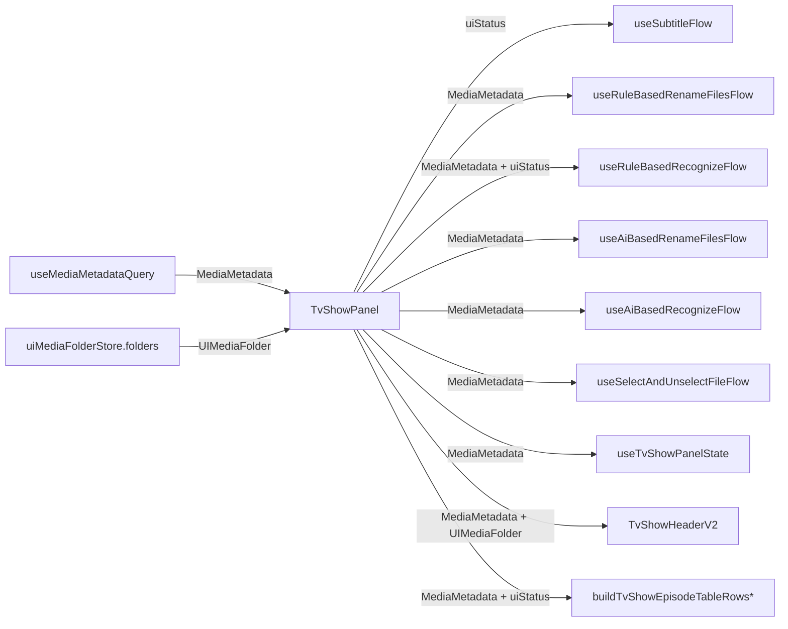

> **Scope addendum (mid-implementation)**: `buildTemporaryRecognitionPlanAsync` in `apps/ui/src/components/TvShowPanelUtils.ts` was discovered to take `UIMediaMetadata` but read no `status` fields, and is only called from `useRuleBasedRecognizeFlow` and its unit test. Narrowing its signature to `MediaMetadata` is necessary to keep the call from `useRuleBasedRecognizeFlow` type-correct after Task 3. Added to scope.

# TvShowPanel UIMediaMetadata 废弃

## Checklist

- [x] New UI component - 无
- [x] New user config - 无
- [x] Electron only - 否
- [x] User document - 否

## Status

**完成** — TvShowPanel 调用树内 11 个文件已彻底脱离 `UIMediaMetadata`：

| 文件 | 变化 |
|------|------|
| `apps/ui/src/components/TvShowPanel.tsx` | `mediaMetadata` 收敛为 `MediaMetadata \| undefined`; `uiStatus` 单独 `useMemo` 合成; 渲染分支改用 `uiStatus === "initializing"`; 移除内联 `import("@core/types").*` |
| `apps/ui/src/hooks/useSubtitleFlow.ts` | options 增加 `uiStatus: UIMediaFolderStatus \| undefined`; 移除 `resolveOkMediaMetadata` 内 `"status" in mediaMetadata` 判断 |
| `apps/ui/src/components/hooks/useRuleBasedRecognizeFlow.ts` | options 增加 `uiStatus`; `okMediaMetadata = uiStatus === "ok" ? mediaMetadata : undefined` |
| `apps/ui/src/components/hooks/useRuleBasedRenameFilesFlow.ts` | `mediaMetadata: MediaMetadata \| undefined` |
| `apps/ui/src/components/hooks/useAiBasedRenameFilesFlow.ts` | `mediaMetadata: MediaMetadata \| undefined` |
| `apps/ui/src/components/hooks/useAiBasedRecognizeFlow.ts` | `mediaMetadata: MediaMetadata \| undefined` |
| `apps/ui/src/components/hooks/useSelectAndUnselectFileFlow.ts` | `mediaMetadata: MediaMetadata \| undefined`; `requireMediaMetadata` 返回 `MediaMetadata` |
| `apps/ui/src/components/hooks/useTvShowPanelState.ts` | `mediaMetadata: MediaMetadata \| undefined` |
| `apps/ui/src/components/TvShowHeaderV2.tsx` | `selectedMediaMetadata?: MediaMetadata`; `openScrape` 同步收紧 |
| `apps/ui/src/lib/buildTvShowEpisodeTableRows.ts` | 3 种空态 divider 改由 `uiStatus: UIMediaFolderStatus` 参数短路; 形参 `mm: MediaMetadata` |
| `apps/ui/src/helpers/TvShowPanel/handleEpisodeFileSelect.ts` | `mm: MediaMetadata`; 返回 `MediaMetadata` |
| `apps/ui/src/components/TvShowPanelUtils.ts` | `buildTemporaryRecognitionPlanAsync` 形参 `mm: MediaMetadata`（范围扩） |
| `apps/ui/src/lib/buildTvShowEpisodeTableRows.test.ts` | 所有调用点增加 `uiStatus` 参数; `UIMediaMetadata` 移除 |
| `apps/ui/src/components/TvShowHeaderV2.test.tsx` | `UIMediaMetadata` → `MediaMetadata`; 移除多余 `status: 'ok'` 字段 |
| `apps/ui/src/components/TvShowPanelUtils.test.ts` | `buildTemporaryRecognitionPlanAsync` 测试用 `MediaMetadata` |

验证：

- `pnpm run typecheck:ui` 通过
- `pnpm run test:ui` 通过 (1374 tests passed, 23 skipped, 0 failed)
- `grep -rn "UIMediaMetadata"` 在 11 个 TvShowPanel 调用树文件内无输出


## 范围

| 范围 | 入选 |
|------|------|
| TvShowPanel 调用树 | TvShowPanel.tsx + 8 处直接下游 |
| 类型 | `UIMediaMetadata` 保留并标记 deprecated（其他调用方继续使用） |
| 邻近 Panel（MoviePanel / Library / LocalFilePanel） | **不在本次范围** |

## 1. Background

`apps/ui/src/types/UIMediaMetadata.ts` 是 `MediaMetadata & { status: UIMediaFolderStatus, test? }` 的已废弃组合类型（源头标注 `@deprecated`），它把"领域元数据"与"UI 加载状态"混在同一个对象里。`UIMediaFolder`（来自 `uiMediaFolderStore`）已经独立承担 folder 维度的状态。

`TvShowPanel` 内部把 `useMediaMetadataQuery` 的结果与 `uiFolderRow.status` 拼装成 `UIMediaMetadata`，再向下游 8 处传入。下游中只有 `useSubtitleFlow` / `useRuleBasedRecognizeFlow` / `buildTvShowEpisodeTableRows*` 真正读取 `status`，其余都只用 `MediaMetadata` 字段。

本次目标：

- TvShowPanel 内部停止构造 `UIMediaMetadata`。
- `uiStatus` 改由 `uiFolderRow.status` + 局部 fetch 状态合成，保持现有 5 档优先级。
- TvShowPanel 调用树内 8 处下游同步收紧到 `MediaMetadata` + `uiStatus`，使 TvShowPanel 不再 import `UIMediaMetadata`。
- `UIMediaMetadata` 类型本身保留，其他调用方（MoviePanel / AppV2 / LocalFilePanel / 初始化流程）继续使用。

## 2. Project Level Architecture

无架构变更。仅 `apps/ui` 内部类型与签名收敛。



## 3. App Level Architecture

### 3.1 TvShowPanel 内部状态

`mediaMetadata` 收敛为 `MediaMetadata | undefined`（= `queriedMediaMetadata`），不再做"无 domain 时构造占位对象"的拼装。`uiStatus` 单独计算，沿用现有 5 档优先级：

```ts
const uiStatus: UIMediaFolderStatus = (() => {
  if (isMediaMetadataError) return "error_loading_metadata"
  if (mediaMetadata) return "ok"
  if (isMediaMetadataPending || mediaMetadataFetchStatus === "fetching") return "initializing"
  return uiFolderRow?.status ?? "loading"
})()
```

### 3.2 渲染分支

- `{ uiStatus === "initializing" ? <MediaPanelInitializingHint /> : <TvShowEpisodeTable ... /> }`
- `buildTvShowEpisodeTableRows(mediaMetadata, uiStatus, t)` 改为 `buildTvShowEpisodeTableRowsForPlan(mediaMetadata, uiStatus, plan, t)`，传入显式 `uiStatus` 而非从对象上读 `status`。
- `useEffect` 依赖列表增加 `uiStatus`。

### 3.3 8 处下游签名变更

| 文件 | 现状 | 改后 |
|------|------|------|
| `apps/ui/src/hooks/useSubtitleFlow.ts` | `mediaMetadata: MediaMetadata \| UIMediaMetadata \| undefined`，用 `"status" in mediaMetadata && mediaMetadata.status !== "ok"` 判 ok | `mediaMetadata: MediaMetadata \| undefined` + `uiStatus: UIMediaFolderStatus \| undefined`，判 ok 改为 `uiStatus === "ok"` |
| `apps/ui/src/components/hooks/useRuleBasedRenameFilesFlow.ts` | `mediaMetadata: UIMediaMetadata \| undefined` | `mediaMetadata: MediaMetadata \| undefined` |
| `apps/ui/src/components/hooks/useRuleBasedRecognizeFlow.ts` | `mediaMetadata: UIMediaMetadata \| undefined`，`mediaMetadata?.status === "ok"` 判 ok | `mediaMetadata: MediaMetadata \| undefined` + `uiStatus: UIMediaFolderStatus \| undefined`；`okMediaMetadata` 改为 `uiStatus === "ok" ? mediaMetadata : undefined` |
| `apps/ui/src/components/hooks/useAiBasedRenameFilesFlow.ts` | `mediaMetadata: UIMediaMetadata \| undefined` | `mediaMetadata: MediaMetadata \| undefined` |
| `apps/ui/src/components/hooks/useAiBasedRecognizeFlow.ts` | `mediaMetadata: UIMediaMetadata \| undefined` | `mediaMetadata: MediaMetadata \| undefined` |
| `apps/ui/src/components/hooks/useSelectAndUnselectFileFlow.ts` | `mediaMetadata: UIMediaMetadata \| undefined`（含 `requireMediaMetadata` 返回 `UIMediaMetadata`） | `mediaMetadata: MediaMetadata \| undefined`，`requireMediaMetadata` 返回 `MediaMetadata` |
| `apps/ui/src/components/hooks/useTvShowPanelState.ts` | `mediaMetadata: UIMediaMetadata \| undefined` | `mediaMetadata: MediaMetadata \| undefined` |
| `apps/ui/src/components/TvShowHeaderV2.tsx` | `selectedMediaMetadata?: UIMediaMetadata`，`openScrape?: (params: { mediaMetadata: UIMediaMetadata })` | `selectedMediaMetadata?: MediaMetadata`，`openScrape?: (params: { mediaMetadata: MediaMetadata })` |

### 3.4 lib 签名变更

`apps/ui/src/lib/buildTvShowEpisodeTableRows.ts`：

| 旧签名 | 新签名 |
|--------|--------|
| `buildTvShowEpisodeTableRows(mm: UIMediaMetadata, t)` | `buildTvShowEpisodeTableRows(mm: MediaMetadata, uiStatus: UIMediaFolderStatus, t)` |
| `buildTvShowEpisodeTableRowsForPlan(mm: UIMediaMetadata, plan, t)` | `buildTvShowEpisodeTableRowsForPlan(mm: MediaMetadata, uiStatus: UIMediaFolderStatus, plan, t)` |
| `_buildTvShowEpisodeTableRowsFromTmdb(_in_mm: UIMediaMetadata)` | `_buildTvShowEpisodeTableRowsFromTmdb(_in_mm: MediaMetadata)` |
| `_buildTvShowEpisodeTableRowsFromTvdb(_in_mm: UIMediaMetadata)` | `_buildTvShowEpisodeTableRowsFromTvdb(_in_mm: MediaMetadata)` |

3 种空态 divider（`initializing` / `folder_not_found` / `error_loading_metadata`）由调用方传入的 `uiStatus` 短路返回，不再从对象上读 `status`。`fillTvShowEpisodeTableRowByRecognizeMediaFilesPlan` 与 `fillTvShowEpisodeTableRowByRenameFilesPlan` 不读 `status`，签名不变。

### 3.5 helper 签名变更

`apps/ui/src/helpers/TvShowPanel/handleEpisodeFileSelect.ts`：

- `handleEpisodeFileSelect(mm: UIMediaMetadata, ...): UIMediaMetadata` → `(mm: MediaMetadata, ...): MediaMetadata`
- 不读 `status`；`{ ...mm, mediaFiles: updatedMediaFiles }` 直接展开为 `MediaMetadata` 即可。

## 4. User Stories

无新增用户故事。本次为内部类型清理，行为完全保持。

## 5. Tasks

### 5.1 修改 TvShowPanel 内部状态合成

- [x] Task 1 — 修改 `apps/ui/src/components/TvShowPanel.tsx`
  - [x] 删除 `import type { UIMediaMetadata } from "@/types/UIMediaMetadata"`
  - [x] 删除构造 `UIMediaMetadata` 的 `useMemo`，改写为：
    - [x] `mediaMetadata: MediaMetadata | undefined = queriedMediaMetadata`
    - [x] `uiStatus: UIMediaFolderStatus` 按 3.1 合成
  - [x] 渲染分支改为 `uiStatus === "initializing"`
  - [x] 所有下游 hook 调用传入 `(mediaMetadata, uiStatus)` 形式
  - [x] `useEffect` 依赖列表增加 `uiStatus`
  - [x] 移除内联 `import("@core/types").*` 改用顶部 `import type { MediaMetadata, TMDBTVShow, TMDBTVShowDetails }`

### 5.2 修改 useSubtitleFlow

- [x] Task 2 — 修改 `apps/ui/src/hooks/useSubtitleFlow.ts`
  - [x] `UseSubtitleFlowOptions` 增加 `uiStatus: UIMediaFolderStatus | undefined`
  - [x] `mediaMetadata` 类型从 `MediaMetadata | UIMediaMetadata | undefined` 改为 `MediaMetadata | undefined`
  - [x] 删除 `resolveOkMediaMetadata` 内 `"status" in mediaMetadata && mediaMetadata.status !== "ok"` 判断，改为 `uiStatus === "ok"`
  - [x] `mediaMetadataForTranscribeRows` 不再需要"接受 UIMediaMetadata"分支，签名收敛

### 5.3 修改 useRuleBasedRecognizeFlow

- [x] Task 3 — 修改 `apps/ui/src/components/hooks/useRuleBasedRecognizeFlow.ts`
  - [x] `UseRuleBasedRecognizeFlowOptions` 增加 `uiStatus: UIMediaFolderStatus | undefined`
  - [x] `mediaMetadata` 类型从 `UIMediaMetadata | undefined` 改为 `MediaMetadata | undefined`
  - [x] `okMediaMetadata` 改为 `uiStatus === "ok" ? mediaMetadata : undefined`
  - [x] 依赖列表增加 `uiStatus`

### 5.4 修改其余无 status 依赖的下游 hook

- [x] Task 4 — 修改 `apps/ui/src/components/hooks/useRuleBasedRenameFilesFlow.ts`
  - [x] `mediaMetadata: UIMediaMetadata | undefined` → `mediaMetadata: MediaMetadata | undefined`
- [x] Task 5 — 修改 `apps/ui/src/components/hooks/useAiBasedRenameFilesFlow.ts`
  - [x] `mediaMetadata: UIMediaMetadata | undefined` → `mediaMetadata: MediaMetadata | undefined`
- [x] Task 6 — 修改 `apps/ui/src/components/hooks/useAiBasedRecognizeFlow.ts`
  - [x] `mediaMetadata: UIMediaMetadata | undefined` → `mediaMetadata: MediaMetadata | undefined`
- [x] Task 7 — 修改 `apps/ui/src/components/hooks/useSelectAndUnselectFileFlow.ts`
  - [x] `mediaMetadata: UIMediaMetadata | undefined` → `mediaMetadata: MediaMetadata | undefined`
  - [x] `requireMediaMetadata` 返回 `MediaMetadata | undefined`
- [x] Task 8 — 修改 `apps/ui/src/components/hooks/useTvShowPanelState.ts`
  - [x] `mediaMetadata: UIMediaMetadata | undefined` → `mediaMetadata: MediaMetadata | undefined`

### 5.5 修改 TvShowHeaderV2

- [x] Task 9 — 修改 `apps/ui/src/components/TvShowHeaderV2.tsx`
  - [x] `selectedMediaMetadata?: UIMediaMetadata` → `selectedMediaMetadata?: MediaMetadata`
  - [x] `openScrape?: (params: { mediaMetadata: UIMediaMetadata })` → `(params: { mediaMetadata: MediaMetadata })`
  - [x] 删除 `import type { UIMediaMetadata }`
  - [x] 增加 `import type { MediaMetadata } from "@core/types"`

### 5.6 修改 buildTvShowEpisodeTableRows

- [x] Task 10 — 修改 `apps/ui/src/lib/buildTvShowEpisodeTableRows.ts`
  - [x] 删除 `import type { UIMediaMetadata }`，增加 `import type { MediaMetadata } from "@core/types"` 与 `import type { UIMediaFolderStatus } from "@/types/UIMediaFolder"`
  - [x] `buildTvShowEpisodeTableRows(mm, t)` → `buildTvShowEpisodeTableRows(mm, uiStatus, t)`：3 种空态判断改为基于 `uiStatus`
  - [x] `buildTvShowEpisodeTableRowsForPlan(mm, plan, t)` → `buildTvShowEpisodeTableRowsForPlan(mm, uiStatus, plan, t)`：3 种空态判断改为基于 `uiStatus`
  - [x] `_buildTvShowEpisodeTableRowsFromTmdb` / `_buildTvShowEpisodeTableRowsFromTvdb` 形参从 `UIMediaMetadata` 改为 `MediaMetadata`
  - [x] 保留 `FOLDER_FILE_IDS` 常量

### 5.7 修改 handleEpisodeFileSelect

- [x] Task 11 — 修改 `apps/ui/src/helpers/TvShowPanel/handleEpisodeFileSelect.ts`
  - [x] `(mm: UIMediaMetadata, ...): UIMediaMetadata` → `(mm: MediaMetadata, ...): MediaMetadata`
  - [x] 删除 `import type { UIMediaMetadata }`

### 5.8 修改相关单元测试

- [x] Task 12 — 修改 `apps/ui/src/lib/buildTvShowEpisodeTableRows.test.ts`
  - [x] 调用处 `buildTvShowEpisodeTableRows(mm, t)` / `buildTvShowEpisodeTableRowsForPlan(mm, plan, t)` 增加 `uiStatus` 参数
  - [x] 形参为 `UIMediaMetadata` 的 mock 改为 `MediaMetadata`（删除 `status` 字段）
- [x] Task 13 — 修改 `apps/ui/src/components/TvShowHeaderV2.test.tsx` 与 `TvShowPanelUtils.test.ts`
  - [x] `TvShowHeaderV2.test.tsx`：`UIMediaMetadata` → `MediaMetadata`；移除多余 `status: 'ok'` 字段
  - [x] `TvShowPanelUtils.test.ts`：`buildTemporaryRecognitionPlanAsync` 测试改用 `MediaMetadata`
  - MovieHeaderV2 不在本次范围（未修改）

### 5.9 验证

- [x] Task 14 — 类型检查 `pnpm run typecheck:ui` 通过（其他包预存在错误已通过 stash 验证未引入）
- [x] Task 15 — UI 单元测试 `pnpm test` 通过（1374 passed, 23 skipped, 0 failed）
- [x] Task 16 — 搜索 `apps/ui/src/components/TvShowPanel.tsx` 及 TvShowPanel 调用树 11 个文件，UIMediaMetadata 均无输出

## 6. Backward Compatibility

- `UIMediaMetadata` 类型保留在 `apps/ui/src/types/UIMediaMetadata.ts`，`@deprecated` 标记维持。
- 8 处下游签名为破坏性变更（仅影响 TvShowPanel 调用方，库 lib 调用方在 tvshow 调用树内）。
- MoviePanel / AppV2 / LocalFilePanel / 初始化流程 / tests 不变；`UIMediaMetadata` 在 apps/ui 中仍有合法引用。
- 用户视角行为完全保持：`uiStatus` 5 档优先级逐字还原旧 `useMemo`。

## 7. Documents

实测：
- [x] `apps/ui/src/types/UIMediaMetadata.ts` 类型与 `extractUIMediaMetadataProps` 维持现状
- [x] `docs/api/index.md` 不变更
- [x] `.agents/docs/design/episode-rename-recognize.md` 不变更
- [x] `pnpm run typecheck:ui` 通过
- [x] `pnpm test` 通过 (1374 passed, 23 skipped, 0 failed)
- [x] `grep -n "UIMediaMetadata" apps/ui/src/components/TvShowPanel.tsx` 应无输出
- [x] `grep -n "UIMediaMetadata" apps/ui/src/components/TvShowHeaderV2.tsx` 应无输出
- [x] `grep -rn "UIMediaMetadata" apps/ui/src/components/hooks/` 应无输出
- [x] `grep -n "UIMediaMetadata" apps/ui/src/lib/buildTvShowEpisodeTableRows.ts` 应无输出
- [x] `grep -n "UIMediaMetadata" apps/ui/src/helpers/TvShowPanel/handleEpisodeFileSelect.ts` 应无输出
- [x] `grep -n "UIMediaMetadata" apps/ui/src/hooks/useSubtitleFlow.ts` 应无输出


## 8. Post Verification

实测：

- [x] `pnpm run typecheck:ui` 通过（`apps/ui` 0 errors）
- [x] `pnpm build` 通过（cli + ui）
- [x] `pnpm test` 通过（1374 passed, 23 pre-existing skipped, 0 failed）
- [x] `pnpm run typecheck:core-routes` / `typecheck:e2e` 仍报 9 / 39 个 pre-existing errors（已通过 `git stash` 验证未引入新错误）
- [x] `grep -n "UIMediaMetadata" apps/ui/src/components/TvShowPanel.tsx` 无输出
- [x] `grep -n "UIMediaMetadata" apps/ui/src/components/TvShowHeaderV2.tsx` 无输出
- [x] `grep -rn "UIMediaMetadata" apps/ui/src/components/hooks/` 无输出
- [x] `grep -n "UIMediaMetadata" apps/ui/src/lib/buildTvShowEpisodeTableRows.ts` 无输出
- [x] `grep -n "UIMediaMetadata" apps/ui/src/helpers/TvShowPanel/handleEpisodeFileSelect.ts` 无输出
- [x] `grep -n "UIMediaMetadata" apps/ui/src/hooks/useSubtitleFlow.ts` 无输出

## 9. 实施备注
- `buildTemporaryRecognitionPlanAsync` 以 `UIMediaMetadata` 为形参但不读 `status` 字段，仅由 `useRuleBasedRecognizeFlow` 与其单元测试调用，已一并收敛到 `MediaMetadata`。
- 实施中重新引入 `FOLDER_FILE_IDS` 常量（某次替换中被误删）。
- 库外其他类型清理（`MoviePanel` / `AppV2` / `LocalFilePanel`）按设计不在本次范围，`UIMediaMetadata` 类型本身保留 `@deprecated` 标记。


## 10. 实施阶段 — 构建错误修复（`pnpm build` 12 errors → 0）

构建阶段发现 12 个类型错误，按错误类别分 7 组修复：

1. **TvShowPanel 重复 import**：合并 `MediaMetadata` 重复声明为 1 处。
2. **buildTvShowEpisodeTableRows `rows` undefined**：`_buildTvShowEpisodeTableRowsFromTvdb` 缺少 `const rows: TvShowEpisodeTableRow[] = []` 局部声明（与 `_buildTvShowEpisodeTableRowsFromTmdb` 对称），恢复。
3. **out-of-scope 3 个 action/lib 实际不读 `status`，按 design 一致原则一并收敛到 `MediaMetadata`**：
   - `apps/ui/src/actions/handleAiRecognizeConfirm.ts` — `mediaMetadata: MediaMetadata`
   - `apps/ui/src/components/TvShowPanelUtils.ts` — `HandlePendingPlansParams.mediaMetadata: MediaMetadata | undefined`
   - `apps/ui/src/actions/handleRenamePromptConfirmForTvShow.ts` — `mediaMetadata: MediaMetadata`（含 `selectedEpisodePaths: string[]` 重写回 options 类型）
   - `apps/ui/src/lib/applyRenamePairsToUIMediaMetadata.ts` — `metadata: MediaMetadata`（仅 spread + 2 字段重写，与 `MediaMetadata` 完全兼容）
   - `applyRenamePairsToUIMediaMetadata.test.ts` — `UIMediaMetadata` 改 `MediaMetadata`，删除 `status: 'ok'` 字段
4. **useAiBasedRenameFilesFlow** — `mediaMetadata?.status === "ok" ? (mediaMetadata as MediaMetadata) : undefined` 现在 `mediaMetadata` 已是 `MediaMetadata`（无 `status`），简化为直接传 `mediaMetadata`（`useTvShowWebSocketEvents` 签名已是 `MediaMetadata | undefined`）。
5. **useSelectAndUnselectFileFlow** — `t` 类型不匹配 `unlinkEpisode` 的 `(key: string, options?: Record<string, unknown>) => string`，改用既有 `castTranslationFn` helper（`apps/ui/src/lib/i18n.ts`）桥接。
6. **MoviePanel** — 同名 `useSubtitleFlow` 调用补传 `uiStatus: rawMediaMetadata?.status`（最小改动：MoviePanel 整体不在本次范围，但 `useSubtitleFlow` 签名变更是其上游，必须联动）。
7. **pkill / restore missing line**：在重构 `handleRenamePromptConfirmForTvShow` 签名时漏写 `selectedEpisodePaths: string[]`，已恢复。

`UIMediaMetadata` 类型本身保持 `@deprecated`，文件保留。

## 11. 实施后最终文件清单（含构建修复新增）

| 文件 | 变化 |
|------|------|
| `apps/ui/src/components/TvShowPanel.tsx` | 修改 |
| `apps/ui/src/hooks/useSubtitleFlow.ts` | 修改 |
| `apps/ui/src/components/hooks/useRuleBasedRecognizeFlow.ts` | 修改 |
| `apps/ui/src/components/hooks/useRuleBasedRenameFilesFlow.ts` | 修改 |
| `apps/ui/src/components/hooks/useAiBasedRenameFilesFlow.ts` | 修改 |
| `apps/ui/src/components/hooks/useAiBasedRecognizeFlow.ts` | 修改 |
| `apps/ui/src/components/hooks/useSelectAndUnselectFileFlow.ts` | 修改 |
| `apps/ui/src/components/hooks/useTvShowPanelState.ts` | 修改 |
| `apps/ui/src/components/TvShowHeaderV2.tsx` | 修改 |
| `apps/ui/src/lib/buildTvShowEpisodeTableRows.ts` | 修改 |
| `apps/ui/src/helpers/TvShowPanel/handleEpisodeFileSelect.ts` | 修改 |
| `apps/ui/src/components/TvShowPanelUtils.ts` | 修改（`buildTemporaryRecognitionPlanAsync` 范围扩） |
| `apps/ui/src/lib/buildTvShowEpisodeTableRows.test.ts` | 修改 |
| `apps/ui/src/components/TvShowHeaderV2.test.tsx` | 修改 |
| `apps/ui/src/components/TvShowPanelUtils.test.ts` | 修改（`buildTemporaryRecognitionPlanAsync` 测试） |
| `apps/ui/src/actions/handleAiRecognizeConfirm.ts` | 修改（`mediaMetadata: MediaMetadata`，构建修复 3） |
| `apps/ui/src/actions/handleRenamePromptConfirmForTvShow.ts` | 修改（`mediaMetadata: MediaMetadata`，构建修复 3） |
| `apps/ui/src/lib/applyRenamePairsToUIMediaMetadata.ts` | 修改（`metadata: MediaMetadata`，构建修复 3） |
| `apps/ui/src/lib/applyRenamePairsToUIMediaMetadata.test.ts` | 修改（`MediaMetadata`，构建修复 3） |
| `apps/ui/src/components/MoviePanel.tsx` | 修改（`useSubtitleFlow` 补传 `uiStatus`，构建修复 6） |

合计 20 个文件修改，无新增文件。`UIMediaMetadata` 类型未删除。
