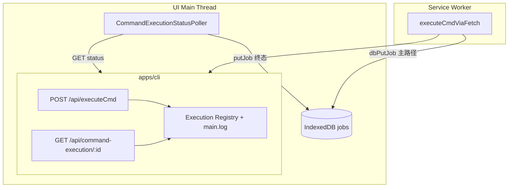
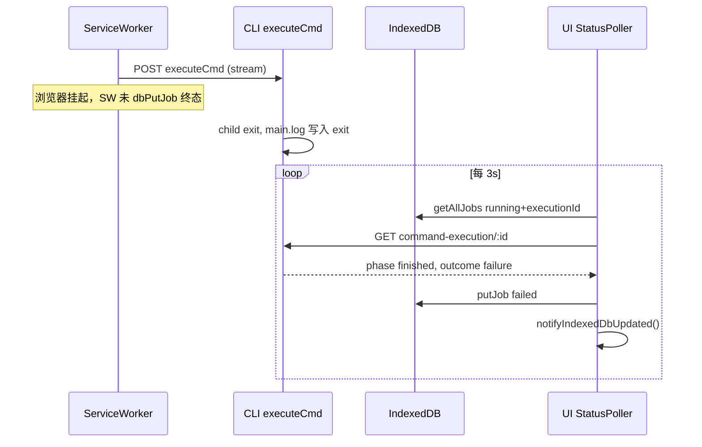

# UI 主动轮询后台命令执行状态

[ ] New UI component
[ ] New user config
[ ] Electron only
[ ] User document

## 1. Background

### 问题

后台任务（下载、转写等）通过 Service Worker 调用 `POST /api/executeCmd`，并在 **IndexedDB**（`DownloadTaskDatabase` / `jobs`）中维护 `status`。

当 **浏览器挂起 UI 标签页或 Service Worker** 时：

- SW 中的 `fetch` 流可能中断、卡住，无法把终态写回 IDB；
- 现有「主动策略」仅是 **UI 每 5s 读取 IDB**（`JobOrchestratorProvider` → `getAllJobs` → `syncJobRecordsToStore`），**不查询 CLI 上命令是否已结束**；
- 导致 IDB 长期 `running`，与 CLI 磁盘日志 / 实际进程状态不一致。

### 范围

| 在范围内 | 不在范围内 |
|----------|------------|
| 新增 CLI 只读状态 API（按 `executionId`） | LogDialog、日志轮询 UI |
| UI **主线程**轮询 API，终态时 **写 IDB** | 直接改 Zustand / BackgroundJobs UI |
| 与 `executeCmd` 关联的任务类型 | 无 `executionId` 的任务（如 `test-delay`） |

IDB 更新后通过既有 `notifyIndexedDbUpdated` / `indexed-updated` 触发 UI 同步，**本需求不实现 UI 层逻辑**。

### 关联 ID

- HTTP 流式执行：`POST /api/executeCmd`，响应头 **`X-Command-Execution-Id`**（UUID v4）。
- 任务记录在 `job.data.executionId`（download / transcribe / translate / synthesize / process）。

---

## 2. Project Level Architecture

在现有「UI + SW + CLI」三层上增加 **UI 主线程 → CLI 的状态对账环**，不替换 SW 正常路径，作为挂起/断连时的修复通道。



---

## 3. App Level Architecture

### 3.1 CLI：命令执行状态 API

**路由**（建议）：

```
GET /api/command-execution/:executionId
```

**校验**：`executionId` 与 `commandLog` 相同（UUID v4），路径穿越防护复用 `resolveCommandMainLogPath` 思路。

**响应**（JSON）：

```ts
type CommandExecutionPhase = 'unknown' | 'running' | 'finished';

type CommandExecutionOutcome = 'success' | 'failure';

interface CommandExecutionStatusResponse {
  executionId: string;
  /** 是否能在服务端判定该 execution 存在 */
  found: boolean;
  phase: CommandExecutionPhase;
  /** phase === 'finished' 时必有 */
  outcome?: CommandExecutionOutcome;
  exitCode?: number | null;
  signal?: string | null;
  /** 来自 main.log 最后一条 system 摘要（可选） */
  systemNote?: string;
}
```

**状态判定（两层，与磁盘日志一致）**：

1. **内存注册表**（主）：`executeCmd` 流式 / `runWhitelistedCommandSync` 在 spawn → close/abort/timeout 时注册/更新。可准确反映「进程仍在跑」。
2. **日志尾部解析**（备）：注册表无条目时（如 CLI 重启后），读 `commands/<id>/main.log` 尾部，匹配与 UI `isTerminalCommandLogText` 对齐的 system 行（`exit code=`、`client disconnected (abort)`、`timeout after`、`process error:`、`spawn failed:`）。解析成功 → `finished` + `outcome`。

**`outcome` 规则**：

- `exit code=0`（且无 error/timeout 行）→ `success`
- 非零 exit、timeout、abort、spawn error → `failure`

**HTTP 状态码**：

- 非法 id → `400`
- 合法 id 但无 log 且注册表无记录 → `200` + `{ found: false, phase: 'unknown' }`（勿用 404，便于轮询）

实现位置建议：`apps/cli/src/route/commandExecutionStatus.ts`，在 `server.ts` 注册；注册表逻辑可放在 `apps/cli/src/route/commandExecutionRegistry.ts`，由 `executeCmd.ts` / `VideoCaptioner` sync 路径调用。

### 3.2 UI：主线程轮询器

**模块**（建议）：`apps/ui/src/lib/commandExecutionStatusPoller.ts`

**职责**：

1. `getAllJobs()`，筛选 `status === 'running'` 且 `data.executionId` 非空（按 job type 解析 JSON）。
2. 对每个 `executionId` 调用 `GET /api/command-execution/:id`（封装在 `apps/ui/src/api/commandExecutionStatus.ts`）。
3. 若 `phase === 'finished'`，按 job type **对账写 IDB**（`putJob` + `notifyIndexedDbUpdated()`），**不**调用 `syncJobRecordsToStore`。

**轮询间隔**：默认 **3s**（可常量 `COMMAND_EXECUTION_STATUS_POLL_MS`）；仅当存在至少一条「running + executionId」时启动 `setInterval`，否则清除。

**挂载点**：`JobOrchestratorProvider` 内 `useEffect`（与现有 `hasActiveJobs` 5s IDB 轮询并列或替代后者对 running 的语义——见 3.3）。

**并发**：同一 `executionId` 去重；`inFlight` Set 防止重叠请求。

### 3.3 与现有 IDB 5s 轮询的关系

| 机制 | 行为 | 变更 |
|------|------|------|
| 现有 `ACTIVE_JOB_POLL_INTERVAL_MS` | 只 `getAllJobs` → 刷 store | **保留**，用于 SW 已写 IDB 后的 UI 同步 |
| 新 CommandExecutionStatusPoller | 问 CLI → 写 IDB | **新增**，解决 IDB 与后台不一致 |

二者互补：新轮询 **生产** 正确 IDB 终态；旧轮询 **消费** IDB 更新到 store。

### 3.4 IDB 对账规则（按 job type）

原则：仅当记录仍为 `running` 且 API 返回 `finished` 时写入；**不覆盖** SW 已写入的 `succeeded` / `failed` / `stopped`（先读-再-写 compare）。

#### `download-video`

- `outcome === 'failure'`：`job.status = 'failed'`；当前 `videos[].status === 'downloading'` 的项 → `failed`。
- `outcome === 'success'`：当前 downloading 项 → `succeeded`；若全部 succeeded → `job.status = 'succeeded'`，否则保持 `running`（后续视频仍由 SW 执行；若 SW 已死则仅剩单视频场景可整 job `succeeded`）。

#### `transcribe` | `translate` | `synthesize` | `process`

- `failure` → `job.status = 'failed'`
- `success` → `job.status = 'succeeded'`

（与 SW 各 `start*`  handler 终态一致；不解析 stdout 路径，避免与 SW 重复。）

#### 无 `executionId` 的 `running` 任务

跳过（无法对账）。

---

## 4. User Stories

### 4.1 SW 挂起后 IDB 与 CLI 重新一致

* **Given** 一条 `download-video` 任务 `running`，`data.executionId` 已设置，CLI 上 yt-dlp 已结束（main.log 含 `exit code=` 或 `client disconnected`）
* **When** SW 未更新 IDB，UI 主线程轮询器运行
* **Then** 下一次轮询后 IDB 中任务为 `failed` 或 `succeeded`（与 CLI outcome 一致），并触发 `indexed-updated`



---

## 5. Tasks

### 5.1 CLI

- [x] `commandExecutionRegistry.ts`：register / finish / getStatus
- [x] `executeCmd.ts`（及 `runWhitelistedCommandSync`）挂钩注册表
- [x] `commandExecutionStatus.ts`：`GET /api/command-execution/:executionId`
- [x] 单元测试：注册表生命周期 + log 尾部 fallback 解析
- [x] `docs/api/index.md`

### 5.2 UI

- [x] `api/commandExecutionStatus.ts`：fetch 封装
- [x] `lib/commandExecutionStatusPoller.ts`：轮询 + IDB reconcile
- [x] `lib/reconcileJobRecordWithCommandStatus.ts`：按 type 更新 `TaskJobRecord`
- [x] `JobOrchestratorProvider`：挂载/卸载 poller
- [x] 单元测试：reconcile 逻辑

### 5.3 清理（可选，单独 PR）

- [ ] 评估是否从 LogDialog 移除「主动层」对 `backgroundJobsStore` 的依赖（用户声明与 LogDialog 无关，可不动）

---

## 6. Backward Compatibility

- 新 API 为增量；旧客户端不调用则无影响。
- SW 仍为主写入路径；UI 对账仅在 `running` + 有 `executionId` 时覆盖，避免与 SW 正常完成竞态（compare `updatedAt` 或 status 仍为 running）。

---

## 7. Documents

- [ ] `docs/api/index.md` — 登记 `GET /api/command-execution/:executionId`
- [ ] `docs/api/CommandExecutionStatusAPI.md` — 新建
- [ ] `.agents/docs/architecture.md` — Background Jobs 小节补充对账环（可选）

---

## 8. Post Verification

- [ ] `pnpm test`（cli + ui 新测试）
- [ ] 手动：dev 下触发代理断连 / 标签页后台化，确认 IDB 在数十秒内变为终态（无需刷新）

---

## 9. 已确认

1. **轮询间隔**：**3s**（`COMMAND_EXECUTION_STATUS_POLL_MS`）。
2. **多视频 download 成功对账**：仅将当前 `downloading` 条目标为 `succeeded`；**不**在 UI 对账中把整 job 标为 `succeeded`（整 job 终态仍由 SW 写入）。
