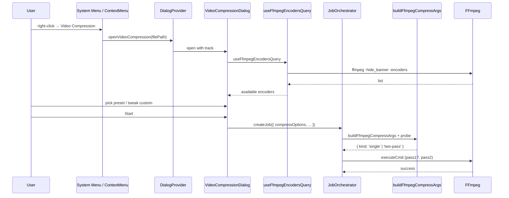

# Video Compression

[Add a new **Video Compression** dialog (独立于 FormatConverterDialog) with two tabs — *Presets* and *Custom* — that re-uses the existing `ffmpeg-convert` background job pipeline. Encoder support (H.264 / H.265 / VP9 / AV1, plus NVIDIA / Intel QSV / AMD AMF / Apple VideoToolbox) is auto-detected by parsing `ffmpeg -encoders` at startup and cached. Available in system menu and right-click context menu of MusicPanel / TvShowPanel / MoviePanel.]

[ ] New UI component — new `VideoCompressionDialog`, plus tabs-based layout
[ ] New user config — no; encoder cache is in-memory only
[ ] Electron only — runs in browser too; only the encoder list cache is unavailable in browser without executeCmd
[ ] User document — `docs/user-guide.md` may add a section

## 1. Background

The app already supports **format conversion** (FormatConverterDialog) for video → video / image, but it is **codec / preset oriented** (`mp4h264`, `mp4h265`, `webm`, `mkv` × `quality` / `balanced` / `speed`). It does not support:

* 5 named presets (极速压缩 / 均衡 / 高质量 / 极限压缩 / 仅音频) for one-click compression.
* Hardware encoders (NVENC, QSV, AMF, VideoToolbox).
* Target bitrate / target size (2-pass) workflows.
* Advanced controls: pixel format, profile, GOP, threads, HDR, denoise/sharpen filters, metadata.
* Resolution scaling + frame-rate control side-by-side in a single "compression" workflow.

The user wants a **new** dedicated dialog that focuses on **reducing file size** (vs. transcoding to a different container/format), with the same `ffmpeg-convert` background job pluming the existing infrastructure already uses.

## 2. Project Level Architecture

None. The new dialog re-uses the same `ffmpeg-convert` job type and the same `JobOrchestrator` flow.

## 3. App Level Architecture

### 3.1 Type & data model

**Extend** `FfmpegConvertBackgroundJobData` in `apps/ui/src/types/background-jobs.ts` with **optional** `compressOptions` field. Existing convert jobs (FormatConverterDialog) keep working unchanged.

```ts
export interface FfmpegCompressOptions {
  // ── Preset or custom ───────────────────────────────────
  /** Selected preset key; "custom" when user has tweaked. */
  presetKey: 'speed' | 'balanced' | 'quality' | 'extreme' | 'audioOnly' | 'custom'

  // ── Output container ───────────────────────────────────
  /** Output container format, e.g. 'mp4' | 'mkv' | 'webm' | 'mov'. */
  container: 'mp4' | 'mkv' | 'webm' | 'mov'

  // ── Video encoding ─────────────────────────────────────
  videoEncoder: string          // 'libx264' | 'libx265' | 'libvpx-vp9' | 'libaom-av1' | 'h264_nvenc' | …
  /** Quality control mode. */
  qualityMode: 'crf' | 'targetBitrate' | 'targetSize'
  /** CRF value (0–51). Ignored for non-CRF modes. */
  crf: number
  /** Target average bitrate in kbps (used when qualityMode = targetBitrate, or computed for targetSize). */
  targetBitrateKbps?: number
  /** Target file size in MB (used when qualityMode = targetSize). */
  targetSizeMB?: number
  /** x264/x265/vpx/aom preset speed (ultrafast → veryslow). */
  encoderPreset: string         // 'ultrafast' | 'superfast' | 'veryfast' | 'faster' | 'fast' | 'medium' | 'slow' | 'slower' | 'veryslow'
  /** H.264/H.265 profile: baseline | main | high. */
  profile?: 'baseline' | 'main' | 'high'
  /** Pixel format: yuv420p | yuv444p | yuv420p10le (HDR). */
  pixFmt?: 'yuv420p' | 'yuv444p' | 'yuv420p10le'
  /** GOP (keyframe interval) in frames; 0 = default. */
  gopSize?: number

  // ── Resolution & frame rate ────────────────────────────
  /** 'original' | '480p' | '720p' | '1080p' | '4k' | 'custom' */
  resolutionMode: 'original' | '480p' | '720p' | '1080p' | '4k' | 'custom'
  /** Custom width when resolutionMode === 'custom' (height auto). */
  customWidth?: number
  /** 'original' | 24 | 30 | 60 | 'custom' */
  frameRateMode: 'original' | 24 | 30 | 60 | 'custom'
  customFps?: number
  /** Drop every Nth frame to thin out content; 0 = off. */
  frameSkip?: number

  // ── Audio ──────────────────────────────────────────────
  audioMode: 'keep' | 'reencode' | 'remove'
  audioCodec?: 'aac' | 'libopus' | 'libmp3lame' | 'copy'
  audioBitrateKbps?: number
  audioSampleRateHz?: number   // 44100, 48000
  audioChannels?: 1 | 2

  // ── Advanced ───────────────────────────────────────────
  /** Force 2-pass encoding (auto-enabled for targetSize). */
  twoPass: boolean
  threads?: number             // 0 = ffmpeg default
  hdr: 'preserve' | 'convertToSdr'
  /** Denoise / sharpen filter names. */
  filters: {
    denoise: 'none' | 'light' | 'medium' | 'strong'  // hqdn3d strength
    sharpen: boolean
  }
  metadata: 'preserve' | 'strip'
}

export interface FfmpegConvertBackgroundJobData {
  // … existing fields
  /** When set, signals a compression job and unlocks all ffmpeg features. */
  compressOptions?: FfmpegCompressOptions
}
```

### 3.2 Constants (`packages/core/whitelistedCmd/constants.ts`)

```ts
/** User-facing encoder groups. Each entry has a stable id, label key, codec family. */
export interface FfmpegEncoderInfo {
  id: string                              // 'libx264'
  /** Hardware acceleration tag; undefined for software. */
  hwAccel?: 'nvenc' | 'qsv' | 'amf' | 'videotoolbox'
  codec: 'h264' | 'hevc' | 'vp9' | 'av1'
  /** Containers this encoder is allowed to be muxed into. */
  compatibleContainers: readonly ('mp4' | 'mkv' | 'webm' | 'mov')[]
  /** Default preset speed string. */
  defaultPreset: string
  /** True if encoder supports -crf. Some NVENC/QSV variants prefer -b:v. */
  supportsCrf: boolean
  /** Recommended CRF range. */
  crfRange: { min: number; max: number; default: number }
  /** True if encoder supports 10-bit (yuv420p10le) for HDR. */
  supports10Bit: boolean
}

/** Static catalog presented in the UI when ffmpeg -encoders is unavailable. */
export const FFMPEG_COMPRESS_ENCODER_CATALOG: readonly FfmpegEncoderInfo[] = [
  // Software
  { id: 'libx264',     codec: 'h264', compatibleContainers: ['mp4', 'mkv', 'mov'], defaultPreset: 'medium',   supportsCrf: true,  crfRange: { min: 0, max: 51, default: 23 }, supports10Bit: false },
  { id: 'libx265',     codec: 'hevc', compatibleContainers: ['mp4', 'mkv', 'mov'], defaultPreset: 'medium',   supportsCrf: true,  crfRange: { min: 0, max: 51, default: 28 }, supports10Bit: true  },
  { id: 'libvpx-vp9',  codec: 'vp9',  compatibleContainers: ['webm', 'mkv'],       defaultPreset: 'good',     supportsCrf: true,  crfRange: { min: 0, max: 63, default: 31 }, supports10Bit: false },
  { id: 'libaom-av1',  codec: 'av1',  compatibleContainers: ['mp4', 'mkv', 'webm'],defaultPreset: '6',        supportsCrf: true,  crfRange: { min: 0, max: 63, default: 30 }, supports10Bit: true  },
  { id: 'libsvtav1',   codec: 'av1',  compatibleContainers: ['mp4', 'mkv', 'webm'],defaultPreset: '8',        supportsCrf: true,  crfRange: { min: 0, max: 63, default: 30 }, supports10Bit: true  },
  // NVIDIA
  { id: 'h264_nvenc',  codec: 'h264', hwAccel: 'nvenc', compatibleContainers: ['mp4', 'mkv', 'mov'], defaultPreset: 'p4', supportsCrf: true,  crfRange: { min: 0, max: 51, default: 23 }, supports10Bit: false },
  { id: 'hevc_nvenc',  codec: 'hevc', hwAccel: 'nvenc', compatibleContainers: ['mp4', 'mkv', 'mov'], defaultPreset: 'p4', supportsCrf: true,  crfRange: { min: 0, max: 51, default: 28 }, supports10Bit: true  },
  // Intel QSV
  { id: 'h264_qsv',    codec: 'h264', hwAccel: 'qsv',   compatibleContainers: ['mp4', 'mkv', 'mov'], defaultPreset: 'medium', supportsCrf: true,  crfRange: { min: 1, max: 51, default: 23 }, supports10Bit: false },
  { id: 'hevc_qsv',    codec: 'hevc', hwAccel: 'qsv',   compatibleContainers: ['mp4', 'mkv', 'mov'], defaultPreset: 'medium', supportsCrf: true,  crfRange: { min: 1, max: 51, default: 28 }, supports10Bit: true  },
  // AMD AMF
  { id: 'h264_amf',    codec: 'h264', hwAccel: 'amf',   compatibleContainers: ['mp4', 'mkv', 'mov'], defaultPreset: 'balanced', supportsCrf: true, crfRange: { min: 0, max: 51, default: 23 }, supports10Bit: false },
  { id: 'hevc_amf',    codec: 'hevc', hwAccel: 'amf',   compatibleContainers: ['mp4', 'mkv', 'mov'], defaultPreset: 'balanced', supportsCrf: true, crfRange: { min: 0, max: 51, default: 28 }, supports10Bit: true  },
  // Apple VideoToolbox
  { id: 'h264_videotoolbox', codec: 'h264', hwAccel: 'videotoolbox', compatibleContainers: ['mp4', 'mov'], defaultPreset: 'medium', supportsCrf: false, crfRange: { min: 0, max: 100, default: 70 }, supports10Bit: false },
  { id: 'hevc_videotoolbox', codec: 'hevc', hwAccel: 'videotoolbox', compatibleContainers: ['mp4', 'mov'], defaultPreset: 'medium', supportsCrf: false, crfRange: { min: 0, max: 100, default: 70 }, supports10Bit: true  },
] as const

export const FFMPEG_COMPRESS_PRESETS = [
  {
    key: 'speed',
    label: 'videoCompression.presetSpeed',
    description: 'videoCompression.presetSpeedDesc',
    options: { container: 'mp4', videoEncoder: 'libx264', qualityMode: 'crf', crf: 28, encoderPreset: 'ultrafast', audioMode: 'keep', resolutionMode: 'original', frameRateMode: 'original' },
  },
  {
    key: 'balanced',
    label: 'videoCompression.presetBalanced',
    description: 'videoCompression.presetBalancedDesc',
    options: { container: 'mp4', videoEncoder: 'libx264', qualityMode: 'crf', crf: 23, encoderPreset: 'medium', audioMode: 'keep', resolutionMode: 'original', frameRateMode: 'original' },
  },
  {
    key: 'quality',
    label: 'videoCompression.presetQuality',
    description: 'videoCompression.presetQualityDesc',
    options: { container: 'mkv', videoEncoder: 'libx265', qualityMode: 'crf', crf: 18, encoderPreset: 'slow', audioMode: 'reencode', audioCodec: 'aac', audioBitrateKbps: 256, resolutionMode: 'original', frameRateMode: 'original' },
  },
  {
    key: 'extreme',
    label: 'videoCompression.presetExtreme',
    description: 'videoCompression.presetExtremeDesc',
    options: { container: 'mp4', videoEncoder: 'libx265', qualityMode: 'crf', crf: 32, encoderPreset: 'medium', resolutionMode: '720p', frameRateMode: 'original', audioMode: 'reencode', audioCodec: 'aac', audioBitrateKbps: 96 },
  },
  {
    key: 'audioOnly',
    label: 'videoCompression.presetAudioOnly',
    description: 'videoCompression.presetAudioOnlyDesc',
    options: { container: 'mp4', videoEncoder: 'libx264', audioMode: 'remove' },
  },
] as const

export type FfmpegCompressPresetKey = (typeof FFMPEG_COMPRESS_PRESETS)[number]['key']
```

### 3.3 ffmpeg arg builder (`packages/core/whitelistedCmd/ffmpeg.ts`)

Add a new function `buildFfmpegCompressArgs(inputPath, outputPath, options: FfmpegCompressOptions, probe: { durationSec: number; width: number; height: number })`. Behaviour:

1. **2-pass resolution**:
   * If `qualityMode === 'targetSize'`: `bitrate = (sizeMB * 8 * 1024) / durationSec * 1000 - audioBitrateKbps` (kbps), clamp to ≥ 100 kbps. Always 2-pass.
   * If `qualityMode === 'targetBitrate'`: use `targetBitrateKbps` directly. 2-pass when `twoPass === true`.
   * Else (CRF): no 2-pass.
2. **Output arguments** (single pass):
   ```
   -i input -c:v <encoder>
     [hwaccel flags if applicable]
     [crf + preset + profile + pix_fmt + gop]
     -vf "scale=<W>:-2,fps=<FPS>,hqdn3d=<l|m|s>,unsharp" (assembled from options)
   -c:a <codec> [b:a] [ar] [ac]  |  -an
   -map_metadata <0|−1>   (preserve vs strip)
   -movflags +faststart    (for mp4/mov)
   ```
3. **2-pass**: when `twoPass === true`, build **two** arg arrays (`pass1` with `-pass 1 -an -f null`, `pass2` with `-pass 2`). The orchestrator runs them in sequence; pass1 output goes to `ffmpeg2pass-0.log` in the same output dir, then deleted.
4. **HDR conversion**: if `hdr === 'convertToSdr'`, prepend `-vf zscale=...,format=yuv420p`; emit metadata accordingly.
5. **Audio-only**: `-vn -c:a <codec> -b:a <k>`; container becomes whichever is compatible (e.g. `mka` for mkv, `mp4` still valid for audio-only AAC).

The function returns a union:
```ts
export type FfmpegCompressRun =
  | { kind: 'single'; args: string[] }
  | { kind: 'two-pass'; pass1Args: string[]; pass2Args: string[]; passLogPath: string }
```

### 3.4 Encoder detection (TanStack Query)

`apps/ui/src/hooks/ffmpeg/useFfmpegEncodersQuery.ts`:

* On mount, executes `ffmpeg -hide_banner -encoders` via `executeCmdToCompletion`.
* Parses the output lines of the form:
  ```
  V..... = Video
  A..... = Audio
  S..... = Subtitle
  ------
  V..... libx264              libx264 H.264 / AVC / MPEG-4 AVC / MPEG-4 part 10 (decoders: h264 h264_qsv ) (encoders: libx264 libx264_nvenc libx264_qsv libx264_amf libx264_videotoolbox libx264_mf )
  ```
* Extracts encoder names whose prefix is `V.....` and matches the catalog IDs.
* Returns `{ available: string[]; isLoading; error }`. Cached for 1 hour.
* Cross-references with `FFMPEG_COMPRESS_ENCODER_CATALOG` to expose only supported ones in the dialog's encoder dropdown.

If the query fails (e.g. ffmpeg not installed), the dialog falls back to a **single software H.264 option** and shows a "FFmpeg encoders not detected" banner.

### 3.5 UI: `VideoCompressionDialog`

A new component in `apps/ui/src/components/dialogs/video-compression-dialog.tsx`. Re-uses the existing `Dialog`, `ScrollableDialog*`, `Button`, `Input`, `Select`, `Tabs` primitives (no new Shadcn install needed — `tabs.tsx` already exists).

Layout:

```
┌─ Video Compression ──────────────────────────────────────────┐
│ [ Presets ]  [ Custom ]                                      │
│                                                                │
│  Source:  video.mkv (00:42:13)                                │
│  Encoder: libx264  (✓ available, 4 more)                      │
│                                                                │
│  ── Presets tab ─────────────────────────────────────────     │
│  ┌──────────────┐ ┌──────────────┐ ┌──────────────┐          │
│  │ ⚡ 极速压缩   │ │ ⚖ 均衡模式    │ │ ⭐ 高质量     │          │
│  │ H.264 ultraf │ │ H.264 med    │ │ H.265 slow   │          │
│  │ CRF 28       │ │ CRF 23       │ │ CRF 18       │          │
│  └──────────────┘ └──────────────┘ └──────────────┘          │
│  ┌──────────────┐ ┌──────────────┐                            │
│  │ 🔥 极限压缩   │ │ 🎵 仅音频     │                            │
│  │ H.265 720p   │ │ Audio only   │                            │
│  │ CRF 32       │ │              │                            │
│  └──────────────┘ └──────────────┘                            │
│                                                                │
│  ── Custom tab (collapsible sections) ─────────────────      │
│  Video encoding                                               │
│    [Encoder ▼] [Hardware ▼] [Profile ▼] [PixFmt ▼] [Preset ▼]│
│    [● CRF 23]  [○ Bitrate ___k]  [○ Target size ___ MB]     │
│  Resolution & frame rate                                      │
│    [Resolution ▼] [Width ___] [Frame rate ▼] [FPS ___]       │
│  Audio                                                        │
│    [● Keep] [○ Re-encode] [○ Remove]                          │
│    [Codec ▼] [Bitrate ___] [Sample rate ▼] [Channels ▼]      │
│  Advanced                                                     │
│    ☐ 2-pass encoding  Threads [___]  HDR [▼]                 │
│    Denoise [None ▼]  ☐ Sharpen  Metadata [▼]                  │
│                                                                │
│  Output                                                       │
│    [Save to: /path/  📁]                                      │
│    [File name: video-compressed.mp4]                          │
│                                                                │
│              [ Cancel ]  [ Start ]                            │
└──────────────────────────────────────────────────────────────┘
```

#### Behaviour rules

1. **Source / output path**: identical pattern to `FormatConverterDialog` (source path → default output dir + filename `<base> (1).<ext>`). If no track is provided, dialog shows a "Select a video file" placeholder.
2. **Tabs share common state** (source, output dir, output name). Switching tabs does not lose data.
3. **Selecting a Preset** in the Presets tab **overwrites all custom options** (sets `presetKey`, then applies preset defaults). It does NOT switch to the Custom tab; the user can switch to Custom to see/edit the resulting values.
4. **Editing any field in the Custom tab** sets `presetKey = 'custom'`.
5. **Container / encoder compatibility**: when the user picks an encoder, the container dropdown filters to `compatibleContainers`. When the user picks a container, the encoder dropdown filters to encoders compatible with that container.
6. **Target size flow**:
   * On selecting *Target size*, the dialog first calls `getMediaTags({ path })` (already used for track duration) to read duration.
   * Shows the computed bitrate in a small hint (e.g. "→ target ~3 200 kbps").
   * Auto-enables 2-pass.
7. **CRF for hardware encoders without CRF** (`supportsCrf = false`): the CRF input is replaced with a "Quality (0–100)" slider (matches VideoToolbox's `-q:v`).
8. **2-pass preview** for "Audio only" preset is hidden (no video encoding).
9. **HDR convert to SDR** prepends a complex filter; a warning is shown: "Conversion may slightly alter colors".
10. **Filters**: Denoise maps to `hqdn3d` with strengths `4:3:6:3` (light) / `7:7:9:7` (medium) / `10:10:12:10` (strong). Sharpen maps to `unsharp=5:5:1.0:5:5:0.0`.
11. **Submit** calls `buildFfmpegCompressJob` (see 3.6) and dispatches to `createJob`. The dialog closes on success; failure shows an inline error (mirrors FormatConverterDialog UX).

### 3.6 Job factory (`apps/ui/src/lib/ffmpegCompressJobFactory.ts`)

Mirrors `ffmpegConvertJobFactory.ts`. Same `FfmpegConvertBackgroundJob` shape, but with `outputFormat = 'mp4compress'` (new enum) and a `compressOptions` field. The orchestrator's existing `ffmpeg-convert` switch case is extended to handle `'mp4compress'` and any other `'compress-*'` value by calling `buildFfmpegCompressArgs` instead of `buildFfmpegConvertArgs`.

`FfmpegConvertFormat` extends to:
```ts
| 'mp4compress' | 'mkvcompress' | 'webmcompress' | 'movcompress'
```

These are opaque values: the orchestrator detects the `compressOptions` field and routes to the new builder. The UI never shows them.

### 3.7 Orchestrator changes (`JobOrchestratorProvider.tsx`)

In the `'ffmpeg-convert'` switch case, branch on `data.compressOptions`:

```ts
const compressOpts = cd.compressOptions
let run: FfmpegCompressRun
if (compressOpts) {
  // Get probe via executeCmd ffprobe (ffprobe -v error -show_entries format=duration:stream=width,height ...)
  const probe = await probeVideoForCompression(cd.inputPathPlatform)
  run = buildFfmpegCompressArgs(cd.inputPathPlatform, cd.outputPathPlatform, compressOpts, probe)
} else {
  run = { kind: 'single', args: buildFfmpegConvertArgs(...) }
}
```

For `'two-pass'`: run pass1 to a NUL output (`-f null -`), then run pass2 to the real output. Update progress after each pass.

For the background job toast registry (`jobTypeRegistry.ts`): keep `ffmpeg-convert` type. Add a `compress` sub-label in the toast key when `compressOptions` is set.

### 3.8 Dialog provider (`apps/ui/src/providers/dialog-provider.tsx`)

Add a new entry:
```ts
videoCompressionDialog: [
  openVideoCompression: (input: { filePath: string; title?: string; duration?: number } | string) => void,
  closeVideoCompression: () => void
]
```

If a string is passed, treat it as `filePath`. Mount `<VideoCompressionDialog />` alongside the others.

### 3.9 Right-click context menu (MusicPanel, TvShowPanel, MoviePanel)

#### MusicPanel (`apps/ui/src/components/LocalFileRow.tsx`)

Add a new `ContextMenuItem` next to **Format Convert**:
```tsx
<ContextMenuItem onClick={fileMenu.onVideoCompress} disabled={!isVideoFile(row.path)}>
  <Film className="mr-2 size-4" />
  {t("mediaPlayer.trackContextMenu.videoCompress")}
</ContextMenuItem>
```

`isVideoFile(path)` checks the extension (`mp4|mkv|webm|mov|avi|flv|m4v|ts|m2ts`).

`fileMenu` extended in `MusicFileTable.tsx`'s `fileMenuForRow`:
```ts
onVideoCompress: () => emitVideoCompressionEvent({ id, title, path, duration })
```

New event in `apps/ui/src/lib/musicEvents.ts`:
```ts
'track:videoCompress'
```

New handler in `MusicPanel.tsx` calling `openVideoCompression({ filePath: track.path, title: track.title, duration: track.duration })`.

#### TvShowPanel (`TvShowEpisodeTable.tsx`)

Add a new `ContextMenuItem` inside the existing `ContextMenuContent` for episode rows:
```tsx
<ContextMenuItem
  disabled={!row.videoFile}
  onClick={() => onVideoCompressContextMenuClick?.(row)}
>
  {t("tvShowEpisodeTable.contextMenu.videoCompress")}
</ContextMenuItem>
```

A new optional prop `onVideoCompressContextMenuClick?: (row: TvShowEpisodeDataRow) => void` is added. `TvShowPanel.tsx` wires it to `openVideoCompression` (passing the resolved absolute video file path).

#### MoviePanel (`MovieEpisodeTable.tsx`)

Same pattern: add a `ContextMenuItem` for the video row only, with an `onVideoCompressContextMenuClick` callback wired in `MoviePanel.tsx`.

### 3.10 System menu (`apps/ui/src/components/menu.tsx`)

Add a new item **after** "Format conversion" in the SMM menu:
```ts
{
  name: t('menu.videoCompression'),
  id: 'video-compression',
  onClick: () => {
    logMenuAction("video-compression.click")
    openVideoCompression()
  },
}
```
`openVideoCompression()` (no args) opens the dialog in "no source selected" state, identical to FormatConverterDialog's empty state, prompting the user to pick a file.

### 3.11 Sequence diagram



## 4. User Stories

### 4.1 Compress via 1-click preset

* **Given** a video file is right-clicked in MusicPanel
* **When** the user chooses *Video Compression → 极速压缩* and clicks *Start*
* **Then** a `ffmpeg-convert` background job is created with `compressOptions.presetKey = 'speed'`, runs in the orchestrator, and the output is saved beside the source file as `<basename> (1).mp4`.

### 4.2 Custom CRF + 2-pass target size

* **Given** the user opens the Video Compression dialog on a 10-min 1080p video
* **When** they pick the **Custom** tab, choose `libx265`, target size 200 MB
* **Then** the dialog reads duration via ffprobe, shows "→ ~2 530 kbps" hint, auto-enables 2-pass, and starts. The orchestrator runs pass 1 (NUL output) then pass 2 to the final mp4.

### 4.3 Hardware encoder unavailable gracefully

* **Given** the bundled ffmpeg does not include NVENC
* **When** the user opens the dialog
* **Then** `useFfmpegEncodersQuery` returns without `h264_nvenc`; the encoder dropdown shows only the encoders that exist; the dialog never suggests NVENC and never errors at submit.

### 4.4 Container / encoder compatibility

* **Given** the user picks `libvpx-vp9` encoder
* **When** they look at the container dropdown
* **Then** only `webm` and `mkv` are shown. The mp4 option is filtered out automatically.

### 4.5 Audio-only extraction

* **Given** the user picks the *仅音频* preset
* **When** they start
* **Then** the produced file has no video stream (`-vn`); the output container is mp4/AAC; the encoded file is the audio track only.

## 5. Tasks

### 5.1 Core types & constants

- [x] Add `FfmpegEncoderInfo` + `FFMPEG_COMPRESS_ENCODER_CATALOG` + `FFMPEG_COMPRESS_PRESETS` in `packages/core/whitelistedCmd/constants.ts`
- [x] Extend `FfmpegConvertFormat` with `'compress-mp4' | 'compress-mkv' | 'compress-webm' | 'compress-mov'`
- [x] Add `FfmpegCompressOptions` interface in `packages/core/whitelistedCmd/constants.ts`
- [x] Implement `buildFfmpegCompressArgs` in `packages/core/whitelistedCmd/ffmpeg.ts`
- [ ] Unit tests in `packages/core/whitelistedCmd/ffmpeg.test.ts` (CRF / bitrate / 2-pass / audio-only / HDR)

### 5.2 Encoder detection

- [x] `apps/ui/src/hooks/ffmpeg/useFfmpegEncodersQuery.ts` — `useQuery` over `executeCmdToCompletion({ command: 'ffmpeg', args: ['-hide_banner', '-encoders'] })`, parse with regex
- [x] `parseFfmpegEncoders(stdout: string): string[]` — pure parser unit-tested
- [x] Cache lifetime 1 h via `staleTime`

### 5.3 Background job data & factory

- [x] Extend `FfmpegConvertBackgroundJobData` in `apps/ui/src/types/background-jobs.ts` with optional `compressOptions`
- [x] Add `apps/ui/src/lib/ffmpegCompressJobFactory.ts` (mirrors `ffmpegConvertJobFactory.ts`)
- [x] Add tests for the factory (paths, format, data structure)

### 5.4 Orchestrator integration

- [x] In `JobOrchestratorProvider.tsx`'s `'ffmpeg-convert'` case, branch on `cd.compressOptions`; on present, call `buildFfmpegCompressArgs` (after probing duration + size via ffprobe)
- [x] Support `'two-pass'`: run pass1 to `/dev/null` (or `NUL`), then pass2 to real output
- [x] Update progress to 50% after pass1, 100% after pass2
- [x] Update `JOB_TIMEOUT_MS['ffmpeg-compress'] = 2 * 60 * 60 * 1000` (2 hours) for heavy encodes

### 5.5 UI: dialog

- [x] `apps/ui/src/components/dialogs/video-compression-dialog.tsx` — full Tabs-based layout
- [x] `apps/ui/src/components/dialogs/types/index.ts` — add `VideoCompressionDialogProps`
- [x] `apps/ui/src/components/dialogs/index.ts` — export the dialog
- [x] `apps/ui/src/providers/dialog-provider.tsx` — add `videoCompressionDialog` entry
- [x] `apps/ui/src/components/background-jobs/BackgroundJobItem.tsx` — show "Compress" label in job list when `compressOptions` set (existing `ffmpeg-convert` job name string already includes "Format conversion"; the compress job shares the same registry, so the job list label is reused as-is)

### 5.6 UI: integration

- [x] System menu: add `menu.videoCompression` entry in `apps/ui/src/components/menu.tsx`
- [x] MusicPanel: add right-click item via `musicEvents.ts` + `LocalFileRow.tsx` + `MusicFileTable.tsx` + `MusicPanel.tsx`
- [x] TvShowPanel: add right-click item in `TvShowEpisodeTable.tsx` + wire callback in `TvShowPanel.tsx`
- [x] MoviePanel: add right-click item in `MovieEpisodeTable.tsx` + wire callback in `MoviePanel.tsx`

### 5.7 i18n

- [x] Add keys to `apps/ui/public/locales/{en,zh-CN,zh-HK,zh-TW}/components.json` and `dialogs.json`
  - `menu.videoCompression`
  - `mediaPlayer.trackContextMenu.videoCompress`
  - `tvShowEpisodeTable.contextMenu.videoCompress`
  - `movieEpisodeTable.contextMenu.videoCompress`
  - `videoCompression.title`, `description`, `presetsTab`, `customTab`
  - 5 preset names + descriptions
  - All Custom field labels
- [x] Update `i18next.d.ts` type augmentation

### 5.8 Tests

- [x] `packages/core/whitelistedCmd/ffmpeg.test.ts` — arg snapshots for each preset and selected custom options (15 tests, all pass)
- [x] `apps/ui/src/components/dialogs/video-compression-dialog.test.tsx` — preset select, custom field validation, target-size bitrate hint, container/encoder compatibility filter (7 tests, all pass)
- [x] `apps/ui/src/hooks/ffmpeg/useFfmpegEncodersQuery.test.ts` — parser correctness (5 tests, all pass)
- [x] `apps/ui/src/lib/ffmpegCompressJobFactory.test.ts` — factory output (3 tests, all pass)

## 6. Backward Compatibility

* Existing `FfmpegConvertBackgroundJob` data without `compressOptions` continues to work — the orchestrator falls back to `buildFfmpegConvertArgs`.
* `FfmpegConvertFormat` is extended with new members; existing code that uses the old members (e.g. `mp4h264`) is unaffected.
* New i18n keys are added; missing keys are gracefully rendered as raw key strings (current pattern).
* New event `track:videoCompress` is added to `MUSIC_EVENT_NAMES`; no listener breakage.

## 7. Documents

- [ ] `docs/user-guide.md` — new "Video Compression" section
- [ ] `docs/api/index.md` — no new REST endpoint (the dialog re-uses the `ffmpeg-convert` job pluming)

## 9. Addendum: Estimated Output Size (Approach D) — IMPLEMENTED

### 9.1 Approach

A **pure client-side estimator** (no ffmpeg execution) implemented in
`packages/core/whitelistedCmd/compressEstimation.ts`. Combines:
- a per-encoder **bits-per-pixel-per-second** (bpp/s) table calibrated for "general content" at the encoder's reference CRF,
- a **CRF slope** (each ±6 CRF ≈ half/double bitrate) shared across encoders,
- a **content factor** derived from the source's own bitrate (compared to a baseline for its resolution) to handle simple vs. action content.

Returns instantly in a `useMemo` as the user changes options.

### 9.2 Source bitrate

`parseFfprobeTagsJson` in `packages/core/whitelistedCmd/ffmpeg.ts` now also
exposes `bitrateKbps`, `videoBitrateKbps`, and `audioBitrateKbps`. The
`getMediaTags` API in `apps/ui/src/api/ffmpeg.ts` forwards these to the
caller. The dialog already calls `getMediaTags` for duration, so the
bitrate is available for free.

### 9.3 Estimator API

```ts
// packages/core/whitelistedCmd/compressEstimation.ts
export interface CompressEstimationProbe { durationSec, width, height, videoBitrateKbps?, audioBitrateKbps?, totalBitrateKbps?, fps? }
export interface CompressEstimationResult { videoBitrateKbps, audioBitrateKbps, totalBitrateKbps, estimatedSizeMB, pctOfSource? }
export function estimateCompressVideoBitrateKbps(options, probe): number
export function estimateCompressAudioBitrateKbps(options, probe): number
export function estimateCompressSizeMb(options, probe): CompressEstimationResult | null
```

### 9.4 UI hint

In the dialog's source card, a new line below duration:
```
Estimated output: ~45 MB  (62% smaller)
Estimate based on encoder heuristic; actual size depends on content complexity.
```

The "smaller"/"larger" suffix is shown only when the source bitrate is
known (so a percentage can be computed). i18n keys added in 4 locales.

### 9.5 Calibration

| Encoder family | bpp/s at reference CRF |
|---|---|
| libx264 | 0.10 @ CRF 23 |
| libx265 | 0.05 @ CRF 28 |
| libvpx-vp9 | 0.065 @ CRF 31 |
| libaom-av1 / libsvtav1 | 0.045 @ CRF 30 |
| h264_nvenc / h264_videotoolbox | 0.14 @ q:v 70 / CRF 23 |
| hevc_nvenc / hevc_videotoolbox | 0.07 @ q:v 70 / CRF 28 |
| h264_qsv / h264_amf | 0.15 @ CRF 23 |
| hevc_qsv / hevc_amf | 0.075 @ CRF 28 |

CRF slope: 6 (matches libx264's "±6 ≈ half/double bitrate" rule of thumb).
For `q:v` encoders: piecewise linear mapping where `q:v 0 → CRF 0`,
`q:v default → crfReference`, `q:v max → CRF 51`.

Content factor: `clamp(sourceBitrate / (0.10 × sourcePixelRate), 0.3, 3.0)`.
Falls back to 1.0 when source bitrate is unavailable.

### 9.6 Status

- [x] `parseFfprobeTagsJson` exposes bitrate (1h, no behavioural change for existing callers)
- [x] Estimator module + 24 unit tests, all pass
- [x] UI hint with i18n in 4 locales
- [x] Dialog test added for the new hint
- [x] Calibration sanity-checked via tests (libx264 1080p CRF 23 lands in 3–7 Mbps; libx265 1080p CRF 28 is half of x264; target-bitrate mode is exact; never upscales)

## 8. Post Verification

- [x] `pnpm test:core` — 254 tests pass (including 10 new compress tests)
- [x] `pnpm test:ui` — 1241 tests pass (including 15 new dialog/hook/factory tests)
- [x] `pnpm typecheck` (core + ui) — passes
- [ ] Manual:
  1. Open dialog from system menu → 5 presets visible, custom tab shows defaults
  2. Pick 极速压缩, Start — completes, file ~30–40% of original size on a sample 1080p clip
  3. Custom: pick libx265, target 200 MB on a 10-min 1080p clip — completes, output ~200 MB
  4. Custom: pick h264_nvenc on a system without NVENC — option not shown
  5. MusicPanel right-click on a video → "Video Compression" item → opens dialog with that file
  6. TvShowPanel / MoviePanel right-click → same
  7. Audio-only preset produces audio-only file (verify via `ffprobe`)
