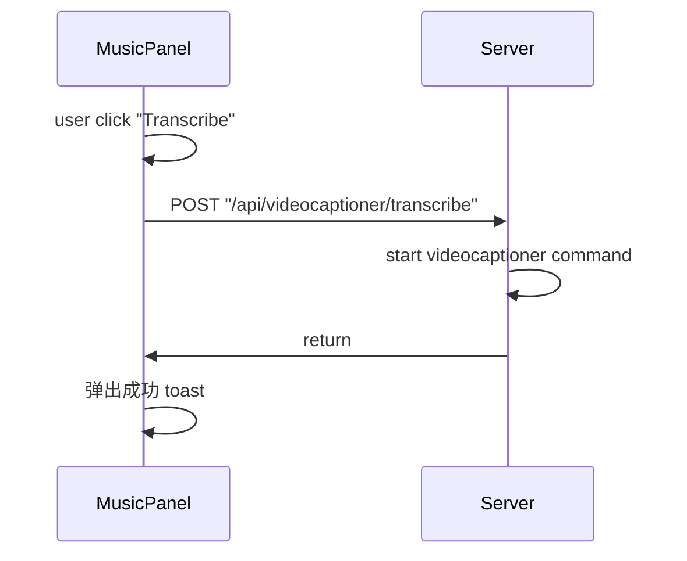
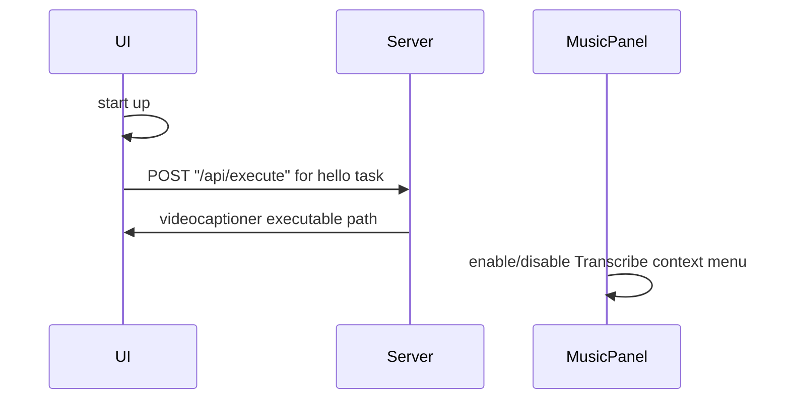

# VideoCaptioner Integration

> This requirement is for https://github.com/lawrenceching/SMM/issues/20

This feature support to transcribe video/audio by calling videocaptioner command.

## Use Cases

### Transcribe

User click "Transcribe" context menu to generate subtitle file for video/audio file.

### videocaptioner Discovery

In app startup, discover the videocaptioner cli command.
If it's not found, disable the Transcribe context menu.

## References

[VideoCaptioner CLI | GitHub](https://github.com/WEIFENG2333/VideoCaptioner/blob/master/docs/cli.md)
