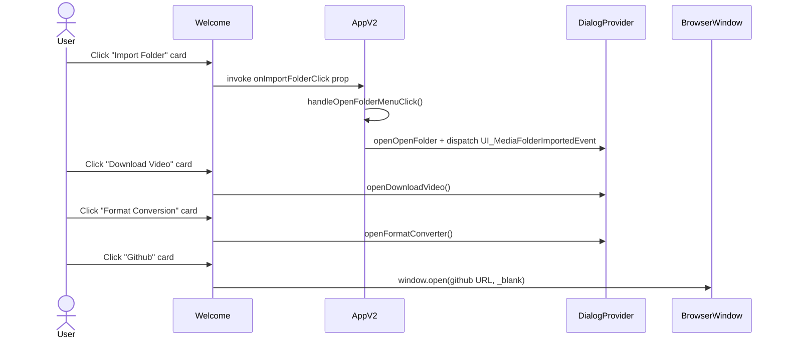
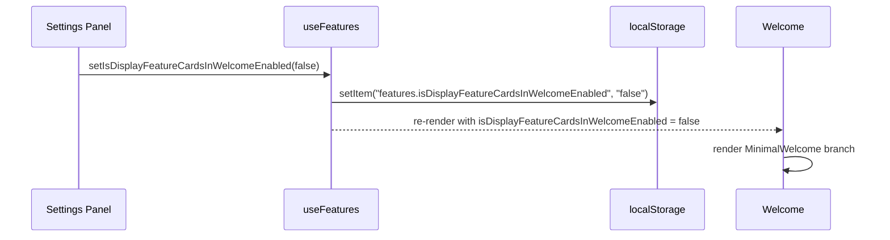

# Welcome Feature Cards

Redesign the `Welcome` component shown when no media folders are imported, replacing the minimal "Simple Media Manager" heading with a set of 4 feature cards: Import Folder, Download Video, Format Conversion, Github. The change is gated by a new feature flag in `useFeatures.ts` so users can opt back to the old welcome view.

[Complete the checklist below]
- [x] New UI component - check this if new UI component added
- [x] New user config - check this if new user config introduced
- [ ] Electron only - check this if new feature only work in Electron env.
- [ ] User document - check this if this change requires to add/update/delete user documents in `docs` folder

## 1. Background

The current `apps/ui/src/components/welcome.tsx` only renders a tiny centered block with the app name and the Github / GitCode links. Because the welcome view is shown when `uiFolders.length === 0` (i.e. on first launch for a new user), it is the first impression of the app. Users currently have no hint about what they can do next, and have to discover the menu in the top-left to find entry points like "Open Folder", "Download Video", or "Format Conversion".

Goal: surface the most common entry points as clickable feature cards right on the empty state, while still allowing users to fall back to the minimal view via a feature flag.

## 2. Project Level Architecture

None. The change is scoped to the `apps/ui` frontend.

## 3. App Level Architecture

None. The change is contained inside one component file plus its consumer (`AppV2.tsx`) and the existing `useFeatures` hook. No new providers, no new dependencies.

## 4. User Stories

### 4.1 Discover main features from the empty state

* **Given** a user has just installed SMM and there are no media folders imported
* **When** the app launches and the welcome view is shown
* **Then** the user sees 4 clickable feature cards: "Import Folder", "Download Video", "Format Conversion", "Github"
* **And** clicking "Import Folder" triggers the same flow as clicking the `SMM → Open Folder` menu item
* **And** clicking "Download Video" opens the existing `DownloadVideoDialog`
* **And** clicking "Format Conversion" opens the existing `FormatConverterDialog`
* **And** clicking "Github" opens `https://github.com/lawrenceching/SMM` in a new tab

### 4.2 Opt back to the minimal welcome view

* **Given** the user prefers the old minimal welcome view
* **When** they set `displayFeatureCardsInWelcome` to `false` (via the existing general settings panel, same mechanism as the other `useFeatures` flags)
* **Then** the welcome view renders the original "Simple Media Manager" block with the Github / GitCode links

## 5. Tasks

### 5.1 New UI Component

- [x] Task 1: Add 4 feature cards layout in `apps/ui/src/components/welcome.tsx`
  - 2x2 grid on mobile, 4 columns on `md+`
  - Each card: lucide-react icon (size 8) + translated title (`text-sm font-medium`)
  - Cards are `button` / `a` elements with `rounded-lg border bg-card hover:bg-accent transition-colors`
  - Import Folder, Download Video, Format Conversion use `useDialogs()`
  - Github uses `<a target="_blank">` with `rel="noopener noreferrer"`

- [x] Task 2: Keep minimal welcome view (current "Simple Media Manager") as a fallback branch, gated by `useFeatures().isDisplayFeatureCardsInWelcomeEnabled`

- [x] Task 3: Accept `onImportFolderClick?: () => void` prop so the parent can inject the existing "Open Folder" flow (`handleOpenFolderMenuClick` in `AppV2.tsx`)

- [x] Task 4: Use `useTranslation('components')` to translate card titles
  - Keys added under a new `welcome.featureCards` namespace:
    - `importFolder`, `downloadVideo`, `formatConversion`, `github`

### 5.2 Hook changes

- [x] Task 5: Extend `apps/ui/src/hooks/useFeatures.ts`
  - Add `DISPLAY_FEATURE_CARDS_IN_WELCOME_STORAGE_KEY = "features.isDisplayFeatureCardsInWelcomeEnabled"`
  - Add `readDisplayFeatureCardsInWelcomeEnabled()` returning `true` by default (default-on)
  - Add `writeDisplayFeatureCardsInWelcomeEnabled(enabled)`
  - Add `isDisplayFeatureCardsInWelcomeEnabled` state + setter to the `UseFeaturesResult` interface
  - Wire up `storage` event listener so multiple tabs / other components stay in sync
  - Add to the `useMemo` return and dependency array

### 5.3 Wire-up

- [x] Task 6: Update `apps/ui/src/AppV2.tsx`
  - Pass `onImportFolderClick={handleOpenFolderMenuClick}` to `<Welcome />`

### 5.4 i18n

- [x] Task 7: Add translations in 4 locales
  - `apps/ui/public/locales/en/components.json`
  - `apps/ui/public/locales/zh-CN/components.json`
  - `apps/ui/public/locales/zh-HK/components.json`
  - `apps/ui/public/locales/zh-TW/components.json`
  - New keys: `welcome.featureCards.{importFolder,downloadVideo,formatConversion,github}`

- [x] Task 8: Update `apps/ui/src/types/i18next.d.ts`
  - Add `welcome: { featureCards: { importFolder: string, downloadVideo: string, formatConversion: string, github: string } }` to `ComponentsResources`

### 5.5 Unit tests

- [x] Task 9: Add `apps/ui/src/components/welcome.test.tsx`
  - Renders 4 feature cards by default (flag on)
  - Uses i18n keys for card labels
  - `onImportFolderClick` prop is invoked on Import Folder click
  - `openDownloadVideo` is invoked on Download Video click
  - `openFormatConverter` is invoked on Format Conversion click
  - Minimal Simple Media Manager view is rendered when flag is off

## 6. Backward Compatibility

- The feature flag defaults to `true`, so the new view is the default.
- Users who prefer the old view can set the flag to `false`. The legacy branch is preserved verbatim, so visual / behavioral parity is guaranteed.
- No data migration. localStorage key is new; old users start with the default (new view).
- No new runtime dependencies — `lucide-react` is already a project dependency.

## 7. Documents

- [x] `.agents/docs/design/welcome-feature-cards.md` (this file)

No user-facing docs in `docs/` need updating. The change is purely visual / structural and is opt-out via feature flag, so the user guide is unaffected.

## 8. Post Verification

- [x] Unit tests
  - Run `pnpm run test` and expect all unit tests succeeded
  - Result: 1135 tests passed, 23 skipped, 0 failed
- [x] Typecheck
  - Run `pnpm run typecheck` and expect no errors
  - Result: no errors
- [ ] Build
  - Run `pnpm run build` and expect build succeeded
  - Result: pre-existing build errors in `format-converter-dialog.tsx` (formatConverter.webpPreset* / formatConverter.apngPred* keys missing in `i18next.d.ts`). These errors are unrelated to this change and exist on the baseline. Treated as out of scope.
- [ ] Manual smoke
  - Open the app with no media folders and verify the 4 cards render
  - Click each card and verify the corresponding action / dialog opens
  - Toggle the feature flag (default-on) to off and verify the original minimal view reappears
