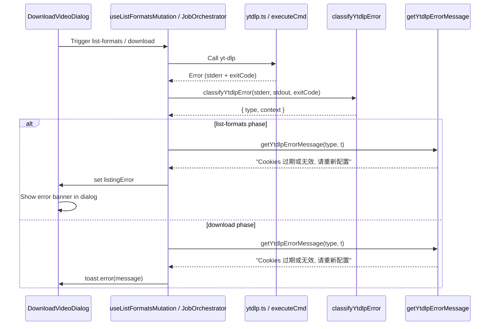

# yt-dlp Error Handling

Comprehensive yt-dlp error classification and user-friendly error display for both
`--list-formats` (DVD dialog) and download execution (toast notification) phases.

[ ] New UI component
[ ] New user config
[ ] Electron only
[ ] User document

## 1. Background

Currently, `ytdlpErrorDetection.ts` classifies 5 error types and is only used during the
`--list-formats` phase. The actual download execution in `JobOrchestratorProvider.tsx`
shows a generic "下载失败" toast regardless of the actual yt-dlp error.

The yt-dlp error code doc (`.agents/docs/yt-dlp_error_code.md`) documents ~20+ distinct
error patterns with specific user-facing meanings.

**Goal**: Classify ALL meaningful yt-dlp errors (by exit code + stderr patterns) in both
phases, with proper i18n messages.

## 2. Project Level Architecture

None.

## 3. App Level Architecture

### 3.1 Enhanced Error Classification (`apps/ui/src/lib/ytdlpErrorDetection.ts`)

Expand `classifyYtdlpError()` to detect all patterns from the yt-dlp error code doc.
Return only the error type (not hardcoded message). The callers produce i18n messages.

**Input**: stderr string, stdout string, exitCode number | null

**Detection priority** (more specific → less specific):

| Error Type | Detection | Exit Code |
|---|---|---|
| `cookie-expired` | `The provided YouTube account cookies are no longer valid` | 1 |
| `bot-detection` | `Sign in to confirm you're not a bot` (after cookie-expired check) | 1 |
| `age-restricted` | `age-restricted` or `confirm your age` (after bot check) | 1 |
| `login-required` | `Sign in to confirm` (generic, after age check) | 1 |
| `format-unavailable` | `Requested format is not available` | 1 |
| `unsupported-url` | `Unsupported URL` | 1 |
| `video-unavailable` | `Private video` / `Video unavailable` / `live event has ended` | 1 |
| `geo-restricted` | `Geo-restricted` | 1 |
| `http-403` | `HTTP Error 403` | 1 |
| `http-404` | `HTTP Error 404` | 1 |
| `http-410` | `HTTP Error 410` | 1 |
| `http-412` | `HTTP Error 412` (Bilibili anti-bot) | 1 |
| `http-429` | `HTTP Error 429` | 1 |
| `http-5xx` | `HTTP Error 5` | 1 |
| `connection-timeout` | `Connection to X timed out` | 1 |
| `network-error` | `Unable to download webpage` / `urlopen error` / `getaddrinfo` / SSL errors | 1 |
| `ffmpeg-missing` | `ffprobe and ffmpeg not found` | 1 |
| `postprocessing-error` | `Post-processing:` | 1 |
| `same-file-error` | `already exists` (from SameFileError) | 1 |
| `keyboard-interrupt` | `Interrupted by user` | 1 |
| `content-too-short` | `Incomplete data received` | 1 |
| `player-request-failed` | `Player request failed` | 1 |
| `options-error` | Any error | 2 |
| `download-cancelled` | Any error | 101 |
| `unknown` | All unrecognized errors | 1 |

### 3.2 i18n Message Mapping

New function `getYtdlpErrorMessage(type, t)` in `ytdlpErrorDetection.ts` that maps
error types to i18n keys. The actual translations go in `dialogs.json` under
`downloadVideo.errors.*`.

### 3.3 Caller Changes

#### useListFormatsMutation.ts (list-formats phase)
- Already uses `reportYtdlpError()`
- Change to use `classifyYtdlpError()` + `getYtdlpErrorMessage()` with t-function
- Error message still displayed via `listingError` in DVD dialog

#### JobOrchestratorProvider.tsx (download phase)
- After yt-dlp download fails, call `classifyYtdlpError()` on `result.stderr` + `result.stdout`
- Use `getYtdlpErrorMessage()` with `tRef.current` for the toast
- Store `errorType` in job record data for UI display in MusicPanel / status bar

## 4. User Stories

### 4.1 Cookie expired during format listing

- **Given** User has a YouTube URL with saved cookies
- **When** User clicks "Go" to list formats
- **Then** DVD shows error: "Cookies 过期或无效, 请重新配置"

### 4.2 Cookie expired during download

- **Given** User started a YouTube download with saved cookies
- **When** yt-dlp fails with cookie-expired error
- **Then** Toast shows: "Cookies 过期或无效, 请重新配置" (not generic "下载失败")

### 4.3 Format unavailable

- **Given** User selected a format code that YouTube doesn't offer
- **When** yt-dlp fails with "Requested format is not available"
- **Then** Toast/Dialog shows: "请求格式不可用, 请尝试选择格式码"

### 4.4 Bilibili HTTP 412 anti-bot

- **Given** User downloads Bilibili content without cookies
- **When** Bilibili returns HTTP 412
- **Then** Toast/Dialog shows: "请求被服务器拒绝 (412), 可能需要更新 Cookies 或等待后重试"

### 4.5 Network failure

- **Given** User's network connection drops
- **When** yt-dlp fails with connection timeout or DNS error
- **Then** Toast/Dialog shows: "网络连接失败, 请检查网络设置"

### 4.6 Unknown error

- **Given** Any yt-dlp error not matching known patterns
- **When** Download or list-formats fails
- **Then** Toast/Dialog shows: "未知错误, 请从状态栏任务列表中查看详细日志"

## 5. Tasks

### 5.1 Enhance error classification

- [x] **Task 1**: Expand `classifyYtdlpError()` signature to accept `exitCode` and `stdout`
  - File: `apps/ui/src/lib/ytdlpErrorDetection.ts`
  - Added all 22 error patterns
  - Returns only `{ type, context? }` (no hardcoded message)
  - `YtdlpErrorType` defined as a discriminated union type

- [x] **Task 2**: Add `getYtdlpErrorMessage()` function
  - Maps `YtdlpErrorType` → i18n key via `YTDLP_ERROR_I18N_MAP`
  - Accepts optional t-function parameter
  - File: `apps/ui/src/lib/ytdlpErrorDetection.ts`

- [x] **Task 3**: Update `reportYtdlpError()` to use new signature
  - Accepts both `ClassifyYtdlpErrorInput` object or string (backward compat)
  - Returns `YtdlpErrorResult` with type only
  - File: `apps/ui/src/lib/ytdlpErrorDetection.ts`

### 5.2 Update callers

- [x] **Task 4**: Update `useListFormatsMutation.ts`
  - File: `apps/ui/src/components/dialogs/hooks/useListFormatsMutation.ts`
  - Uses `useTranslation('dialogs')` internally
  - Uses `getYtdlpErrorMessage()` for i18n display

- [x] **Task 5**: Update `JobOrchestratorProvider.tsx` download-video error handling
  - File: `apps/ui/src/components/JobOrchestratorProvider.tsx`
  - After download fails, classify stderr + stdout with exit code
  - Store `ytdlpErrorType` and `ytdlpErrorMessage` in job record data for UI display
  - Show classified error toast instead of generic "下载失败"
  - Falls back to generic toast for unknown errors

### 5.3 Add i18n translations

- [x] **Task 6**: Add error message keys to `dialogs.json` (all 4 languages)
  - Added 24 error message keys under `downloadVideo.errors.*`
  - All locales: en, zh-CN, zh-HK, zh-TW
  - `downloadVideo.errors.cookieExpired`
  - `downloadVideo.errors.botDetection`
  - `downloadVideo.errors.ageRestricted`
  - `downloadVideo.errors.loginRequired`
  - `downloadVideo.errors.formatUnavailable`
  - `downloadVideo.errors.unsupportedUrl`
  - `downloadVideo.errors.videoUnavailable`
  - `downloadVideo.errors.geoRestricted`
  - `downloadVideo.errors.http403`
  - `downloadVideo.errors.http404`
  - `downloadVideo.errors.http410`
  - `downloadVideo.errors.http412`
  - `downloadVideo.errors.http429`
  - `downloadVideo.errors.http5xx`
  - `downloadVideo.errors.networkError`
  - `downloadVideo.errors.ffmpegMissing`
  - `downloadVideo.errors.postprocessingError`
  - `downloadVideo.errors.sameFileError`
  - `downloadVideo.errors.keyboardInterrupt`
  - `downloadVideo.errors.contentTooShort`
  - `downloadVideo.errors.playerRequestFailed`
  - `downloadVideo.errors.optionsError`
  - `downloadVideo.errors.unknown`

### 5.4 Update tests

- [x] **Task 7**: Update `ytdlpErrorDetection.test.ts`
  - 42 tests (was 9)
  - Tests all 22 error patterns
  - Tests exit code priority
  - Tests context extraction (hostname for timeout)
  - Tests `getYtdlpErrorMessage()` with i18n and fallback

- [x] **Task 8**: No `useListFormatsMutation` test exists; all existing DVD tests pass

- [x] **Task 9**: All related DVD tests pass (89 tests, 20 skipped)

## 6. Backward Compatibility

- `classifyYtdlpError()` signature changes (adds exitCode, stdout params) — update all callers
- `reportYtdlpError()` return type changes — update callers
- `YtdlpErrorResult.message` removed — callers use `getYtdlpErrorMessage()` instead

## 7. Documents

None (no user-facing docs change; error messages are self-explanatory).

## 8. Post Verification

- [x] Unit tests — `pnpm run test` (ytdlpErrorDetection: 42 passed; DVD: 89 passed)
- [x] Build — `pnpm run build` (CLI + UI both succeed)
- [ ] Manual test scenarios:
  1. YouTube with expired cookies → "Cookies 过期或无效" in DVD dialog
  2. Bilibili 412 → specific message in toast
  3. YouTube without cookies → appropriate error
  4. Invalid format code → format-unavailable message
  5. Network disconnect → network error message
