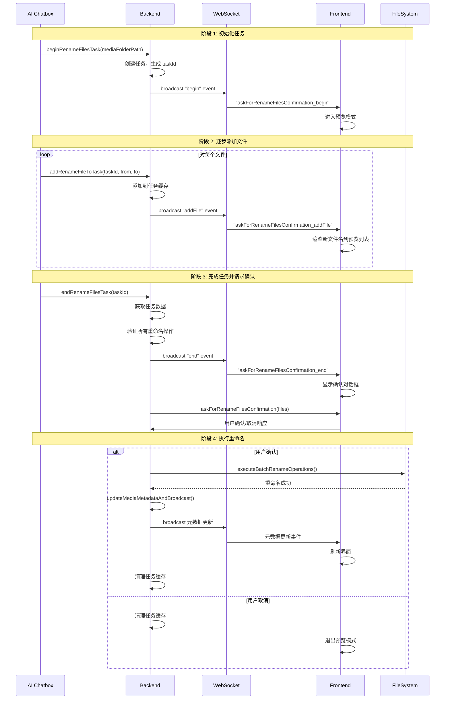

# AI 重命名文件流程文档

本文档描述了 AI 代理重命名文件的完整流程，包括 AI Chatbox、后端服务、Socket 通道和前端界面之间的交互。

## 概述

AI 重命名文件流程采用任务模式，允许 AI 逐步推断文件名，并在所有文件推断完成后统一请求用户确认。这种设计提供了更好的用户体验，用户可以实时预览重命名结果，并在最后统一确认或取消。

## 流程说明

### 阶段 1: 初始化任务

1. **AI Chatbox** 调用 `beginRenameFilesTask` 工具，传入媒体文件夹路径
2. **Backend** 创建重命名任务，生成唯一任务 ID，并将任务存储在缓存中
3. **Backend** 通过 Socket 广播 `askForRenameFilesConfirmation_begin` 事件，包含媒体文件夹路径
4. **Frontend** 接收到 `begin` 事件后，进入预览模式，准备显示重命名列表

### 阶段 2: 逐步添加文件

对于每个需要重命名的文件：

1. **AI Chatbox** 推断新文件名，调用 `addRenameFileToTask` 工具，传入任务 ID、原文件路径和新文件路径
2. **Backend** 将重命名操作添加到任务缓存中
3. **Backend** 通过 Socket 广播 `askForRenameFilesConfirmation_addFile` 事件，包含文件的原路径和新路径
4. **Frontend** 接收到 `addFile` 事件后，实时渲染新文件名到预览列表中

此过程会重复执行，直到所有文件都被处理。

### 阶段 3: 完成任务并请求确认

1. **AI Chatbox** 调用 `endRenameFilesTask` 工具，传入任务 ID
2. **Backend** 执行以下操作：
   - 从缓存中获取任务数据
   - 验证所有重命名操作（检查文件是否存在、路径是否有效、是否有冲突等）
   - 通过 Socket 广播 `askForRenameFilesConfirmation_end` 事件
   - 调用 `askForRenameFilesConfirmation` 函数，等待用户确认
3. **Frontend** 接收到 `end` 事件后，显示确认对话框，列出所有重命名操作
4. **Frontend** 用户点击确认或取消按钮
5. **Frontend** 通过 Socket 发送确认响应（`confirmed: true/false`）

### 阶段 4: 执行重命名

如果用户确认：

1. **Backend** 接收到确认响应后：
   - 执行批量重命名操作（调用 `executeBatchRenameOperations`）
   - 更新媒体元数据（调用 `updateMediaMetadataAndBroadcast`）
   - 清理任务缓存
   - 通过 Socket 广播元数据更新事件
2. **Frontend** 接收到元数据更新后，刷新界面显示新的文件名

如果用户取消：

1. **Backend** 接收到取消响应后，清理任务缓存，不执行任何重命名操作
2. **Frontend** 退出预览模式

## 流程图

## 关键组件

### Backend 工具

- **`beginRenameFilesTask`**: 创建新的重命名任务
- **`addRenameFileToTask`**: 向任务中添加单个文件重命名操作
- **`endRenameFilesTask`**: 完成任务，验证并执行所有重命名操作

### Socket 事件

- **`askForRenameFilesConfirmation_begin`**: 任务开始，包含媒体文件夹路径
- **`askForRenameFilesConfirmation_addFile`**: 添加文件，包含原路径和新路径
- **`askForRenameFilesConfirmation_end`**: 任务结束，准备请求确认
- **`askForRenameFilesConfirmation`**: 请求用户确认，包含所有文件列表

### 验证规则

在 `endRenameFilesTask` 阶段，系统会执行以下验证：

1. 检查源文件是否存在
2. 检查目标文件是否已存在
3. 验证路径是否在媒体文件夹内
4. 检查是否有重复的源文件或目标文件
5. 检查是否有链式冲突（A->B, B->C）
6. 检查路径格式是否正常

## 错误处理

- 如果验证失败，返回错误信息，不执行重命名
- 如果用户取消，清理任务缓存，不执行任何操作
- 如果重命名执行失败，记录错误日志，更新部分成功的文件元数据

## 相关文件

- `cli/src/tools/renameFilesTool.ts`: 任务管理核心逻辑
- `cli/src/tools/renameFilesTask.ts`: AI 工具定义
- `cli/src/tools/renameFilesInBatch.ts`: 批量重命名工具（替代方案）
- `cli/src/events/askForRenameFilesConfirmation.ts`: 确认事件处理
- `core/event-types.ts`: 事件类型定义

TODO: user cancel the task in the middle
TODO; user cancel the task after end
TODO: lost connection should reject tool call to AI