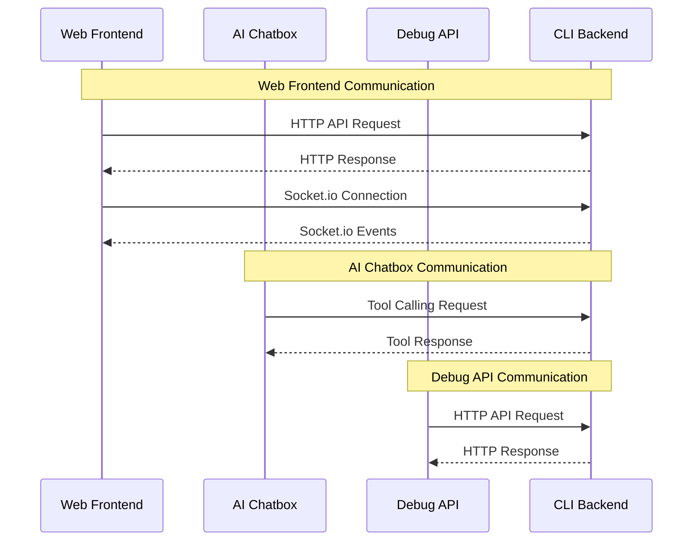

# Development Guideline

## Folder Structure

* core - The common and share code. The code in this module MUST be available in both frontend(browser) and backend(Bun.js and Node.js) side.
* ui - The HTML frontend
* electron - The electron application, which use the dist files from `ui`
* cli - The server side app

## UI

The HTML frontend application, uses Shadcn + Tailwind CSS.
The `ui` module bulid distribution for both Electron and Web UI.

## Electron
The `electron` module wrap HTML files into Electron application. And implement the platform specific logic.

## CLI

The `cli` module serves HTML as web UI and Implement the platform specific logic.
`cli` is a Bun application written in TypeScipt, and will be build into executable for different OS and arch.

### Folder Structure in CLI module

* **`src/route`** The API Routes / API handlers
* **`src/tools`** The tools for AI Agent tool calling
* **`src/utils`** The utility code

## Unit Test

This is the unit test guideline for AI Agent.

Following the red-green principle, you need to ensure the unit test is actually work by:

1. Comment out part of production code
2. Run unit test
3. Verify the unit test fail with expected error reason
4. Uncomment the production code which commented out in step 1

Repeat above step to ensure all assertions are actual working.


## Key Concepts

**Media Metadata** The metadata of media folder, contains the TMDB TV Show or Movie data, and the linkage between local video files to TV Show episode.

**User Config** The config changable for user

**App Config** The config used by SMM

## Architecture

SMM contains 3 frontends(web, AI chatbox, debug API)

web connects to backend(cli module) via HTTP API and socket.io API

AI chatbox connects to backend via tool calling

Debug API connects to backend via HTTP API

### Architecture Diagram




### Web UI Architecture

**Menu** The application menu
**Sidebar** show the list of media folder, and search box and toolbar(sorting or filtering)
**Content** show the TV Show/Movie/Music content of media folder
**AI Chatbox** the AI chatbox
**Status Bar** show application status
**Config Dialog** the user config dialog


### AI Chatbox Tool Calling

```
   ChatTask 
-> backend: askForConfirmation
-> backend: sendAndWaitForResponse
-> backend: socket.emit()
-> ui: App.tsx:WebSocketHandlers
-> ui: useWebSocketEvent
```
          


## Docker

```bash

docker buildx build --progress=plain --no-cache --platform linux/amd64,linux/arm64 -t lawrenceching/smm:latest .


docker buildx build --progress=plain --no-cache --platform linux/amd64 -t lawrenceching/smm:latest .

docker run -it --rm -p 30000:30000 lawrenceching/smm:latest
```