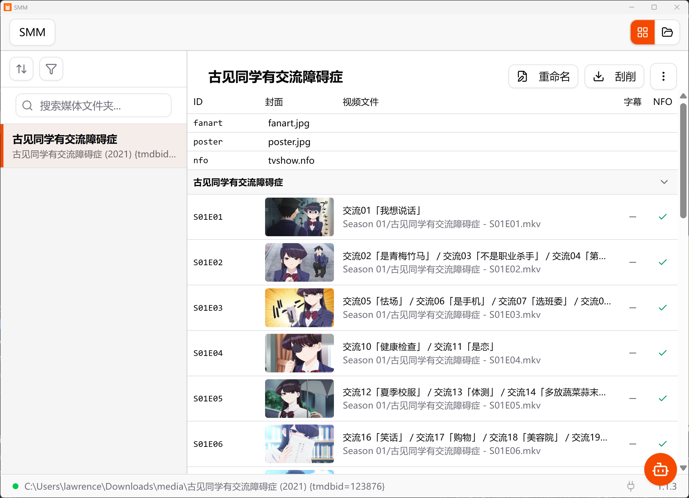

# Simple Media Manager

Simple Media Manger(SMM) 一款简单的多媒体管理、重命名和刮削工具。内建AI助手，支持 MCP Server。

支持 Windows, macOS 和 Linux。

[下载](https://gitcode.com/lawrenceching/simple-media-manager/releases/)

## Features

* Rename Files in Plex/Jellyfin/Emby(or more) naming convention
* Scrape poster, fanart, nfo
* Download Video from Youtube or Bilibili
* Video Format Converter
* Edit Tag
* Build-in AI Assistant
* MCP Server
