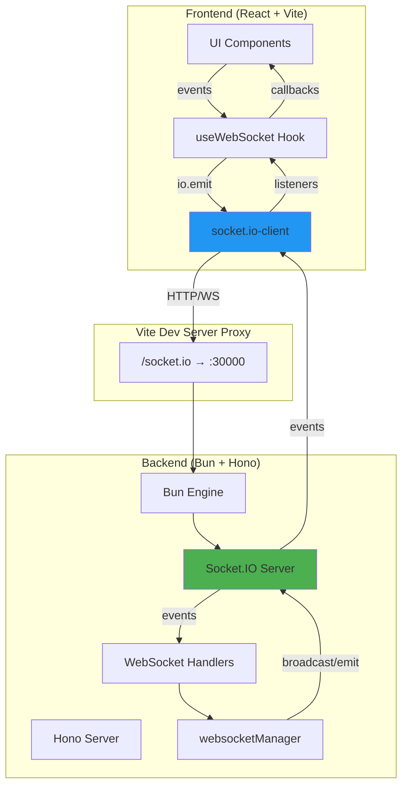
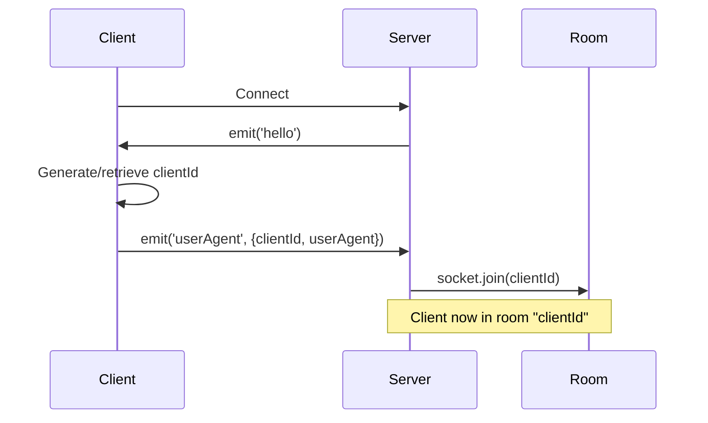
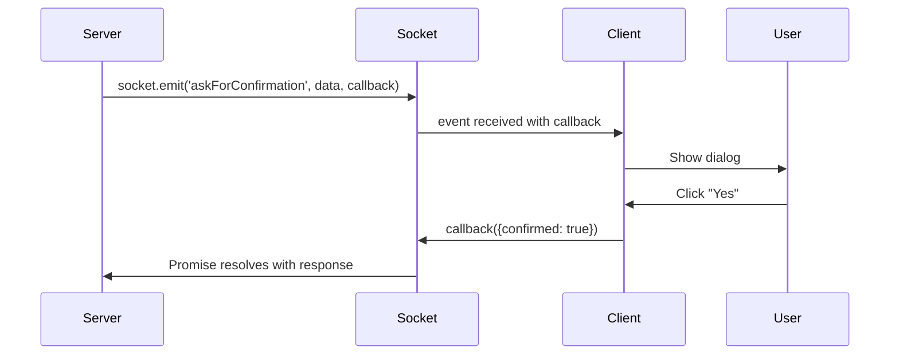

# Client-Server Communication with Socket.IO

## Overview

This project uses **Socket.IO** for real-time bidirectional communication between the frontend (React/Vite) and backend (Bun/Hono). Socket.IO provides automatic reconnection, event-based messaging, acknowledgements, and room-based client management.

### Why Socket.IO?

- **Event-based messaging**: Clean, semantic event names instead of manual JSON parsing
- **Built-in acknowledgements**: Native request/response pattern without manual requestId tracking
- **Automatic reconnection**: Client reconnects automatically on connection loss
- **Room support**: Easy multi-client management using clientId as room names
- **Transport flexibility**: Automatic fallback from WebSocket to HTTP long-polling

## Architecture



## Connection Flow

### 1. Client Initialization

**File**: `ui/src/hooks/useWebSocket.ts`

```typescript
const socket = io('http://localhost:5173', {
  reconnection: true,
  reconnectionDelay: 3000,
  reconnectionAttempts: 5,
  transports: ['websocket', 'polling'],
  path: '/socket.io/',
  autoConnect: true,
});
```

**Key Points:**
- Client connects to Vite dev server (port 5173)
- Vite proxy forwards `/socket.io/` to backend (port 30000)
- Tries WebSocket first, falls back to polling if needed
- Auto-reconnects on disconnection

### 2. Server Initialization

**File**: `cli/server.ts`

```typescript
// Initialize Socket.IO with Bun Engine
this.engine = new Engine({
  cors: {
    origin: "*",
    methods: ["GET", "POST"],
    credentials: true
  }
});

this.io = new SocketIOServer({
  cors: {
    origin: "*",
    methods: ["GET", "POST"]
  }
});

this.io.bind(this.engine);
```

**Key Points:**
- Uses `@socket.io/bun-engine` for Bun runtime compatibility
- CORS enabled for development (restrict in production)
- Binds Socket.IO to Bun engine for WebSocket handling

### 3. Connection Handshake

**File**: `cli/src/route/WebSocket.ts`

```typescript
io.on('connection', (socket: Socket) => {
  // 1. Send hello event to client
  socket.emit('hello');
  
  // 2. Wait for userAgent response with clientId
  socket.on('userAgent', (data: any) => {
    const clientId = data?.clientId;
    
    // 3. Join client to room using their clientId
    if (clientId) {
      socket.join(clientId);
      // Now we can target this specific client by clientId
    }
  });
});
```

**Sequence Diagram:**



## Client Management with Rooms

### What are Rooms?

Rooms are server-side groups that sockets can join. We use the `clientId` as the room name to target specific clients.

### ClientId Generation

**File**: `ui/src/hooks/useWebSocket.ts`

```typescript
export function getOrCreateClientId(): string {
  const key = 'clientId';
  try {
    const existing = localStorage.getItem(key);
    if (existing && existing.trim().length > 0) {
      return existing;
    }
    const created = crypto.randomUUID();
    localStorage.setItem(key, created);
    return created;
  } catch {
    return crypto.randomUUID();
  }
}
```

**Key Points:**
- Persisted in localStorage for consistency across page reloads
- Each browser tab/window gets a unique clientId
- Used as room name for targeted messaging

### Targeting Specific Clients

**File**: `cli/src/utils/websocketManager.ts`

```typescript
// Find socket in room
const socketsInRoom = io.sockets.adapter.rooms.get(clientId);
const socketId = Array.from(socketsInRoom)[0];
const socket = io.sockets.sockets.get(socketId);

// Send to specific socket
socket.emit(event, data);
```

**Important:** When using acknowledgements, always emit to the specific `socket`, not to the room with `io.to(room)`, because room emits expect acknowledgements from ALL sockets in the room.

## Communication Patterns

### Pattern 1: Broadcasting (One-way, No Response)

Use case: Notify all clients about server-side changes

**Server** (`cli/src/utils/websocketManager.ts`):
```typescript
export function broadcastMessage(message: WebSocketMessage): void {
  io.emit(message.event, message.data);
}
```

**Client** (`ui/src/App.tsx`):
```typescript
useWebSocketEvent((message) => {
  if (message.event === "mediaMetadataUpdated") {
    refreshMediaMetadata(message.data.folderPath);
  }
});
```

**Example:**
```bash
curl -X POST http://localhost:30000/debug \
  -H "Content-Type: application/json" \
  -d '{
    "name": "broadcastMessage",
    "event": "mediaMetadataUpdated",
    "data": {"folderPath": "/path/to/media"}
  }'
```

### Pattern 2: Request-Response with Acknowledgements

Use case: Ask user for input and wait for response

**Server** (`cli/src/tools/askForConfirmation.ts`):
```typescript
const responseData = await sendAndWaitForResponse(
  {
    event: 'askForConfirmation',
    data: { message: 'Continue?' },
  },
  '', // responseEvent not needed with acknowledgements
  30000, // 30 second timeout
  clientId
);

const confirmed = responseData?.confirmed;
```

**Client** (`ui/src/App.tsx`):
```typescript
useWebSocketEvent((message) => {
  if (message.event === "askForConfirmation") {
    // Show dialog to user
    openConfirmation({
      title: "Confirmation",
      description: message.data.message,
      content: (
        <div>
          <Button onClick={() => {
            // Send acknowledgement back
            sendAcknowledgement(message, {
              confirmed: true,
              response: "yes"
            });
          }}>Yes</Button>
        </div>
      )
    });
  }
});
```

**How Acknowledgements Work:**

1. Server emits event with a callback parameter
2. Client receives event with callback attached as `_socketCallback`
3. Client calls `sendAcknowledgement(message, response)` which invokes the callback
4. Server's Promise resolves with the response data

**Sequence Diagram:**



## File Structure

### Backend Files

```
cli/
├── server.ts                           # Server initialization, Socket.IO setup
├── src/
│   ├── route/
│   │   ├── WebSocket.ts               # Connection handlers, room management
│   │   └── Debug.ts                   # Debug API endpoints
│   ├── utils/
│   │   └── websocketManager.ts        # Core Socket.IO utilities
│   └── tools/
│       └── askForConfirmation.ts      # Example tool using acknowledgements
```

### Frontend Files

```
ui/
├── vite.config.ts                     # Proxy configuration
├── src/
│   ├── hooks/
│   │   └── useWebSocket.ts           # Socket.IO client hook
│   └── App.tsx                        # Event handlers
```

## API Reference

### Server Functions

#### `setSocketIOInstance(io: SocketIOServer)`
Store the Socket.IO server instance for use by other modules.

#### `broadcastMessage(message: WebSocketMessage)`
Broadcast event to all connected clients (no acknowledgement).

**Parameters:**
- `message.event`: Event name
- `message.data`: Event payload

#### `sendAndWaitForResponse(message, responseEvent, timeoutMs, clientId?)`
Send event to specific client and wait for acknowledgement.

**Parameters:**
- `message`: WebSocketMessage with event and data
- `responseEvent`: (unused, kept for compatibility)
- `timeoutMs`: Timeout in milliseconds (default: 5000)
- `clientId`: Target client room (optional, uses first connection if not provided)

**Returns:** Promise that resolves with acknowledgement data

### Client Functions

#### `useWebSocket(): UseWebSocketReturn`
React hook to establish and manage Socket.IO connection.

**Returns:**
- `status`: Connection status ('connecting' | 'connected' | 'disconnected' | 'error')
- `connect()`: Manually connect
- `disconnect()`: Manually disconnect
- `send(message)`: Send event to server

#### `useWebSocketEvent(handler: (message) => void)`
React hook to register event listener for all Socket.IO events.

#### `sendAcknowledgement(message, response)`
Send acknowledgement response for events that expect one.

**Parameters:**
- `message`: The original message object (contains callback)
- `response`: Response data to send back

## Development Setup

### 1. Install Dependencies

**Backend:**
```bash
cd cli
bun add socket.io @socket.io/bun-engine
```

**Frontend:**
```bash
cd ui
npm install socket.io-client
```

### 2. Configure Vite Proxy

**File**: `ui/vite.config.ts`

```typescript
server: {
  proxy: {
    '/socket.io': {
      target: 'http://localhost:30000',
      ws: true,
      changeOrigin: true,
    },
  },
}
```

### 3. Start Servers

**Backend** (port 30000):
```bash
cd cli
bun run dev
```

**Frontend** (port 5173):
```bash
cd ui
npm run dev
```

## Debugging

### Enable Debug Logs

All Socket.IO operations include `[DEBUG]` tags for easy filtering.

**Backend logs** (stdout):
```
[DEBUG] socket.io connection established
[DEBUG] socket.io client joined room
[DEBUG] socket.io sending message to specific socket with acknowledgement
[DEBUG] socket.io acknowledgement received successfully
```

**Browser logs** (DevTools console):
```javascript
[Socket.IO][DEBUG] Received event: askForConfirmation
[Socket.IO][DEBUG] Callback attached to message
[Socket.IO][DEBUG] Calling callback with response
[Socket.IO][DEBUG] Acknowledgement sent successfully
```

### Common Issues

#### Issue: "No active Socket.IO connections available"
**Cause:** Client hasn't connected or disconnected
**Solution:** Check browser console for connection errors, verify Vite proxy configuration

#### Issue: "Socket.IO request timed out"
**Cause:** Client didn't send acknowledgement, or acknowledgement callback not properly attached
**Solution:** Check that `sendAcknowledgement()` is called with correct message object

#### Issue: "WebSocket is closed before the connection is established"
**Cause:** CORS or proxy misconfiguration
**Solution:** Verify CORS settings in server.ts and proxy in vite.config.ts

#### Issue: Room not found
**Cause:** Client hasn't joined room yet (userAgent event not processed)
**Solution:** Wait for connection to be fully established before sending targeted messages

### Inspect Socket.IO State

**Server side:**
```typescript
// List all connected sockets
console.log('Connected sockets:', Array.from(io.sockets.sockets.keys()));

// List all rooms
console.log('Rooms:', Array.from(io.sockets.adapter.rooms.keys()));

// Get sockets in specific room
const socketsInRoom = io.sockets.adapter.rooms.get(clientId);
console.log('Sockets in room:', socketsInRoom);
```

**Client side:**
```typescript
// Check connection status
console.log('Connected:', socket.connected);

// Check socket ID
console.log('Socket ID:', socket.id);
```

## Testing

### Using Debug API

The Debug API provides HTTP endpoints to trigger Socket.IO events for testing.

**Broadcast test:**
```bash
curl -X POST http://localhost:30000/debug \
  -H "Content-Type: application/json" \
  -d '{
    "name": "broadcastMessage",
    "event": "testEvent",
    "data": {"message": "Hello"}
  }'
```

**Retrieve with acknowledgement:**
```bash
curl -X POST http://localhost:30000/debug \
  -H "Content-Type: application/json" \
  -d '{
    "name": "retrieve",
    "event": "askForConfirmation",
    "data": {"message": "Confirm action?"}
  }'
```

Response:
```json
{
  "success": true,
  "data": {
    "confirmed": true,
    "response": "yes"
  }
}
```

## Best Practices

### 1. Use Semantic Event Names
✅ Good: `mediaMetadataUpdated`, `askForConfirmation`
❌ Bad: `event1`, `msg`, `update`

### 2. Always Handle Disconnections
Socket.IO handles reconnection automatically, but ensure your client-side state doesn't break during reconnection.

### 3. Set Appropriate Timeouts
- Quick operations: 5 seconds
- User input: 30 seconds
- Background tasks: 60+ seconds

### 4. Clean Up Event Listeners
Use `useWebSocketEvent` hook which automatically cleans up on unmount.

### 5. Target Specific Sockets for Acknowledgements
Always emit to the specific `socket` object, not to rooms, when expecting acknowledgements.

```typescript
// ✅ Correct
socket.emit(event, data, callback);

// ❌ Wrong (acknowledgement won't work properly)
io.to(room).emit(event, data, callback);
```

### 6. Validate Data on Both Sides
Always validate incoming event data with schemas (e.g., Zod) to prevent runtime errors.

## Production Considerations

### 1. Restrict CORS
```typescript
cors: {
  origin: process.env.ALLOWED_ORIGINS?.split(',') || [],
  methods: ["GET", "POST"],
  credentials: true
}
```

### 2. Use Redis Adapter for Horizontal Scaling
If running multiple server instances:
```typescript
import { createAdapter } from "@socket.io/redis-adapter";
io.adapter(createAdapter(pubClient, subClient));
```

### 3. Monitor Connections
Track active connections, rooms, and message rates for performance monitoring.

### 4. Implement Authentication
Add middleware to verify client identity:
```typescript
io.use((socket, next) => {
  const token = socket.handshake.auth.token;
  if (isValidToken(token)) {
    next();
  } else {
    next(new Error('Authentication failed'));
  }
});
```

## Further Reading

- [Socket.IO Documentation](https://socket.io/docs/v4/)
- [Socket.IO with Hono & Bun](https://socket.io/docs/v4/server-initialization/#with-hono--bun)
- [Emitting Events](https://socket.io/docs/v4/emitting-events/)
- [Rooms](https://socket.io/docs/v4/rooms/)
- [Acknowledgements](https://socket.io/docs/v4/emitting-events/#acknowledgements)

