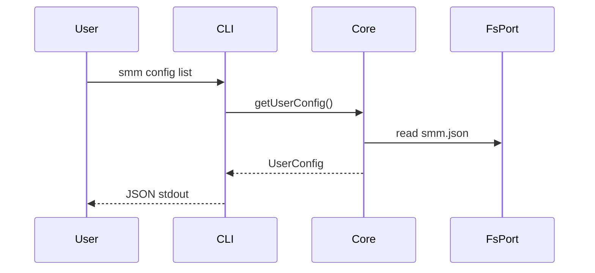
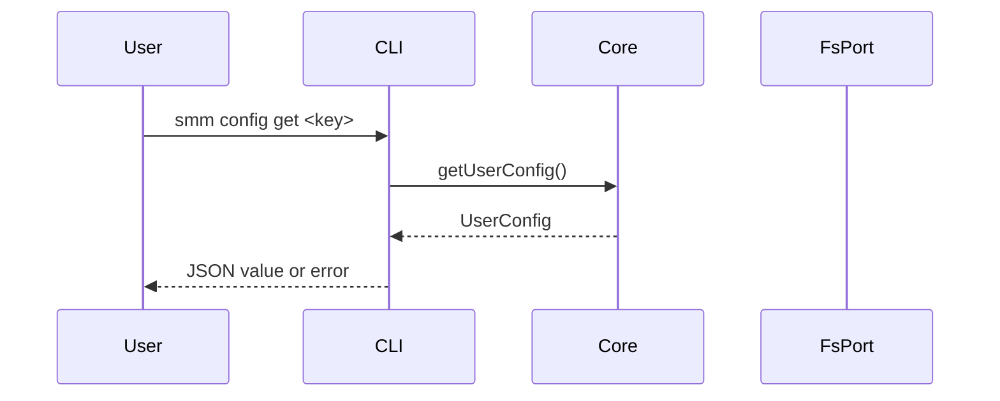
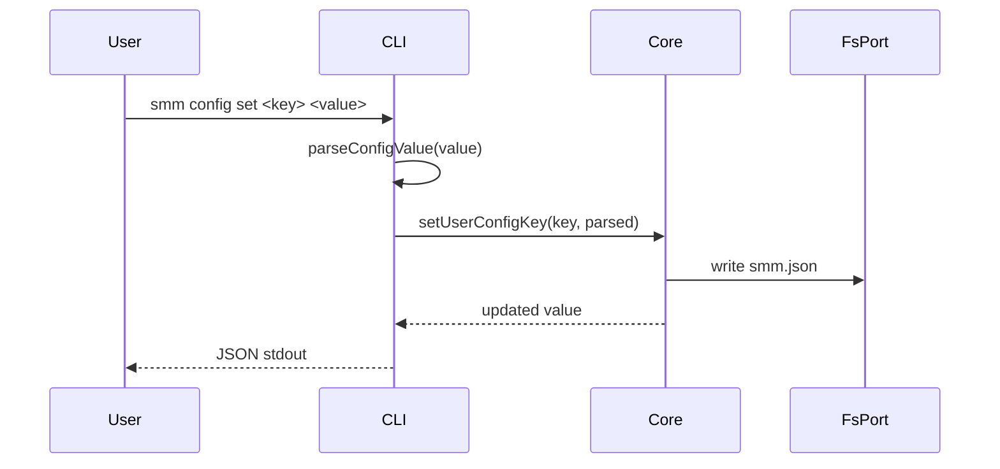
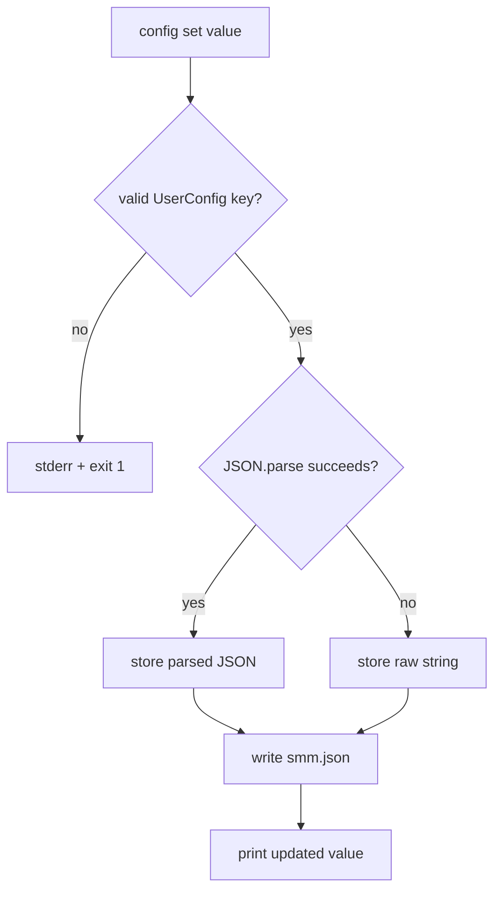
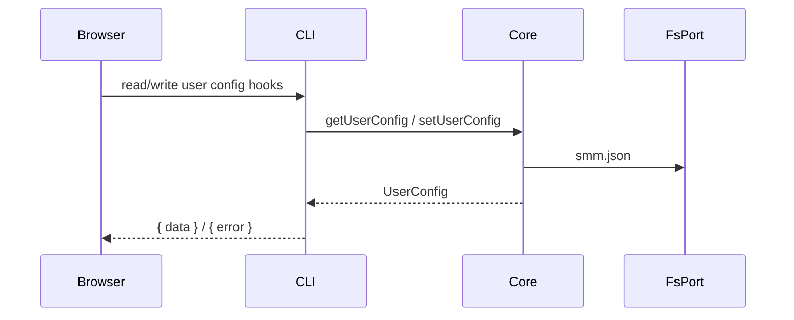

# Config

**Supported Platform** Web UI, CLI, Electron, ohos
**Status** done

## CLI

```
smm config list
smm config get <key>
smm config set <key> <value>
```









## Web UI, Electron and ohos



## References

[Supported Platform](./supported-platform.md)
