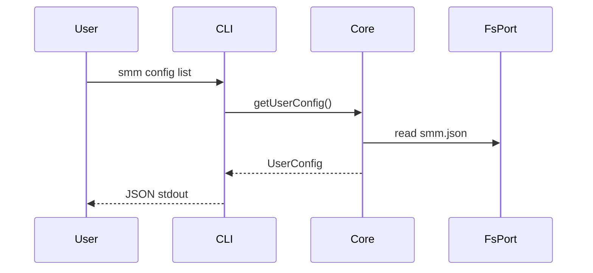
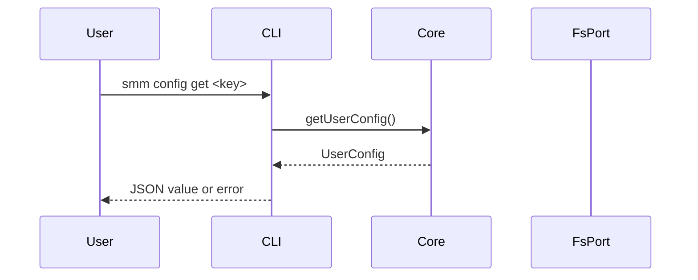
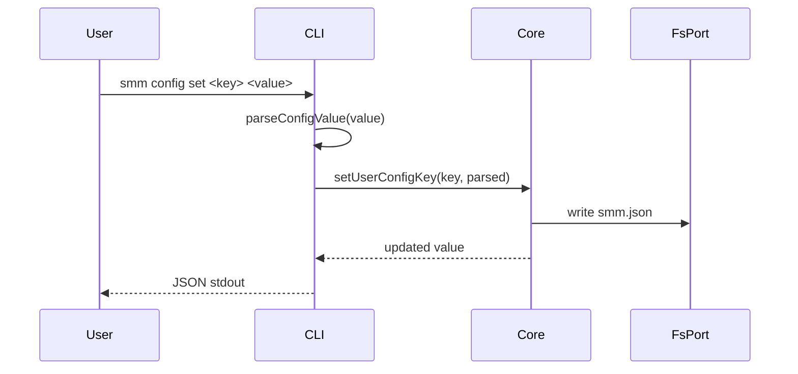
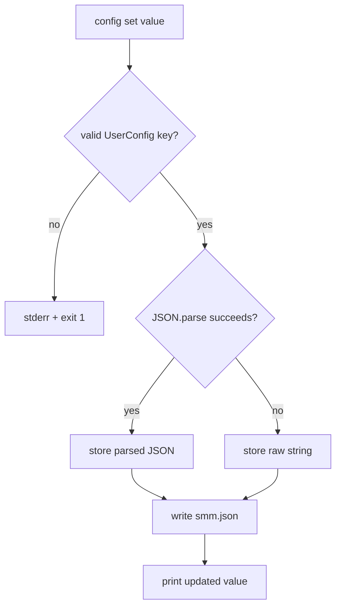
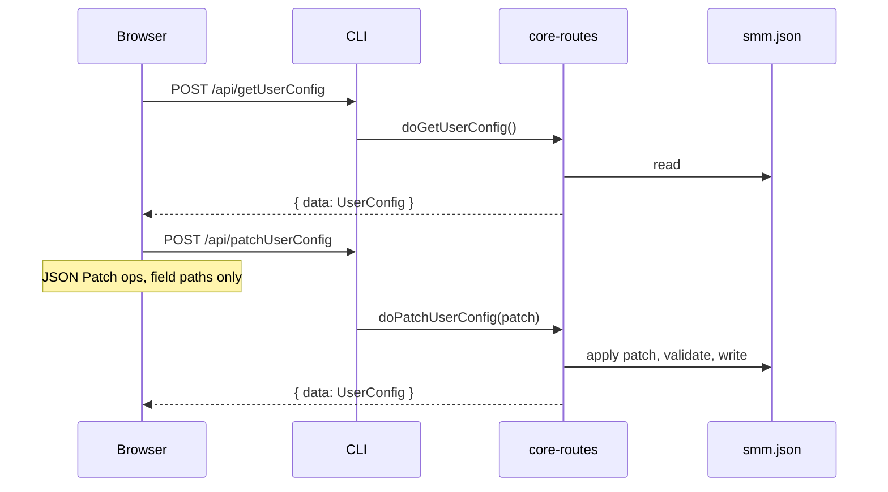

# Config

**Supported Platform** Web UI, CLI, Electron, ohos
**Status** done

## CLI

```
smm config list
smm config get <key>
smm config set <key> <value>
```









## Web UI, Electron and ohos



`readFile` and `writeFile` reject `smm.json`. User config is only read through `POST /api/getUserConfig` and updated through `POST /api/patchUserConfig` (RFC 6902 `add`, `remove`, `replace` on known fields). HarmonyOS uses the same handlers on the core-routes HTTP server.

## References

[Supported Platform](./supported-platform.md)
