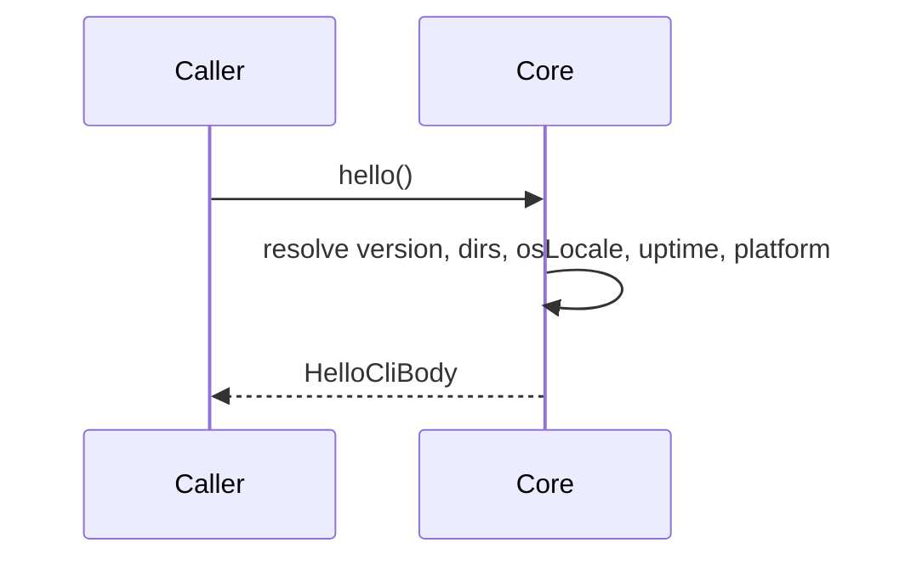
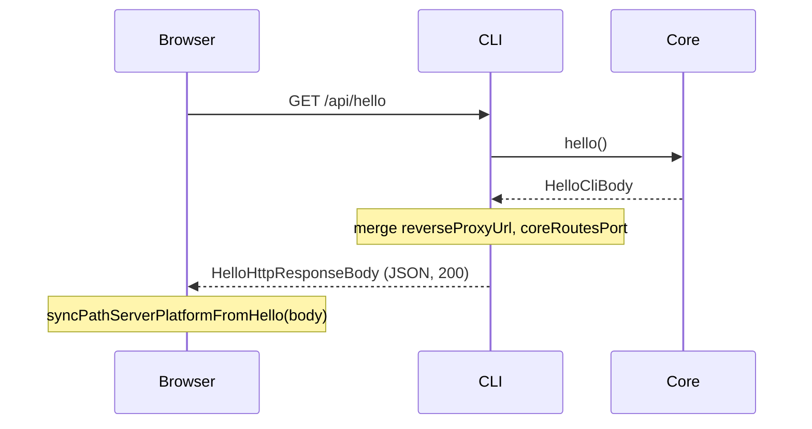
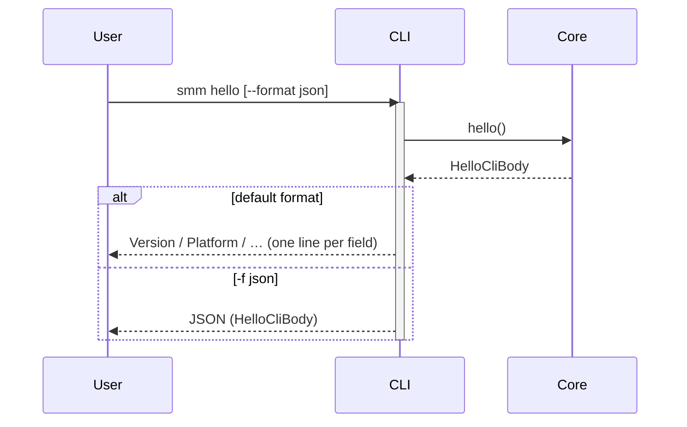

# Hello

**Supported Platform** Web UI, CLI, Electron, ohos
**Status** wip

## Overview

`hello` is the application bootstrap handshake. Callers use it to discover runtime environment: version, platform, data directories, uptime, and (for HTTP clients) reverse-proxy / core-routes endpoints.

| Surface | Entry | Output |
|---------|-------|--------|
| Web UI / Electron / ohos | `GET /api/hello` | `HelloHttpResponseBody` (JSON) |
| CLI | `smm hello` | Human-readable lines (default) or JSON (`-f json`) |

CLI output omits `reverseProxyUrl` and `coreRoutesPort` — those fields only matter when a long-running HTTP server is up.

## apps/core

Layer 2 entry point shared by CLI and HTTP adapters:

| Method | Role |
|--------|------|
| `hello()` | Return bootstrap info: `uptime`, `version`, `platform`, `userDataDir`, `appDataDir`, `tmpDir`, `logDir`, `osLocale` |

Implementation notes:

- `uptime` — `process.uptime()` (seconds)
- `version` — app version from build metadata
- `platform` — `process.platform` (`win32`, `linux`, `darwin`, …)
- `*Dir` — resolved via platform-specific config helpers (same paths as today’s `buildHelloOptions`)
- `osLocale` — OS locale detected by CLI process (e.g. `en-US`, `zh-CN`)



### Types

```typescript
/** Shared bootstrap payload — CLI and HTTP base. */
interface HelloCliBody {
  uptime: number
  version: string
  platform: string
  userDataDir: string
  appDataDir: string
  tmpDir: string
  logDir: string
  osLocale: string
}

/** HTTP-only extensions for browser / embedded UI. */
interface HelloHttpResponseBody extends HelloCliBody {
  reverseProxyUrl: string | null
  coreRoutesPort: number
  error?: string
}
```

`HelloHttpResponseBody` replaces the current monolithic `HelloResponseBody` in `@core/types`. HTTP handlers merge server-specific fields on top of `Core.hello()`.

## Web UI, Electron and ohos

Web UI talks to Core via Internal HTTP (`apps/cli`). Electron and ohos reuse the same UI bundle.

Bootstrap runs once at app start (TanStack Query `helloQueryKey`). The UI binds `Path` helpers to `platform`, reads `userDataDir` for config I/O, and uses `reverseProxyUrl` / `coreRoutesPort` for proxied metadata requests and core-routes calls.



HTTP contract:

- **Method** `GET` (no request body)
- **Response** `200` + JSON `HelloHttpResponseBody`
- **Auth** Bearer token when CLI auth is enabled (same as other `/api/*` routes)
- `reverseProxyUrl` is `null` when the local reverse proxy failed to start
- `coreRoutesPort` is the port of the core-routes Node `http` server (used when UI origin is the Hono/Bun CLI port, not core-routes directly)

Electron main process and ohos embed the same HTTP stack (`apps/core` + `packages/core-routes`); the UI path is identical.

## CLI

```
smm hello [-f json | --format json]
```

| Option | Description |
|--------|-------------|
| `-f, --format <fmt>` | Output format. Default: human-readable lines. `json`: pretty-printed JSON. |

Default (line) output — one field per line, aligned with other `smm` commands (`show`, `metadata`):

```
Version: 1.3.8
Platform: win32
Uptime: 42.5s
User data dir: C:\Users\lawrence\AppData\Roaming\SMM
App data dir: C:\Users\lawrence\AppData\Local\SMM
Tmp dir: C:\Users\lawrence\AppData\Local\Temp\SMM
Log dir: C:\Users\lawrence\AppData\Local\SMM\logs
OS locale: zh-CN
```

`-f json` prints `HelloCliBody` (no `reverseProxyUrl`, no `coreRoutesPort`):

```json
{
  "uptime": 42.5,
  "version": "1.3.8",
  "platform": "win32",
  "userDataDir": "C:\\Users\\lawrence\\AppData\\Roaming\\SMM",
  "appDataDir": "C:\\Users\\lawrence\\AppData\\Local\\SMM",
  "tmpDir": "C:\\Users\\lawrence\\AppData\\Local\\Temp\\SMM",
  "logDir": "C:\\Users\\lawrence\\AppData\\Local\\SMM\\logs",
  "osLocale": "zh-CN"
}
```



CLI wiring:

- Register `hello` command in `runCli.ts` (Commander)
- Formatting helper `formatHelloLines(body: HelloCliBody): string[]` in `apps/cli/src/cli/` (mirror `formatShowFolder`)
- `executeHelloTask` / `buildHelloOptions` / `doHello` collapse into `Core.hello()` + thin HTTP/CLI adapters

## Refactor checklist

| Area | Change |
|------|--------|
| `apps/core` | Add `hello()` returning `HelloCliBody` |
| `packages/core/types.ts` | Split `HelloResponseBody` → `HelloCliBody` + `HelloHttpResponseBody` |
| `apps/cli/src/route/execute.ts` | `GET /api/hello` (replace `POST`); merge HTTP-only fields after `Core.hello()` |
| `packages/core-routes` | Route handler accepts `GET /api/hello`; delegate to shared hello builder |
| `apps/ui/src/api/hello.ts` | `GET /api/hello` |
| `apps/cli/src/cli/runCli.ts` | Add `smm hello` with `-f \| --format` |
| CI / e2e readiness | Poll `GET /api/hello` (`ci/wait-for-e2e-ready.ts`, docker wait scripts) |

Deprecate `POST /api/hello` after callers migrate. Remove `name: "hello"` remnants from `/api/execute` docs and tests.

## Test

| Test Case | Platform | Test File |
|--|--|--|
| `GET /api/hello` returns full HTTP body | CLI (route unit) | `apps/cli/src/route/execute.test.ts` |
| `hello()` core unit | Core | `apps/core/src/...` (new) |
| `smm hello` default lines | CLI | `apps/cli/src/cli/hello.test.ts` (new) |
| `smm hello -f json` | CLI | `apps/cli/src/cli/hello.test.ts` (new) |
| UI bootstrap on load | Web UI | existing e2e / startup specs |
| ohos bootstrap | ohos | existing e2e via `--platform ohos` |

## References

[Supported Platform](./supported-platform.md)
