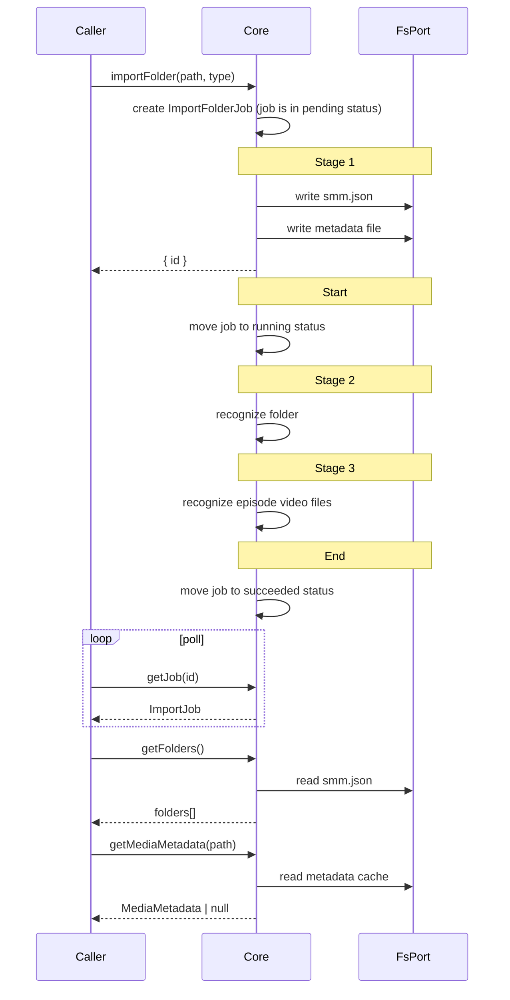
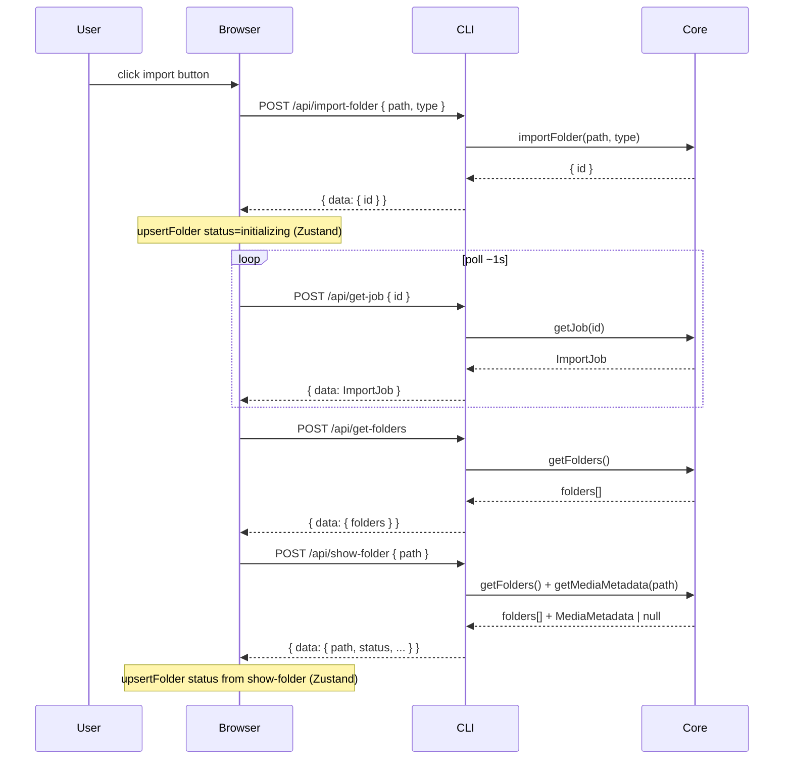
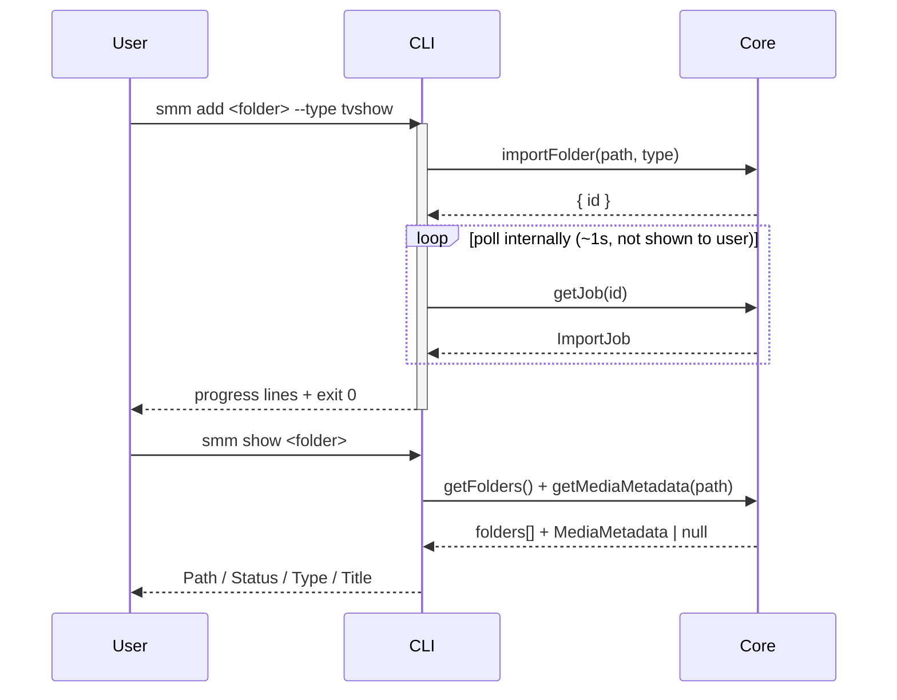

# Import Folder

**Supported Platform** Web UI, CLI, Electron, ohos


When user import a folder, SMM starts the "Folder Initialization" process in below stages:
1. Persist new folder
2. Start to [Recognize Media Folder](../../AGENTS.md#核心术语), see [Recognize Folder Spec](./recognize-folder.md)
3. Start to [Recognize Episode Video File](../../AGENTS.md#核心术语), see [Recognize Episodes Spec](./recognize-episodes.md)


## apps/core



note: `importFolder` interface return when stage 1 completed. Caller(Web UI or CLI) loop to query the job status until job is succeeded, failed, or aborted.

note2: core layer already provides methods to recognize folder and recognize episodes.
`docs/dev/recognize-folder.md` and `docs/dev/recognize-episodes.md` described the process of user-triggered recognition process. The recognition process triggered by initialization share the low level recognition methods with user-triggered recognition process.


## Web UI, Electron and ohos

Web UI talks to Core via Internal HTTP (`apps/cli`). Electron and ohos reuse the same UI bundle.



See [apps/core](#appscore) for pipeline stages and persistence details.

## CLI

```bash
smm add <folder> --type tvshow|movie|music|anime [--verbose] [--skip-init]
smm list
smm show <folder>
smm metadata <folder>
```



See [apps/core](#appscore) for pipeline stages and persistence details.

## Test

See [test cases](./test/import-folder-test.md)

## References

[Supported Platform](./supported-platform.md)
[Job Definition](../../apps/core/src/jobs/types.ts)
