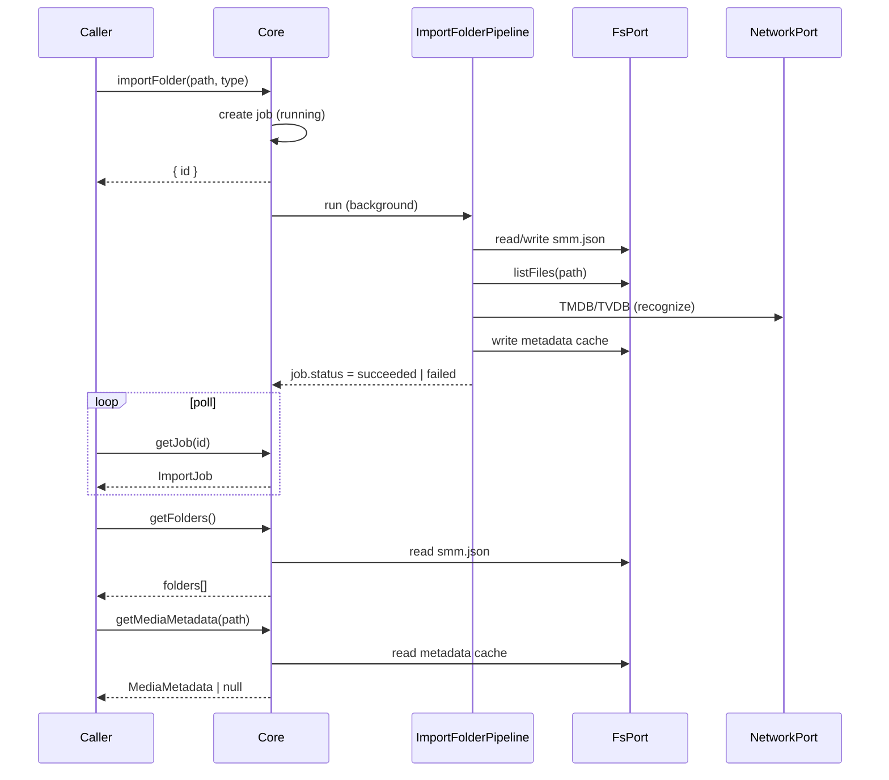
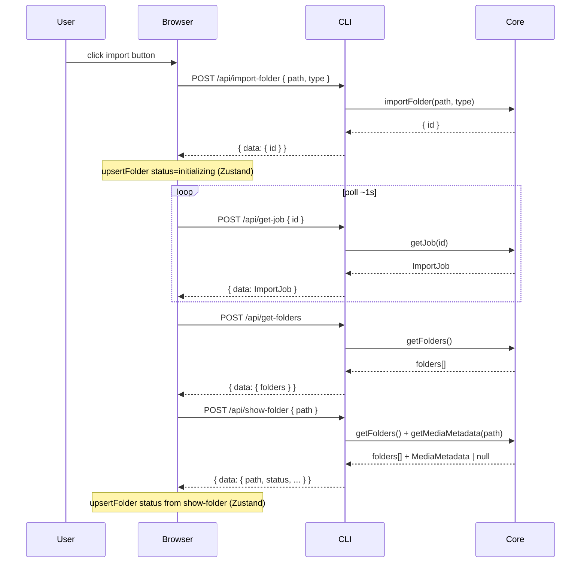
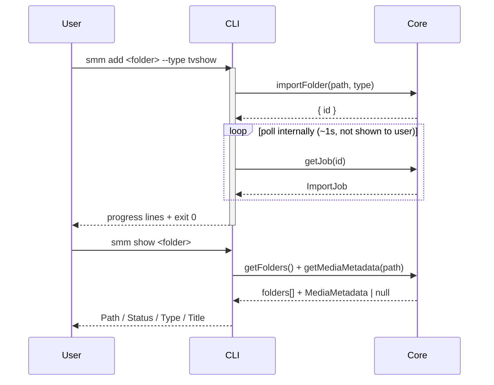

# Import Folder

**Supported Platform** Web UI, CLI, Electron, ohos
**Status** done

## apps/core

Layer 2 entry points used by all frontends:

| Method | Role |
|--------|------|
| `importFolder(path, type, { skipInit? })` | Start import; returns `{ id }` immediately; runs pipeline in background |
| `getJob(id)` | Poll in-memory import job (`status`, `stage`, `progress`, `error`) |
| `getFolders()` | List imported folder paths from `smm.json` |
| `getMediaMetadata(path)` | Read persisted metadata cache; used by `resolveShowFolder` for folder status |

`importFolder` pipeline (`ImportFolderPipeline`):

```
config → metadata → listFiles → recognize → episodes → persist
```

- **config** — add path to `userConfig.folders`, write `smm.json`
- **metadata** — create blank `MediaMetadata` with folder type
- **listFiles** — list directory files via `FsPort`
- **recognize** — tvshow/movie only (NFO → id in folder name → search); music skips
- **episodes** — match video files to episodes (tvshow) or pick first video (movie)
- **persist** — write metadata cache under `<appDataDir>/metadata/`



Folder status values (`ok` | `folder_not_found` | `error_loading_metadata`) are derived in the CLI helper `resolveShowFolder` from `getFolders()`, on-disk path check, and `getMediaMetadata()`.

## Web UI, Electron and ohos

Web UI talks to Core via Internal HTTP (`apps/cli`). Electron and ohos reuse the same UI bundle.



See [apps/core](#appscore) for pipeline stages and persistence details.

## CLI

```bash
smm add <folder> --type tvshow|movie|music|anime [--verbose] [--skip-init]
smm list
smm show <folder>
smm metadata <folder>
```



See [apps/core](#appscore) for pipeline stages and persistence details.

## Test

See [test cases](./test/import-folder-test.md)

## References

[Supported Platform](./supported-platform.md)
