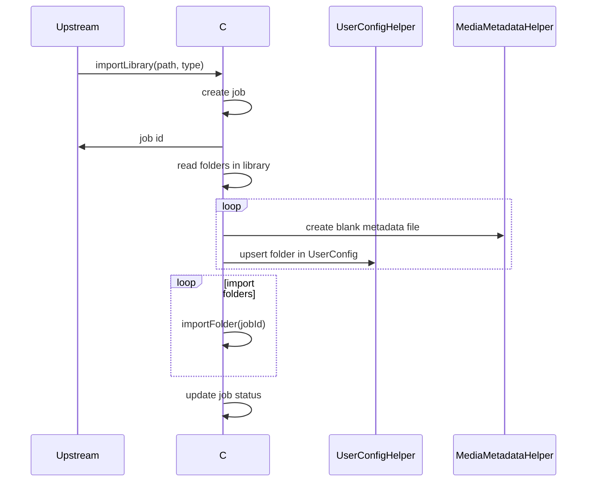
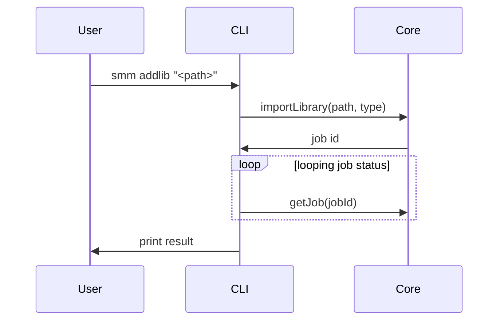
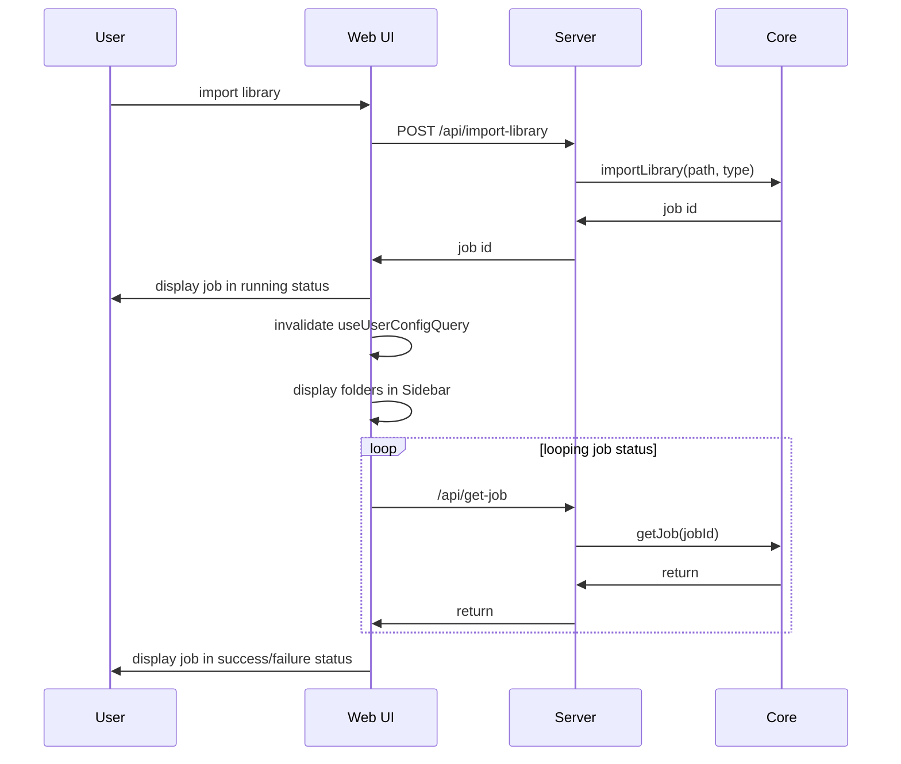

# Import Library

**Supported Platform** Web UI, CLI, Electron, ohos
**Status** wip

## Core

The function of importing library reuses the function of [importing folder](./import-folder.md).



> #1: this loop supports Web UI to render folder list immediately after user import library.
> Web UI first get folder list from user config. And then get folder status from media metadata.
> So we need to create metadata file before upsert folder in UserConfig
> To avoid Web UI find new folder but fail to get its metadata


## CLI

```bash
smm addlib "<path>" --type --type tvshow|movie|music|anime --skip-init
```



## Web UI, Electron and ohos

TODO: There is bug
The folder list was not updated before importFolder job completed.
UI should show all folders at the first step
and then run import job to trigger init process



## Testing 

| Use Case | Platform | File |
|--|--|--|
|UC1|Web UI, Electron, ohos| apps/e2e/common/ImportLibrary.e2e.ts|
|UC1|CLI| apps/e2e/cli/import-library.test.ts|

### UC1: import tvshow/movie/music libraries