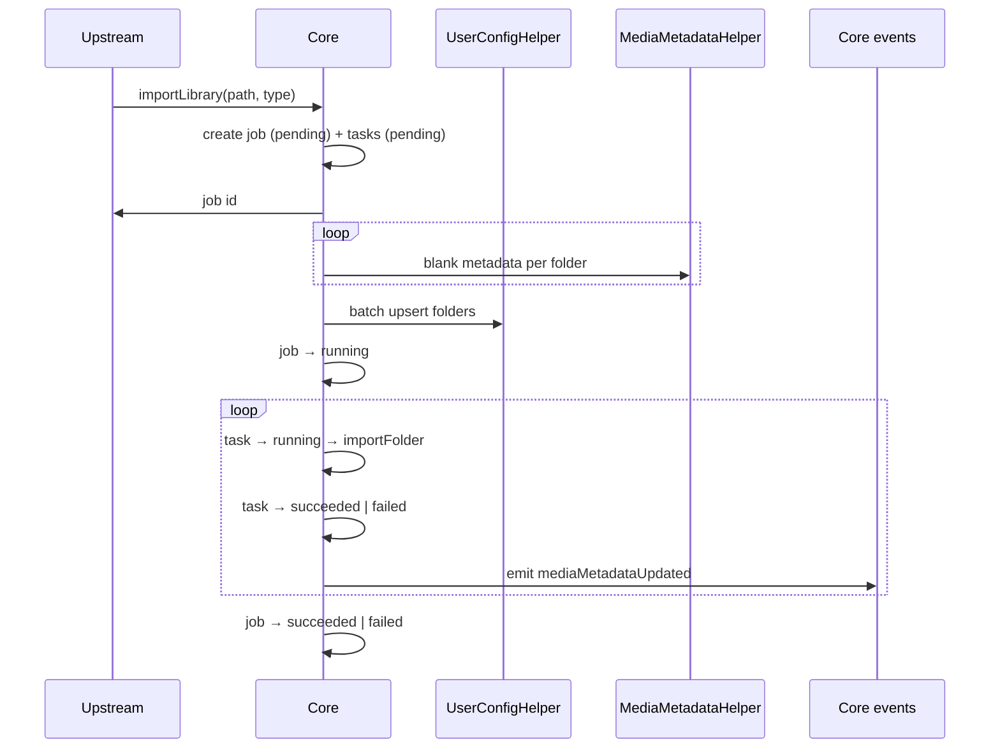
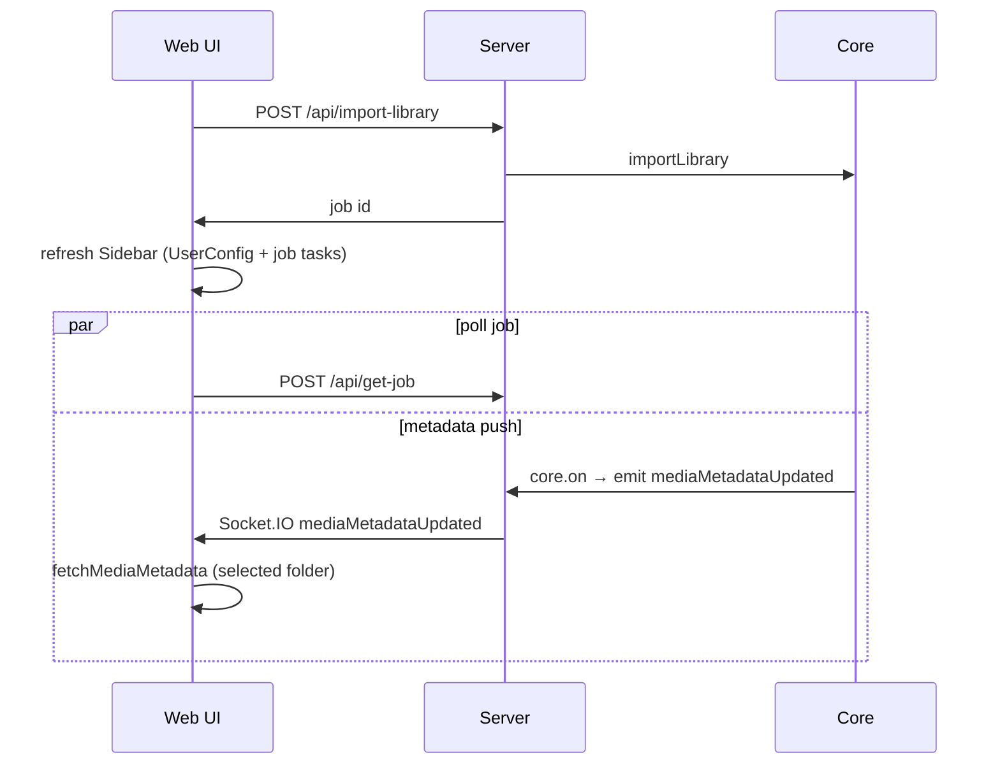

# Import Library

**Supported Platform** Web UI, CLI, Electron, ohos  
**Status** wip

## Core

Reuses [import folder](./import-folder.md). Job shape: [ImportLibraryJob](../../packages/core/job/ImportLibraryJob.ts).



- **Loop #1**: Sidebar can list folders early; blank metadata must exist before UserConfig upsert.
- **Loop #2**: Each `importFolder` persist completion emits `mediaMetadataUpdated` (not Loop #1, not `skipInit` blank writes). Host subscribes via `core.on(...)` and forwards to Socket.IO.

## CLI

```bash
smm addlib "<path>" --type tvshow|movie|music|anime [--skip-init]
```

Poll `getJob(jobId)` until the import-library job settles.

## Web UI, Electron and ohos



- Sidebar status: `ImportLibraryJob.tasks[]` via get-job poll.
- Panel content (TvShowPanel, etc.): existing `MediaMetadataUpdatedEventListener` refetches metadata when the selected folder’s import completes.

## Testing

| Use Case | Platform | File |
|--|--|--|
| UC1 | Web UI, Electron, ohos | `apps/e2e/common/ImportLibrary.e2e.ts` |
| UC1 | CLI | `apps/e2e/cli/import-library.test.ts` |

### UC1: import tvshow/movie/music libraries
