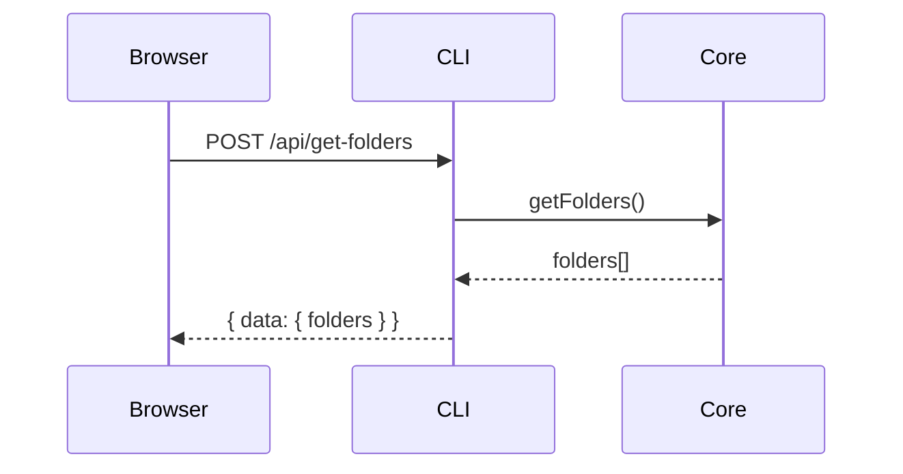
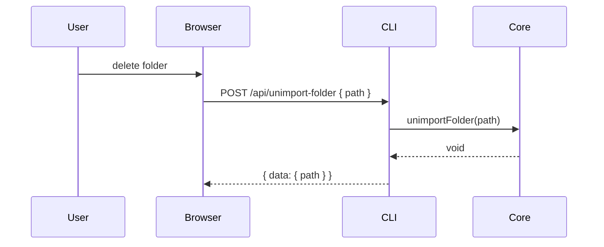
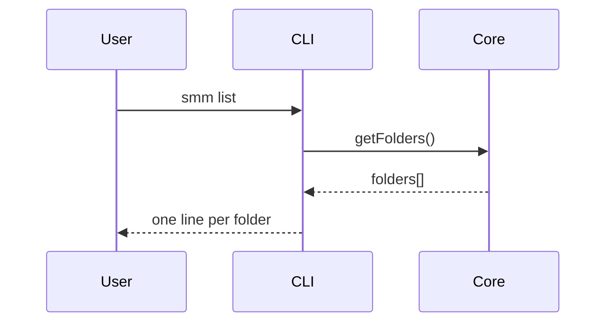
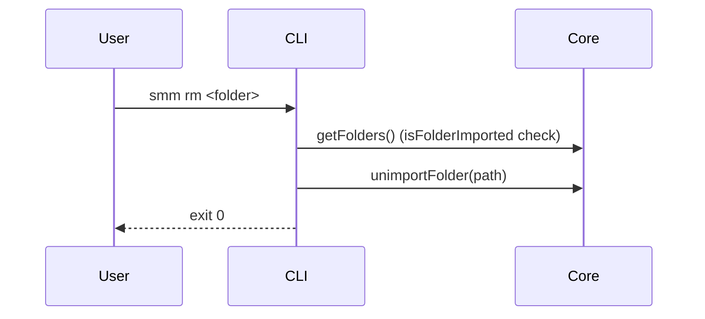

# Manage Folders

**Supported Platform** Web UI, CLI, Electron, ohos
**Status** done

## Import Folder

See [Import Folder](./import-folder.md)

## Web UI, Electron and ohos

### List Folders

### Unimport Folders

## CLI

### List Folders

### Unimport Folders

## References

[Import Folder](./import-folder.md) — full import pipeline (without `--skip-init`)

[Supported Platform](./supported-platform.md)
