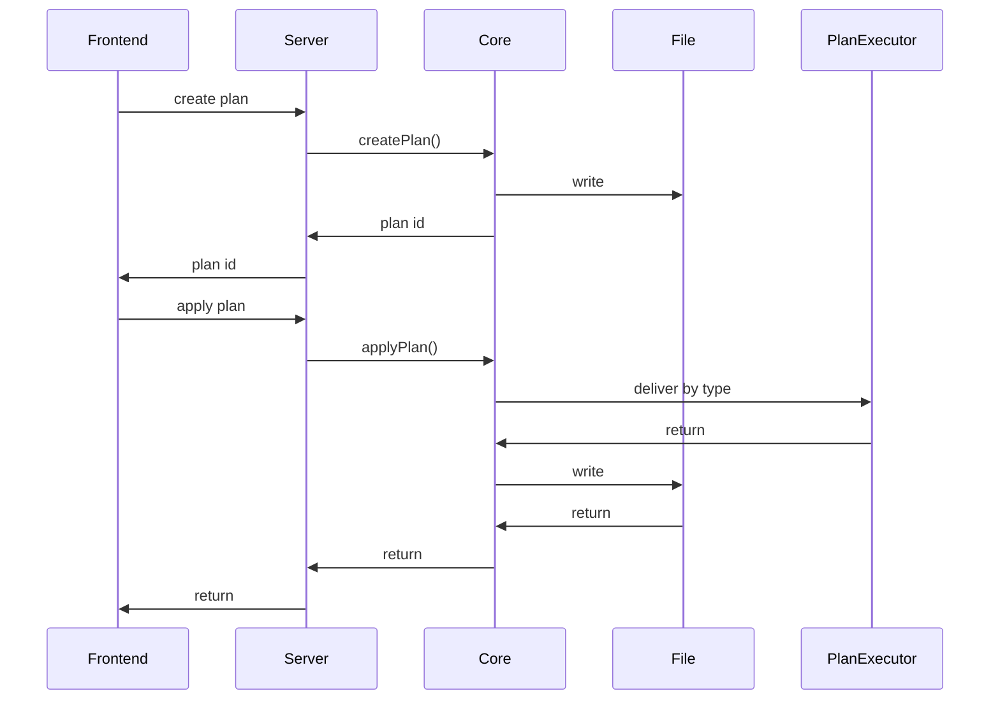
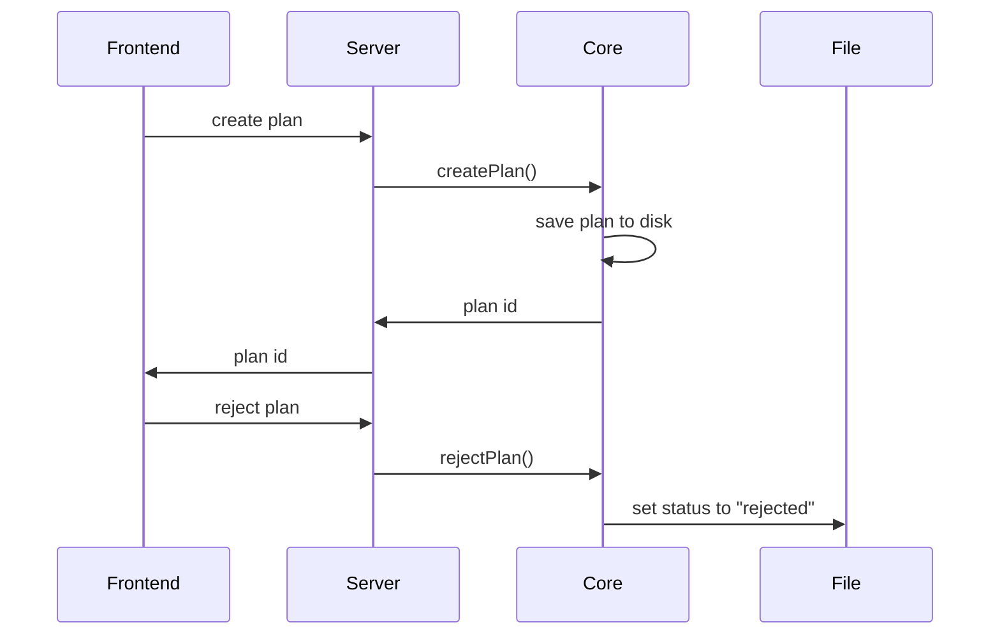

# Manage Plan

**Supported Platform** Web UI, CLI, Electron, ohos, MCP tool, AI tool
**Status** done

The term "Plan" is a concept of task that require user's review and approval.

For example:

**Rename Plan** stores the old and new file names
**Recognize Plan** stores the mapping from episode to local media file

This page focus on a technical solution to create/approve/reject plan. This page doesn't care the actual plan and how the plan apply.

## CLI

```
smm plan list [-a|--all] [-f|--format json] # list all pending plans
smm plan list <folder> [-a|--all] [-f|--format json] # list pending plans for given folder

smm plan show <planId> [-f|--format json]
smm plan apply <planId>
smm apply <planId> # alias to "plan apply"
smm plan reject <planId>
smm reject <planId> # alias to "plan reject"

# commands creates various types of plan
smm try-to-recognize <folder>
smm try-to-rename <folder>
```

- Default `plan list` shows active plans (`preparing` / `pending`).
- `-a` / `--all` also includes `rejected` (completed plans are deleted).
- Human-readable list: one line per plan `<id>  <task>  <status>  <folder>`.
- `plan show` prints the same multi-line detail as try-to-recognize / try-to-rename.

## HTTP API

Source Code: `packages/core-routes/src/plansApi.ts` (handlers), `packages/core-routes/src/routes/plansRoute.ts` (Node http routes). CLI wrapper: `apps/cli/src/route/Plans.ts`.

Plans are persisted as `{appDataDir}/plans/{planId}.plan.json`. All endpoints use RPC-style `POST` and return HTTP `200` with `{ data, error }` — business success/failure is determined by the `error` field. Requires `appDataDir` to be configured; otherwise returns `Error Reason: appDataDir is not configured`.

Plan lifecycle: `preparing` → `pending` → `completed` | `rejected`. Active plans (`preparing` / `pending`) are listed by `getPlans`; terminal `completed` deletes the plan file; terminal `rejected` keeps the file so in-flight AI workflows can detect cancellation.

### `POST /api/getPlans`

List active (non-terminal) plans for a media folder. Equivalent to `smm plan list <folder>`.

Request body:

```json
{ "mediaFolderPath": "<platform absolute path>" }
```

Response:

```json
{ "data": { "plans": [ /* RecognizeMediaFilePlan | RenameFilesPlan */ ] } }
```

### `POST /api/getPlanById`

Load a single plan by id. Equivalent to `smm plan show <planId>`.

Request body:

```json
{ "id": "<plan uuid>" }
```

Response:

```json
{ "data": { "plan": { /* RecognizeMediaFilePlan | RenameFilesPlan */ } } }
```

Returns `{ "error": "Error Reason: Plan with id \"…\" not found" }` when missing.

### `POST /api/createPlan`

Create an empty plan in `preparing` status. Used by rule-based UI flows and AI/MCP task begin tools before entries are added.

Request body:

```json
{
  "id": "<optional client-supplied uuid>",
  "task": "recognize-media-file" | "rename-files",
  "mediaFolderPath": "<platform absolute path>",
  "creator": "app" | "ai"
}
```

Response:

```json
{ "data": { "plan": { /* plan with status \"preparing\", files: [] */ } } }
```

### `POST /api/updatePlan`

Patch a plan's `status` and/or `files`. Replaces `files` wholesale when provided (not append). Equivalent to approve/reject in the CLI sense:

- **Apply** — frontend runs domain apply logic (rename files, update metadata, etc.), then calls with `{ "id", "status": "completed" }` to delete the plan file.
- **Reject** — call with `{ "id", "status": "rejected" }` to mark cancelled; the plan file is kept.

Request body:

```json
{
  "id": "<plan uuid>",
  "status": "preparing" | "pending" | "completed" | "rejected",
  "files": [ /* RecognizedFile[] or RenameFileEntry[] */ ]
}
```

`RecognizedFile`: `{ season: number, episode: number, path: string }` (POSIX absolute path).

`RenameFileEntry`: `{ from: string, to: string }` (POSIX absolute paths).

Response:

```json
{ "data": { "plan": { /* updated plan (or last snapshot before delete) */ } } }
```

Returns `{ "error": "Error Reason: Plan with id \"…\" not found" }` when missing.

## Apply Plan

The term "Frontend" represent frotends of all supported platforms.
Talk to server via method call or HTTP API.
See [Overview](./overview.md).



## Reject Plan

