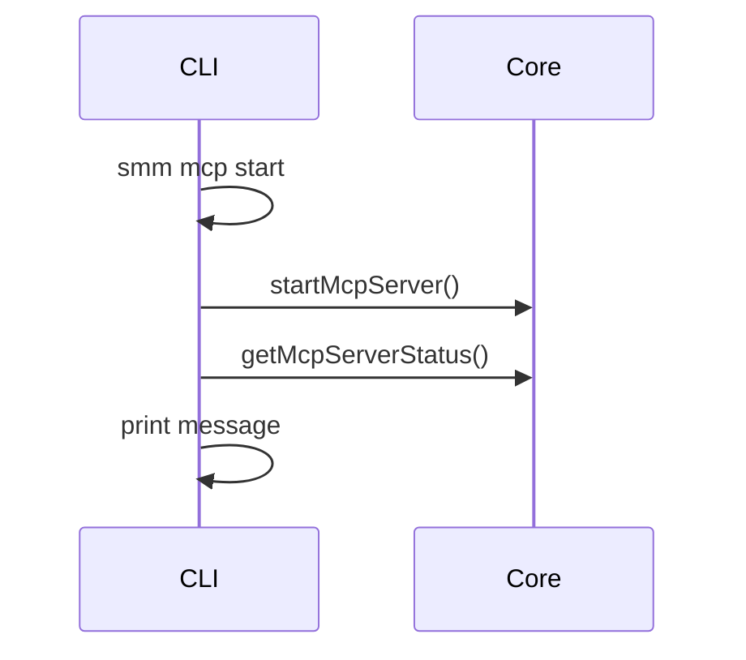
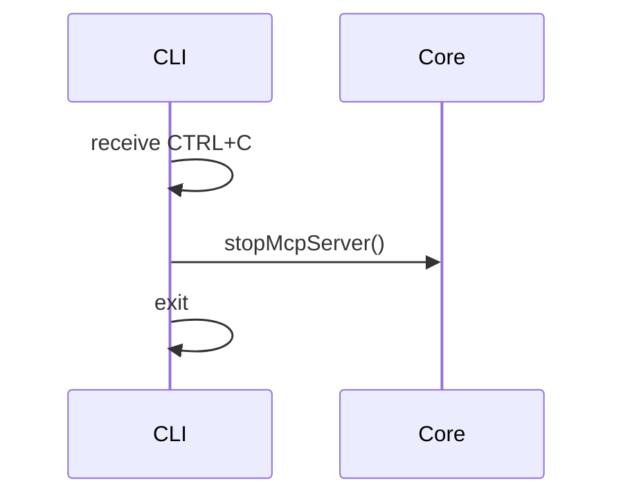
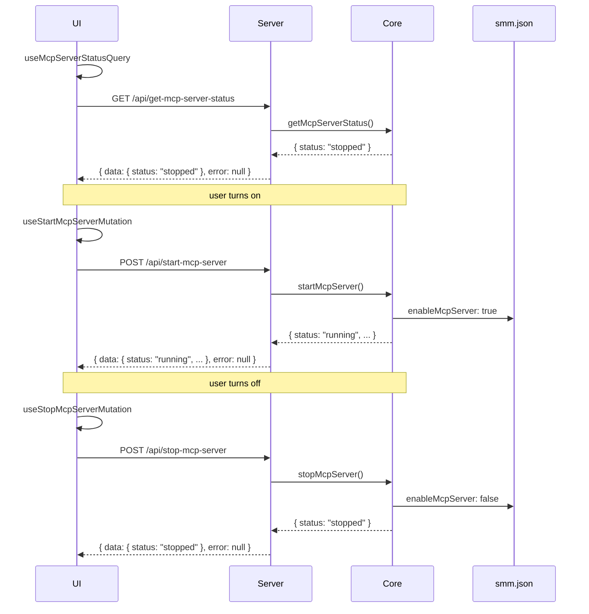

# MCP Server

**Supported Platform**  MCP tools, Web UI, ohos
**Status** draft

This document describes the **future architecture** for turning the MCP server on and off (not the current implementation).

## Layering

| Layer | Responsibility |
|-------|----------------|
| **UI** | TanStack Query hooks; display state; trigger start/stop mutations (**does not** write `enableMcpServer` directly) |
| **Server** | Thin Hono routes; forward to Core |
| **Core** | `getMcpServerStatus` / `startMcpServer` / `stopMcpServer`; start/stop MCP and **persist** MCP fields in `UserConfig` |

HTTP APIs follow project RPC naming and the `{ data, error }` response shape.

| Method | Endpoint | Core |
|--------|----------|------|
| `GET` | `/api/get-mcp-server-status` | `getMcpServerStatus` |
| `POST` | `/api/start-mcp-server` | `startMcpServer` |
| `POST` | `/api/stop-mcp-server` | `stopMcpServer` |

`data` shape (`McpServerState`):

```json
{
  "status": "running",
  "host": "127.0.0.1",
  "port": 30001,
  "url": "http://127.0.0.1:30001/mcp"
}
```

`status` is one of: `running` | `stopped` | `error` (with `error` carrying the failure reason).

UI hooks:

| Hook | Purpose |
|------|---------|
| `useMcpServerStatusQuery` | Fetch runtime status on mount and cache it |
| `useStartMcpServerMutation` | Start the MCP server |
| `useStopMcpServerMutation` | Stop the MCP server |

User config (`smm.json`, written by **Core** on start/stop):

| Field | Description |
|-------|-------------|
| `enableMcpServer` | Whether MCP is enabled |
| `mcpHost` | Bind address; default `127.0.0.1` |
| `mcpPort` | Port; default `30001` |

`get-mcp-server-status` returns **runtime state**. Core keeps MCP fields in `UserConfig` in sync after a successful start/stop. On start failure, Core **does not** set `enableMcpServer` to `true`.

## MCP tool

### Start MCP Server

```bash
$ smm mcp start
MCP server started at http://127.0.0.1:30010 using protocol is Streamable HTTP

# Or
$ smm mcp start -p 8080 --host 0.0.0.0
MCP server started at http://0.0.0.0:8080 using protocol is Streamable HTTP
```



### Stop MCP Server

Press Ctrl+C to stop the `smm` CLI process.



## Web UI

### Turn on/off MCP server

#### Query status (initial load / polling)

```mermaid
sequenceDiagram
  participant UI
  participant Server
  participant Core

  UI->>UI: useMcpServerStatusQuery
  UI->>Server: GET /api/get-mcp-server-status
  Server->>Core: getMcpServerStatus()
  Core-->>Server: McpServerState
  Server-->>UI: { data: { status: "stopped" }, error: null }
  UI->>UI: cache query data; drive status-bar toggle and address display
```

#### Start MCP Server

Entry points: status-bar `McpIndicator` toggle OFF → ON, or General Settings checkbox on Save.

```mermaid
sequenceDiagram
  participant User
  participant UI
  participant Server
  participant Core
  participant Config as smm.json

  User->>UI: toggle ON
  UI->>UI: useStartMcpServerMutation
  UI->>Server: POST /api/start-mcp-server { host?, port? }
  Server->>Core: startMcpServer(options)
  Core->>Core: stop existing instance if any; create Streamable HTTP handler; listen on host:port
  Core->>Config: write enableMcpServer: true; optionally update mcpHost / mcpPort
  Core-->>Server: McpServerState { status: "running", host, port, url }
  Server-->>UI: { data: { status: "running", ... }, error: null }
  UI->>UI: update useMcpServerStatusQuery cache; invalidate userConfig

  alt start fails
    Core->>Core: do not write enableMcpServer: true
    Core-->>Server: McpServerState { status: "error", error }
    Server-->>UI: { data: { status: "error", error }, error: "Error Reason: ..." }
    UI->>User: toast error message
  end
```

The UI only calls the start API; Core atomically starts the server and persists config. On failure, `enableMcpServer` is not updated.

#### Stop MCP Server

Entry points: status-bar toggle ON → OFF, or General Settings checkbox cleared on Save.

```mermaid
sequenceDiagram
  participant User
  participant UI
  participant Server
  participant Core
  participant Config as smm.json

  User->>UI: toggle OFF
  UI->>UI: useStopMcpServerMutation
  UI->>Server: POST /api/stop-mcp-server
  Server->>Core: stopMcpServer()
  Core->>Core: stop listener; release handler
  Core->>Config: write enableMcpServer: false
  Core-->>Server: McpServerState { status: "stopped" }
  Server-->>UI: { data: { status: "stopped" }, error: null }
  UI->>UI: update useMcpServerStatusQuery cache; invalidate userConfig

  alt stop fails
    Note over Core,Config: still attempt to write enableMcpServer: false
    Core-->>Server: { status: "error", error }
    Server-->>UI: { data, error: "Error Reason: ..." }
    UI->>UI: log error; invalidate userConfig to fetch Core-written state
  end
```

The UI only calls the stop API; Core stops the server and persists `enableMcpServer: false`.

#### App startup (auto start/stop from config)

```mermaid
sequenceDiagram
  participant Server
  participant Core
  participant Config as smm.json

  Server->>Server: HTTP server listen complete
  Server->>Core: applyMcpLifecycleFromConfig()
  Core->>Config: read enableMcpServer, mcpHost, mcpPort

  alt enableMcpServer === true
    Core->>Core: startMcpServer({ host: mcpHost, port: mcpPort })
    Note over Core,Config: on success do not rewrite config; on failure do not set enableMcpServer: true
    Core-->>Server: running | error
  else enableMcpServer === false
    Core->>Core: stopMcpServer()
    Core-->>Server: stopped
  end
```

On boot failure, `getMcpServerStatus` returns `status: "error"`. Core may sync `enableMcpServer` to `false` during boot or inside `getMcpServerStatus` so the UI sees a consistent state on first query.

#### Initial load: align config with runtime

```mermaid
sequenceDiagram
  participant UI
  participant Server
  participant Core
  participant Config as smm.json

  UI->>UI: useMcpServerStatusQuery + useConfig (wait for both)
  UI->>Server: GET /api/get-mcp-server-status
  Server->>Core: getMcpServerStatus()
  Core->>Config: if enableMcpServer is true but process not running, correct to false
  Core-->>Server: McpServerState
  Server-->>UI: { data, error: null }
  UI->>UI: invalidate userConfig (fetch Core-corrected config)

  alt was inconsistent and Core corrected
    UI->>UI: toast warning or error (notify only; do not write config)
  end
```

Config correction is done by **Core**; the UI only shows a toast and never calls `setAndSaveUserConfig` for MCP fields.

#### General Settings save

MCP changes (toggle, host, port) are **not** written to `smm.json` from the UI; they go through Core APIs:

```mermaid
sequenceDiagram
  participant User
  participant UI
  participant Server
  participant Core
  participant Config as smm.json

  User->>UI: Save (includes MCP field changes)
  UI->>UI: setAndSaveUserConfig (non-MCP fields only, e.g. language, telemetry)

  alt OFF to ON
    UI->>Server: POST /api/start-mcp-server { host, port }
    Server->>Core: startMcpServer(options)
    Core->>Config: enableMcpServer: true; mcpHost; mcpPort
  else ON to OFF
    UI->>Server: POST /api/stop-mcp-server
    Server->>Core: stopMcpServer()
    Core->>Config: enableMcpServer: false
  else stays ON and host/port changed
    UI->>Server: POST /api/stop-mcp-server
    Server->>Core: stopMcpServer()
    UI->>Server: POST /api/start-mcp-server { host, port }
    Server->>Core: startMcpServer(options)
    Core->>Config: update mcpHost / mcpPort
  end

  Core-->>UI: McpServerState (wrapped by Server as { data, error })
  UI->>UI: invalidate useMcpServerStatusQuery + userConfig

  alt start fails
    Note over UI: do not roll back form; useMcpServerStatusQuery shows error
  end
```

#### Overview (one full on/off cycle)



---

## HarmonyOS (ohos)

On HarmonyOS, the Web UI runs in the Electron renderer; HTTP routes are served by the **Electron main process** (Node.js side with Core and core-routes). The UI talks to the main process instead of a separate `apps/cli` Hono server.

### Start MCP Server

```mermaid
sequenceDiagram
  participant User
  participant UI
  participant Electron as Electron Main Process
  participant Core
  participant Config as smm.json

  User->>UI: toggle ON
  UI->>UI: useStartMcpServerMutation
  UI->>Electron: POST /api/start-mcp-server { host?, port? }
  Electron->>Core: startMcpServer(options)
  Core->>Core: stop existing instance if any; create Streamable HTTP handler; listen on host:port
  Core->>Config: write enableMcpServer: true; optionally update mcpHost / mcpPort
  Core-->>Electron: McpServerState { status: "running", host, port, url }
  Electron-->>UI: { data: { status: "running", ... }, error: null }
  UI->>UI: update useMcpServerStatusQuery cache; invalidate userConfig

  alt start fails
    Core->>Core: do not write enableMcpServer: true
    Core-->>Electron: McpServerState { status: "error", error }
    Electron-->>UI: { data: { status: "error", error }, error: "Error Reason: ..." }
    UI->>User: toast error message
  end
```

### Stop MCP Server

```mermaid
sequenceDiagram
  participant User
  participant UI
  participant Electron as Electron Main Process
  participant Core
  participant Config as smm.json

  User->>UI: toggle OFF
  UI->>UI: useStopMcpServerMutation
  UI->>Electron: POST /api/stop-mcp-server
  Electron->>Core: stopMcpServer()
  Core->>Core: stop listener; release handler
  Core->>Config: write enableMcpServer: false
  Core-->>Electron: McpServerState { status: "stopped" }
  Electron-->>UI: { data: { status: "stopped" }, error: null }
  UI->>UI: update useMcpServerStatusQuery cache; invalidate userConfig

  alt stop fails
    Note over Core,Config: still attempt to write enableMcpServer: false
    Core-->>Electron: { status: "error", error }
    Electron-->>UI: { data, error: "Error Reason: ..." }
    UI->>UI: log error; invalidate userConfig to fetch Core-written state
  end
```


## References
[Supported Platform](./supported-platform.md)