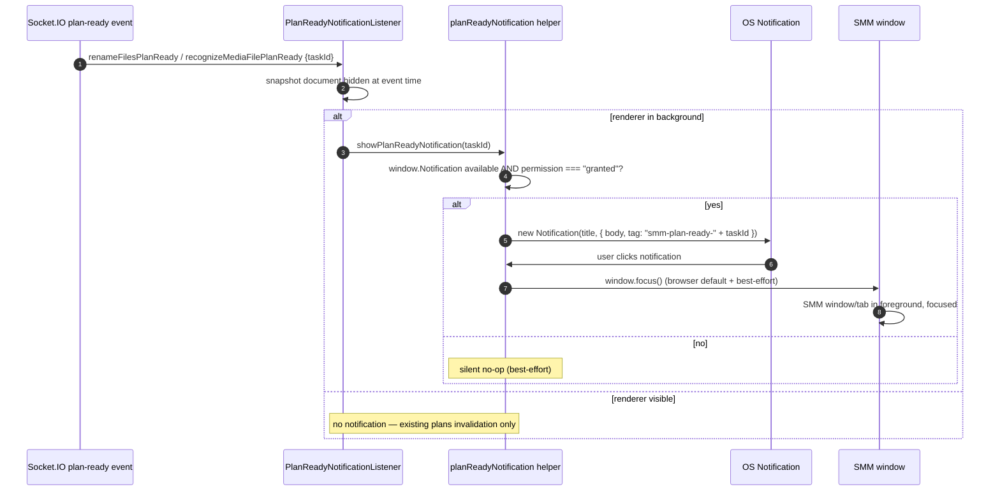

# Notification in SMM

**Supported Platform**  AI tools, MCP tools, Electron (macOS / Windows / Linux), HarmonyOS, Web UI (local CLI / Docker)
**Status** proposed

When the AI Agent creates a plan through the `create-rename-episode-plan` or `create-recognize-episode-plan` tool and the SMM window is in the background, SMM raises a system notification — "a plan is waiting for approval". Clicking the notification brings the SMM window to the foreground with focus. The approval flow itself (how the user reviews and approves the plan) is explicitly out of scope for this feature.

## 1. Background

Plan-based AI writes in SMM follow a two-phase flow: the AI Agent first creates a plan (a `*.plan.json` file stored under `{appDataDir}/plans/`), and the plan then waits for the user to review and approve it in the UI.

The plan-creation tools are:

| Tool | Plan file | Socket.IO event (pending plan) |
|------|-----------|--------------------------------|
| `create-rename-episode-plan` | `RenameFilesPlan` | `renameFilesPlanReady` |
| `create-recognize-episode-plan` | `RecognizeMediaFilePlan` | `recognizeMediaFilePlanReady` |

Both events carry `{ taskId, planFilePath }` (see `packages/types/event-types.ts`) and are broadcast over Socket.IO when the created plan stays **pending**:

- Built-in AI Assistant — `createChatTools` builds `buildCreateRenameEpisodePlanTool` / `buildCreateRecognizeEpisodePlanTool` with the Socket.IO `broadcast` injected (`packages/core-routes/src/tools/index.ts`).
- MCP tools — the MCP tool handlers `create-rename-episode-plan` / `create-recognize-episode-plan` reuse the same builders with `config.broadcast` (`packages/core-routes/src/mcp/toolHandlers/`).
- If the user has granted the `metadata.write` AI Agent permission, the plan is applied automatically and **no** plan-ready event is emitted — there is nothing to notify.

Today the renderer's only reaction to these events is a TanStack Query invalidation (`RenameFilesPlanReadyEventListener` / `RecognizeMediaFilePlanReadyEventListener` in `apps/ui/src/components/eventlisteners/`). If the SMM window is minimized, behind another window, or on a background tab, the user gets **no visible signal** that a plan is waiting for approval.

**Design stance — renderer-only, best-effort (product decision).** The notification trigger lives entirely in the UI renderer, which runs the same code in the plain browser, the Electron renderer, and the HarmonyOS Electron renderer. Browsers throttle background pages (timers, `requestAnimationFrame`) and may freeze or suspend them entirely (Safari background suspension, Edge sleeping tabs, Chrome memory-saver freezing), so a notification raised inside the renderer **can be missed**. This risk is accepted: the notification is a convenience nudge, not part of the approval mechanism — the plan simply stays pending and is visible when the user returns. A main-process trigger (Electron) or Service Worker + Web Push (browser) exists as future work if reliability becomes a requirement (§9).

## 2. Scope

### 2.1 Goals

1. The notification covers **only** the two plan-creation tools: `create-rename-episode-plan` and `create-recognize-episode-plan` (through both the built-in AI Assistant and MCP tools).
2. The notification is a plain **system notification** telling the user "a plan is waiting for approval".
3. Clicking the notification brings the SMM window to the **foreground with focus** (best-effort, see FR-2).
4. It covers every distribution form of SMM with **one shared renderer implementation**:

| Target | Form | Notes |
|--------|------|-------|
| Electron app | macOS / Windows / Linux desktop | Same `apps/ui` bundle in the renderer |
| HarmonyOS app | Electron port on HarmonyOS (`apps/ohos`) | Same renderer bundle; best-effort |
| Web UI (local) | `smm` started locally, browser opens `http://localhost:<port>` | Secure context, `Notification` API available after permission grant |
| Web UI (Docker) | Container serves the UI, browser opens `http://<host>:<port>` | `Notification` API requires a secure context — see §4.3 |

### 2.2 Non-Goals

- **The approval flow itself.** This feature does not touch how the user reviews or approves a plan (plan prompt, plans panel, plan state machine, `apply-plan` execution). The notification only signals and focuses the window; it contains **no** Approve/Deny actions.
- **Direct confirmation dialogs.** The `askForConfirmation` flow used by `rename-folder` / `rename-episode-file` (30 s Socket.IO acknowledgement dialog) is a different mechanism and is **not** covered by this notification.
- **Auto-applied plans.** When `metadata.write` permission is granted, no plan-ready event fires and no notification is shown — nothing is pending.
- **MCP server started by `smm mcp start`.** No UI is connected (no Socket.IO manager, `broadcast` defaults to a no-op), so there is no renderer to notify.
- **New backend surface.** No new Socket.IO events, HTTP endpoints, or `smm.json` fields. The change is purely additive in `apps/ui`.
- **Guaranteed delivery.** The notification is best-effort everywhere: if the renderer is throttled, frozen, or suspended, or notifications are blocked, the notification may be missed — accepted by product decision (§1, NF-1).

## 3. Current Plan-Ready Flow

```mermaid
sequenceDiagram
    autonumber
    participant AI as AI Assistant (built-in chat)
    participant MCP as MCP client (external agent)
    participant Tool as create-*-episode-plan tool
    participant SIO as Socket.IO Manager (cli)
    participant UI as Web UI renderer
    participant Q as TanStack Query plans

    AI->>Tool: create-rename-episode-plan (chat tools)
    MCP->>Tool: create-recognize-episode-plan (Streamable HTTP)
    Tool->>Tool: create plan file; check metadata.write permission
    alt permission granted
        Tool->>Tool: apply plan automatically
        Note over Tool,SIO: mediaMetadataUpdated only — no plan-ready event
    else plan stays pending
        Tool->>SIO: broadcast renameFilesPlanReady / recognizeMediaFilePlanReady {taskId, planFilePath}
        SIO-->>UI: socket.io event (io.emit → all connected clients)
        UI->>Q: existing listener invalidates ['plans']
        Note over UI: no visible signal to the user today
    end
```

Key facts:

- Event definitions: `RenameFilesPlanReady` / `RecognizeMediaFilePlanReady` in `packages/types/event-types.ts`; payload `{ taskId, planFilePath }`.
- Tool implementations: `packages/core-routes/src/tools/createRenameEpisodePlan.ts` and `createRecognizeEpisodePlan.ts` (shared by the chat and MCP paths).
- The cli broadcasts with `io.emit(...)` (`packages/core-routes/src/socketIO/messaging.ts`).
- UI listeners: `apps/ui/src/components/eventlisteners/RenameFilesPlanReadyEventListener.tsx` and `RecognizeMediaFilePlanReadyEventListener.tsx` — query invalidation only.

## 4. Requirements

### 4.1 Functional Requirements

| ID | Requirement |
|----|-------------|
| FR-1 | When `renameFilesPlanReady` or `recognizeMediaFilePlanReady` arrives **while the SMM window/tab is in the background**, the renderer raises a system notification telling the user that a plan is waiting for approval. |
| FR-2 | Clicking the notification brings the SMM window/tab to the foreground with focus (best-effort: browsers focus the originating tab by default; Electron relies on `onclick → window.focus()`, which may not restore a minimized window — accepted). |
| FR-3 | When the SMM window/tab is visible, no system notification fires — the event keeps its existing behavior (plans query invalidation only). |
| FR-4 | SMM never calls `Notification.requestPermission()`. If permission is not granted or the API is unavailable, the feature degrades silently. |
| FR-5 | One notification per pending plan: repeated events for the same `taskId` reuse/replace the same notification instead of stacking. |
| FR-6 | The notification text is localized in all four UI languages (en, zh-CN, zh-HK, zh-TW) and contains no file paths or plan details. |
| FR-7 | Plan creation and the approval flow are untouched: the notification is purely additive and never delays, modifies, or substitutes any part of the plan pipeline. |

### 4.2 Non-Functional Requirements

| ID | Requirement |
|----|-------------|
| NF-1 | **Best-effort.** No retry, no queue, no persistence. If the renderer is throttled or frozen (background tab throttling, OS suspension) or notifications are blocked, the notification may be missed — accepted by product decision. |
| NF-2 | **Non-blocking.** Raising the notification is fire-and-forget and wrapped in `try/catch`; it never affects plan processing. |
| NF-3 | **No backend changes.** The existing plan-ready events are reused as-is; no new events, endpoints, MCP surface, or config fields. |
| NF-4 | **Privacy.** The notification text is generic ("a plan is waiting for approval") — no folder names, file names, or plan contents leave the app. |
| NF-5 | **Portability.** One shared implementation in `apps/ui` covers browser, Electron, and HarmonyOS renderers; unsupported contexts degrade to a silent no-op. |

### 4.3 Platform Capability Matrix

| Platform | `Notification` API in renderer | Permission model | Background detection | Click → focus | Delivery risk |
|----------|-------------------------------|------------------|----------------------|---------------|---------------|
| Electron (macOS) | Available (Chromium) | Granted by default unless a session permission handler denies; macOS may require the user to allow notifications for the app in System Settings (best-effort) | `document.hidden` (minimized / hidden window; a window merely behind another app is **not** detected — §8 OQ-1) | `onclick → window.focus()`; minimized window may not be restored (best-effort) | Renderer throttling when hidden for a long time — accepted (NF-1) |
| Electron (Windows / Linux) | Available (Chromium) | Granted by default | Same as macOS | Same | Same |
| HarmonyOS (Electron port) | Same renderer API; on-device behavior to be verified (§8 OQ-2) | Best-effort | Same as Electron | Same; verify on device | Same |
| Web UI, local `smm` | Available — `localhost` is a secure context | `permission === "granted"` required; no prompt is requested | `document.hidden` (other tab / minimized window) | Browser focuses the originating tab (default behavior) | Tab freezing/suspension (Safari, sleeping tabs, memory saver) — accepted (NF-1) |
| Web UI, Docker | **Not available over plain HTTP on a remote host** — secure context required (HTTPS or localhost) | n/a | `document.hidden` | n/a — silent no-op fallback | n/a |

## 5. Technical Design

### 5.1 Project Level Architecture

| Package / App | Change |
|---------------|--------|
| `apps/ui` | New listener component + notification helper; mount in `main.tsx`; locale strings; unit tests |
| `packages/*`, `apps/cli`, `apps/core`, `apps/electron`, `apps/ohos` | none |

The renderer-side `Notification` constructor exists in plain browsers, the Electron renderer, and the HarmonyOS Electron renderer — the same `apps/ui` code runs on all three targets.

An implementation-level design already exists at [`docs/superpowers/design/ai-plan-ready-browser-notification/design.md`](./superpowers/design/ai-plan-ready-browser-notification/design.md), which follows the same renderer-side approach. Where that document conflicts with this one, **this document takes precedence** — notably: no toast-when-visible (FR-3) and a single generic message for both plan kinds (§5.4). The design doc should be aligned before implementation.

### 5.2 App Level Architecture



Files:

| File | Responsibility |
|------|----------------|
| `apps/ui/src/lib/planReadyNotification.ts` (new) | `showPlanReadyNotification(taskId: string): void` — `try/catch`; only when `document.hidden`; permission check; `new Notification(title, { body, tag: "smm-plan-ready-<taskId>" })`; `onclick` → `window.focus()` |
| `apps/ui/src/components/eventlisteners/PlanReadyNotificationListener.tsx` (new) | Listens for `socket.io_renameFilesPlanReady` / `socket.io_recognizeMediaFilePlanReady`; snapshots `document.hidden`; calls the helper; mounted in `main.tsx` next to the existing plan listeners |
| `apps/ui/src/main.tsx` | Mount `<PlanReadyNotificationListener />` |
| `apps/ui/public/locales/{en,zh-CN,zh-HK,zh-TW}/common.json` | New `planReady.notification.*` keys (§5.4) |

### 5.3 Key Design Decisions

1. **Reuse the existing events as the trigger.** `renameFilesPlanReady` / `recognizeMediaFilePlanReady` are already broadcast exactly when a plan stays pending — no new events, endpoints, or config. The cli stays untouched.
2. **Renderer-only trigger (product decision).** One shared implementation in `apps/ui` covers browser, Electron, and HarmonyOS renderers, keeping the structure simple. The accepted trade-off: a throttled, frozen, or suspended renderer may miss the notification (NF-1). The notification is a convenience nudge — the plan itself stays pending and is visible when the user returns; the approval mechanism is unaffected.
3. **Snapshot background state at event time.** `document.hidden` is captured synchronously when the event arrives — never inside a `setTimeout`, where a throttled tab could observe a stale or changed value.
4. **No toast when visible.** When the window is visible, the feature does nothing beyond the existing invalidation — strictly a system notification feature (FR-3).
5. **Both plan kinds share one message.** A single generic "a plan is waiting for approval" text; no per-kind wording, no file paths, no plan contents (NF-4).
6. **Dedupe per plan.** `tag: "smm-plan-ready-<taskId>"` — the OS replaces the notification for the same plan instead of stacking (FR-5); two different pending plans may each have one notification.
7. **Click → focus is best-effort.** Browsers focus the originating tab automatically; for Electron the helper attaches `onclick = () => window.focus()`. Restoring a minimized window may require OS/Chromium cooperation and is not guaranteed (FR-2).
8. **Never prompt for permission.** If `Notification.permission !== "granted"` or the API is missing (e.g. Docker over plain HTTP), the helper silently no-ops (FR-4).
9. **Auto-applied plans are naturally excluded.** When `metadata.write` is granted, the tools emit `mediaMetadataUpdated` instead of a plan-ready event — no code needs to distinguish anything.

### 5.4 Locale Strings

New namespace `planReady.notification` in all four locale files (wording subject to review):

| Locale | `planReady.notification.title` | `planReady.notification.body` |
|--------|-------------------------------|-------------------------------|
| en | `SMM` | `A plan is waiting for your approval` |
| zh-CN | `SMM` | `有计划需要审批` |
| zh-HK | `SMM` | `有計劃需要審批` |
| zh-TW | `SMM` | `有計劃需要審批` |

## 6. Edge Cases

| Scenario | Behavior |
|----------|----------|
| Notifications blocked / permission `denied` or `default` | Silent no-op; plan remains pending and visible when the user returns (FR-4) |
| `window.Notification` missing or insecure context (Docker over plain HTTP) | Silent no-op |
| OS Do Not Disturb / Focus mode | Notification queued or suppressed by the OS — out of SMM control |
| Plan auto-applied (`metadata.write` granted) | No plan-ready event → no notification |
| Two plans created in quick succession | One notification per `taskId` (`tag: "smm-plan-ready-<taskId>"`); duplicates for the same plan are replaced, not stacked (FR-5) |
| Renderer throttled/frozen (window minimized for a long time, sleeping tab) | Notification may be delayed or missed entirely until the renderer resumes — accepted per NF-1 |
| Electron window visible but behind another app | `document.hidden` is `false` → no notification (known detection gap, §8 OQ-1) |
| Electron window minimized, notification clicked | `window.focus()` is attempted; if the OS does not restore the window, the user still sees the plan on next use (best-effort FR-2) |
| Window hidden at event time, user returns before clicking | Notification remains in the OS tray/center; clicking still focuses SMM; no duplicate fires |
| Frontend in-renderer transport (`ReverseProxyChatTransport`) | Out of scope: plan task components call `/api/updatePlan` in the same renderer and the prompt opens there; no server broadcast is involved |

## 7. Acceptance Criteria

1. **Background window:** while the SMM window is minimized or on another tab, an AI Assistant chat or an MCP client calls `create-rename-episode-plan` / `create-recognize-episode-plan` with a pending plan → a system notification "a plan is waiting for approval" appears.
2. **Click → foreground:** clicking the notification focuses SMM — the originating tab in a browser; `window.focus()` best-effort in Electron (minimized-window restore not guaranteed).
3. **Visible window:** the same plan creation while SMM is visible produces no system notification (existing plans invalidation only).
4. **Auto-applied plan:** with `metadata.write` permission granted, no notification is shown.
5. **Permission missing / unsupported:** no notification, no prompt, no console error; the plan flow is unaffected.
6. **Dedupe:** repeated plan-ready events for the same `taskId` show a single (replaced) notification.
7. **No regression:** plan creation, review and approval flows are unchanged; `pnpm typecheck` and `pnpm --filter smm-ui build` pass; `smm mcp start` behavior is untouched (no UI, no notification).

## 8. Risks & Open Questions

| ID | Risk / Question | Notes |
|----|-----------------|-------|
| OQ-1 | `document.hidden` does not detect an Electron window that is visible but behind another app | Accepted in v1; precise detection needs main-process `blur`/`focus` tracking (§9) |
| OQ-2 | HarmonyOS notification behavior in the Electron port | Same renderer API is expected, but on-device verification is required; see [HarmonyOS FAQ](./superpowers/reference/faq-harmonyos.md) |
| OQ-3 | Renderer throttling/freezing may miss the notification | Accepted by product decision (NF-1); escalation paths are listed in §9 |
| OQ-4 | macOS may require the user to allow notifications for the app | First-notification guidance in the UI could be considered later; no permission prompt in v1 |
| OQ-5 | Docker-deployed UI over plain HTTP has no `Notification` API | Documented degradation (§4.3); HTTPS (or localhost) restores the feature |
| OQ-6 | Existing design doc deltas (toast-when-visible, per-kind wording, different title) | Align `ai-plan-ready-browser-notification/design.md` with this document before implementation (§5.1) |

## 9. Future Work

- **Reliable delivery (only if the accepted risk becomes a problem):**
  - Electron / HarmonyOS — raise the notification from the **main process** (subscribe to the plan-ready events as a Socket.IO client; native `Notification` + `win.show()`/`focus()`), immune to renderer throttling.
  - Browser — **Service Worker + Web Push** so a frozen/closed tab still gets the notification (heavy machinery: VAPID keys, push subscription, server push).
- **Precise background detection** via Electron main-process `blur`/`focus` events (covers the window-behind-another-app case).
- **Interactive notification actions:** Approve/Deny directly in the notification — explicitly out of scope here.
- **Extend to other events:** the direct confirmation dialogs (`askForConfirmation`) and background-job completion could reuse the same helper later.
- **User-config toggle** for plan notifications (future `notifications` section of `smm.json`).

## 10. References

- [Supported Platform](./supported-platform.md)
- [MCP Server](./mcp.md)
- [AI / MCP Plan-Ready Browser Notification design](./superpowers/design/ai-plan-ready-browser-notification/design.md)
- `packages/types/event-types.ts` — `RenameFilesPlanReady` / `RecognizeMediaFilePlanReady` definitions
- `packages/core-routes/src/tools/createRenameEpisodePlan.ts`, `createRecognizeEpisodePlan.ts` — plan tools and event emission
- `packages/core-routes/src/mcp/toolHandlers/createRenameEpisodePlan.ts` — MCP registration
- `packages/core-routes/src/socketIO/messaging.ts` — `io.emit` broadcast
- `apps/ui/src/components/eventlisteners/RenameFilesPlanReadyEventListener.tsx` — current plans invalidation
