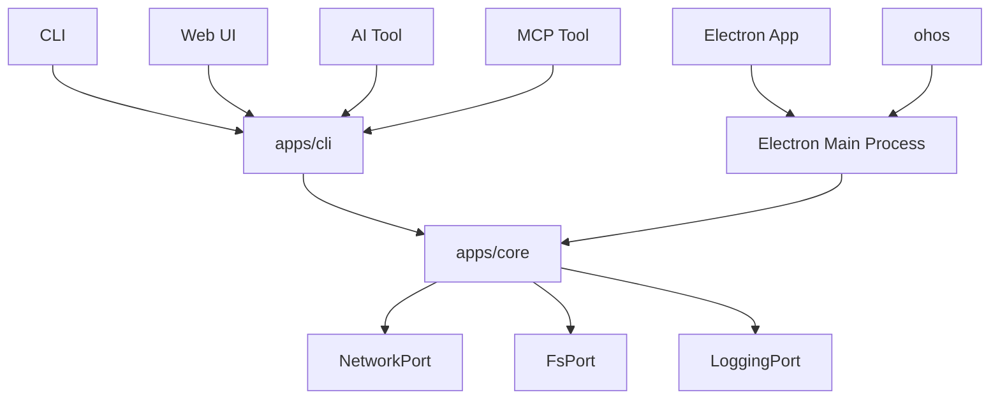

# Overview

This document describe the overview architecture of SMM.

Key Requirements
* Multi-Frontend - Web UI, Electron, HarmonyOS(ohos), CLI, AI Tool, MCP Tool frontends
* Multi-Distribution - Desktop app, HarmonyOS app, Docker image, CLI

## References
[Supported Platform](./supported-platform.md)