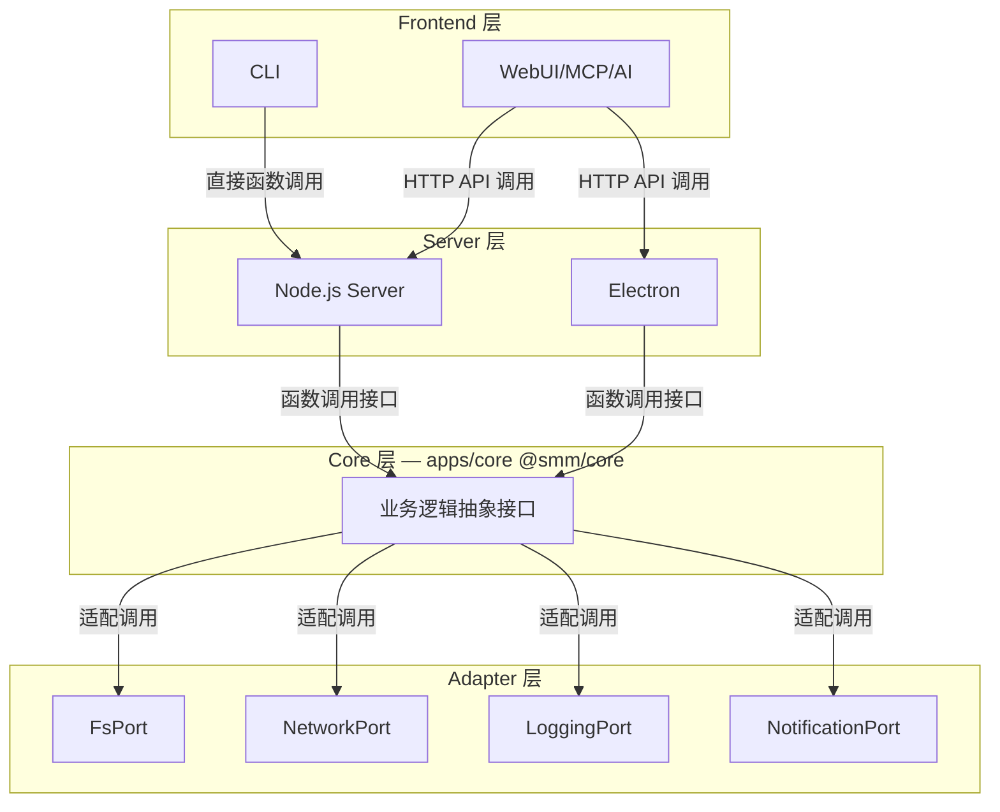
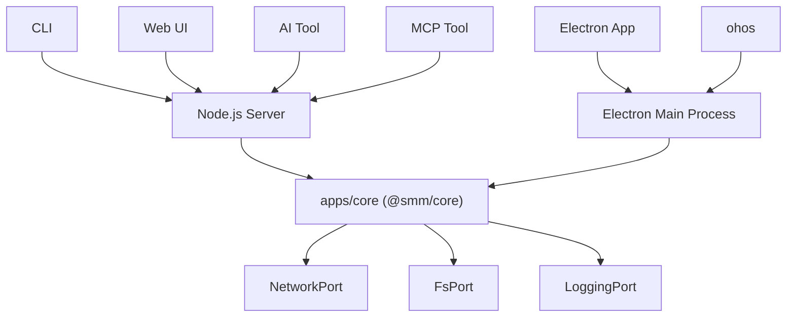

# Overview

This document describe the overview architecture of SMM.

Key Requirements
* Multi-Frontend - Web UI, Electron, HarmonyOS(ohos), CLI, AI Tool, MCP Tool frontends
* Multi-Distribution - Desktop app, HarmonyOS app, Docker image, CLI
* Layering - The core module abstract the iteraction and state managmenet for SMM business

**Core 层** 对应 monorepo 中的 `apps/core`，npm 包名 `@smm/core`。共享类型与纯工具分别位于 `packages/types`（`@smm/types`）与 `packages/utils`（`@smm/utils`）。

## References
[Supported Platform](./supported-platform.md)