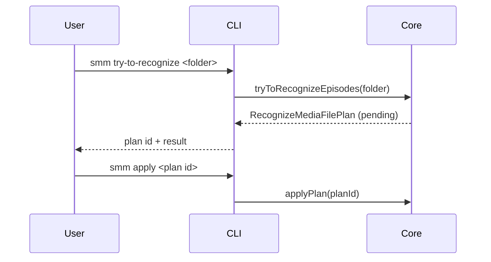
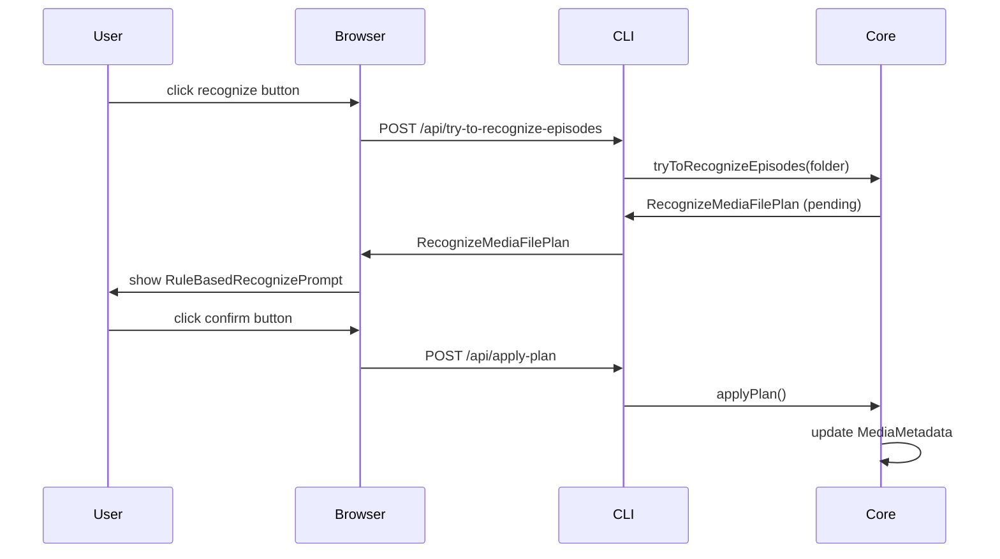

# Recognize

**Supported Platform** Web UI, CLI, Electron, ohos
**Status** done

We have two similar recognition functions, don't get confused:

**Recognize Folder** – determines the TV series or movie title for a given media folder. This function is described in [Recognize Folder](./recognize-folder.md)
**Recognize Episodes** – matches local video files to their correct episode numbers within a series. This is what this page describes.

## CLI

```
smm try-to-recognize <folder> --skip
smm apply <planId>
```



## Web UI, Electron and ohos



## References

[Import Folder](./import-folder.md)

[Supported Platform](./supported-platform.md)
