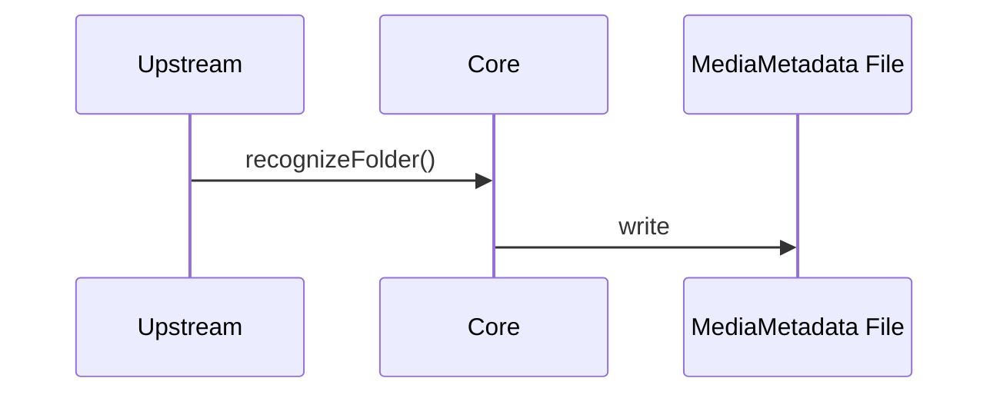
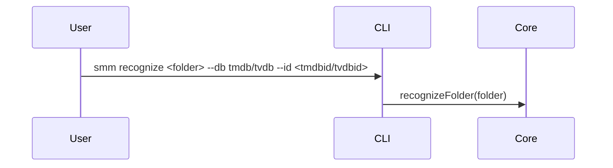
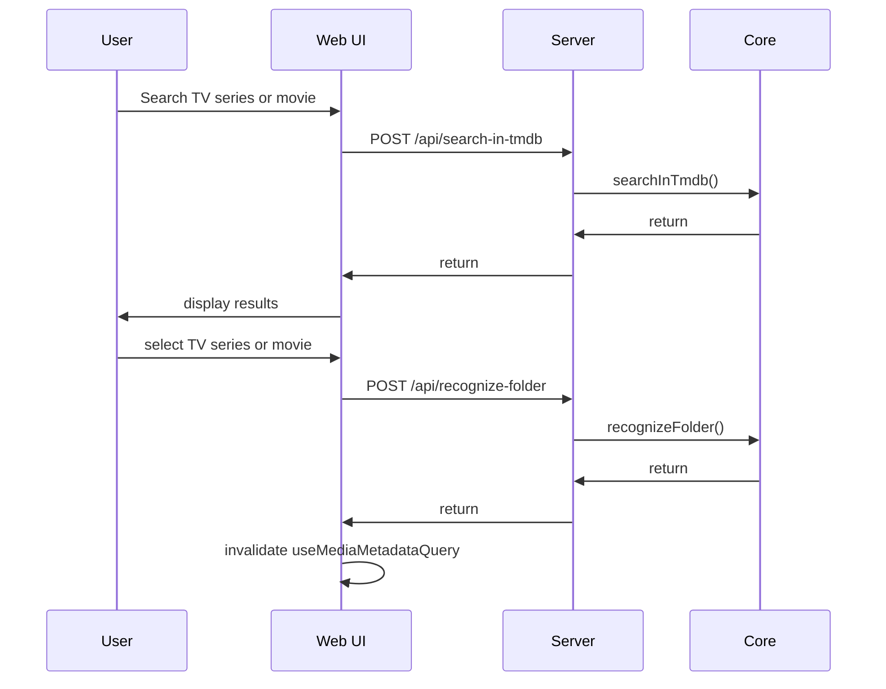
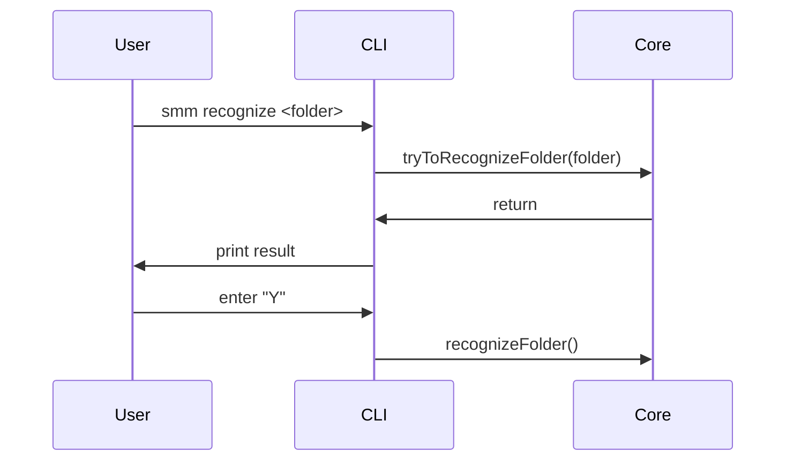

# Recognize Folder

**Supported Platform** CLI
**Status** implemented

We have two similar recognition functions, don't get confused:

**Recognize Folder** – determines the TV series or movie title for a given media folder. This is what this page describes.
**Recognize Episodes** – matches local video files to their correct episode numbers within a series. This function is described in [Recognize Episodes](./recognize-episodes.md)


There are two way to recognize folder:
1. manual - User tell SMM the TV series or movie for a folder
2. auto - Let SMM find out

## Core Module

`recognizeFolder` method is used to recognize given folder as TMDB/TVDB TV series or movie



## CLI

### Recognize folder manually
```
# Manual
smm recognize <folder> --db tmdb/tvdb --id <tmdbid/tvdbid>
```



## Web UI, Electron and HarmonyOS

NOTE: The function of searching media in TMDB/TVDB is described in [Search in TMDB](./tmdb.md) and [Search in TVDB](./tvdb.md).



### Recognize folder in auto

```
# Auto (interactive)
smm recognize <folder>
Is it "{title} ({release year})"? [Y/n]
> Y
Metadata is updated

# Auto (non-interactive)
smm recognize <folder> --yes
# or
smm recognize <folder> -y
Metadata is updated
```

Use `--yes` / `-y` to accept the auto-recognition candidate without prompting. Empty input at the prompt defaults to yes; `n` or `N` cancels without writing metadata. `--yes` is only used in auto mode; it is ignored when `--db` and `--id` are provided.



## Recognize Folder by Rule

```mermaid
flowchart TD
  Start([importFolder: recognize stage]) --> TypeCheck{Folder type?}
  TypeCheck -->|music| Skip([Skip recognition])
  TypeCheck -->|tvshow / movie| NfoRule

  NfoRule{tvshow.nfo or movie.nfo exists?}
  NfoRule -->|no| TmdbIdRule
  NfoRule -->|yes| NfoTmdb{tmdbid in NFO?}
  NfoTmdb -->|yes| FetchNfoTmdb[Fetch metadata from TMDB by id]
  NfoTmdb -->|no| NfoTvdb{tvdbid in NFO?}
  NfoTvdb -->|yes| FetchNfoTvdb[Fetch metadata from TVDB by id]
  NfoTvdb -->|no| TmdbIdRule
  FetchNfoTmdb --> HitCheck1{Recognized?}
  FetchNfoTvdb --> HitCheck1
  HitCheck1 -->|yes| AfterRecognize
  HitCheck1 -->|no| TmdbIdRule

  TmdbIdRule{tmdbid in folder name<br/>e.g. [tmdbid=123]?}
  TmdbIdRule -->|yes| FetchFolderTmdb[Fetch metadata from TMDB by id]
  TmdbIdRule -->|no| TvdbIdRule
  FetchFolderTmdb --> HitCheck2{Recognized?}
  HitCheck2 -->|yes| AfterRecognize
  HitCheck2 -->|no| TvdbIdRule

  TvdbIdRule{tvdbid in folder name<br/>e.g. [tvdbid=456]?}
  TvdbIdRule -->|yes| FetchFolderTvdb[Fetch metadata from TVDB by id]
  TvdbIdRule -->|no| SearchOrder
  FetchFolderTvdb --> HitCheck3{Recognized?}
  HitCheck3 -->|yes| AfterRecognize
  HitCheck3 -->|no| SearchOrder

  SearchOrder{primaryDatabase?}
  SearchOrder -->|TVDB| SearchTvdbFirst[Search folder name in TVDB]
  SearchOrder -->|TMDB or default| SearchTmdbFirst[Search folder name in TMDB]
  SearchTvdbFirst --> HitCheck4{Recognized?}
  HitCheck4 -->|yes| AfterRecognize
  HitCheck4 -->|no| SearchTmdbSecond[Search folder name in TMDB]
  SearchTmdbFirst --> HitCheck5{Recognized?}
  HitCheck5 -->|yes| AfterRecognize
  HitCheck5 -->|no| SearchTvdbSecond[Search folder name in TVDB]
  SearchTmdbSecond --> HitCheck6{Recognized?}
  SearchTvdbSecond --> HitCheck7{Recognized?}
  HitCheck6 -->|yes| AfterRecognize
  HitCheck6 -->|no| Unrecognized
  HitCheck7 -->|yes| AfterRecognize
  HitCheck7 -->|no| Unrecognized

  AfterRecognize{Folder type?}
  AfterRecognize -->|tvshow| RecognizeEpisodes[Match local video files to episodes]
  AfterRecognize -->|movie| PickFirstVideo[Pick first video file as media file]
  RecognizeEpisodes --> Persist([Persist metadata cache])
  PickFirstVideo --> Persist

  Unrecognized([Leave metadata blank]) --> Persist
  Skip --> Persist
```

## Testing

### UC1: Recognize folder with TMDB id (CLI only)
Run below commands and check result
```
smm recognize <folder> --db tmdb --id <tmdbid>
smm metadata <folder>
```

### UC2: Recognize folder with TVDB id (CLI only)
Run below commands and check result
```
smm recognize <folder> --db tvdb --id <tvdbid>
smm metadata <folder>
```

### UC3: Auto recognize with `--yes` (CLI only)
Run below commands and check result (folder name should be recognizable by import rules, e.g. contains `{tmdbid=…}`)
```
smm recognize <folder> --yes
smm metadata <folder>
```

## References

[Import Folder](./import-folder.md)

[Supported Platform](./supported-platform.md)
