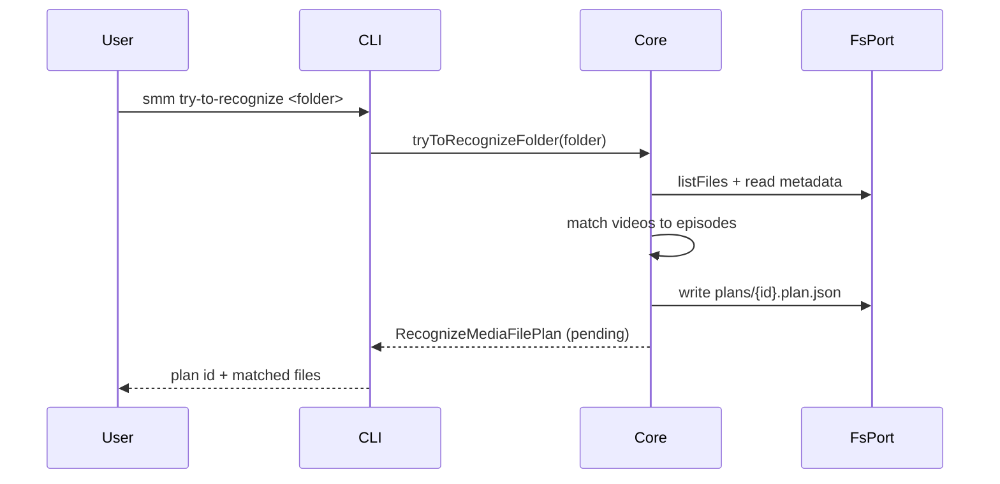
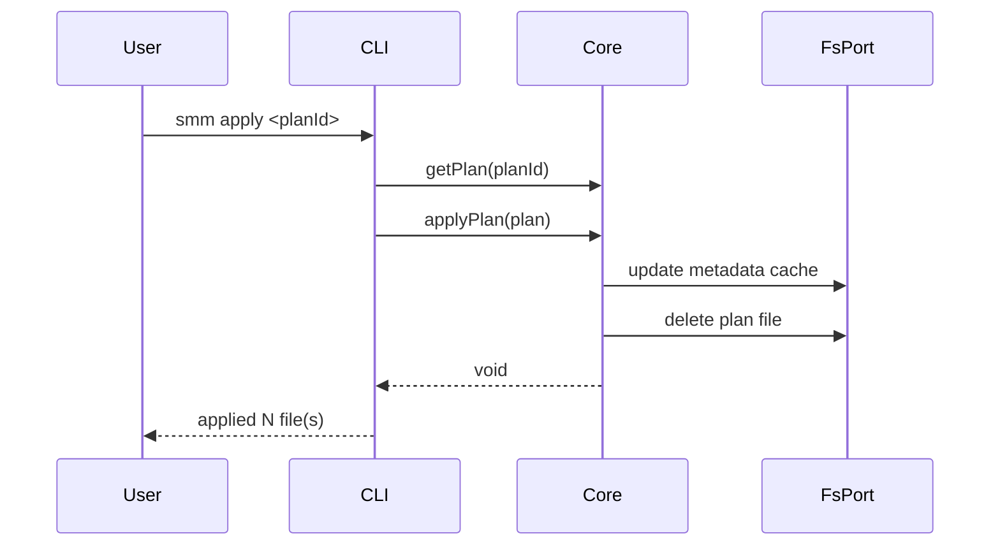
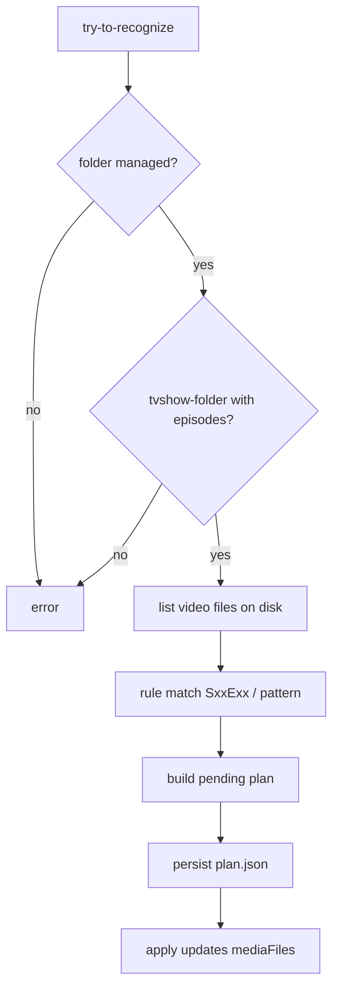
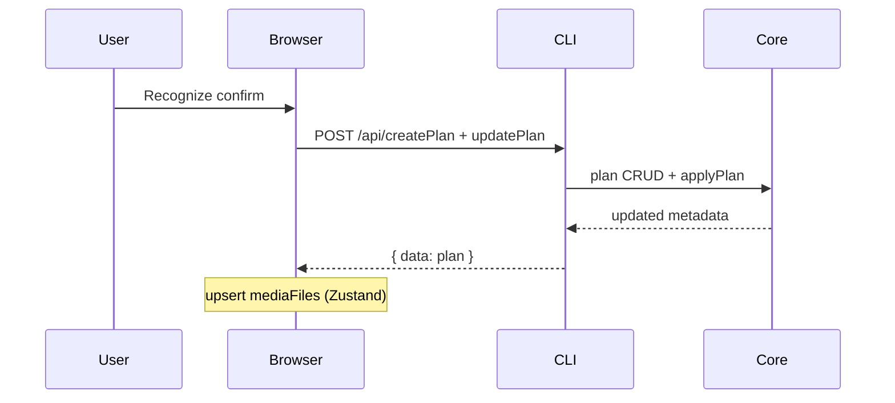

# Recognize (episode file mapping)

**Supported Platform** Web UI, CLI, Electron, ohos
**Status** done

## CLI

```
smm try-to-recognize <folder>
smm apply <planId>
```







## Web UI, Electron and ohos



## References

[Import Folder](./import-folder.md)

[Supported Platform](./supported-platform.md)
