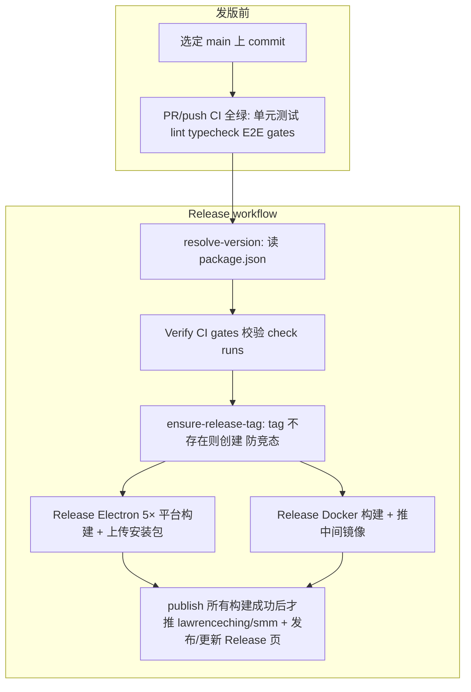

# 发版流程（Release）

本文描述 SMM **维护者** 如何发布 **Electron 桌面版** 与 **Docker 镜像**。采用短期方案：

- **e2e-gate**：Docker E2E 汇总为一个可校验的 CI 检查项  
- **可复用 build / tag**：构建与 Git tag 逻辑共用，避免 Electron / Docker 各写一套  
- **单 GitHub Release、多产物**：同一 `vX.Y.Z` tag 下挂 Electron 安装包与 Docker 说明，不重复建 tag  

> **说明**：Release Docker、e2e-gate、共用 reusable workflow 已在 CI 中落地。若本地文档与 workflow 不一致，以 `.github/workflows/` 为准。

---

## 概念

| 术语 | 含义 |
|------|------|
| **Git tag** | 如 `v1.2.3`，由 `package.json` 的 `version` 自动生成（`v` + semver） |
| **GitHub Release** | 与 tag 关联的发布页，可含 Electron 附件与 Release 说明 |
| **Docker 镜像 tag** | Hub 上 `lawrenceching/smm:1.2.3`（**无**前缀 `v`）与 `lawrenceching/smm:latest` |
| **e2e-gate** | 各 E2E workflow 末尾汇总 job；所选 matrix 通过才为 success（如 `web-ui-e2e / gate`、`docker-e2e / gate`） |
| **Verify CI gates** | 发版 workflow 第一步：校验该 commit 上 PR/push CI 已全部通过，**不重跑**测试 |

Electron 与 Docker **共用同一个 Git tag**（例如 `v1.2.3`）。先发布的一方创建 tag 与 Release；后发布的一方检测到 tag 已存在则**跳过建 tag**，只补充产物（安装包或 Docker 镜像 / Release 说明）。

---

## 发版前准备

### 1. 选定 commit

- 发版应对 **`main` 上已合并、打算对用户发布的 commit**。  
- 在 GitHub Actions 手动触发 workflow 时，在 UI 中选择正确的 **branch / tag / commit**（或使用 workflow 的 `ref` 输入，若已提供）。  
- **Electron 与 Docker 应指向同一 commit**，用户才得到一致版本。

### 2. 版本号

- 发版前在目标 commit 上 bump：
  - Electron：`apps/electron/package.json` → `version`（如 `1.2.3`）
  - Docker：`apps/docker/package.json` → `version`（须与 Electron **相同**）
- CI（`ci/resolve-release-version.ts`）自动推导：
  - **Git tag / GitHub Release**：`v` + semver（如 `v1.2.3`）
  - **Docker Hub tag**：裸 semver（如 `lawrenceching/smm:1.2.3`，**无**前缀 `v`）
- Release workflow **不再要求**手填 `tag_name`。紧急时可填可选输入 `version_override`（semver，可带或不带 `v`）。
- 联合发版（**Release**）若两边 `version` 不一致，resolve 步骤会立即失败。

### 3. 质量门禁（发版默认要求）

对**同一 commit**，以下检查须在 **push/PR 触发的 CI** 中全部通过（发版 workflow 会通过 **Verify CI gates** 校验，默认不重跑）：

| 检查项 | Workflow | Job 名称 |
|--------|----------|----------|
| Lint | **CI** | `Lint UI` |
| 多平台 Build（CI 仅 win-x64） | **Build** | `build / gate` |
| Web UI E2E（CI 仅 win-x64） | **E2E Tests for Web UI** | `web-ui-e2e / gate` |
| MCP Tools E2E（CI 仅 win-x64） | **E2E Tests for MCP Tools** | `mcp-tools-e2e / gate` |

**PR / push 到 `main` / `develop`**（改动 `apps/**`、`packages/**`、`ci/**` 等路径）会自动触发上述 workflow。

若某 commit 从未跑过完整 CI（例如仅改了 docs），**Release** 会因缺少 check run 而失败。可对该 commit 手动重跑 **CI** workflow，或仅在紧急情况下使用 `skip_gates`。

### 4. Secrets（Actions）

| Secret | Electron | Docker build/push | Docker E2E |
|--------|----------|-------------------|------------|
| `GITHUB_TOKEN` | 内置 | 内置 | 内置 |
| `DOCKERHUB_USERNAME` | — | 必填 | — |
| `DOCKERHUB_TOKEN` | 必填 | 必填 | — |
| `TMDB_API_KEY` / `TVDB_API_KEY` | — | — | 部分 suite 需要 |

---

## 总体流程



**推荐顺序（同一版本）：**

1. 在 `main` 上 bump `apps/electron/package.json` 与 `apps/docker/package.json` 的 `version` 并合并；等待 **CI** workflow 在 PR/push 上全绿（含 Build / Web UI / MCP / Docker / HTTP Proxy gates）  
2. （可选）Actions → **Pre Release**：以独立 `workflow_dispatch` 并行触发 **E2E Tests for CLI / Electron / Web UI / Docker / MCP Tools / AI Tools**（各 suite 在对应 workflow 页面有独立 run；Docker 为 linux x64/arm64，其余为五平台矩阵），确认 `pre-release / gate` 全绿  
3. Actions → **Release**（或单独 **Release Electron** / **Release Docker**）：依次 dispatch **Build**（全平台）→ **Pre Release**，再跑原有 Electron/Docker 发版与 publish。紧急时可对 **Release** 使用 `skip_build` / `skip_pre_release`（及必要时 `skip_gates`）跳过编排前置步骤；一般**无需**再填版本号（可选 `version_override`）  

**Dispatch 复用：** `ci/dispatch-and-wait-workflow.sh` 在 Actions 内会带上 `parent_run_id=<当前 run id>`。子 workflow（Build / Pre Release / 各 E2E）的 `run-name` 含 `«parent:<id>»`。若同一父 run 重试失败 job，且该父 run 已派过的同 SHA 子 run 已成功（或仍在跑），会**复用**该子 run，而不会再开一轮。手动触发且无 `parent_run_id` 的 run 不会被误用。全新再点一次 **Release**（新的 run id）不会复用上一轮的子 run，可用 `skip_build` / `skip_pre_release`。
4. 默认 **Verify CI gates** 通过后才开始构建；两个子 workflow 的 `ensure-tag` 并发创建/复用 tag（防竞态）；**所有构建成功后才统一发布**镜像与 Release 页

---

## 场景 A：仅发布 Electron

### 适用

- 只更新桌面安装包，暂不推 Docker 镜像，或 Docker 稍后另发同一 tag。

### 操作

1. Actions → **Release Electron**（`.github/workflows/release.yml`）  
2. 填写输入：

   | 输入 | 说明 |
   |------|------|
   | `version_override` | 可选；默认读 `apps/electron/package.json` 的 `version` |
   | `release_name` | Release 标题（可选） |
   | `draft` | 是否草稿 |
   | `prerelease` | 是否预发布 |
   | `body` | Release 说明（可选） |

3. 选择发版 **ref**（目标 commit）  
4. Run workflow  

### CI 行为（目标）

1. **resolve-version**：从 `apps/electron/package.json`（或 `version_override`）得到 `git_tag`（`v` + semver）
2. **Verify CI gates**：校验该 commit 上的 required check runs（不重跑测试）
3. **ensure-release-tag**：若 `git_tag` 不存在 → 创建 tag；已存在 → 跳过（并发防竞态）
4. 并行构建：linux x64/arm64、windows x64/arm64、mac arm64（构建依赖前置检查通过）
5. 若 tag **新建**：`action-gh-release` 创建 Release 并上传各平台安装包  
6. 若 tag **已存在**：跳过建 tag，向**已有 Release** 上传/更新 Electron 资产（不覆盖 Docker 相关说明）

### 发版后验证

- GitHub → Releases：对应 tag 下能看到各平台安装包  
- 本地安装 smoke test（至少一个平台）  

---

## 场景 B：仅发布 Docker

### 适用

- 只推 `lawrenceching/smm` 镜像（如容器用户），Electron 已发或暂不发。

### 操作

1. 确认目标 commit 上 **CI** 的 required checks 已通过（见上文）；Docker 专项 E2E 可选手动跑 **E2E Tests for Docker**  
2. Actions → **Release Docker**（`.github/workflows/release-docker.yml`）  
3. 填写输入：

   | 输入 | 默认 | 说明 |
   |------|------|------|
   | `version_override` | （空） | 可选；默认读 `apps/docker/package.json` 的 `version` |
   | `skip_gates` | `false` | `true` 时跳过 Verify CI gates（仅维护者紧急使用） |
   | `draft` / `prerelease` / `body` | 同 Electron | 用于 GitHub Release（新建或更新说明） |

4. 选择发版 **ref**  
5. Run workflow  

### CI 行为（目标）

1. **resolve-version**：从 `apps/docker/package.json` 得到 `git_tag`（`v1.2.3`）与 `docker_tag`（`1.2.3`）
2. **Verify CI gates**：校验该 commit 上的 required check runs（不重跑测试）
3. **ensure-release-tag**：tag 不存在 → 创建；已存在 → 跳过（并发创建已做防竞态处理）
4. **build-push-docker**（reusable **build-docker-push**）：multi-arch 构建，推送
   - `lawrenceching/smm:latest`
   - `lawrenceching/smm:<git-sha>`
   - `lawrenceching/smm:<docker_tag>`（如 `1.2.3`，无前缀 `v`）
   - 通过 **Release** 编排（build-only）时：本 workflow 只推中间镜像，最终镜像由 orchestrator 的 `publish` 统一推送
5. **release-github**
   - 单独运行：tag 不存在 → 创建 Release，`body` 含 Docker 拉取说明；tag 已存在 → 追加/更新 Docker 段
   - 通过 **Release** 编排时：本 job 跳过，统一由 orchestrator 的 `publish` 发布

### 发版后验证

```bash
docker pull lawrenceching/smm:1.2.3
docker buildx imagetools inspect lawrenceching/smm:1.2.3
# 应包含 linux/amd64 与 linux/arm64
docker run --rm -p 30000:30000 lawrenceching/smm:1.2.3
```

用户安装说明见 [docker-install.md](../docker-install.md)。

---

## 场景 C：同一版本同时提供 Electron + Docker（常见）

对**同一 commit**、两边 `package.json` **相同 `version`**：

```text
1. bump apps/electron + apps/docker version 并合并；CI required checks 全绿
2. Actions → Release（推荐）或分别跑 Release Electron / Release Docker
```

**Release** workflow 会先 **resolve-version**（两边 version 必须一致），再**并行**触发 Electron 与 Docker 两个子 workflow。两个子 workflow 都以 **build-only** 方式运行（`skip_final_publish=true`）：Electron 侧构建 5 个平台安装包并上传产物，Docker 侧构建并推送中间镜像（不推送最终 `lawrenceching/smm`）。待**所有构建都成功**后，由 orchestrator 的 `publish` job 统一推送 `lawrenceching/smm`（`latest` / `<sha>` / `<docker_tag>`）并创建/更新 GitHub Release 页面（安装包 + Docker 说明）。

- 任一子 workflow 的前置检查（`verify-ci` / `ensure-tag`）或构建失败 → 对应构建跳过，`publish` 不运行，整个 Release 快速失败。
- Git tag 由两个子 workflow 的 `ensure-tag` 并发创建，已做防竞态处理。

若只发一种产物，仍可单独运行 **Release Electron** 或 **Release Docker**（单产品发布，前置检查通过后才构建并发布）。

**GitHub Release 页面**应同时包含：

- Electron：`.exe` / `.dmg` / `.AppImage` / `.deb` 等  
- 说明文字：Docker 段落，例如  

  ```text
  ## Docker
  docker pull lawrenceching/smm:1.2.3
  详见 https://github.com/lawrenceching/SMM/blob/v1.2.3/docs/docker-install.md
  ```

---

## 共用 tag 规则（ensure-release-tag）

| 情况 | Git tag | GitHub Release | Electron 资产 | Docker 镜像 |
|------|---------|----------------|---------------|-------------|
| 首次发 `v1.2.3` | 创建 | 创建 | 上传 | 推送 `1.2.3`（无 `v`） |
| tag 已存在，补 Electron | 跳过 | 已存在，仅 upload | 上传 | — |
| tag 已存在，补 Docker | 跳过 | 已存在，edit body | — | 推送 `1.2.3`（无 `v`） |

**不要**为 Electron 与 Docker 使用不同 Git tag 表示同一版本；两边 `package.json` 的 `version` 必须一致，Git tag 为 `v` + 该 version。

---

## skip 选项（Release / Release Docker / Release Electron）

| 选项 | 作用范围 | 风险 | 何时使用 |
|------|----------|------|----------|
| `skip_build: true` | 仅 **Release** 编排的 Dispatch Build | 发版前不再跑一轮全平台 Build 校验 | 紧急发版；须确认近期 Build 可信 |
| `skip_pre_release: true` | 仅 **Release** 编排的 Dispatch Pre Release | 发版前不再跑全套产品 E2E | 偶发不稳定阻塞发版时；须人工判断风险 |
| `skip_gates: true` | Release / Release Electron / Release Docker | 未确认该 commit 上 required CI checks 全绿即发版 | 紧急 hotfix；须在 Release 说明中注明 |

`skip_build` / `skip_pre_release` **不会**跳过 Electron/Docker 子 workflow 内的产品构建与统一 `publish`。

skip 为 true 时，CI summary 会记录该次选择，便于审计。

---

## 相关 Workflows

| Workflow | 用途 | 触发 |
|----------|------|------|
| **Release** | 同时发 Electron + Docker（并行） | 手动 |
| **Release Electron** | 仅桌面安装包 + Release | 手动 |
| **Release Docker** | 仅 Hub 镜像 + Release 说明 | 手动 |
| **Build Docker** | 日常/维护：推 `latest` + sha，非 semver 发版 | 手动 |
| **CI** | 单元测试、lint、typecheck、构建 + Host / Docker / HTTP-Proxy E2E（build 全绿后才触发） | push / PR / 手动 |

可复用 workflow：

- `_build-docker-push.yml` — multi-arch 构建与 push  
- `_ensure-release-tag.yml` — 检查 / 创建 tag，输出 `tag_exists`  
- `_verify-ci-gates.yml` — 发版前校验 commit 上 required check runs  

Required checks 列表见 `ci/verify-check-runs-lib.ts` → `RELEASE_REQUIRED_CHECKS`。

---

## 当前 CI 对照

| 能力 | 状态 |
|------|------|
| Release Electron（`release.yml`） | 已有；可单独运行或由 **Release** 调用 |
| tag 已存在则跳过 | 已有（`_ensure-release-tag.yml`） |
| Release Docker（`release-docker.yml`） | 已有；可单独运行或由 **Release** 调用 |
| **Release**（`release-all.yml`） | 已有；并行触发 Electron + Docker |
| `skip_gates` | 已有（所有 Release workflow） |
| `skip_build` / `skip_pre_release` | 已有（仅 **Release** 编排） |
| PR/push 触发单元测试 + lint + typecheck + 构建 | 已有（`ci.yml`） |
| PR/push 触发 Web UI + MCP E2E（win-x64），且仅在 build 全绿后 | 已有（`ci.yml`，dispatch + gate） |
| E2E **gate** 汇总 job | 已有（`web-ui-e2e / gate`、`mcp-tools-e2e / gate`；Docker / HTTP Proxy 见独立 workflow） |
| 发版前 **Verify CI gates**（不重跑测试） | 已有（`ci/verify-check-runs.ts`） |
| Reusable build-docker-push / ensure-release-tag | 已有 |
| Build Docker（multi-arch → Hub） | 已有（调用 `_build-docker-push.yml`） |

## 故障排查

| 现象 | 可能原因 | 处理 |
|------|----------|------|
| Docker login `Username and password required` | 未配置 `DOCKERHUB_*` secrets | 仓库 Settings → Secrets |
| Release：Verify CI gates 失败 | 该 commit 缺少或未通过 required checks | 在 PR 上等待 CI 全绿，或手动重跑 **CI** workflow |
| CI 全绿但 GitHub Release 页未创建 | 子 workflow 的 job 用了 **job 级** `if:` 被 skip，导致 reusable workflow 调用方 job 结论为 `skipped`，`publish`（无 `if: always()`）随之被 skip | 改为 **step 级** `if:` 门控（如 `_verify-ci-gates.yml` 的 `skip` 输入、发布 job 的步骤门控），保证 job 本身始终运行并结论为 `success` |
| `action-gh-release` tag 已存在 | Electron/Docker 重复创建 tag | ensure-release-tag 会跳过；第二个 workflow 追加产物/说明 |
| 镜像无 arm64 | Build 未 multi-arch | 使用 **Build Docker** / Release 内 reusable build，勿仅本地 amd64 assemble |
| E2E 绿但用户反馈 Docker 异常 | E2E 测的是 job 内 amd64 本地镜像，与 Hub multi-arch 构建路径不同 | 见 [docker-install.md](../docker-install.md)；长期可考虑 digest promotion |

---

## 参考

- [docker-install.md](../docker-install.md) — 用户安装 Docker 镜像  
- [apps/docker/README.md](../../apps/docker/README.md) — 本地构建镜像（开发者）  
- [apps/electron/docs/pack-external-binaries-plan.md](../../apps/electron/docs/pack-external-binaries-plan.md) — Electron 打包依赖  
