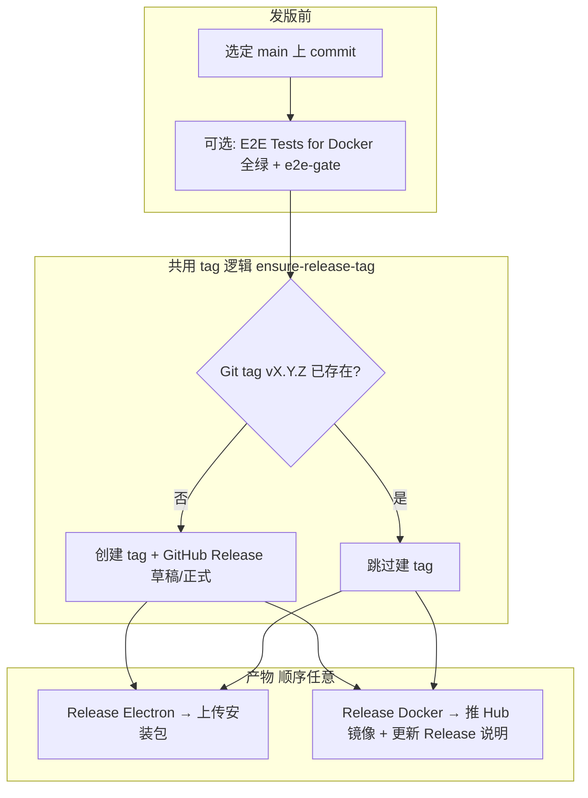

# 发版流程（Release）

本文描述 SMM **维护者** 如何发布 **Electron 桌面版** 与 **Docker 镜像**。采用短期方案：

- **e2e-gate**：Docker E2E 汇总为一个可校验的 CI 检查项  
- **可复用 build / tag**：构建与 Git tag 逻辑共用，避免 Electron / Docker 各写一套  
- **单 GitHub Release、多产物**：同一 `vX.Y.Z` tag 下挂 Electron 安装包与 Docker 说明，不重复建 tag  

> **说明**：Release Docker、e2e-gate、共用 reusable workflow 已在 CI 中落地。若本地文档与 workflow 不一致，以 `.github/workflows/` 为准。

---

## 概念

| 术语 | 含义 |
|------|------|
| **Git tag** | 如 `v1.2.3`，标记发布对应的 commit |
| **GitHub Release** | 与 tag 关联的发布页，可含 Electron 附件与 Release 说明 |
| **Docker 镜像 tag** | Hub 上 `lawrenceching/smm:v1.2.3` 与 `lawrenceching/smm:latest` |
| **e2e-gate** | `E2E Tests for Docker` workflow 末尾的汇总 job；全 matrix 通过才为 success |

Electron 与 Docker **共用同一个 Git tag**（例如 `v1.2.3`）。先发布的一方创建 tag 与 Release；后发布的一方检测到 tag 已存在则**跳过建 tag**，只补充产物（安装包或 Docker 镜像 / Release 说明）。

---

## 发版前准备

### 1. 选定 commit

- 发版应对 **`main` 上已合并、打算对用户发布的 commit**。  
- 在 GitHub Actions 手动触发 workflow 时，在 UI 中选择正确的 **branch / tag / commit**（或使用 workflow 的 `ref` 输入，若已提供）。  
- **Electron 与 Docker 应指向同一 commit**，用户才得到一致版本。

### 2. 版本号

- Git tag 建议与 `apps/electron/package.json` 的 `version` 对齐，格式 **`v` + semver**（如 `v1.2.3`）。  
- Docker Hub 使用相同字符串 tag：`lawrenceching/smm:v1.2.3`（与 Git tag 一致，便于对照）。

### 3. 质量门禁（Docker 发版默认要求）

在触发 **Release Docker** 之前，对**同一 commit** 完成：

| 检查 | Workflow | 说明 |
|------|----------|------|
| 单元测试 | `Build UI and CLI`（push/PR）或 Release 内 `unit-tests` | 默认不跳过 |
| Docker E2E | **E2E Tests for Docker** | 须全 matrix + **e2e-gate** 通过；Release 校验 gate，**不重跑**全量 e2e |

操作步骤：

1. Actions → **E2E Tests for Docker** → Run workflow  
2. 选择发版目标 **branch / commit**  
3. 等待所有 matrix job 及 **e2e-gate** 均为绿色  

若从未对该 commit 跑过 Docker E2E，**Release Docker** 应失败（无 gate 记录）。

### 4. Secrets（Actions）

| Secret | Electron | Docker build/push | Docker E2E |
|--------|----------|-------------------|------------|
| `GITHUB_TOKEN` | 内置 | 内置 | 内置 |
| `DOCKERHUB_USERNAME` | — | 必填 | — |
| `DOCKERHUB_TOKEN` | 必填 | 必填 | — |
| `TMDB_API_KEY` / `TVDB_API_KEY` | — | — | 部分 suite 需要 |

---

## 总体流程



**推荐顺序（同一版本）：**

1. （可选）合并后跑 **Build UI and CLI** 确认单元测试  
2. 对目标 commit 跑 **E2E Tests for Docker**，确认 **e2e-gate** 通过  
3. **Release Electron** 或 **Release Docker** 任选先后；第二个会自动复用已有 tag  

---

## 场景 A：仅发布 Electron

### 适用

- 只更新桌面安装包，暂不推 Docker 镜像，或 Docker 稍后另发同一 tag。

### 操作

1. Actions → **Release Electron**（`.github/workflows/release.yml`）  
2. 填写输入：

   | 输入 | 说明 |
   |------|------|
   | `tag_name` | 如 `v1.2.3`（必填） |
   | `release_name` | Release 标题（可选） |
   | `draft` | 是否草稿 |
   | `prerelease` | 是否预发布 |
   | `body` | Release 说明（可选） |

3. 选择发版 **ref**（目标 commit）  
4. Run workflow  

### CI 行为（目标）

1. 并行构建：linux x64/arm64、windows x64/arm64、mac arm64  
2. **ensure-release-tag**：若 `tag_name` 不存在 → 创建 tag；已存在 → 跳过  
3. 若 tag **新建**：`action-gh-release` 创建 Release 并上传各平台安装包  
4. 若 tag **已存在**：跳过建 tag，向**已有 Release** 上传/更新 Electron 资产（不覆盖 Docker 相关说明）

### 发版后验证

- GitHub → Releases：对应 tag 下能看到各平台安装包  
- 本地安装 smoke test（至少一个平台）  

---

## 场景 B：仅发布 Docker

### 适用

- 只推 `lawrenceching/smm` 镜像（如容器用户），Electron 已发或暂不发。

### 操作

1. 确认目标 commit 上 **E2E Tests for Docker** 的 **e2e-gate** 已通过（见上文）  
2. Actions → **Release Docker**（`.github/workflows/release-docker.yml`）  
3. 填写输入：

   | 输入 | 默认 | 说明 |
   |------|------|------|
   | `tag_name` | — | 如 `v1.2.3`（必填） |
   | `skip_unit_tests` | `false` | `true` 时跳过 `pnpm -r test`（仅维护者紧急使用） |
   | `skip_e2e_tests` | `false` | `true` 时跳过 e2e-gate 校验；默认必须已通过 gate |
   | `draft` / `prerelease` / `body` | 同 Electron | 用于 GitHub Release（新建或更新说明） |

4. 选择发版 **ref**  
5. Run workflow  

### CI 行为（目标）

1. **unit-tests**（除非 `skip_unit_tests`）  
2. **verify-docker-e2e**（除非 `skip_e2e_tests`）：检查该 commit 是否存在成功的 **e2e-gate**，不重跑 E2E  
3. **build-push-docker**（reusable **build-docker-push**）：multi-arch 构建，推送  
   - `lawrenceching/smm:latest`  
   - `lawrenceching/smm:<git-sha>`  
   - `lawrenceching/smm:<tag_name>`（如 `v1.2.3`）  
4. **ensure-release-tag** + **release-github**  
   - tag 不存在：创建 Release，`body` 含 Docker 拉取说明  
   - tag 已存在（例如 Electron 先发布）：跳过建 tag，**追加/更新** Release 说明中的 Docker 段  

### 发版后验证

```bash
docker pull lawrenceching/smm:v1.2.3
docker buildx imagetools inspect lawrenceching/smm:v1.2.3
# 应包含 linux/amd64 与 linux/arm64
docker run --rm -p 30000:30000 lawrenceching/smm:v1.2.3
```

用户安装说明见 [docker-install.md](../docker-install.md)。

---

## 场景 C：同一版本同时提供 Electron + Docker（常见）

对**同一 commit**、**同一 `tag_name`**：

```text
1. E2E Tests for Docker（手动，e2e-gate 全绿）
2. Release Electron  或  Release Docker  （顺序不限）
3. 另一个 Release workflow               （自动跳过建 tag，只补产物）
```

**GitHub Release 页面**应同时包含：

- Electron：`.exe` / `.dmg` / `.AppImage` / `.deb` 等  
- 说明文字：Docker 段落，例如  

  ```text
  ## Docker
  docker pull lawrenceching/smm:v1.2.3
  详见 https://github.com/lawrenceching/SMM/blob/v1.2.3/docs/docker-install.md
  ```

---

## 共用 tag 规则（ensure-release-tag）

| 情况 | Git tag | GitHub Release | Electron 资产 | Docker 镜像 |
|------|---------|----------------|---------------|-------------|
| 首次发 `v1.2.3` | 创建 | 创建 | 上传 | 推送 `v1.2.3` |
| tag 已存在，补 Electron | 跳过 | 已存在，仅 upload | 上传 | — |
| tag 已存在，补 Docker | 跳过 | 已存在，edit body | — | 推送 `v1.2.3` |

**不要**为 Electron 与 Docker 使用不同 tag 表示同一版本；用户与文档都假设 **`vX.Y.Z` 一一对应**。

---

## skip 选项（仅 Release Docker）

| 选项 | 风险 | 何时使用 |
|------|------|----------|
| `skip_unit_tests: true` | 未测代码可能进镜像 | 仅重推镜像、commit 未变且已测过 |
| `skip_e2e_tests: true` | 未跑 Docker E2E 即发布 | 紧急 hotfix；须在 Release 说明中注明 |

skip 为 true 时，CI summary 应记录该次选择，便于审计。

---

## 相关 Workflows

| Workflow | 用途 | 触发 |
|----------|------|------|
| **Release Electron** | 桌面安装包 + Release | 手动 |
| **Release Docker** | Hub 镜像 + Release 说明 | 手动 |
| **Build Docker** | 日常/维护：推 `latest` + sha，非 semver 发版 | 手动 |
| **E2E Tests for Docker** | Docker 回归；发版前跑 gate | 手动 |
| **Build UI and CLI** | PR/main 单元测试 | push / PR |

可复用 workflow（Release / Build Docker 共用）：

- `_build-docker-push.yml` — multi-arch 构建与 push  
- `_ensure-release-tag.yml` — 检查 / 创建 tag，输出 `tag_exists`  

---

## 当前 CI 对照

| 能力 | 状态 |
|------|------|
| Release Electron（`release.yml`） | 已有；并行多平台构建 + 新建/追加 Release |
| tag 已存在则跳过 | 已有（`_ensure-release-tag.yml`） |
| Release Docker（`release-docker.yml`） | 已有 |
| `skip_unit_tests` / `skip_e2e_tests` | 已有（Release Docker） |
| E2E **e2e-gate** 汇总 job | 已有（`e2e-docker.yml`） |
| Release 内校验 e2e-gate（不重跑 e2e） | 已有（`ci/verify-docker-e2e-gate.ts`） |
| Reusable build-docker-push / ensure-release-tag | 已有 |
| Build Docker（multi-arch → Hub） | 已有（调用 `_build-docker-push.yml`） |
| E2E Tests for Docker | 已有（含 gate） |

## 故障排查

| 现象 | 可能原因 | 处理 |
|------|----------|------|
| Docker login `Username and password required` | 未配置 `DOCKERHUB_*` secrets | 仓库 Settings → Secrets |
| Release Docker：e2e 校验失败 | 该 commit 未跑 E2E 或 gate 未绿 | 对同一 commit 重跑 **E2E Tests for Docker** |
| `action-gh-release` tag 已存在 | Electron/Docker 重复创建 tag | ensure-release-tag 会跳过；第二个 workflow 追加产物/说明 |
| 镜像无 arm64 | Build 未 multi-arch | 使用 **Build Docker** / Release 内 reusable build，勿仅本地 amd64 assemble |
| E2E 绿但用户反馈 Docker 异常 | E2E 测的是 job 内 amd64 本地镜像，与 Hub multi-arch 构建路径不同 | 见 [docker-install.md](../docker-install.md)；长期可考虑 digest promotion |

---

## 参考

- [docker-install.md](../docker-install.md) — 用户安装 Docker 镜像  
- [apps/docker/README.md](../../apps/docker/README.md) — 本地构建镜像（开发者）  
- [apps/electron/docs/pack-external-binaries-plan.md](../../apps/electron/docs/pack-external-binaries-plan.md) — Electron 打包依赖  
