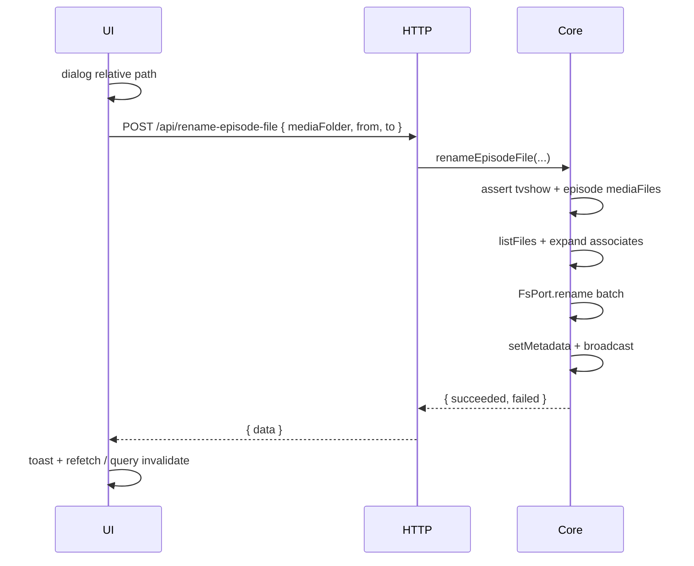

# Rename Episode File (context-menu rename → Core)


SMM provides 3 renaming functions:
**Rename Folder** rename media folder, see [Rename Folder](./rename-folder.md)
**Rename Episodes** Rename recognized episode files all at once. See [Rename Episode Files](./rename-episodes.md)
**Rename Episode** Rename single recognized episode file

This page is for **Rename Episode**. Don't get confused.


This design document is the **golden source** for porting the **TV episode context-menu “Rename”** flow into Layer 2 Core, then wiring Layer 1 clients through the Internal HTTP API (and thin Core callers).

**Naming:** Core / HTTP / CLI / MCP / AI use **`renameEpisodeFile`** / **`rename-episode-file`** only. Do **not** name this `renameVideoFile` — that is too broad. This API renames an **episode’s linked media file** (and same-stem associates) inside a **TV show** folder. It does **not** support renaming arbitrary video files (e.g. orphan files, music videos, or movie-panel videos).

Sibling docs (different features — do not confuse):

| Doc / feature | What it renames |
|---------------|-----------------|
| **This doc** | One **episode** file (+ same-stem associates) via right-click **重命名**, plus the same Core API exposed to **CLI / MCP / in-app AI** |
| [rename-folder](../api/index.md) / `Core.renameFolder` | Entire **media folder** directory |
| `smm try-to-rename` / rule-based toolbar | Batch plex/emby **naming-rule** plans |
| AI `begin/add/end-rename-files-task` | AI-authored **batch rename plans** (multi-file task) — **not** this single-episode tool |
| Movie panel “Rename” | Separate legacy path (`useRenameVideoFileFlow` / `/api/renameFiles`) — **out of scope** for this Core API |

Architecture baseline: [refactoring.md](../../refactoring.md). Pattern reference: [scrape.md](./scrape.md) (Core parity → HTTP → UI / CLI / AI / MCP); MCP/AI confirmation pattern: `rename-folder`.

## 1. Background

### 1.1 Legacy UX (must preserve)

In the **TV show** panel, the user right-clicks an episode row → **Rename** / **重命名**:

1. A rename dialog opens, pre-filled with the episode file’s path **relative to the media folder** (e.g. `S01E01.mp4` or `Season 01\….mkv`).
2. Confirm is disabled while the value is unchanged; enabled when the user edits it.
3. On confirm:
   - Rename the **episode file** to the new absolute path (media folder + new relative path).
   - Rename every **associated file** that shares that file’s stem (e.g. `S01E01.srt`, `S01E01.en.srt`, `S01E01.ass`) to the new stem, **keeping each associate’s directory**.
4. Persist updated `mediaFiles` / `files` in metadata and refresh the UI.

E2E coverage: `apps/e2e/common/tv/TVShow-RenameEpisodeFile.e2e.ts`.

### 1.2 Scope boundary (important)

| In scope | Out of scope |
|----------|----------------|
| `tvshow-folder` with episode linked in `mediaFiles` (`seasonNumber` + `episodeNumber`) | Movie folder / movie panel rename |
| Context-menu rename of that episode’s primary file + same-stem associates | Arbitrary path under the folder that is not an episode `mediaFiles` entry |
| | Rule-based / AI plan batch rename |
| | Folder rename |

Core **must reject** requests where `from` is not the `absolutePath` of a TV episode entry in `mediaFiles`. This is what keeps the API from becoming a generic “rename any video” endpoint.

### 1.3 Legacy implementation (business logic in UI)

| Piece | Location | Role today |
|-------|----------|------------|
| Context menu entry | `TvShowPanel` → `MediaFileTable` extra menu; also `TvShowEpisodeTable` | Opens rename dialog for an episode row |
| Flow hook | `apps/ui/src/hooks/useRenameVideoFileFlow.ts` | Shared hook today (also used by Movie) — **TV v3 path** should call `renameEpisodeFile`; movie stays on legacy |
| Associate expansion | `computeAssociatedFileRenames` in `apps/ui/src/components/episode-file.tsx` | Stem-based sibling renames |
| HTTP | `POST /api/renameFiles` (`packages/core-routes`) | Generic batch rename + optional metadata update + broadcast |
| Metadata helper | `updateMediaMetadataAfterRename` in `packages/core/mediaMetadata.ts` | Already shared — keep / call from Core |

Problem: associate discovery and orchestration live in **Layer 1**. Electron / OHOS / Web all depend on UI code; Core cannot be unit-tested as the source of truth; `/api/renameFiles` is a low-level batch API that still expects the client to build the full rename list and does not enforce “episode only”.

### 1.4 Goal

1. **Port** legacy **episode** rename orchestration into `apps/core` (FsPort + metadata), with episode identity checks.  
2. Expose a **thin Internal HTTP** command that only validates and calls Core.  
3. Point **TV** frontends (Web UI, Electron, OHOS — shared `apps/ui`) at that API under `smm.v3.enabled`.  
4. Expose the **same Core capability** to **CLI**, **MCP**, and **in-app AI tool** (shared schemas; confirmation for MCP/AI).  
5. Leave movie rename, rule-based / AI **batch plans**, and **folder** rename out of this workstream.

### 1.5 Delivery phases

1. **Core** — `Core.renameEpisodeFile` with episode check + associate expansion + disk + metadata + shared rename preflight  
2. **HTTP** — `POST /api/rename-episode-file` → Core; Socket/metadata broadcast parity with today’s `/api/renameFiles`  
3. **UI v3 (TV only)** — episode context-menu confirm calls the new API; no client-side `computeAssociatedFileRenames` when v3 is on  
4. **CLI** — `smm rename <from> <to>` auto-dispatches `renameFolder` vs `renameEpisodeFile` (alias: `rename-episode-file`)  
5. **MCP + AI tool** — shared `rename-episode-file` tool schemas; MCP handler + in-app assistant tool; **user confirmation** before disk write (mirror `rename-folder`)  
6. **Cleanup** — optional: dual paths for TV; keep generic `/api/renameFiles` for movie / plan apply until those migrate  

## 2. Architecture

### 2.1 Project Level Architecture

```
Layer 1: Web UI / Electron / OHOS / CLI / in-app AI / MCP clients
    │
    │  POST /api/rename-episode-file   (UI v3, in-app AI)
    │  Core.renameEpisodeFile(...)     (CLI direct; MCP via host)
    │  mediaMetadataUpdated (Socket.IO) — same as today
    ▼
Layer 3: apps/cli Hono (or core-routes adapter) + MCP server
    │
    │  Core.renameEpisodeFile(...)
    ▼
Layer 2: apps/core
    assertEpisodeMediaFile (tvshow-folder + mediaFiles match)
    expandAssociatedFileRenames (port of computeAssociatedFileRenames)
    validateRenameOperations (path + FS preflight)
    FsPort.mkdir / rename (batch)
    updateMediaMetadataAfterRename + setMetadata
```

Per [refactoring.md](../../refactoring.md): UI only collects intent (dialog relative path) and renders results; **no** associate math and **no** metadata rewrite in Layer 1 for the v3 path. CLI / MCP / AI must **not** reimplement associate expansion — they pass primary `from` / `to` only.

### 2.2 App Level Architecture

| Piece | Role |
|-------|------|
| `Core.renameEpisodeFile(input)` | Assert TV episode; expand associates; preflight; rename; update metadata; return result |
| `assertEpisodeMediaFile` | Folder is `tvshow-folder`; `from` matches a `mediaFiles` entry with season/episode |
| `expandAssociatedFileRenames` | Port of UI `computeAssociatedFileRenames` (stem + suffix; same directory) |
| `updateMediaMetadataAfterRename` | Existing pure helper — Core must apply it after successful disk renames |
| `POST /api/rename-episode-file` | Body → Core → `{ data }` / `{ error }`, HTTP 200 |
| Broadcast | After success: `mediaMetadataUpdated` for the folder (parity with `/api/renameFiles`) |
| UI TV context menu | v3 ON → new API with `{ mediaFolder, from, to }` only; v3 OFF → legacy client expand + `/api/renameFiles` |
| CLI | `smm rename <from> <to>` auto-dispatches folder vs episode; alias `rename-episode-file` |
| MCP tool `rename-episode-file` | Same args as HTTP; **confirm** then Core (or HTTP); omit on hosts that cannot rename files |
| In-app AI tool `rename-episode-file` | Same schemas as MCP; UI confirmation bridge then `POST /api/rename-episode-file` |

### 2.3 Key Design

#### Decisions

| Topic | Choice |
|-------|--------|
| Naming | **`renameEpisodeFile`** / `/api/rename-episode-file` only — never `renameVideoFile` |
| Response envelope | `{ data?, error? }`, HTTP **200** (same as import / scrape / rename-folder) |
| Error string | `Error Reason: <detail>` |
| Sync vs job | **Synchronous** command (small batch). No JobStore / plan. |
| Client payload | One primary **episode file** rename (`from` / `to`); Core expands associates |
| Associate semantics | **Legacy context-menu**: same directory, stem prefix match (`stem` or `stem.*`) — **not** rule-based season-folder move |
| Folder type | **`tvshow-folder` only** |
| Episode identity | `from` must equal a `mediaFiles[].absolutePath` that has `seasonNumber` and `episodeNumber` |
| Movie | **Out of scope** — keep legacy `/api/renameFiles` |
| Feature flag | `smm.v3.enabled` — mirror scrape / rename-folder |
| Existing `/api/renameFiles` | Keep for movie, rule-based, AI plan apply, and v3-off TV path |

#### Prerequisites

Fail before any disk write when:

- `mediaFolder` is missing / empty  
- Folder is not managed by SMM  
- Metadata missing or `type !== "tvshow-folder"`  
- `from` / `to` missing  
- `from === to` (dialog already disables confirm; API should still reject)  
- `from` is not under the media folder  
- Destination `to` would escape the media folder  
- **`from` is not a linked episode file** in `mediaFiles` (no matching entry with both `seasonNumber` and `episodeNumber`)  

#### Associate expansion (parity with UI)

Port `computeAssociatedFileRenames(episodeOld, episodeNew, allFilesInFolder)`:

1. Derive old/new **basename stems** (strip last extension).  
2. If stems empty or equal → no associates.  
3. For each path in the folder file list (excluding the episode file itself): if basename is `oldStem` or starts with `oldStem + '.'`, map to `dirname(assoc) + newStem + suffix`.  
4. Primary list for disk ops: `[{ from: episodeOld, to: episodeNew }, ...associates]`.

Core should obtain `allFilesInFolder` via `FsPort.listFiles(mediaFolder)` (or accept an optional list for tests). Do **not** rely on deprecated `metadata.files` alone.

#### Runtime flow

1. Normalize `mediaFolder`, `from`, `to` to POSIX internally; platform paths for FsPort as needed.  
2. Validate managed + `tvshow-folder` + episode `mediaFiles` match + paths in folder.  
3. `listFiles` → `expandAssociatedFileRenames`.  
4. For each pair: ensure parent of `to` exists; `rename(from, to)`.  
5. On full or partial success: `updateMediaMetadataAfterRename` for successful pairs; `setMetadata`; broadcast `mediaMetadataUpdated`.  
6. Return `{ succeeded, failed }` (same shape spirit as today’s renameFiles `data`).

Partial failure policy: match `/api/renameFiles` — report per-path failures; still update metadata for successful renames.

#### Core signature

```ts
export interface RenameEpisodeFileInput {
  /** Absolute media folder path (platform or POSIX; Core normalizes). */
  mediaFolderPath: string
  /** Absolute current episode file path (must be a linked mediaFiles entry). */
  from: string
  /** Absolute desired episode file path (under the same media folder tree). */
  to: string
}

export interface RenameEpisodeFileResult {
  /** Successful renames (episode file + associates). */
  succeeded: Array<{ from: string; to: string }>
  failed: Array<{ path: string; error: string }>
}

Core.renameEpisodeFile(input: RenameEpisodeFileInput): Promise<RenameEpisodeFileResult>
```

Optional convenience: accept `toRelative` instead of absolute `to` and join inside Core — either is fine if HTTP and UI agree. CLI may accept relative `--from` / `--to` and resolve against `<folder>` before calling Core.

#### Legacy sources to port (do not call UI from Core)

- Associate logic: `apps/ui/src/components/episode-file.tsx` → `computeAssociatedFileRenames`  
- Orchestration (TV): `useRenameVideoFileFlow` / `TvShowEpisodeTable` context menu — only the **episode** confirm path  
- Metadata: `packages/core/mediaMetadata.ts` → `updateMediaMetadataAfterRename`  
- Preflight: shared `packages/core/validations/rename` (`validateRenameOperations` + FS probe) — path rules, source must exist, dest must not; refuse entire batch before any rename  

Note: Core already has `findAssociatedFiles` for **rule-based** apply (extension allowlists + season moves). Context-menu rename must keep **`computeAssociatedFileRenames` semantics**, not silently switch to `findAssociatedFiles`.

#### CLI

Unified command (preferred):

```
smm rename <from> <to>
```

| Arg | Meaning |
|-----|---------|
| `<from>` | Absolute path of a **managed media folder**, or of a **linked episode file** under one |
| `<to>` | Absolute target path |

**Auto-dispatch** (no `--folder` / `--episode` required for the happy paths):

1. Load managed folders via `Core.getFolders()`.  
2. If `<from>` **exactly matches** a managed media folder → `Core.renameFolder({ from, to })`.  
3. Else find the managed folder that **contains** `<from>` (longest POSIX prefix wins if folders nest).  
4. If none → error: not under a managed media folder.  
5. If `<from>` is a **directory** but not a media-folder root (e.g. `…/Show/Season 01`) → error: only media-folder roots or linked episode files.  
6. Otherwise treat as episode file → `Core.renameEpisodeFile({ mediaFolderPath, from, to })` (Core expands associates + preflight).

Examples:

```bash
# Episode file (+ associates)
smm rename "/media/TV/Show/Season 01/ep1.mkv" "/media/TV/Show/Season 01/S01E01.mkv"

# Media folder
smm rename "/media/TV/Show" "/media/TV/Show2"
```

Output:

- Folder rename: one line `from → to`, exit `0` / `1`.  
- Episode rename: one line per `succeeded` pair; `FAILED path: error` for failures; exit `1` if Core throws or any pair failed.

**Compatibility alias** (still supported):

```
smm rename-episode-file <folder> --from <path> --to <path>
```

Resolves relative `--from` / `--to` against `<folder>`, then calls the same episode path as `smm rename` (does not auto-dispatch to folder rename).

#### MCP tool

Mirror **`rename-folder`**: one shared tool contract in `@smm/core/types/ai-tools/renameEpisodeFile` (name, description, Zod input/output), registered on the MCP server and reused by the in-app AI tool.

| Field | Value |
|-------|--------|
| Tool name | `rename-episode-file` (`RENAME_EPISODE_FILE`) |
| Input | `{ mediaFolder: string, from: string, to: string }` — absolute paths (POSIX or Windows); same semantics as HTTP |
| Output | `{ renamed: boolean, succeeded: Array<{from,to}>, failed: Array<{path,error}>, error?: string }` (shape may align with existing `toolOk` / `createSuccessResponse` conventions) |

Execution (MCP host, e.g. Bun cli):

1. Validate non-empty strings.  
2. **Ask for confirmation** via Socket `askForConfirmation` (or host-equivalent acknowledge), with a message that names the primary episode rename and notes that same-stem associates will also be renamed. Title e.g. `Rename episode file`.  
3. If cancelled → return cancelled result (no disk writes).  
4. If confirmed → call `Core.renameEpisodeFile` (preferred) or `POST /api/rename-episode-file` on the same process.  
5. Map Core throw → tool error string; map `{ succeeded, failed }` → tool success payload (include `failed` even when `succeeded.length > 0`).

**Host notes:**

- Hosts that cannot rename files (e.g. HarmonyOS sandbox) must pass `disabledTools: [RENAME_EPISODE_FILE]` so `tools/list` never advertises the tool (same pattern as `RENAME_FOLDER`).  
- Description must state: **TV episode file only**; not for folders; not for movies; not for arbitrary paths; for multi-file batch plans use `begin/add/end-rename-files-task`.

#### AI tool (in-app assistant)

Same tool name / description / input schema as MCP (`packages/core/types/ai-tools/renameEpisodeFile`).

| Concern | Choice |
|---------|--------|
| Registration | `apps/ui` assistant-ui tool (like `RenameFolder.tsx`) |
| Confirmation | UI confirmation dialog / `requestConfirmation` bridge **before** HTTP |
| Execute | `POST /api/rename-episode-file` (not a second Core embed in the browser) |
| Result copy | Shared helpers under `@core/ai-tool/` (`renameEpisodeFileConfirm`, `renameEpisodeFileResult`) mirroring rename-folder |
| Model guidance | Prefer this tool when the user asks to rename **one** linked episode file; prefer plan tools when renaming **many** files under a naming rule |

Do **not** teach the model to call generic `/api/renameFiles` for this UX — that bypasses episode identity checks.

## 3. HTTP API

All endpoints: **HTTP 200**. Clients use `error` for business failure and `data` for success.

### 3.1 `POST /api/rename-episode-file` (new)

**Request**

```ts
interface RenameEpisodeFileRequestBody {
  /** Absolute media folder path. */
  mediaFolder: string
  /** Absolute current episode file path. */
  from: string
  /** Absolute target episode file path. */
  to: string
}
```

**Success**

```json
{
  "data": {
    "succeeded": [
      { "from": "…/S01E01.mp4", "to": "…/S01E01_renamed.mp4" },
      { "from": "…/S01E01.srt", "to": "…/S01E01_renamed.srt" }
    ],
    "failed": []
  }
}
```

**Failure**

```json
{
  "error": "Error Reason: …"
}
```

| Condition | Detail after `Error Reason: ` |
|-----------|-------------------------------|
| Missing fields | `mediaFolder is required` / `from is required` / `to is required` |
| Unmanaged folder | `{path} is not managed by SMM` |
| Not TV show | `Folder is not a TV show: {path}` |
| Not an episode file | `File is not a linked episode: {from}` |
| Path outside folder | `Path is outside media folder: …` |
| Validation / IO | Human-readable rename validation or fs error |

Unexpected route exceptions also return `{ error: "Error Reason: …" }` with HTTP 200.

After success, server broadcasts `mediaMetadataUpdated` for the folder (clients invalidate / refetch metadata queries).

### 3.2 Existing `POST /api/renameFiles`

Unchanged in phases 1–3. Still used by:

- Movie panel rename  
- Rule-based rename confirm (`applyRenameFilesPlanForTvShow`)  
- AI rename confirm  
- v3 **off** TV context-menu path  

## 4. User Stories

### 4.1 Rename episode file + associates (happy path)

* **Given** a managed TV folder with episode `S01E01` linked to `S01E01.mp4` and `S01E01.srt`  
* **When** the user renames via context menu to `S01E01_renamed.mp4`  
* **Then** both files are renamed on disk  
* **And** metadata `mediaFiles` paths update  
* **And** UI shows the new name after refetch / socket  



### 4.2 Reject non-episode file

* **Given** a managed TV folder  
* **When** the client calls `renameEpisodeFile` with a `from` path that is not in `mediaFiles` as an episode  
* **Then** response is `{ error: "Error Reason: File is not a linked episode: …" }`  
* **And** no files are renamed  

### 4.3 v3 off keeps legacy path

* **Given** `smm.v3.enabled` is false  
* **When** the user uses TV context-menu Rename  
* **Then** UI still expands associates and calls `POST /api/renameFiles`  

### 4.4 v3 on all TV frontends

* **Given** Web, Electron, or OHOS with shared UI and v3 enabled  
* **When** TV episode context-menu Rename confirms  
* **Then** only `POST /api/rename-episode-file` → Core runs (no UI `computeAssociatedFileRenames`)  

### 4.5 Prerequisite / validation failure

* **Given** an unmanaged path, movie folder, or `to` outside the media folder  
* **When** the client calls `POST /api/rename-episode-file`  
* **Then** response is `{ error: "Error Reason: …" }`  
* **And** no files are renamed  

### 4.6 CLI rename (unified)

* **Given** a managed TV folder with a linked episode file  
* **When** the operator runs `smm rename <episode-from> <episode-to>`  
* **Then** Core renames the episode (+ associates)  
* **And** stdout lists each succeeded pair  

* **Given** a managed media folder  
* **When** the operator runs `smm rename <folder-from> <folder-to>`  
* **Then** Core renames the folder and rewrites metadata / user config  

### 4.7 MCP / AI tool with confirmation

* **Given** MCP or in-app AI invokes `rename-episode-file`  
* **When** the user **cancels** confirmation  
* **Then** no files are renamed and the tool reports cancelled  
* **When** the user **confirms**  
* **Then** Core (or HTTP → Core) runs the same path as the UI v3 context menu  

### 4.8 Boundary vs batch rename plan tools

* **Given** the assistant needs to rename many files under a plex/emby-style plan  
* **When** choosing a tool  
* **Then** it uses `begin/add/end-rename-files-task`, **not** `rename-episode-file`  

## 5. Out of scope

- Media **folder** rename (`Core.renameFolder` / `/api/rename-folder`) — separate tool `rename-folder`  
- **Movie** panel / movie-folder file rename (keep legacy)  
- Renaming **arbitrary** files or videos not linked as episodes in `mediaFiles`  
- Toolbar **plex/emby** rule-based batch rename / `try-to-rename` plans  
- Replacing AI / MCP **batch plan** tools (`begin/add/end-rename-files-task`) — they remain; this doc adds a **different** single-episode tool beside them  
- Changing dialog UX (suggestions, i18n) beyond swapping the confirm API  
- Replacing `/api/renameFiles` for plan apply / movie in this milestone  
- Job-based progress UI for a single rename  
- Interactive CLI confirmation (shell is trusted; MCP/AI confirm instead)  

## 6. Testing strategy

- **Core unit:** episode assert accepts linked `mediaFiles` entry and rejects unlinked paths / movie folders; stem associate expansion matches `computeAssociatedFileRenames` fixtures (`S01E01.en.srt` → new stem); rejects unmanaged / escape paths; preflight refuses dest-exists / missing source before any rename; metadata updated via `updateMediaMetadataAfterRename`; partial failure still writes metadata for succeeded pairs.  
- **HTTP route tests:** success returns `data.succeeded`; validation / not-episode / not-TV errors.  
- **UI unit:** TV context-menu flow with v3 on posts `{ mediaFolder, from, to }` to `/api/rename-episode-file` only; v3 off keeps legacy; movie panel unchanged.  
- **CLI e2e / unit:** `smm rename` dispatches folder vs episode; reject subdirectory / unmanaged; episode success prints pairs; folder success updates `list` + metadata cache.  
- **MCP / AI tool unit:** shared schema; cancel confirmation → no Core call; confirm → Core/HTTP invoked with primary paths only (no client-side associate list).  
- **E2E:** `TVShow-RenameEpisodeFile.e2e.ts` must pass with v3 on against Core path (Web / Electron / OHOS / Docker as already tagged).  

## 7. Compatibility notes

- Relative path editing stays in the dialog (Layer 1); Core receives absolute `from` / `to`. CLI may resolve relatives at the edge.  
- Do not conflate with `buildTvShowRenameListForPlan` (moves associates into season folders).  
- `metadata.files` is legacy; prefer disk `listFiles` inside Core for associate discovery.  
- Until movie / plan / AI **batch** flows migrate, `/api/rename-episode-file` and `/api/renameFiles` coexist; plan tools stay on `/api/renameFiles` apply.  
- Feature flag: same `isSmmV3Enabled()` used by folder rename and scrape UI (UI context menu only; CLI/MCP always hit Core path once implemented).  
- Legacy hook name `useRenameVideoFileFlow` may remain until refactored; the **Core/HTTP/CLI/MCP/AI contract** must still be `renameEpisodeFile` / `rename-episode-file`.  
- Shared Zod contracts live under `packages/core/types/ai-tools/renameEpisodeFile` so MCP and in-app AI cannot drift.  
