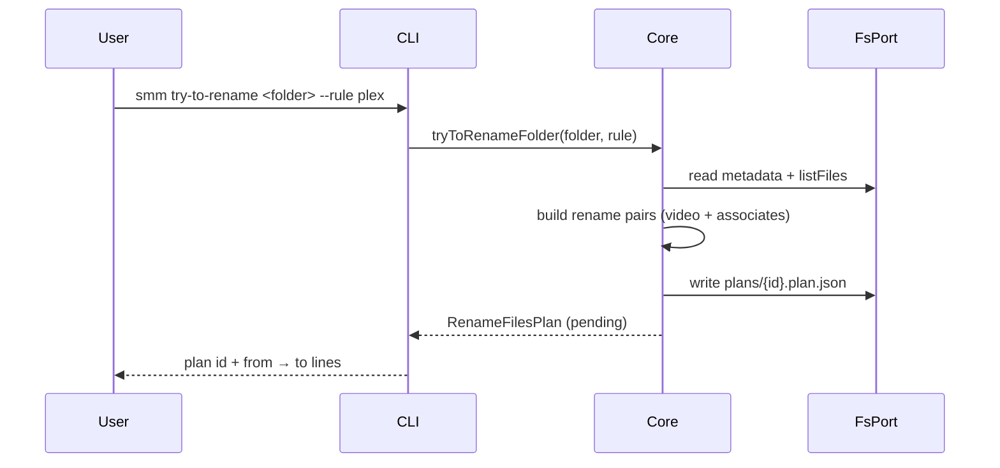
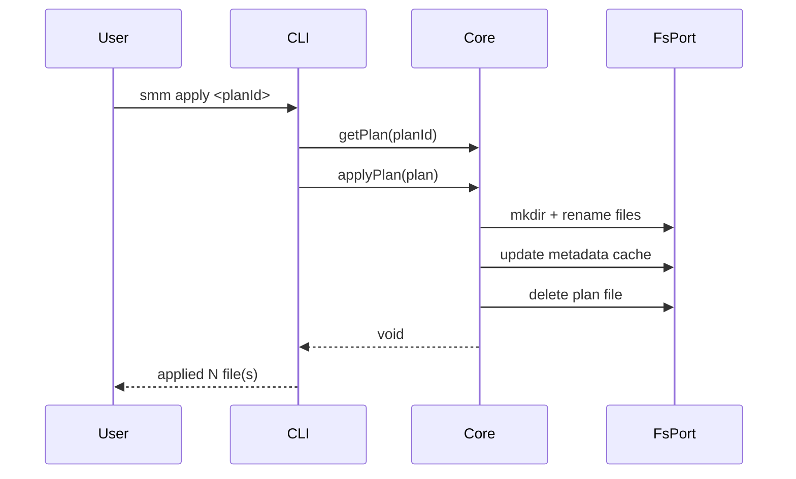
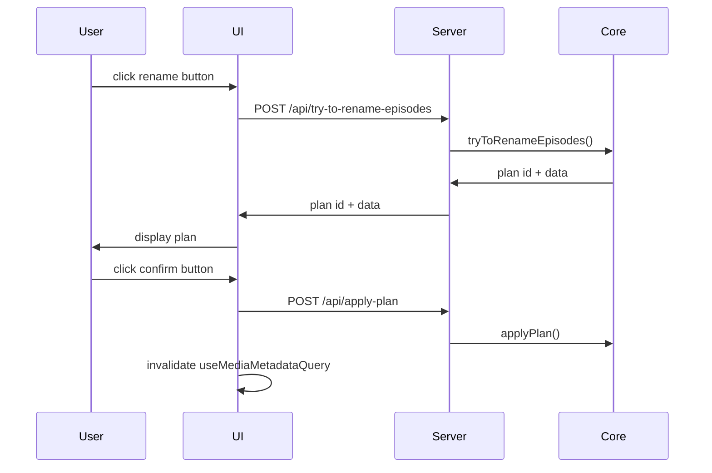
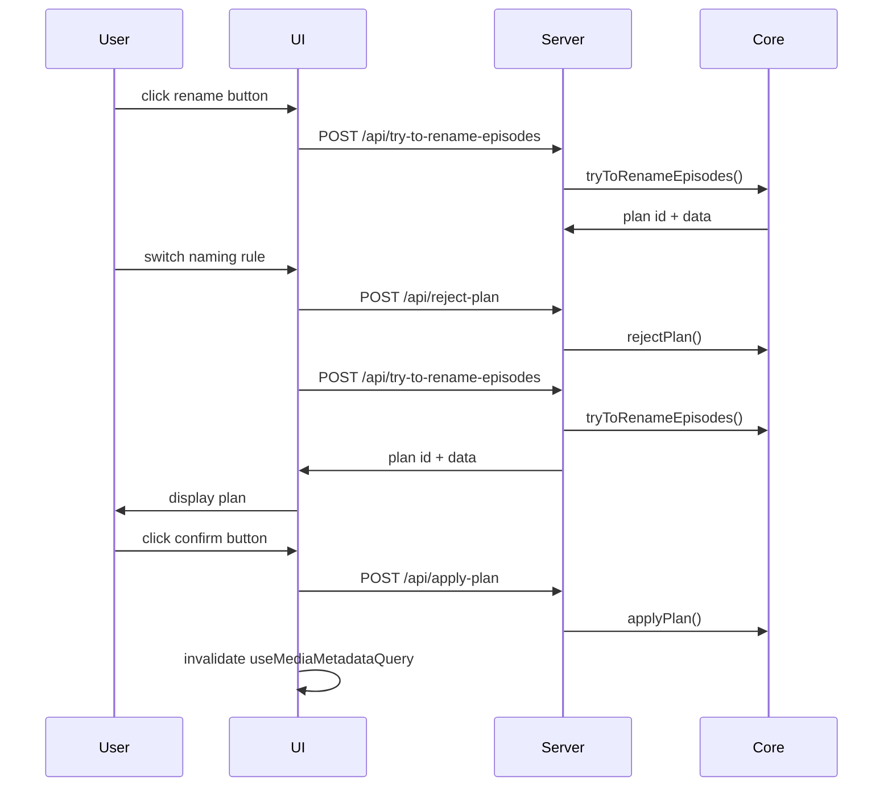

# Rename Episodes

**Supported Platform** Web UI, CLI, Electron, ohos
**Status** wip

SMM provides 3 renaming functions:
**Rename Folder** rename media folder, see [Rename Folder](./rename-folder.md)
**Rename Episodes** Rename recognized episode files all at once
**Rename Episode** Rename single recognized episode file, see [Rename Episode File](./rename-episode-file.md)

This page is for **Rename Episodes**. Don't get confused.


## CLI

```
smm try-to-rename <folder> [--rule plex|emby]
smm reject <planId>
smm apply <planId>
```






## Web UI, Electron and ohos


### UC1: Rename episodes

When user click the rename button
Then UI display rename plan with default naming rule(Plex/Emby)
When user click the confirm button
Then SMM apply plan to rename episode files




### UC2: Switch naming rule

When user click the rename button
Then UI display rename plan with default naming rule(Plex/Emby)
When user switch to another naming rule
Then UI display new rename plan



# Testing

| Use Case | Platform | Test |
|--|--|--|
| UC1 | Web UI, Electron and Ohos | apps/e2e/common/tv/TVShow-RenameEpisodes.e2e.ts |
| UC1 | CLI | apps/e2e/cli/rename-episodes.test.ts |
| UC2 | Web UI, Electron and Ohos | apps/e2e/common/tv/TVShow-RenameEpisodes.e2e.ts |
| UC2 | CLI | apps/e2e/cli/rename-episodes.test.ts |


## References

[Manage Plan](./manage-plan.md)

[Recognize](./recognize.md)

[Rename Episode File](./rename-episode-file.md) — single-episode context-menu rename (not rule batch)

[Supported Platform](./supported-platform.md)
