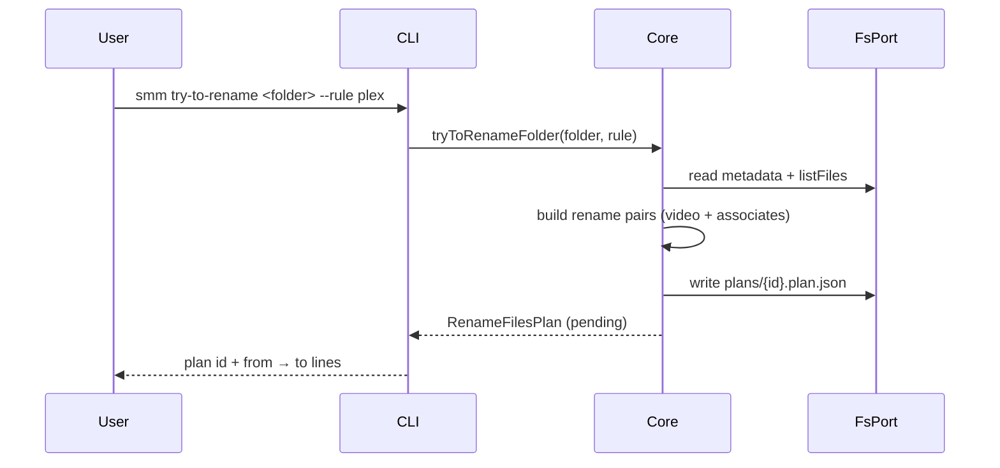
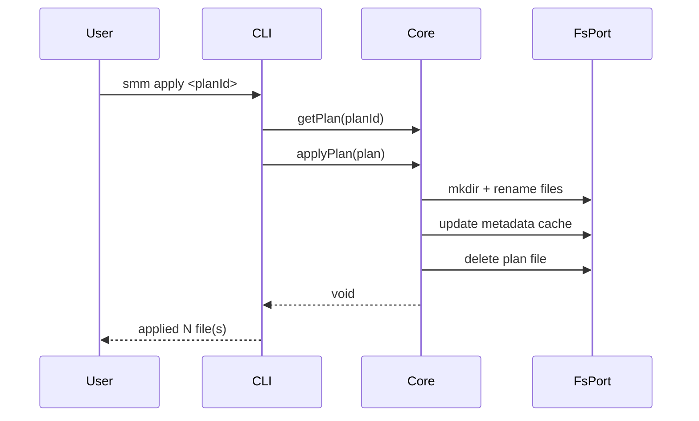
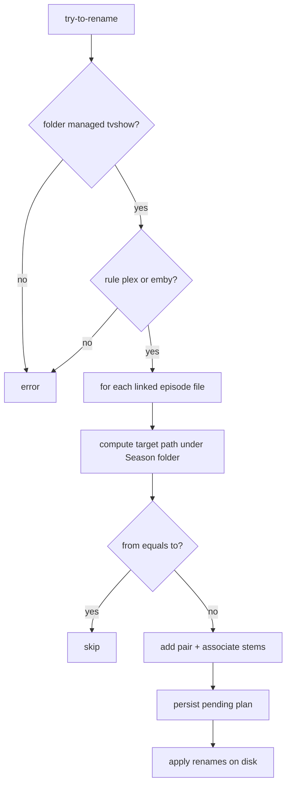
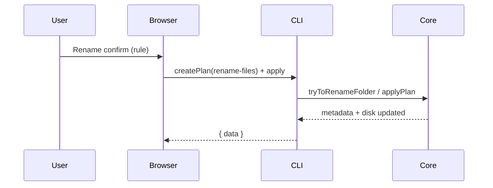

# Rename Files (plex / emby rule)

**Supported Platform** Web UI, CLI, Electron, ohos
**Status** done

## CLI

```
smm try-to-rename <folder> [--rule plex|emby]
smm apply <planId>
```







## Web UI, Electron and ohos



## References

[Recognize](./recognize.md)

[Rename Episode File](./rename-episode-file.md) — single-episode context-menu rename (not rule batch)

[Supported Platform](./supported-platform.md)
