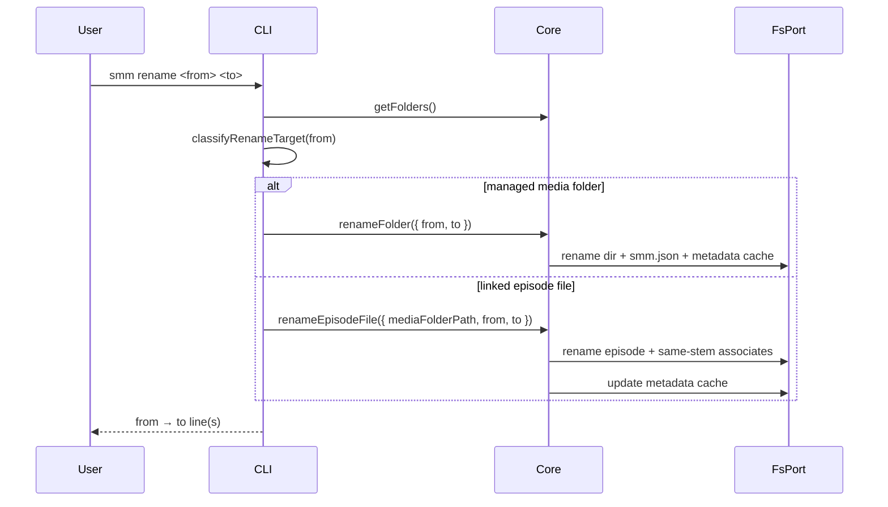
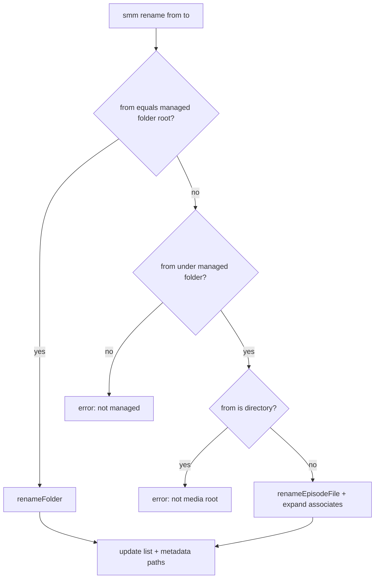
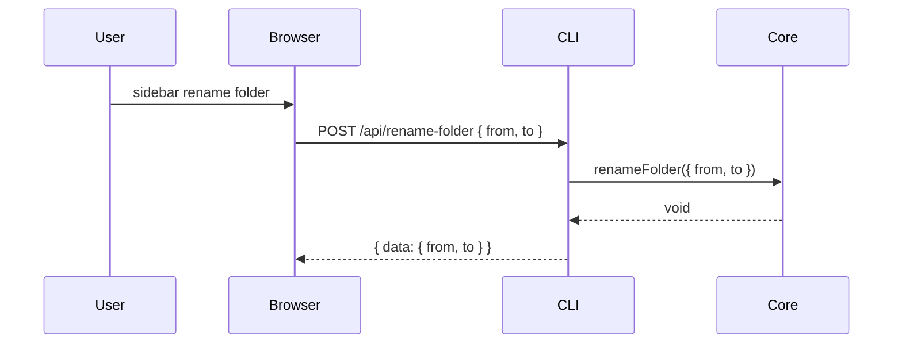

# Rename (media folder or episode file)

**Supported Platform** Web UI, CLI, Electron, ohos
**Status** done

## CLI

```
smm rename <from> <to>
smm rename-episode-file <folder> --from <path> --to <path>
```





## Web UI, Electron and ohos

### Rename media folder



### Rename episode file

See [Rename Episode File](./rename-episode-file.md).

## References

[Rename Files](./rename-files.md) — plex/emby batch plan

[Rename Episode File](./rename-episode-file.md)

[Supported Platform](./supported-platform.md)
